# Exploratory Data Analysis

[<< Go back](../README.md)
## Feature : target
- **Feature type** : categorical
- **Missing** : 0.0%
- **Unique** : 2
- **Count** :347
- **Unique** :2
- **Top** :simulated
- **Freq** :178

## Feature : return_mean1
- **Feature type** : continous
- **Missing** : 0.0%
- **Unique** : 347
- **Count** :347.0
- **Mean** :48.887170638328534
- **Std** :47.152505987402805
- **Min** :1.885538416
- **25%th Percentile** : 19.555044248
- **50%th Percentile** : 34.52509506
- **75%th Percentile** : 62.088444242
- **Max** :368.637599734

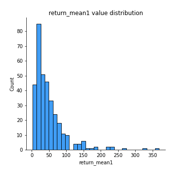
## Feature : return_mean2
- **Feature type** : continous
- **Missing** : 0.0%
- **Unique** : 347
- **Count** :347.0
- **Mean** :50.84672843805187
- **Std** :87.79392212037799
- **Min** :0.122436238
- **25%th Percentile** : 18.929701767
- **50%th Percentile** : 30.732348798
- **75%th Percentile** : 53.985818266
- **Max** :968.654841336

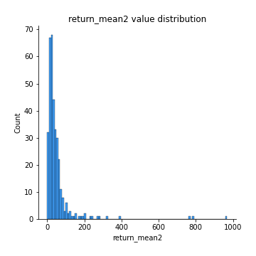
## Feature : return_sd1
- **Feature type** : continous
- **Missing** : 0.0%
- **Unique** : 347
- **Count** :347.0
- **Mean** :8.22523133399363
- **Std** :12.494695903234327
- **Min** :0.17075448275615598
- **25%th Percentile** : 2.6331914075749925
- **50%th Percentile** : 4.8740627254083755
- **75%th Percentile** : 8.994408054375754
- **Max** :113.75913244339056

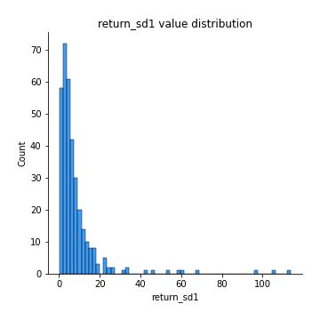
## Feature : return_sd2
- **Feature type** : continous
- **Missing** : 0.0%
- **Unique** : 347
- **Count** :347.0
- **Mean** :8.06315007451689
- **Std** :18.317472963101235
- **Min** :0.06022746901081144
- **25%th Percentile** : 2.438388322730747
- **50%th Percentile** : 4.517303933428743
- **75%th Percentile** : 7.550637763946671
- **Max** :221.10527467938883

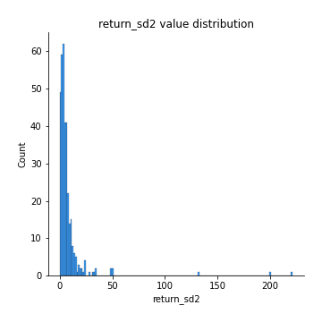
## Feature : return_skew1
- **Feature type** : continous
- **Missing** : 0.0%
- **Unique** : 347
- **Count** :347.0
- **Mean** :0.0851938328451769
- **Std** :0.4819544340362232
- **Min** :-1.2969383077901073
- **25%th Percentile** : -0.22503820026600868
- **50%th Percentile** : 0.048030880617934424
- **75%th Percentile** : 0.4132450923849119
- **Max** :1.517442952270221

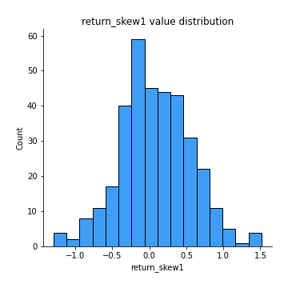
## Feature : return_skew2
- **Feature type** : continous
- **Missing** : 0.0%
- **Unique** : 347
- **Count** :347.0
- **Mean** :0.06918813384856883
- **Std** :0.4961534695678263
- **Min** :-1.6146280688819945
- **25%th Percentile** : -0.2422049455830429
- **50%th Percentile** : 0.04284553918526018
- **75%th Percentile** : 0.36641384562337287
- **Max** :1.723087490745204

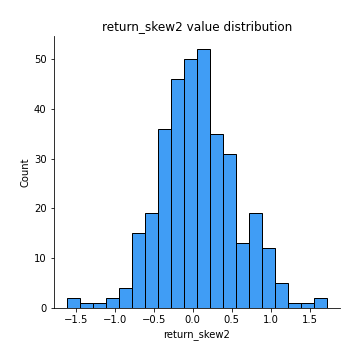
## Feature : return_kurtosis1
- **Feature type** : continous
- **Missing** : 0.0%
- **Unique** : 347
- **Count** :347.0
- **Mean** :-0.6272749743257936
- **Std** :0.6449911487517223
- **Min** :-1.6435775800393035
- **25%th Percentile** : -1.043964524112678
- **50%th Percentile** : -0.795765026013199
- **75%th Percentile** : -0.38705014745330923
- **Max** :2.7204133903766734

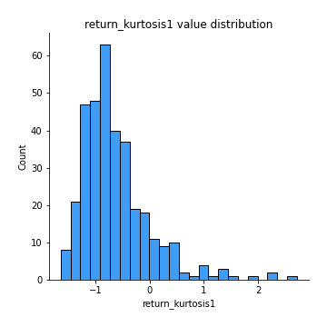
## Feature : return_kurtosis2
- **Feature type** : continous
- **Missing** : 0.0%
- **Unique** : 347
- **Count** :347.0
- **Mean** :-0.6124853593744441
- **Std** :0.637980893891843
- **Min** :-1.5537576053359181
- **25%th Percentile** : -1.0709645215443355
- **50%th Percentile** : -0.7565353046483527
- **75%th Percentile** : -0.28257946083346797
- **Max** :2.158848846238605

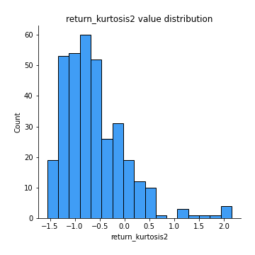
## Feature : return_autocorrelation_1_lag1
- **Feature type** : continous
- **Missing** : 0.0%
- **Unique** : 347
- **Count** :347.0
- **Mean** :0.9894893313110568
- **Std** :0.008865005914226915
- **Min** :0.9355613544071343
- **25%th Percentile** : 0.9862905078632825
- **50%th Percentile** : 0.9922473641957136
- **75%th Percentile** : 0.9954047537582785
- **Max** :0.998907093145209

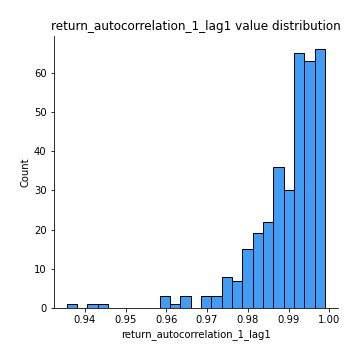
## Feature : return_autocorrelation_1_lag2
- **Feature type** : continous
- **Missing** : 0.0%
- **Unique** : 347
- **Count** :347.0
- **Mean** :0.9797954401837214
- **Std** :0.016159897148747267
- **Min** :0.8975005092899148
- **25%th Percentile** : 0.9732145327559323
- **50%th Percentile** : 0.9848970011044781
- **75%th Percentile** : 0.9910266733869681
- **Max** :0.9978622646293857

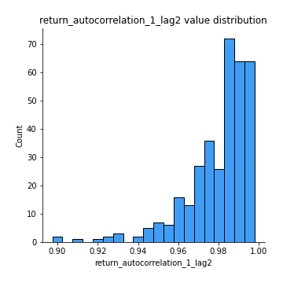
## Feature : return_autocorrelation_1_lag3
- **Feature type** : continous
- **Missing** : 0.0%
- **Unique** : 347
- **Count** :347.0
- **Mean** :0.9703900484216675
- **Std** :0.023211790667939883
- **Min** :0.864348822363276
- **25%th Percentile** : 0.9606898602557796
- **50%th Percentile** : 0.9779407376257376
- **75%th Percentile** : 0.9871304514157732
- **Max** :0.9968227021901522

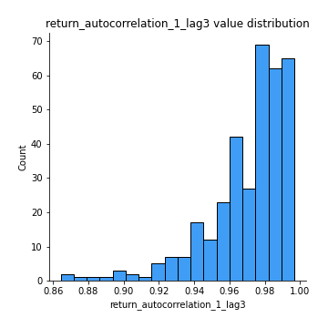
## Feature : return_autocorrelation_2_lag1
- **Feature type** : continous
- **Missing** : 0.0%
- **Unique** : 347
- **Count** :347.0
- **Mean** :0.9900324044273943
- **Std** :0.008257698617816266
- **Min** :0.959392924459774
- **25%th Percentile** : 0.9875956068320777
- **50%th Percentile** : 0.9924893593893083
- **75%th Percentile** : 0.9959557175452722
- **Max** :0.9985403102579625

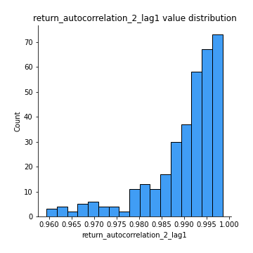
## Feature : return_autocorrelation_2_lag2
- **Feature type** : continous
- **Missing** : 0.0%
- **Unique** : 347
- **Count** :347.0
- **Mean** :0.9807489120606343
- **Std** :0.015691455988068977
- **Min** :0.9236718473891761
- **25%th Percentile** : 0.9758013662139811
- **50%th Percentile** : 0.9855403697530083
- **75%th Percentile** : 0.9919225179974854
- **Max** :0.9972933788707106

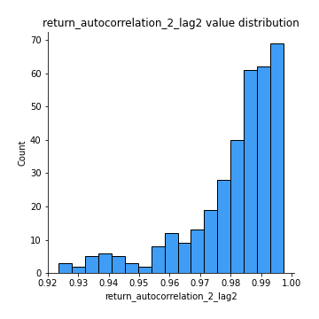
## Feature : return_autocorrelation_2_lag3
- **Feature type** : continous
- **Missing** : 0.0%
- **Unique** : 347
- **Count** :347.0
- **Mean** :0.9717312919470428
- **Std** :0.022923486859947093
- **Min** :0.884200628490271
- **25%th Percentile** : 0.96439468537619
- **50%th Percentile** : 0.9787285916448363
- **75%th Percentile** : 0.9881424494883151
- **Max** :0.9958538038681604

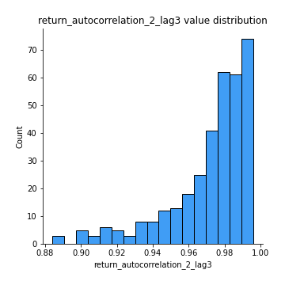
## Feature : return_correlation_ts1_lag_0
- **Feature type** : continous
- **Missing** : 0.0%
- **Unique** : 347
- **Count** :347.0
- **Mean** :0.41618976984773615
- **Std** :0.4634307783607126
- **Min** :-0.9454212056869181
- **25%th Percentile** : 0.10436014597278219
- **50%th Percentile** : 0.5641992571246285
- **75%th Percentile** : 0.7933218796277157
- **Max** :0.9657060675245052

## Feature : return_correlation_ts1_lag_1
- **Feature type** : continous
- **Missing** : 0.0%
- **Unique** : 347
- **Count** :347.0
- **Mean** :0.41317750743892834
- **Std** :0.4635118386865272
- **Min** :-0.9452305740471955
- **25%th Percentile** : 0.09934195995031903
- **50%th Percentile** : 0.5595916361851205
- **75%th Percentile** : 0.7900639854020282
- **Max** :0.9655060959411687

## Feature : return_correlation_ts1_lag_2
- **Feature type** : continous
- **Missing** : 0.0%
- **Unique** : 347
- **Count** :347.0
- **Mean** :0.4105258666509559
- **Std** :0.46349596165405127
- **Min** :-0.9451440682595582
- **25%th Percentile** : 0.10248864047993778
- **50%th Percentile** : 0.5501481915141775
- **75%th Percentile** : 0.7897200688860286
- **Max** :0.9655528894956359

## Feature : return_correlation_ts1_lag_3
- **Feature type** : continous
- **Missing** : 0.0%
- **Unique** : 347
- **Count** :347.0
- **Mean** :0.4080713316191691
- **Std** :0.46340284773361073
- **Min** :-0.9448708035067677
- **25%th Percentile** : 0.09989900589101347
- **50%th Percentile** : 0.5444787334737557
- **75%th Percentile** : 0.7854673631024834
- **Max** :0.965480488388089

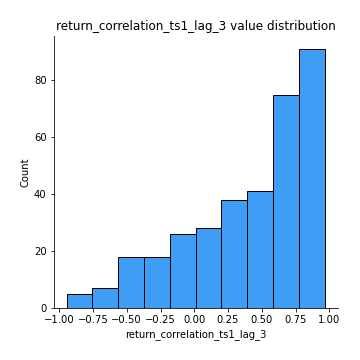
## Feature : return_correlation_ts2_lag_1
- **Feature type** : continous
- **Missing** : 0.0%
- **Unique** : 347
- **Count** :347.0
- **Mean** :0.4127082532506582
- **Std** :0.4642461860735958
- **Min** :-0.9457910375143614
- **25%th Percentile** : 0.10337018803211866
- **50%th Percentile** : 0.5583646885718168
- **75%th Percentile** : 0.7905672886960302
- **Max** :0.9653492015905041

## Feature : return_correlation_ts2_lag_2
- **Feature type** : continous
- **Missing** : 0.0%
- **Unique** : 347
- **Count** :347.0
- **Mean** :0.4095160307642615
- **Std** :0.46510941070292167
- **Min** :-0.9463260196248172
- **25%th Percentile** : 0.09399500733601643
- **50%th Percentile** : 0.5535109481831181
- **75%th Percentile** : 0.7876030030386487
- **Max** :0.9648220784284761

## Feature : return_correlation_ts2_lag_3
- **Feature type** : continous
- **Missing** : 0.0%
- **Unique** : 347
- **Count** :347.0
- **Mean** :0.4065532701429251
- **Std** :0.4657968027867295
- **Min** :-0.9467149428568907
- **25%th Percentile** : 0.08881995482225669
- **50%th Percentile** : 0.551584082711407
- **75%th Percentile** : 0.784742876696956
- **Max** :0.9641714645667581

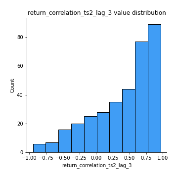
## Feature : sqreturn_autocorrelation_ts1_lag1
- **Feature type** : continous
- **Missing** : 0.0%
- **Unique** : 347
- **Count** :347.0
- **Mean** :0.9891240656259218
- **Std** :0.009144525869527301
- **Min** :0.9332773406178796
- **25%th Percentile** : 0.98570339084707
- **50%th Percentile** : 0.9918794048025069
- **75%th Percentile** : 0.9952424455675833
- **Max** :0.9986169228928321

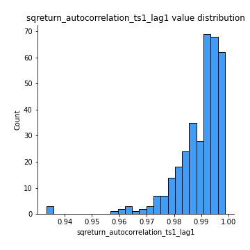
## Feature : sqreturn_autocorrelation_ts1_lag2
- **Feature type** : continous
- **Missing** : 0.0%
- **Unique** : 347
- **Count** :347.0
- **Mean** :0.9791394366079816
- **Std** :0.016427374490910265
- **Min** :0.8823581818725827
- **25%th Percentile** : 0.9720286429903605
- **50%th Percentile** : 0.983672963380182
- **75%th Percentile** : 0.9907586970411004
- **Max** :0.9972727873616056

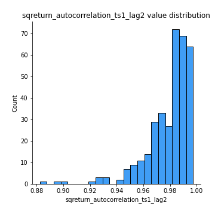
## Feature : sqreturn_autocorrelation_ts1_lag3
- **Feature type** : continous
- **Missing** : 0.0%
- **Unique** : 347
- **Count** :347.0
- **Mean** :0.9694860756655042
- **Std** :0.023319951046367145
- **Min** :0.8535993233028852
- **25%th Percentile** : 0.9595345933922883
- **50%th Percentile** : 0.9765794329978574
- **75%th Percentile** : 0.9865716008634275
- **Max** :0.9959512789640361

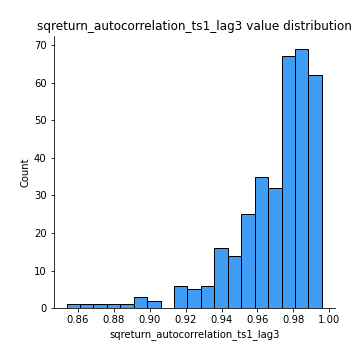
## Feature : sqreturn_autocorrelation_ts2_lag1
- **Feature type** : continous
- **Missing** : 0.0%
- **Unique** : 347
- **Count** :347.0
- **Mean** :0.9897252726992023
- **Std** :0.008155487296417177
- **Min** :0.9604446597294015
- **25%th Percentile** : 0.9870788673934052
- **50%th Percentile** : 0.9922738346847848
- **75%th Percentile** : 0.9956500405860502
- **Max** :0.9986746606786123

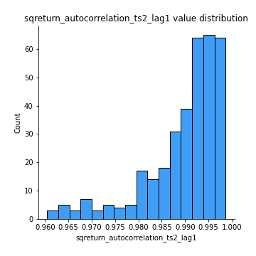
## Feature : sqreturn_autocorrelation_ts2_lag2
- **Feature type** : continous
- **Missing** : 0.0%
- **Unique** : 347
- **Count** :347.0
- **Mean** :0.9801793537808057
- **Std** :0.015518958336442306
- **Min** :0.9255516298765739
- **25%th Percentile** : 0.9745654297326405
- **50%th Percentile** : 0.9853199781437383
- **75%th Percentile** : 0.9913789883922453
- **Max** :0.996990235687134

## Feature : sqreturn_autocorrelation_ts2_lag3
- **Feature type** : continous
- **Missing** : 0.0%
- **Unique** : 347
- **Count** :347.0
- **Mean** :0.9709022129025848
- **Std** :0.022705032230837783
- **Min** :0.8875093155617572
- **25%th Percentile** : 0.9630448400451689
- **50%th Percentile** : 0.9783338744037484
- **75%th Percentile** : 0.9872462672184039
- **Max** :0.9957895086263276

## Feature : sqreturn_correlation_ts1_lag_0
- **Feature type** : continous
- **Missing** : 0.0%
- **Unique** : 347
- **Count** :347.0
- **Mean** :0.41618976984773615
- **Std** :0.4634307783607126
- **Min** :-0.9454212056869181
- **25%th Percentile** : 0.10436014597278219
- **50%th Percentile** : 0.5641992571246285
- **75%th Percentile** : 0.7933218796277157
- **Max** :0.9657060675245052

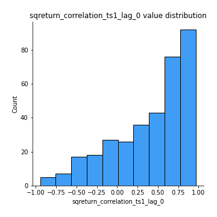
## Feature : sqreturn_correlation_ts1_lag_1
- **Feature type** : continous
- **Missing** : 0.0%
- **Unique** : 347
- **Count** :347.0
- **Mean** :0.41317750743892834
- **Std** :0.4635118386865272
- **Min** :-0.9452305740471955
- **25%th Percentile** : 0.09934195995031903
- **50%th Percentile** : 0.5595916361851205
- **75%th Percentile** : 0.7900639854020282
- **Max** :0.9655060959411687

## Feature : sqreturn_correlation_ts1_lag_2
- **Feature type** : continous
- **Missing** : 0.0%
- **Unique** : 347
- **Count** :347.0
- **Mean** :0.4105258666509559
- **Std** :0.46349596165405127
- **Min** :-0.9451440682595582
- **25%th Percentile** : 0.10248864047993778
- **50%th Percentile** : 0.5501481915141775
- **75%th Percentile** : 0.7897200688860286
- **Max** :0.9655528894956359

## Feature : sqreturn_correlation_ts1_lag_3
- **Feature type** : continous
- **Missing** : 0.0%
- **Unique** : 347
- **Count** :347.0
- **Mean** :0.4080713316191691
- **Std** :0.46340284773361073
- **Min** :-0.9448708035067677
- **25%th Percentile** : 0.09989900589101347
- **50%th Percentile** : 0.5444787334737557
- **75%th Percentile** : 0.7854673631024834
- **Max** :0.965480488388089

## Feature : sqreturn_correlation_ts2_lag_1
- **Feature type** : continous
- **Missing** : 0.0%
- **Unique** : 347
- **Count** :347.0
- **Mean** :0.4127082532506582
- **Std** :0.4642461860735958
- **Min** :-0.9457910375143614
- **25%th Percentile** : 0.10337018803211866
- **50%th Percentile** : 0.5583646885718168
- **75%th Percentile** : 0.7905672886960302
- **Max** :0.9653492015905041

## Feature : sqreturn_correlation_ts2_lag_2
- **Feature type** : continous
- **Missing** : 0.0%
- **Unique** : 347
- **Count** :347.0
- **Mean** :0.4095160307642615
- **Std** :0.46510941070292167
- **Min** :-0.9463260196248172
- **25%th Percentile** : 0.09399500733601643
- **50%th Percentile** : 0.5535109481831181
- **75%th Percentile** : 0.7876030030386487
- **Max** :0.9648220784284761

## Feature : sqreturn_correlation_ts2_lag_3
- **Feature type** : continous
- **Missing** : 0.0%
- **Unique** : 347
- **Count** :347.0
- **Mean** :0.4065532701429251
- **Std** :0.4657968027867295
- **Min** :-0.9467149428568907
- **25%th Percentile** : 0.08881995482225669
- **50%th Percentile** : 0.551584082711407
- **75%th Percentile** : 0.784742876696956
- **Max** :0.9641714645667581

## Feature : price2_granger_cause_price1
- **Feature type** : continous
- **Missing** : 0.0%
- **Unique** : 347
- **Count** :347.0
- **Mean** :0.39030406014415525
- **Std** :0.3056551263285553
- **Min** :7.442002876220672e-07
- **25%th Percentile** : 0.0899836330280875
- **50%th Percentile** : 0.3381757166115231
- **75%th Percentile** : 0.6609792658704691
- **Max** :0.9991604192257109

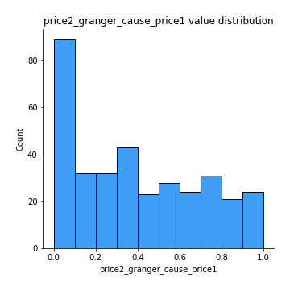
## Feature : price1_granger_cause_price2
- **Feature type** : continous
- **Missing** : 0.0%
- **Unique** : 347
- **Count** :347.0
- **Mean** :0.3807031000893586
- **Std** :0.3065662417042256
- **Min** :8.101068402988115e-10
- **25%th Percentile** : 0.10524886656959545
- **50%th Percentile** : 0.31738874623891766
- **75%th Percentile** : 0.6146706186531665
- **Max** :0.9987360641740829

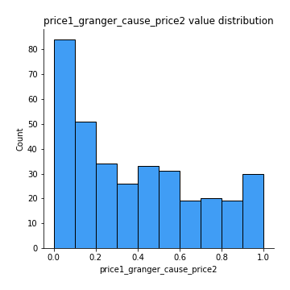

[<< Go back](../README.md)
