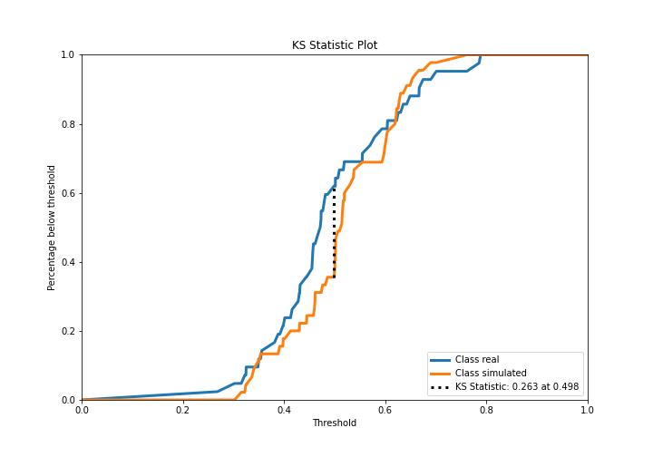

# Summary of Ensemble

[<< Go back](../README.md)

## Ensemble structure
| Model                  |   Weight |
|:-----------------------|---------:|
| 4_Default_Xgboost      |        1 |
| 6_Default_RandomForest |        1 |

## Metric details
|           |    score |   threshold |
|:----------|---------:|------------:|
| logloss   | 0.702333 |  nan        |
| auc       | 0.577249 |  nan        |
| f1        | 0.681818 |    0.241351 |
| accuracy  | 0.632184 |    0.483799 |
| precision | 0.638298 |    0.483799 |
| recall    | 1        |    0.241351 |
| mcc       | 0.2626   |    0.483799 |

## Confusion matrix (at threshold=0.483799)
|                      |   Predicted as real |   Predicted as simulated |
|:---------------------|--------------------:|-------------------------:|
| Labeled as real      |                  25 |                       17 |
| Labeled as simulated |                  15 |                       30 |

## Learning curves

## Confusion Matrix

## Normalized Confusion Matrix

## ROC Curve

## Kolmogorov-Smirnov Statistic

## Precision-Recall Curve

## Calibration Curve

## Cumulative Gains Curve

## Lift Curve

[<< Go back](../README.md)
