# Summary of 2_DecisionTree

[<< Go back](../README.md)

## Decision Tree
- **n_jobs**: -1
- **criterion**: gini
- **max_depth**: 3
- **explain_level**: 2

## Validation
 - **validation_type**: split
 - **train_ratio**: 0.75
 - **shuffle**: True
 - **stratify**: True

## Optimized metric
accuracy

## Training time

12.1 seconds

## Metric details
|           |     score |   threshold |
|:----------|----------:|------------:|
| logloss   | 0.90628   |  nan        |
| auc       | 0.529598  |  nan        |
| f1        | 0.677165  |    0        |
| accuracy  | 0.528736  |    0        |
| precision | 0.588235  |    0.484663 |
| recall    | 0.977273  |    0        |
| mcc       | 0.0813066 |    0.484663 |

## Confusion matrix (at threshold=0.0)
|                      |   Predicted as real |   Predicted as simulated |
|:---------------------|--------------------:|-------------------------:|
| Labeled as real      |                   3 |                       40 |
| Labeled as simulated |                   1 |                       43 |

## Learning curves
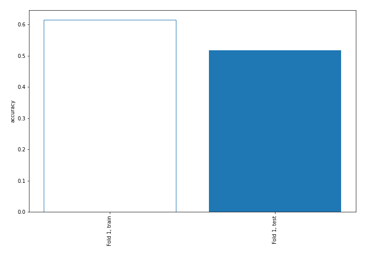

## Decision Tree 

### Tree #1
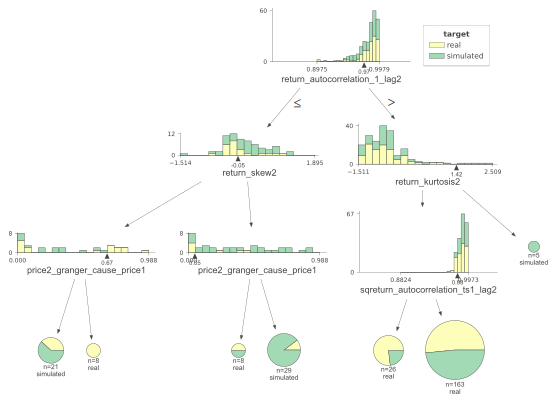

### Rules

if (return_autocorrelation_1_lag2 > 0.973) and (return_kurtosis2 <= 1.421) and (sqreturn_autocorrelation_ts1_lag2 > 0.979) then class: real (proba: 51.53%) | based on 163 samples

if (return_autocorrelation_1_lag2 <= 0.973) and (return_skew2 > -0.053) and (price2_granger_cause_price1 > 0.048) then class: simulated (proba: 89.66%) | based on 29 samples

if (return_autocorrelation_1_lag2 > 0.973) and (return_kurtosis2 <= 1.421) and (sqreturn_autocorrelation_ts1_lag2 <= 0.979) then class: real (proba: 76.92%) | based on 26 samples

if (return_autocorrelation_1_lag2 <= 0.973) and (return_skew2 <= -0.053) and (price2_granger_cause_price1 <= 0.675) then class: simulated (proba: 61.9%) | based on 21 samples

if (return_autocorrelation_1_lag2 <= 0.973) and (return_skew2 > -0.053) and (price2_granger_cause_price1 <= 0.048) then class: real (proba: 50.0%) | based on 8 samples

if (return_autocorrelation_1_lag2 <= 0.973) and (return_skew2 <= -0.053) and (price2_granger_cause_price1 > 0.675) then class: real (proba: 100.0%) | based on 8 samples

if (return_autocorrelation_1_lag2 > 0.973) and (return_kurtosis2 > 1.421) then class: simulated (proba: 100.0%) | based on 5 samples

## Permutation-based Importance
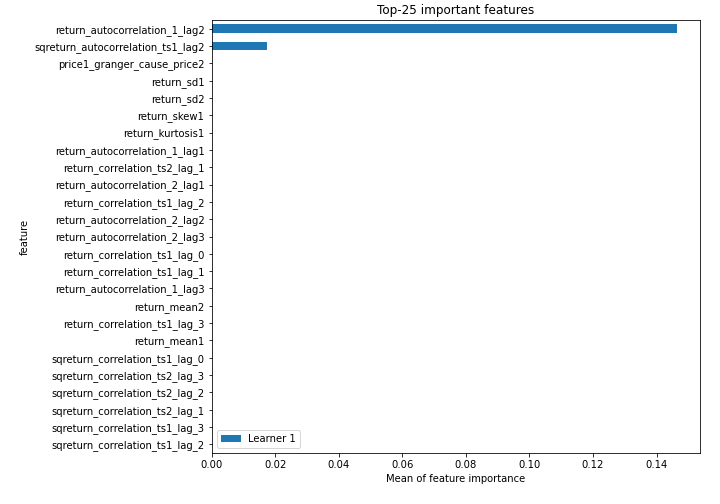
## Confusion Matrix

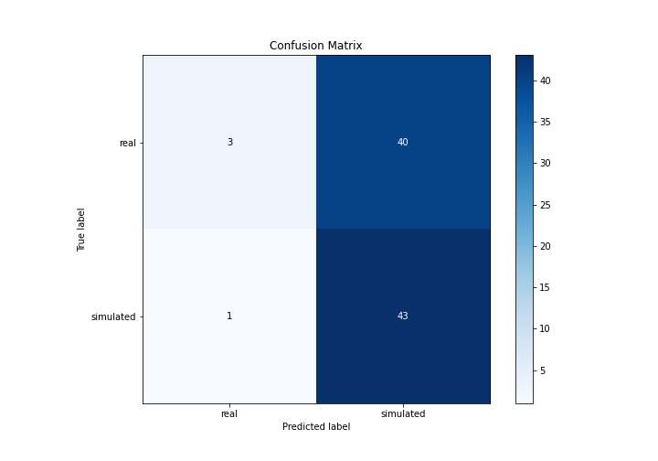

## Normalized Confusion Matrix

## ROC Curve

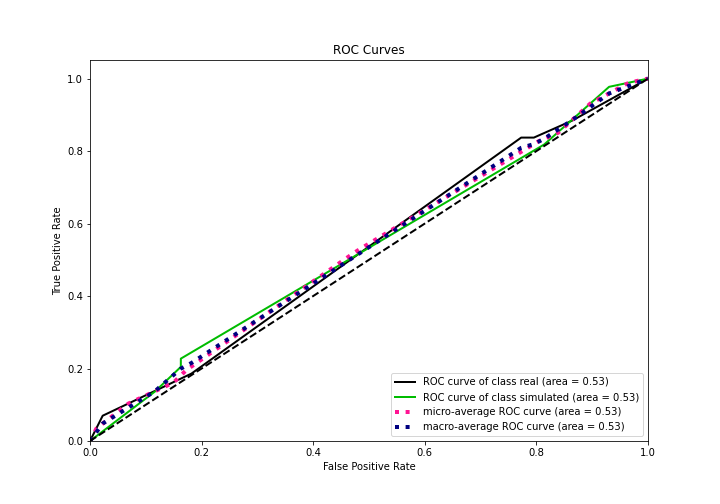

## Kolmogorov-Smirnov Statistic

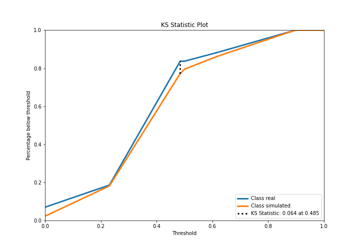

## Precision-Recall Curve

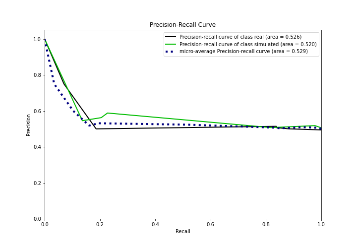

## Calibration Curve

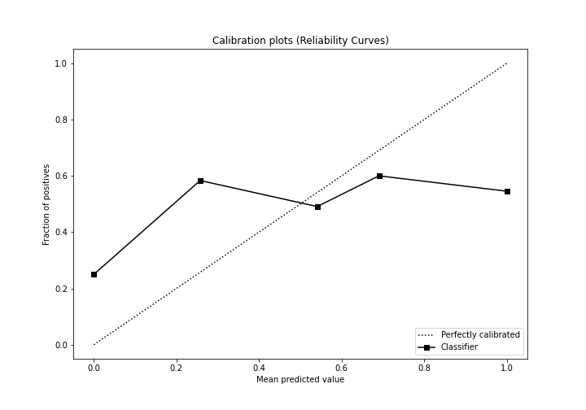

## Cumulative Gains Curve

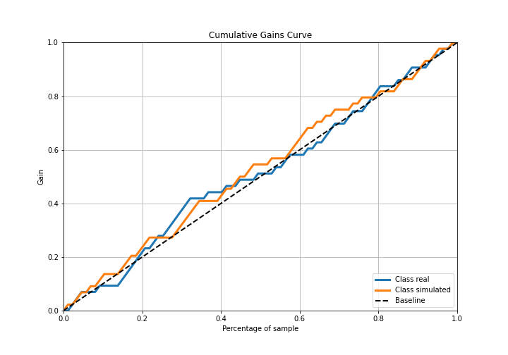

## Lift Curve

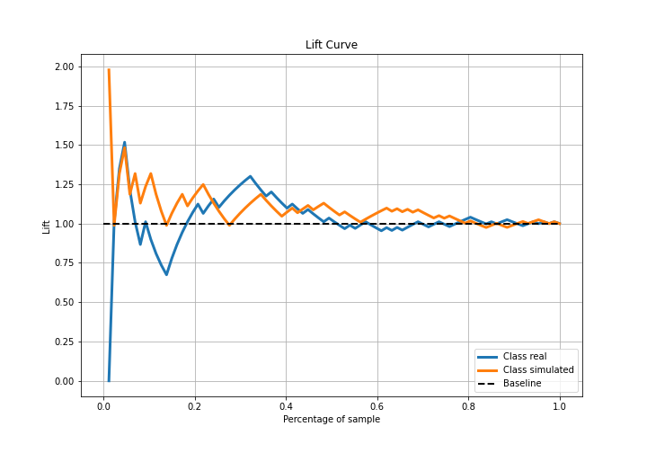

## SHAP Importance
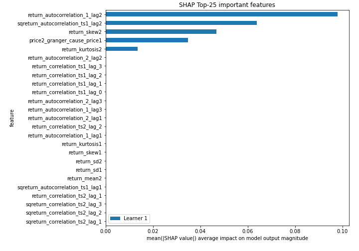

## SHAP Dependence plots

### Dependence (Fold 1)
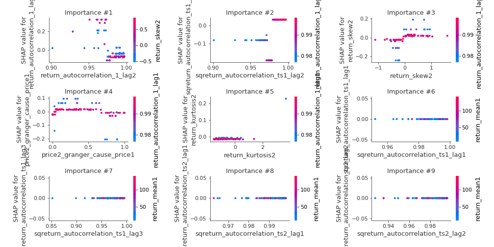

## SHAP Decision plots

### Top-10 Worst decisions for class 0 (Fold 1)
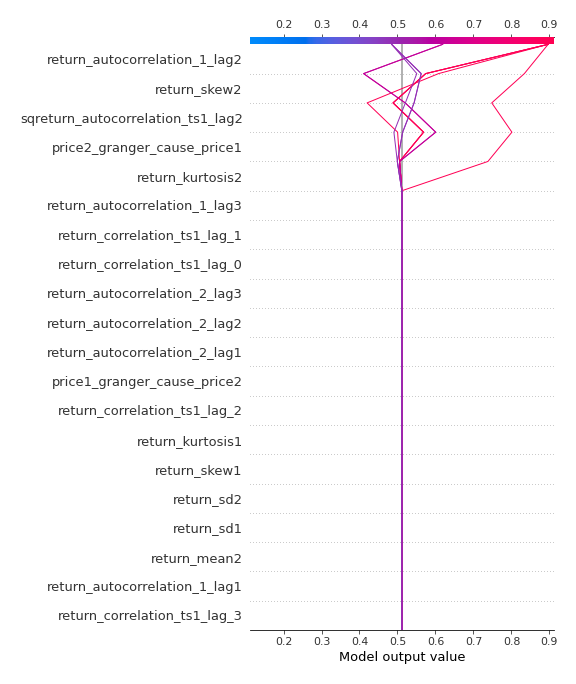
### Top-10 Best decisions for class 0 (Fold 1)
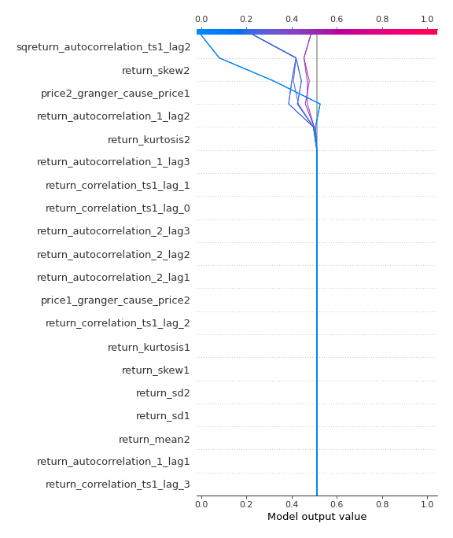
### Top-10 Worst decisions for class 1 (Fold 1)
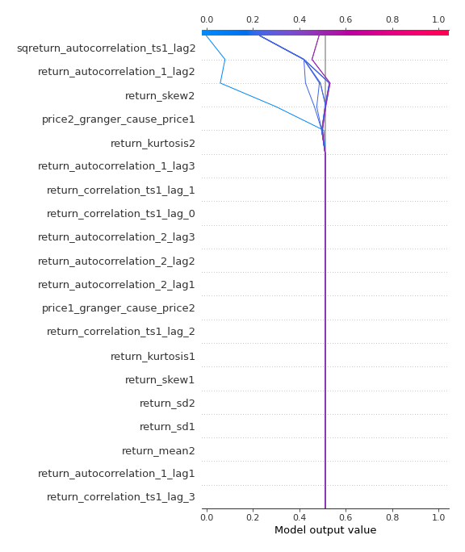
### Top-10 Best decisions for class 1 (Fold 1)
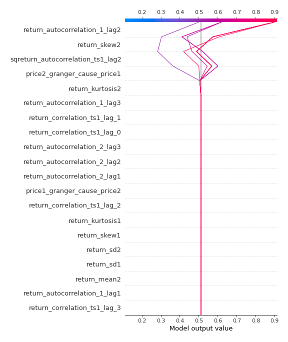

[<< Go back](../README.md)
