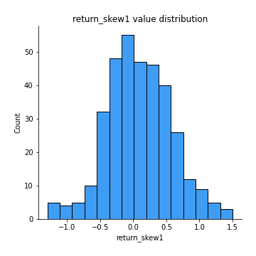
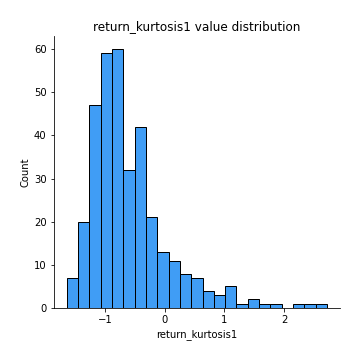

# Exploratory Data Analysis

[<< Go back](../README.md)
## Feature : target
- **Feature type** : categorical
- **Missing** : 0.0%
- **Unique** : 2
- **Count** :347
- **Unique** :2
- **Top** :simulated
- **Freq** :177

## Feature : return_mean1
- **Feature type** : continous
- **Missing** : 0.0%
- **Unique** : 347
- **Count** :347.0
- **Mean** :51.59798798352739
- **Std** :53.53257546977034
- **Min** :1.885538416
- **25%th Percentile** : 19.800731513000002
- **50%th Percentile** : 37.706493738000006
- **75%th Percentile** : 65.771671473
- **Max** :514.7209599040001

## Feature : return_mean2
- **Feature type** : continous
- **Missing** : 0.0%
- **Unique** : 347
- **Count** :347.0
- **Mean** :53.16343405806916
- **Std** :96.6676588962907
- **Min** :0.122436238
- **25%th Percentile** : 18.211550752999997
- **50%th Percentile** : 31.269702763999998
- **75%th Percentile** : 54.216091467
- **Max** :968.654841336

## Feature : return_sd1
- **Feature type** : continous
- **Missing** : 0.0%
- **Unique** : 347
- **Count** :347.0
- **Mean** :8.048609665951332
- **Std** :11.691874756846868
- **Min** :0.17075448275615598
- **25%th Percentile** : 2.6409695642805193
- **50%th Percentile** : 4.870257903420712
- **75%th Percentile** : 8.980262825397112
- **Max** :113.75913244339056

## Feature : return_sd2
- **Feature type** : continous
- **Missing** : 0.0%
- **Unique** : 347
- **Count** :347.0
- **Mean** :8.638688581116341
- **Std** :19.318775530189235
- **Min** :0.06022746901081144
- **25%th Percentile** : 2.63699363564516
- **50%th Percentile** : 4.718744225009718
- **75%th Percentile** : 7.986177246208721
- **Max** :221.10527467938883

## Feature : return_skew1
- **Feature type** : continous
- **Missing** : 0.0%
- **Unique** : 347
- **Count** :347.0
- **Mean** :0.09244653204718191
- **Std** :0.4947852648219179
- **Min** :-1.2969383077901073
- **25%th Percentile** : -0.23477371333107938
- **50%th Percentile** : 0.08445786784041176
- **75%th Percentile** : 0.42964790817692333
- **Max** :1.5010388367538123

## Feature : return_skew2
- **Feature type** : continous
- **Missing** : 0.0%
- **Unique** : 347
- **Count** :347.0
- **Mean** :0.11669473176041968
- **Std** :0.5006150723415582
- **Min** :-1.5143013373937064
- **25%th Percentile** : -0.2206482309125636
- **50%th Percentile** : 0.058669100214212004
- **75%th Percentile** : 0.4169822644756879
- **Max** :1.8950824286933763

## Feature : return_kurtosis1
- **Feature type** : continous
- **Missing** : 0.0%
- **Unique** : 347
- **Count** :347.0
- **Mean** :-0.5902154719400013
- **Std** :0.6714168917828011
- **Min** :-1.6435775800393035
- **25%th Percentile** : -1.02004977941548
- **50%th Percentile** : -0.771938508014367
- **75%th Percentile** : -0.3486421992814521
- **Max** :2.7204133903766734

## Feature : return_kurtosis2
- **Feature type** : continous
- **Missing** : 0.0%
- **Unique** : 347
- **Count** :347.0
- **Mean** :-0.6262968310166739
- **Std** :0.6641736449396527
- **Min** :-1.5239181768313306
- **25%th Percentile** : -1.0682258016102084
- **50%th Percentile** : -0.7645015149950152
- **75%th Percentile** : -0.405083930889347
- **Max** :3.67606360130176

## Feature : return_autocorrelation_1_lag1
- **Feature type** : continous
- **Missing** : 0.0%
- **Unique** : 347
- **Count** :347.0
- **Mean** :0.9896126705886963
- **Std** :0.008861474675618783
- **Min** :0.9355613544071343
- **25%th Percentile** : 0.9867051704965115
- **50%th Percentile** : 0.9925774145208345
- **75%th Percentile** : 0.995443602543201
- **Max** :0.998907093145209

## Feature : return_autocorrelation_1_lag2
- **Feature type** : continous
- **Missing** : 0.0%
- **Unique** : 347
- **Count** :347.0
- **Mean** :0.9801010791184205
- **Std** :0.016138751008612482
- **Min** :0.8975005092899148
- **25%th Percentile** : 0.9734511248808849
- **50%th Percentile** : 0.9856442813923435
- **75%th Percentile** : 0.9911051168203469
- **Max** :0.9978622646293857

## Feature : return_autocorrelation_1_lag3
- **Feature type** : continous
- **Missing** : 0.0%
- **Unique** : 347
- **Count** :347.0
- **Mean** :0.9709407272821304
- **Std** :0.023090158963782057
- **Min** :0.8527377034295596
- **25%th Percentile** : 0.962117610518429
- **50%th Percentile** : 0.9787737028612917
- **75%th Percentile** : 0.9869401964552253
- **Max** :0.9968227021901522

## Feature : return_autocorrelation_2_lag1
- **Feature type** : continous
- **Missing** : 0.0%
- **Unique** : 347
- **Count** :347.0
- **Mean** :0.9909039958514527
- **Std** :0.007598030235315826
- **Min** :0.9535838386842562
- **25%th Percentile** : 0.988340900546148
- **50%th Percentile** : 0.992988585687828
- **75%th Percentile** : 0.9962325619055505
- **Max** :0.9990075551978286

## Feature : return_autocorrelation_2_lag2
- **Feature type** : continous
- **Missing** : 0.0%
- **Unique** : 347
- **Count** :347.0
- **Mean** :0.982295622739252
- **Std** :0.014505809770082024
- **Min** :0.9181007061137118
- **25%th Percentile** : 0.9770834389397889
- **50%th Percentile** : 0.9864744383075431
- **75%th Percentile** : 0.9926347274355536
- **Max** :0.9980152731102225

## Feature : return_autocorrelation_2_lag3
- **Feature type** : continous
- **Missing** : 0.0%
- **Unique** : 347
- **Count** :347.0
- **Mean** :0.973998407308238
- **Std** :0.021221171755765995
- **Min** :0.8783385001119621
- **25%th Percentile** : 0.9664044106082132
- **50%th Percentile** : 0.9803976501436446
- **75%th Percentile** : 0.9891692290458913
- **Max** :0.9970922117201266

## Feature : return_correlation_ts1_lag_0
- **Feature type** : continous
- **Missing** : 0.0%
- **Unique** : 347
- **Count** :347.0
- **Mean** :0.431786675292232
- **Std** :0.47351441171626885
- **Min** :-0.8430691081512005
- **25%th Percentile** : 0.14768139349113146
- **50%th Percentile** : 0.6032868145427865
- **75%th Percentile** : 0.8088650558621348
- **Max** :0.9652680339257566

## Feature : return_correlation_ts1_lag_1
- **Feature type** : continous
- **Missing** : 0.0%
- **Unique** : 347
- **Count** :347.0
- **Mean** :0.428717880593695
- **Std** :0.4741323259632086
- **Min** :-0.8477371479268198
- **25%th Percentile** : 0.1432296485197287
- **50%th Percentile** : 0.6016437205401074
- **75%th Percentile** : 0.806897158883889
- **Max** :0.9655060959411687

## Feature : return_correlation_ts1_lag_2
- **Feature type** : continous
- **Missing** : 0.0%
- **Unique** : 347
- **Count** :347.0
- **Mean** :0.42597492365553324
- **Std** :0.4746463564020531
- **Min** :-0.8526854582503749
- **25%th Percentile** : 0.131456053694237
- **50%th Percentile** : 0.6048874521125646
- **75%th Percentile** : 0.8041421974933038
- **Max** :0.9655528894956359

## Feature : return_correlation_ts1_lag_3
- **Feature type** : continous
- **Missing** : 0.0%
- **Unique** : 347
- **Count** :347.0
- **Mean** :0.42337974366356
- **Std** :0.4751645799671701
- **Min** :-0.8563145423083878
- **25%th Percentile** : 0.12217492095961988
- **50%th Percentile** : 0.6075904293649385
- **75%th Percentile** : 0.8023752078872837
- **Max** :0.965480488388089

## Feature : return_correlation_ts2_lag_1
- **Feature type** : continous
- **Missing** : 0.0%
- **Unique** : 347
- **Count** :347.0
- **Mean** :0.4287030351893564
- **Std** :0.4740112316966189
- **Min** :-0.8419620696123573
- **25%th Percentile** : 0.15164886408803818
- **50%th Percentile** : 0.6033010348509437
- **75%th Percentile** : 0.8063177359141314
- **Max** :0.9641732497647877

## Feature : return_correlation_ts2_lag_2
- **Feature type** : continous
- **Missing** : 0.0%
- **Unique** : 347
- **Count** :347.0
- **Mean** :0.4260062449835431
- **Std** :0.474454013949311
- **Min** :-0.8407733129095517
- **25%th Percentile** : 0.15549016872978105
- **50%th Percentile** : 0.6043799882542106
- **75%th Percentile** : 0.8043713992697641
- **Max** :0.9632401452572252

## Feature : return_correlation_ts2_lag_3
- **Feature type** : continous
- **Missing** : 0.0%
- **Unique** : 347
- **Count** :347.0
- **Mean** :0.4234192096735632
- **Std** :0.47487776568451373
- **Min** :-0.8390925417171665
- **25%th Percentile** : 0.15764343571959172
- **50%th Percentile** : 0.5999096276225491
- **75%th Percentile** : 0.8041469913587842
- **Max** :0.9626030498699537

## Feature : sqreturn_autocorrelation_ts1_lag1
- **Feature type** : continous
- **Missing** : 0.0%
- **Unique** : 347
- **Count** :347.0
- **Mean** :0.9893073023405435
- **Std** :0.009169526505789383
- **Min** :0.9332773406178796
- **25%th Percentile** : 0.9860545564109442
- **50%th Percentile** : 0.9921993688960116
- **75%th Percentile** : 0.9953783036989653
- **Max** :0.9986169228928321

## Feature : sqreturn_autocorrelation_ts1_lag2
- **Feature type** : continous
- **Missing** : 0.0%
- **Unique** : 347
- **Count** :347.0
- **Mean** :0.9795634118657635
- **Std** :0.016468789514910927
- **Min** :0.8823581818725827
- **25%th Percentile** : 0.9722524965605538
- **50%th Percentile** : 0.9847241309647873
- **75%th Percentile** : 0.991040030262399
- **Max** :0.9972727873616056

## Feature : sqreturn_autocorrelation_ts1_lag3
- **Feature type** : continous
- **Missing** : 0.0%
- **Unique** : 347
- **Count** :347.0
- **Mean** :0.9702427750577157
- **Std** :0.023249625775243112
- **Min** :0.8522889535016422
- **25%th Percentile** : 0.9601153699759102
- **50%th Percentile** : 0.977574210004965
- **75%th Percentile** : 0.9866458134973959
- **Max** :0.9959512789640361

## Feature : sqreturn_autocorrelation_ts2_lag1
- **Feature type** : continous
- **Missing** : 0.0%
- **Unique** : 347
- **Count** :347.0
- **Mean** :0.9905188247212343
- **Std** :0.007713339258638892
- **Min** :0.954192546987486
- **25%th Percentile** : 0.9877429911509858
- **50%th Percentile** : 0.9928464120192825
- **75%th Percentile** : 0.9958846463167564
- **Max** :0.9988745118390566

## Feature : sqreturn_autocorrelation_ts2_lag2
- **Feature type** : continous
- **Missing** : 0.0%
- **Unique** : 347
- **Count** :347.0
- **Mean** :0.9815663178969604
- **Std** :0.014750193988816478
- **Min** :0.9171334422938444
- **25%th Percentile** : 0.9763045187704368
- **50%th Percentile** : 0.9862089406694141
- **75%th Percentile** : 0.9921442954941322
- **Max** :0.9976921088288594

## Feature : sqreturn_autocorrelation_ts2_lag3
- **Feature type** : continous
- **Missing** : 0.0%
- **Unique** : 347
- **Count** :347.0
- **Mean** :0.9729512712358572
- **Std** :0.021525635611688593
- **Min** :0.8766322531820853
- **25%th Percentile** : 0.9651762731989313
- **50%th Percentile** : 0.9794354987587762
- **75%th Percentile** : 0.9883259145033213
- **Max** :0.9965698341282454

## Feature : sqreturn_correlation_ts1_lag_0
- **Feature type** : continous
- **Missing** : 0.0%
- **Unique** : 347
- **Count** :347.0
- **Mean** :0.431786675292232
- **Std** :0.47351441171626885
- **Min** :-0.8430691081512005
- **25%th Percentile** : 0.14768139349113146
- **50%th Percentile** : 0.6032868145427865
- **75%th Percentile** : 0.8088650558621348
- **Max** :0.9652680339257566

## Feature : sqreturn_correlation_ts1_lag_1
- **Feature type** : continous
- **Missing** : 0.0%
- **Unique** : 347
- **Count** :347.0
- **Mean** :0.428717880593695
- **Std** :0.4741323259632086
- **Min** :-0.8477371479268198
- **25%th Percentile** : 0.1432296485197287
- **50%th Percentile** : 0.6016437205401074
- **75%th Percentile** : 0.806897158883889
- **Max** :0.9655060959411687

## Feature : sqreturn_correlation_ts1_lag_2
- **Feature type** : continous
- **Missing** : 0.0%
- **Unique** : 347
- **Count** :347.0
- **Mean** :0.42597492365553324
- **Std** :0.4746463564020531
- **Min** :-0.8526854582503749
- **25%th Percentile** : 0.131456053694237
- **50%th Percentile** : 0.6048874521125646
- **75%th Percentile** : 0.8041421974933038
- **Max** :0.9655528894956359

## Feature : sqreturn_correlation_ts1_lag_3
- **Feature type** : continous
- **Missing** : 0.0%
- **Unique** : 347
- **Count** :347.0
- **Mean** :0.42337974366356
- **Std** :0.4751645799671701
- **Min** :-0.8563145423083878
- **25%th Percentile** : 0.12217492095961988
- **50%th Percentile** : 0.6075904293649385
- **75%th Percentile** : 0.8023752078872837
- **Max** :0.965480488388089

## Feature : sqreturn_correlation_ts2_lag_1
- **Feature type** : continous
- **Missing** : 0.0%
- **Unique** : 347
- **Count** :347.0
- **Mean** :0.4287030351893564
- **Std** :0.4740112316966189
- **Min** :-0.8419620696123573
- **25%th Percentile** : 0.15164886408803818
- **50%th Percentile** : 0.6033010348509437
- **75%th Percentile** : 0.8063177359141314
- **Max** :0.9641732497647877

## Feature : sqreturn_correlation_ts2_lag_2
- **Feature type** : continous
- **Missing** : 0.0%
- **Unique** : 347
- **Count** :347.0
- **Mean** :0.4260062449835431
- **Std** :0.474454013949311
- **Min** :-0.8407733129095517
- **25%th Percentile** : 0.15549016872978105
- **50%th Percentile** : 0.6043799882542106
- **75%th Percentile** : 0.8043713992697641
- **Max** :0.9632401452572252

## Feature : sqreturn_correlation_ts2_lag_3
- **Feature type** : continous
- **Missing** : 0.0%
- **Unique** : 347
- **Count** :347.0
- **Mean** :0.4234192096735632
- **Std** :0.47487776568451373
- **Min** :-0.8390925417171665
- **25%th Percentile** : 0.15764343571959172
- **50%th Percentile** : 0.5999096276225491
- **75%th Percentile** : 0.8041469913587842
- **Max** :0.9626030498699537

## Feature : price2_granger_cause_price1
- **Feature type** : continous
- **Missing** : 0.0%
- **Unique** : 347
- **Count** :347.0
- **Mean** :0.38899929580767223
- **Std** :0.2984024397698911
- **Min** :7.442002876220672e-07
- **25%th Percentile** : 0.0980719646810333
- **50%th Percentile** : 0.3425608390258486
- **75%th Percentile** : 0.6543699545822595
- **Max** :0.9991604192257109

## Feature : price1_granger_cause_price2
- **Feature type** : continous
- **Missing** : 0.0%
- **Unique** : 347
- **Count** :347.0
- **Mean** :0.3879814697359403
- **Std** :0.3155313453086206
- **Min** :1.6674455312589196e-07
- **25%th Percentile** : 0.08941545743501106
- **50%th Percentile** : 0.3195169450332437
- **75%th Percentile** : 0.651889332218796
- **Max** :0.9987360641740829

[<< Go back](../README.md)
