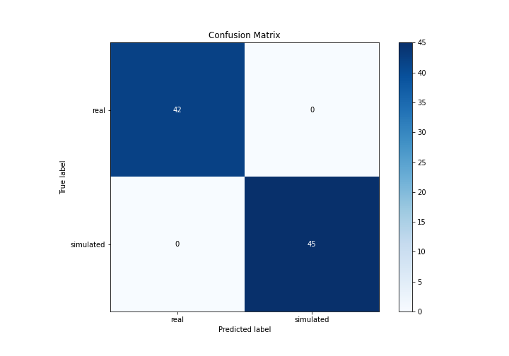
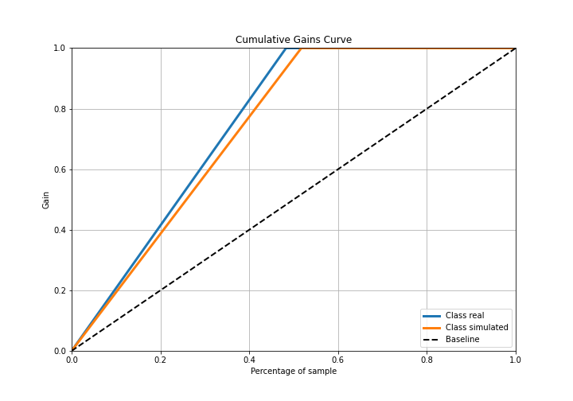
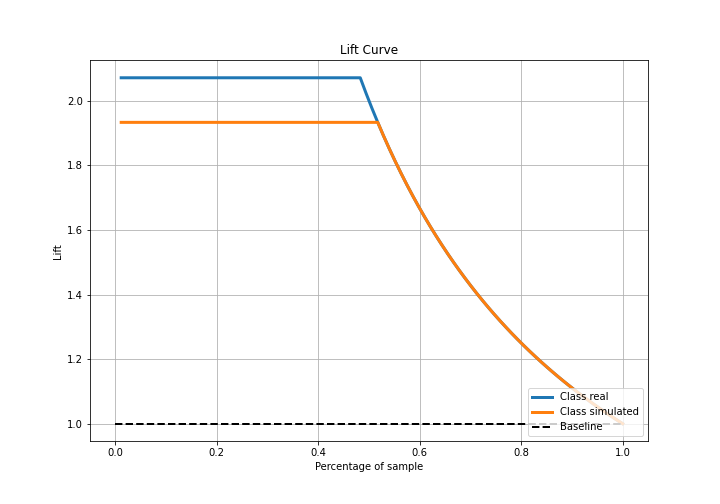

# Summary of 3_Linear

[<< Go back](../README.md)

## Logistic Regression (Linear)
- **n_jobs**: -1
- **explain_level**: 2

## Validation
 - **validation_type**: split
 - **train_ratio**: 0.75
 - **shuffle**: True
 - **stratify**: True

## Optimized metric
accuracy

## Training time

3.4 seconds

## Metric details
|           |      score |     threshold |
|:----------|-----------:|--------------:|
| logloss   | 0.00494746 | nan           |
| auc       | 1          | nan           |
| f1        | 1          |   0.49892     |
| accuracy  | 1          |   0.49892     |
| precision | 1          |   0.996871    |
| recall    | 1          |   0.000130546 |
| mcc       | 1          |   0.49892     |

## Confusion matrix (at threshold=0.49892)
|                      |   Predicted as real |   Predicted as simulated |
|:---------------------|--------------------:|-------------------------:|
| Labeled as real      |                  42 |                        0 |
| Labeled as simulated |                   0 |                       45 |

## Learning curves

## Coefficients
| feature                           |   Learner_1 |
|:----------------------------------|------------:|
| intercept                         |   3.97503   |
| return_sd2                        |   0.499253  |
| return_sd1                        |   0.488265  |
| price2_granger_cause_price1       |   0.112761  |
| return_skew2                      |   0.0678365 |
| price1_granger_cause_price2       |   0.0602606 |
| return_correlation_ts1_lag_3      |  -0.0864219 |
| sqreturn_correlation_ts1_lag_3    |  -0.0864219 |
| sqreturn_correlation_ts2_lag_2    |  -0.0922321 |
| return_correlation_ts2_lag_2      |  -0.0922321 |
| return_correlation_ts1_lag_1      |  -0.0924206 |
| sqreturn_correlation_ts1_lag_1    |  -0.0924206 |
| sqreturn_correlation_ts1_lag_2    |  -0.0938531 |
| return_correlation_ts1_lag_2      |  -0.0938531 |
| sqreturn_correlation_ts2_lag_3    |  -0.0962637 |
| return_correlation_ts2_lag_3      |  -0.0962637 |
| return_correlation_ts1_lag_0      |  -0.0965971 |
| sqreturn_correlation_ts1_lag_0    |  -0.0965971 |
| sqreturn_correlation_ts2_lag_1    |  -0.0967936 |
| return_correlation_ts2_lag_1      |  -0.0967936 |
| return_skew1                      |  -0.131671  |
| return_mean1                      |  -0.195255  |
| return_mean2                      |  -0.291107  |
| return_kurtosis2                  |  -0.485311  |
| return_kurtosis1                  |  -0.494082  |
| return_autocorrelation_1_lag3     |  -0.668398  |
| sqreturn_autocorrelation_ts1_lag3 |  -0.668628  |
| sqreturn_autocorrelation_ts2_lag3 |  -0.675934  |
| return_autocorrelation_2_lag3     |  -0.677485  |
| return_autocorrelation_2_lag2     |  -0.67896   |
| sqreturn_autocorrelation_ts2_lag2 |  -0.679467  |
| sqreturn_autocorrelation_ts1_lag2 |  -0.680634  |
| return_autocorrelation_1_lag2     |  -0.680888  |
| return_autocorrelation_1_lag1     |  -0.682217  |
| sqreturn_autocorrelation_ts1_lag1 |  -0.682352  |
| sqreturn_autocorrelation_ts2_lag1 |  -0.682444  |
| return_autocorrelation_2_lag1     |  -0.682619  |

## Permutation-based Importance

## Confusion Matrix

## Normalized Confusion Matrix

## ROC Curve

## Kolmogorov-Smirnov Statistic

## Precision-Recall Curve

## Calibration Curve

## Cumulative Gains Curve

## Lift Curve

## SHAP Importance

## SHAP Dependence plots

### Dependence (Fold 1)

## SHAP Decision plots

### Top-10 Worst decisions for class 0 (Fold 1)

### Top-10 Best decisions for class 0 (Fold 1)

### Top-10 Worst decisions for class 1 (Fold 1)

### Top-10 Best decisions for class 1 (Fold 1)

[<< Go back](../README.md)
