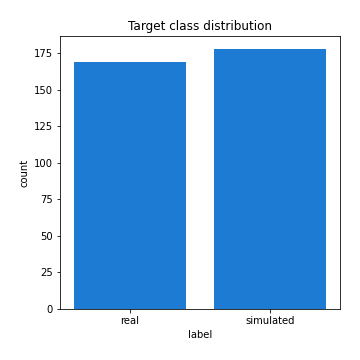

# Exploratory Data Analysis

[<< Go back](../README.md)
## Feature : target
- **Feature type** : categorical
- **Missing** : 0.0%
- **Unique** : 2
- **Count** :347
- **Unique** :2
- **Top** :simulated
- **Freq** :178

## Feature : return_mean1
- **Feature type** : continous
- **Missing** : 0.0%
- **Unique** : 347
- **Count** :347.0
- **Mean** :49.63301087325573
- **Std** :30.765474432825645
- **Min** :2.041832174
- **25%th Percentile** : 35.072610849
- **50%th Percentile** : 49.31823111781362
- **75%th Percentile** : 51.383256546421364
- **Max** :233.603018394

## Feature : return_mean2
- **Feature type** : continous
- **Missing** : 0.0%
- **Unique** : 347
- **Count** :347.0
- **Mean** :52.31243840235247
- **Std** :70.48967314122794
- **Min** :1.6535761199999999
- **25%th Percentile** : 31.189068774
- **50%th Percentile** : 49.450524440351614
- **75%th Percentile** : 51.16015281711951
- **Max** :968.654841336

## Feature : return_sd1
- **Feature type** : continous
- **Missing** : 0.0%
- **Unique** : 347
- **Count** :347.0
- **Mean** :19.088699729964926
- **Std** :14.123497891848647
- **Min** :0.17075448275615598
- **25%th Percentile** : 4.892935828941376
- **50%th Percentile** : 28.04866620850193
- **75%th Percentile** : 28.853435908389674
- **Max** :113.75913244339056

## Feature : return_sd2
- **Feature type** : continous
- **Missing** : 0.0%
- **Unique** : 347
- **Count** :347.0
- **Mean** :19.028287258668144
- **Std** :17.405698643534127
- **Min** :0.2834854899391288
- **25%th Percentile** : 4.731855786209847
- **50%th Percentile** : 28.025829954660068
- **75%th Percentile** : 28.95276214271309
- **Max** :221.10527467938883

## Feature : return_skew1
- **Feature type** : continous
- **Missing** : 0.0%
- **Unique** : 347
- **Count** :347.0
- **Mean** :0.043364728836035635
- **Std** :0.3387859962500853
- **Min** :-1.1720704684568715
- **25%th Percentile** : -0.0843939982293613
- **50%th Percentile** : 0.012409533868791203
- **75%th Percentile** : 0.10798596153483322
- **Max** :1.3650668171612657

## Feature : return_skew2
- **Feature type** : continous
- **Missing** : 0.0%
- **Unique** : 347
- **Count** :347.0
- **Mean** :0.027870706773337257
- **Std** :0.3364267340910143
- **Min** :-1.2832038823397423
- **25%th Percentile** : -0.07468278866880684
- **50%th Percentile** : -0.007547652544365742
- **75%th Percentile** : 0.10249394818621035
- **Max** :1.519021778095084

## Feature : return_kurtosis1
- **Feature type** : continous
- **Missing** : 0.0%
- **Unique** : 347
- **Count** :347.0
- **Mean** :-0.9199558390278756
- **Std** :0.5025551963422784
- **Min** :-1.5936521214358073
- **25%th Percentile** : -1.2076258188782818
- **50%th Percentile** : -1.1464089160312856
- **75%th Percentile** : -0.7828154111918495
- **Max** :2.7204133903766734

## Feature : return_kurtosis2
- **Feature type** : continous
- **Missing** : 0.0%
- **Unique** : 347
- **Count** :347.0
- **Mean** :-0.9174700865020279
- **Std** :0.5270628052169891
- **Min** :-1.5119259840116597
- **25%th Percentile** : -1.218752079255184
- **50%th Percentile** : -1.1581346046591972
- **75%th Percentile** : -0.7801049232294515
- **Max** :1.9883643801715407

## Feature : return_autocorrelation_1_lag1
- **Feature type** : continous
- **Missing** : 0.0%
- **Unique** : 347
- **Count** :347.0
- **Mean** :0.48123744058196977
- **Std** :0.4971127062150679
- **Min** :-0.1125484975936569
- **25%th Percentile** : 0.0015095998317302254
- **50%th Percentile** : 0.08937937582611377
- **75%th Percentile** : 0.9921605639293316
- **Max** :0.9987958286634394

## Feature : return_autocorrelation_1_lag2
- **Feature type** : continous
- **Missing** : 0.0%
- **Unique** : 347
- **Count** :347.0
- **Mean** :0.47420803647166504
- **Std** :0.4947050206673506
- **Min** :-0.12252861440754487
- **25%th Percentile** : -0.006290571414497271
- **50%th Percentile** : 0.07374899283014906
- **75%th Percentile** : 0.9848382471485819
- **Max** :0.9975950806151487

## Feature : return_autocorrelation_1_lag3
- **Feature type** : continous
- **Missing** : 0.0%
- **Unique** : 347
- **Count** :347.0
- **Mean** :0.4741216336783919
- **Std** :0.48607685812557166
- **Min** :-0.09306472130951653
- **25%th Percentile** : 0.001973122629135681
- **50%th Percentile** : 0.08406004703839226
- **75%th Percentile** : 0.9777718479065288
- **Max** :0.9965600149544981

## Feature : return_autocorrelation_2_lag1
- **Feature type** : continous
- **Missing** : 0.0%
- **Unique** : 347
- **Count** :347.0
- **Mean** :0.47927480362778985
- **Std** :0.4997750403436228
- **Min** :-0.11738501734092209
- **25%th Percentile** : -0.006114262095384619
- **50%th Percentile** : 0.08680461057855474
- **75%th Percentile** : 0.992507531262335
- **Max** :0.9985035871279235

## Feature : return_autocorrelation_2_lag2
- **Feature type** : continous
- **Missing** : 0.0%
- **Unique** : 347
- **Count** :347.0
- **Mean** :0.4763332000595884
- **Std** :0.4934479305134428
- **Min** :-0.10826559530308276
- **25%th Percentile** : -0.003943904218591805
- **50%th Percentile** : 0.0855981137133537
- **75%th Percentile** : 0.9855352296373452
- **Max** :0.9969088387936293

## Feature : return_autocorrelation_2_lag3
- **Feature type** : continous
- **Missing** : 0.0%
- **Unique** : 347
- **Count** :347.0
- **Mean** :0.47093787439391566
- **Std** :0.48995137278346346
- **Min** :-0.1226739384975781
- **25%th Percentile** : -0.006934993416163977
- **50%th Percentile** : 0.08117514579833732
- **75%th Percentile** : 0.9787010725423401
- **Max** :0.9955523041927082

## Feature : return_correlation_ts1_lag_0
- **Feature type** : continous
- **Missing** : 0.0%
- **Unique** : 347
- **Count** :347.0
- **Mean** :0.2033524095646292
- **Std** :0.389432368222771
- **Min** :-0.8430691081512005
- **25%th Percentile** : -0.023194503267032998
- **50%th Percentile** : 0.02805217838857662
- **75%th Percentile** : 0.5433763854066793
- **Max** :0.9657060675245052

## Feature : return_correlation_ts1_lag_1
- **Feature type** : continous
- **Missing** : 0.0%
- **Unique** : 347
- **Count** :347.0
- **Mean** :0.20485928928143673
- **Std** :0.387006575520929
- **Min** :-0.8477371479268198
- **25%th Percentile** : -0.01287588035873468
- **50%th Percentile** : 0.03522186170152569
- **75%th Percentile** : 0.5384072702450299
- **Max** :0.9655060959411687

## Feature : return_correlation_ts1_lag_2
- **Feature type** : continous
- **Missing** : 0.0%
- **Unique** : 347
- **Count** :347.0
- **Mean** :0.19917401705363352
- **Std** :0.3887128861511249
- **Min** :-0.8526854582503749
- **25%th Percentile** : -0.023286937761881475
- **50%th Percentile** : 0.02898808540028065
- **75%th Percentile** : 0.5362349166280547
- **Max** :0.9655528894956359

## Feature : return_correlation_ts1_lag_3
- **Feature type** : continous
- **Missing** : 0.0%
- **Unique** : 347
- **Count** :347.0
- **Mean** :0.2028595906780616
- **Std** :0.3855023284289892
- **Min** :-0.8563145423083878
- **25%th Percentile** : -0.01213567698725572
- **50%th Percentile** : 0.03659719471120367
- **75%th Percentile** : 0.5319633339935201
- **Max** :0.965480488388089

## Feature : return_correlation_ts2_lag_1
- **Feature type** : continous
- **Missing** : 0.0%
- **Unique** : 347
- **Count** :347.0
- **Mean** :0.2011261412099842
- **Std** :0.3891272224204236
- **Min** :-0.8419620696123573
- **25%th Percentile** : -0.02053736699695853
- **50%th Percentile** : 0.03190985862577339
- **75%th Percentile** : 0.5386590170150052
- **Max** :0.9653492015905041

## Feature : return_correlation_ts2_lag_2
- **Feature type** : continous
- **Missing** : 0.0%
- **Unique** : 347
- **Count** :347.0
- **Mean** :0.2004177888382241
- **Std** :0.3879851049152087
- **Min** :-0.8407733129095517
- **25%th Percentile** : -0.021629373650864196
- **50%th Percentile** : 0.030528027539324237
- **75%th Percentile** : 0.5288484347925485
- **Max** :0.9648220784284761

## Feature : return_correlation_ts2_lag_3
- **Feature type** : continous
- **Missing** : 0.0%
- **Unique** : 347
- **Count** :347.0
- **Mean** :0.19694443781445348
- **Std** :0.3887892286682486
- **Min** :-0.8390925417171665
- **25%th Percentile** : -0.02117313129107422
- **50%th Percentile** : 0.027117662811535853
- **75%th Percentile** : 0.5247543084234421
- **Max** :0.9641714645667581

## Feature : sqreturn_autocorrelation_ts1_lag1
- **Feature type** : continous
- **Missing** : 0.0%
- **Unique** : 347
- **Count** :347.0
- **Mean** :0.48082008145943667
- **Std** :0.4970557946684434
- **Min** :-0.11400195759256666
- **25%th Percentile** : -0.003918619009871928
- **50%th Percentile** : 0.07939048348339493
- **75%th Percentile** : 0.991554028526676
- **Max** :0.9984433232250934

## Feature : sqreturn_autocorrelation_ts1_lag2
- **Feature type** : continous
- **Missing** : 0.0%
- **Unique** : 347
- **Count** :347.0
- **Mean** :0.47390107254821584
- **Std** :0.4943136432034076
- **Min** :-0.10882442984565852
- **25%th Percentile** : -0.003072568340205071
- **50%th Percentile** : 0.07381395441962808
- **75%th Percentile** : 0.9836725136755935
- **Max** :0.9969274171205735

## Feature : sqreturn_autocorrelation_ts1_lag3
- **Feature type** : continous
- **Missing** : 0.0%
- **Unique** : 347
- **Count** :347.0
- **Mean** :0.47310446988189436
- **Std** :0.48623118587515196
- **Min** :-0.11408294170290487
- **25%th Percentile** : -0.0013088244577195997
- **50%th Percentile** : 0.08176419282031847
- **75%th Percentile** : 0.9765815604827311
- **Max** :0.9956917620790442

## Feature : sqreturn_autocorrelation_ts2_lag1
- **Feature type** : continous
- **Missing** : 0.0%
- **Unique** : 347
- **Count** :347.0
- **Mean** :0.47885797080031434
- **Std** :0.4999650706793022
- **Min** :-0.13877319766331184
- **25%th Percentile** : -0.00455327077611106
- **50%th Percentile** : 0.09083192943132536
- **75%th Percentile** : 0.9922493461683737
- **Max** :0.9986746606786123

## Feature : sqreturn_autocorrelation_ts2_lag2
- **Feature type** : continous
- **Missing** : 0.0%
- **Unique** : 347
- **Count** :347.0
- **Mean** :0.4747944587714171
- **Std** :0.4944579762901005
- **Min** :-0.11525781309319276
- **25%th Percentile** : -0.004379429368550897
- **50%th Percentile** : 0.08083555078676809
- **75%th Percentile** : 0.984602234943704
- **Max** :0.996990235687134

## Feature : sqreturn_autocorrelation_ts2_lag3
- **Feature type** : continous
- **Missing** : 0.0%
- **Unique** : 347
- **Count** :347.0
- **Mean** :0.471383020791168
- **Std** :0.488794560344538
- **Min** :-0.11893346773468856
- **25%th Percentile** : -0.010962520471856089
- **50%th Percentile** : 0.07594693793703787
- **75%th Percentile** : 0.9778787468536807
- **Max** :0.9957895086263276

## Feature : sqreturn_correlation_ts1_lag_0
- **Feature type** : continous
- **Missing** : 0.0%
- **Unique** : 347
- **Count** :347.0
- **Mean** :0.2033524095646292
- **Std** :0.389432368222771
- **Min** :-0.8430691081512005
- **25%th Percentile** : -0.023194503267032998
- **50%th Percentile** : 0.02805217838857662
- **75%th Percentile** : 0.5433763854066793
- **Max** :0.9657060675245052

## Feature : sqreturn_correlation_ts1_lag_1
- **Feature type** : continous
- **Missing** : 0.0%
- **Unique** : 347
- **Count** :347.0
- **Mean** :0.20485928928143673
- **Std** :0.387006575520929
- **Min** :-0.8477371479268198
- **25%th Percentile** : -0.01287588035873468
- **50%th Percentile** : 0.03522186170152569
- **75%th Percentile** : 0.5384072702450299
- **Max** :0.9655060959411687

## Feature : sqreturn_correlation_ts1_lag_2
- **Feature type** : continous
- **Missing** : 0.0%
- **Unique** : 347
- **Count** :347.0
- **Mean** :0.19917401705363352
- **Std** :0.3887128861511249
- **Min** :-0.8526854582503749
- **25%th Percentile** : -0.023286937761881475
- **50%th Percentile** : 0.02898808540028065
- **75%th Percentile** : 0.5362349166280547
- **Max** :0.9655528894956359

## Feature : sqreturn_correlation_ts1_lag_3
- **Feature type** : continous
- **Missing** : 0.0%
- **Unique** : 347
- **Count** :347.0
- **Mean** :0.2028595906780616
- **Std** :0.3855023284289892
- **Min** :-0.8563145423083878
- **25%th Percentile** : -0.01213567698725572
- **50%th Percentile** : 0.03659719471120367
- **75%th Percentile** : 0.5319633339935201
- **Max** :0.965480488388089

## Feature : sqreturn_correlation_ts2_lag_1
- **Feature type** : continous
- **Missing** : 0.0%
- **Unique** : 347
- **Count** :347.0
- **Mean** :0.2011261412099842
- **Std** :0.3891272224204236
- **Min** :-0.8419620696123573
- **25%th Percentile** : -0.02053736699695853
- **50%th Percentile** : 0.03190985862577339
- **75%th Percentile** : 0.5386590170150052
- **Max** :0.9653492015905041

## Feature : sqreturn_correlation_ts2_lag_2
- **Feature type** : continous
- **Missing** : 0.0%
- **Unique** : 347
- **Count** :347.0
- **Mean** :0.2004177888382241
- **Std** :0.3879851049152087
- **Min** :-0.8407733129095517
- **25%th Percentile** : -0.021629373650864196
- **50%th Percentile** : 0.030528027539324237
- **75%th Percentile** : 0.5288484347925485
- **Max** :0.9648220784284761

## Feature : sqreturn_correlation_ts2_lag_3
- **Feature type** : continous
- **Missing** : 0.0%
- **Unique** : 347
- **Count** :347.0
- **Mean** :0.19694443781445348
- **Std** :0.3887892286682486
- **Min** :-0.8390925417171665
- **25%th Percentile** : -0.02117313129107422
- **50%th Percentile** : 0.027117662811535853
- **75%th Percentile** : 0.5247543084234421
- **Max** :0.9641714645667581

## Feature : price2_granger_cause_price1
- **Feature type** : continous
- **Missing** : 0.0%
- **Unique** : 347
- **Count** :347.0
- **Mean** :0.43829739983450183
- **Std** :0.30363736165929656
- **Min** :5.063123743918868e-06
- **25%th Percentile** : 0.15126950726108065
- **50%th Percentile** : 0.4312903212624839
- **75%th Percentile** : 0.6914488166495139
- **Max** :0.9887885544657823

## Feature : price1_granger_cause_price2
- **Feature type** : continous
- **Missing** : 0.0%
- **Unique** : 347
- **Count** :347.0
- **Mean** :0.39779838961236846
- **Std** :0.2983467686757306
- **Min** :8.101068402988115e-10
- **25%th Percentile** : 0.14128302332489764
- **50%th Percentile** : 0.3432686702144787
- **75%th Percentile** : 0.6493397589509591
- **Max** :0.9967863152536168

[<< Go back](../README.md)
