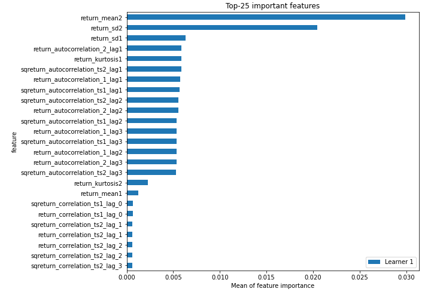
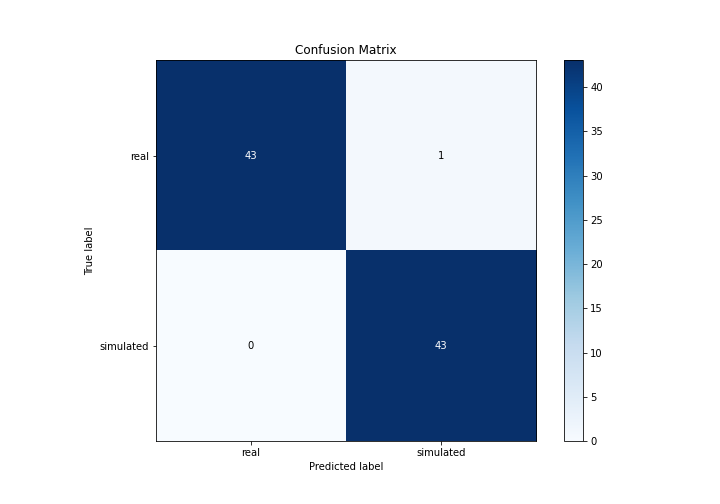
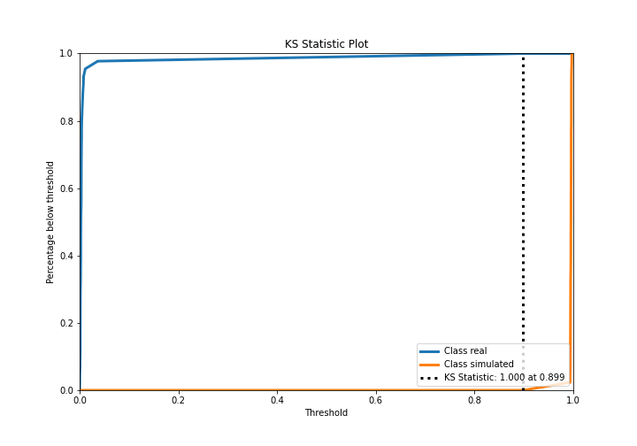
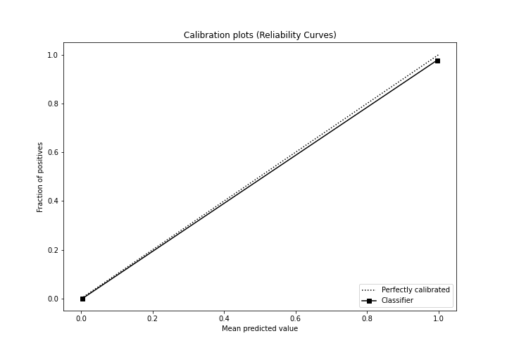
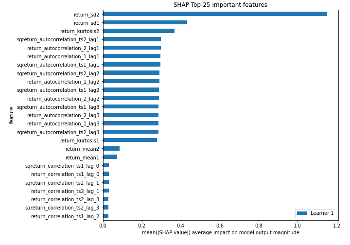
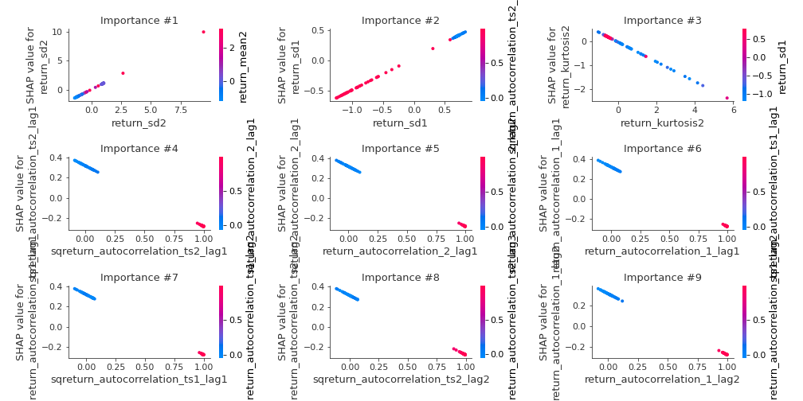
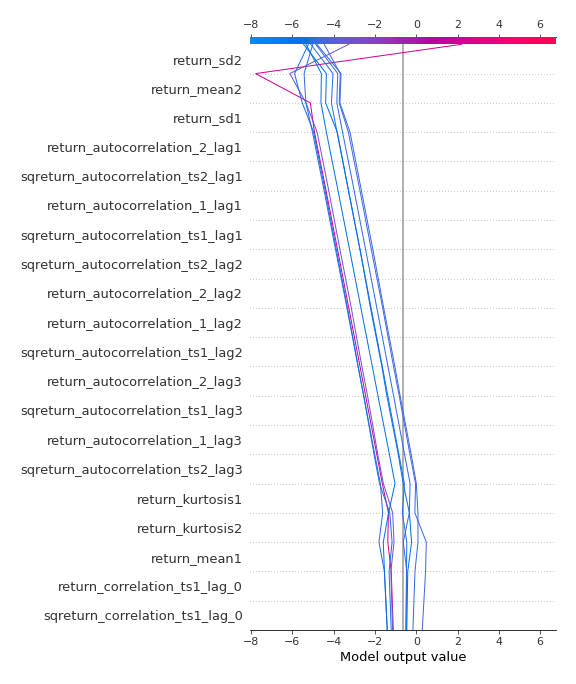
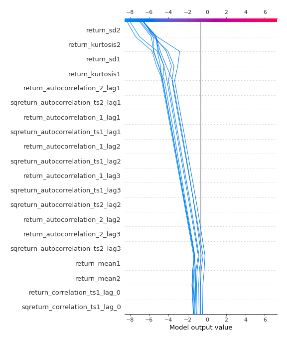
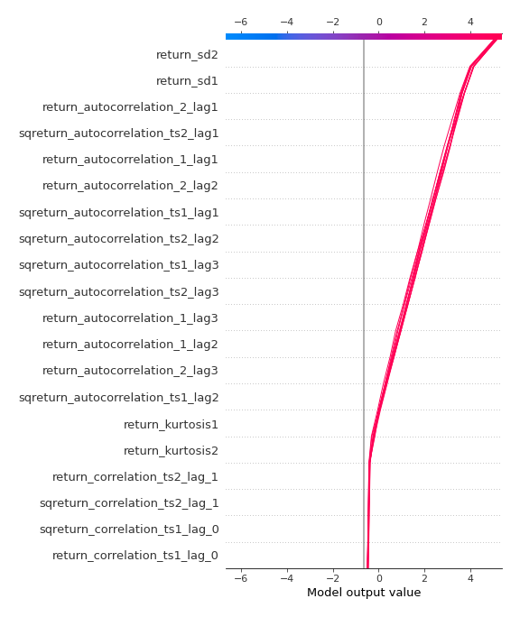
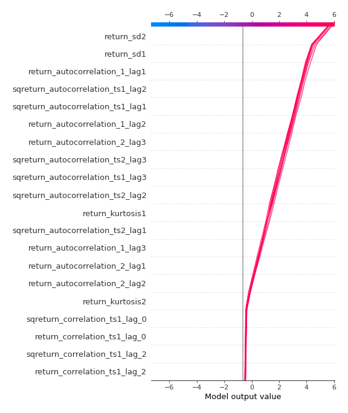

# Summary of 3_Linear

[<< Go back](../README.md)

## Logistic Regression (Linear)
- **n_jobs**: -1
- **explain_level**: 2

## Validation
 - **validation_type**: split
 - **train_ratio**: 0.75
 - **shuffle**: True
 - **stratify**: True

## Optimized metric
accuracy

## Training time

3.3 seconds

## Metric details
|           |     score |     threshold |
|:----------|----------:|--------------:|
| logloss   | 0.0306639 | nan           |
| auc       | 1         | nan           |
| f1        | 0.988506  |   0.499175    |
| accuracy  | 0.988506  |   0.499175    |
| precision | 1         |   0.994792    |
| recall    | 1         |   0.000231211 |
| mcc       | 0.977273  |   0.499175    |

## Confusion matrix (at threshold=0.499175)
|                      |   Predicted as real |   Predicted as simulated |
|:---------------------|--------------------:|-------------------------:|
| Labeled as real      |                  43 |                        1 |
| Labeled as simulated |                   0 |                       43 |

## Learning curves

## Coefficients
| feature                           |   Learner_1 |
|:----------------------------------|------------:|
| intercept                         |   3.45418   |
| return_sd2                        |   1.05138   |
| return_sd1                        |   0.524805  |
| price2_granger_cause_price1       |   0.0899726 |
| price1_granger_cause_price2       |   0.0373343 |
| return_skew2                      |   0.0113769 |
| return_skew1                      |  -0.0584253 |
| return_mean2                      |  -0.0758805 |
| sqreturn_correlation_ts1_lag_3    |  -0.0799566 |
| return_correlation_ts1_lag_3      |  -0.0799566 |
| return_correlation_ts1_lag_1      |  -0.0842681 |
| sqreturn_correlation_ts1_lag_1    |  -0.0842681 |
| sqreturn_correlation_ts1_lag_2    |  -0.0867647 |
| return_correlation_ts1_lag_2      |  -0.0867647 |
| sqreturn_correlation_ts2_lag_2    |  -0.0868225 |
| return_correlation_ts2_lag_2      |  -0.0868225 |
| sqreturn_correlation_ts2_lag_3    |  -0.0912352 |
| return_correlation_ts2_lag_3      |  -0.0912352 |
| return_correlation_ts2_lag_1      |  -0.0922276 |
| sqreturn_correlation_ts2_lag_1    |  -0.0922276 |
| return_correlation_ts1_lag_0      |  -0.0941321 |
| sqreturn_correlation_ts1_lag_0    |  -0.0941321 |
| return_mean1                      |  -0.212373  |
| return_kurtosis2                  |  -0.412357  |
| return_kurtosis1                  |  -0.433619  |
| sqreturn_autocorrelation_ts2_lag3 |  -0.586232  |
| return_autocorrelation_2_lag3     |  -0.58901   |
| sqreturn_autocorrelation_ts1_lag3 |  -0.589168  |
| return_autocorrelation_1_lag3     |  -0.589391  |
| return_autocorrelation_2_lag2     |  -0.591542  |
| sqreturn_autocorrelation_ts2_lag2 |  -0.59311   |
| sqreturn_autocorrelation_ts1_lag2 |  -0.594917  |
| return_autocorrelation_1_lag2     |  -0.595601  |
| return_autocorrelation_1_lag1     |  -0.59907   |
| sqreturn_autocorrelation_ts1_lag1 |  -0.600185  |
| return_autocorrelation_2_lag1     |  -0.603722  |
| sqreturn_autocorrelation_ts2_lag1 |  -0.603728  |

## Permutation-based Importance

## Confusion Matrix

## Normalized Confusion Matrix

## ROC Curve

## Kolmogorov-Smirnov Statistic

## Precision-Recall Curve

## Calibration Curve

## Cumulative Gains Curve

## Lift Curve

## SHAP Importance

## SHAP Dependence plots

### Dependence (Fold 1)

## SHAP Decision plots

### Top-10 Worst decisions for class 0 (Fold 1)

### Top-10 Best decisions for class 0 (Fold 1)

### Top-10 Worst decisions for class 1 (Fold 1)

### Top-10 Best decisions for class 1 (Fold 1)

[<< Go back](../README.md)
