# Exploratory Data Analysis

[<< Go back](../README.md)
## Feature : target
- **Feature type** : categorical
- **Missing** : 0.0%
- **Unique** : 2
- **Count** :347
- **Unique** :2
- **Top** :real
- **Freq** :175

## Feature : return_mean1
- **Feature type** : continous
- **Missing** : 0.0%
- **Unique** : 347
- **Count** :347.0
- **Mean** :49.434330316211664
- **Std** :38.793146707246414
- **Min** :2.041832174
- **25%th Percentile** : 32.099216777
- **50%th Percentile** : 49.29437641948739
- **75%th Percentile** : 51.325899764680884
- **Max** :514.7209599040001

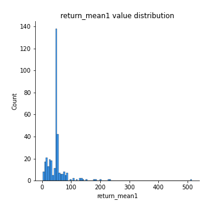
## Feature : return_mean2
- **Feature type** : continous
- **Missing** : 0.0%
- **Unique** : 347
- **Count** :347.0
- **Mean** :48.46350428492184
- **Std** :58.12225506089441
- **Min** :1.6535761199999999
- **25%th Percentile** : 28.502494525
- **50%th Percentile** : 49.09705383392144
- **75%th Percentile** : 50.78566114251808
- **Max** :968.654841336

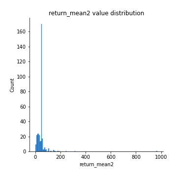
## Feature : return_sd1
- **Feature type** : continous
- **Missing** : 0.0%
- **Unique** : 347
- **Count** :347.0
- **Mean** :18.382798895410406
- **Std** :13.741117508081805
- **Min** :0.17075448275615598
- **25%th Percentile** : 4.495864796926712
- **50%th Percentile** : 27.96011563940463
- **75%th Percentile** : 28.803494223443906
- **Max** :106.16133416858058

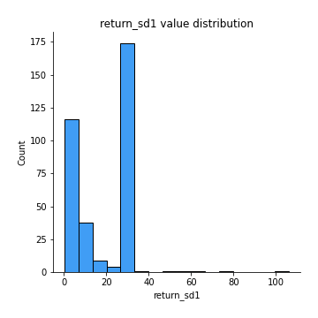
## Feature : return_sd2
- **Feature type** : continous
- **Missing** : 0.0%
- **Unique** : 347
- **Count** :347.0
- **Mean** :17.658810480851695
- **Std** :13.634078154050451
- **Min** :0.2834854899391288
- **25%th Percentile** : 4.169460956361085
- **50%th Percentile** : 27.460895786518584
- **75%th Percentile** : 28.86926487271296
- **Max** :131.03889249429292

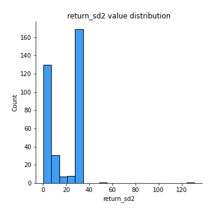
## Feature : return_skew1
- **Feature type** : continous
- **Missing** : 0.0%
- **Unique** : 347
- **Count** :347.0
- **Mean** :0.03788635381433143
- **Std** :0.3686183615358207
- **Min** :-1.1720704684568715
- **25%th Percentile** : -0.08453582695169026
- **50%th Percentile** : 0.022771166898878762
- **75%th Percentile** : 0.1211125443497312
- **Max** :1.3650668171612657

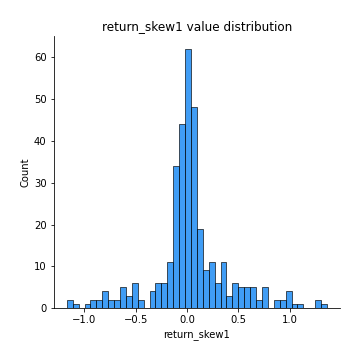
## Feature : return_skew2
- **Feature type** : continous
- **Missing** : 0.0%
- **Unique** : 347
- **Count** :347.0
- **Mean** :0.03918178451504354
- **Std** :0.33890902119784627
- **Min** :-1.2832038823397423
- **25%th Percentile** : -0.08429940964587954
- **50%th Percentile** : -0.006980988906178817
- **75%th Percentile** : 0.11448104547811139
- **Max** :1.519021778095084

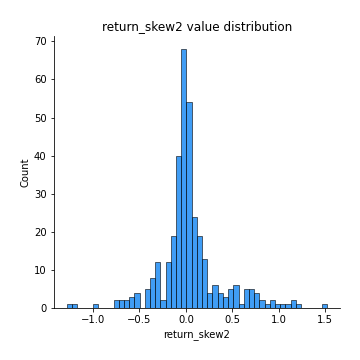
## Feature : return_kurtosis1
- **Feature type** : continous
- **Missing** : 0.0%
- **Unique** : 347
- **Count** :347.0
- **Mean** :-0.8882610074442548
- **Std** :0.5453355731223131
- **Min** :-1.5936521214358073
- **25%th Percentile** : -1.207877721919237
- **50%th Percentile** : -1.1424252379243724
- **75%th Percentile** : -0.6989926994902365
- **Max** :2.7204133903766734

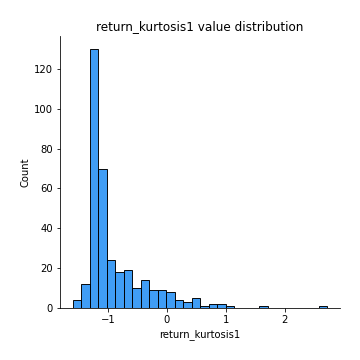
## Feature : return_kurtosis2
- **Feature type** : continous
- **Missing** : 0.0%
- **Unique** : 347
- **Count** :347.0
- **Mean** :-0.8956183597270473
- **Std** :0.5362661969622108
- **Min** :-1.4857276072282979
- **25%th Percentile** : -1.2135357941476
- **50%th Percentile** : -1.1441158366269557
- **75%th Percentile** : -0.7563027312876558
- **Max** :1.9883643801715407

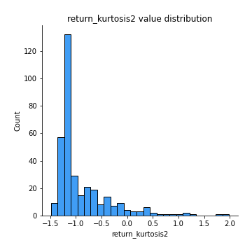
## Feature : return_autocorrelation_1_lag1
- **Feature type** : continous
- **Missing** : 0.0%
- **Unique** : 347
- **Count** :347.0
- **Mean** :0.4992315119933772
- **Std** :0.4964481987841021
- **Min** :-0.1125484975936569
- **25%th Percentile** : 0.004754871945472422
- **50%th Percentile** : 0.9413419342077411
- **75%th Percentile** : 0.9925661281887654
- **Max** :0.9986434654217642

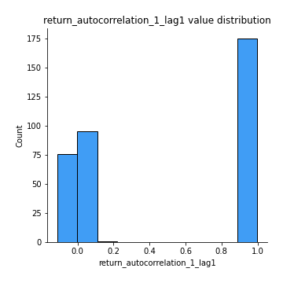
## Feature : return_autocorrelation_1_lag2
- **Feature type** : continous
- **Missing** : 0.0%
- **Unique** : 347
- **Count** :347.0
- **Mean** :0.49524069106269514
- **Std** :0.49115998938857763
- **Min** :-0.09921180071930628
- **25%th Percentile** : 0.0008412510049372558
- **50%th Percentile** : 0.8983702502230806
- **75%th Percentile** : 0.9857159345547322
- **Max** :0.9973077069474119

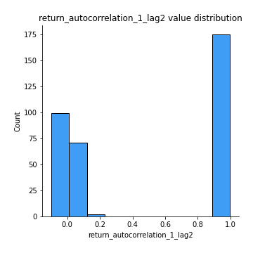
## Feature : return_autocorrelation_1_lag3
- **Feature type** : continous
- **Missing** : 0.0%
- **Unique** : 347
- **Count** :347.0
- **Mean** :0.49065251362440904
- **Std** :0.4866316427582711
- **Min** :-0.09745451039371347
- **25%th Percentile** : 0.004264479161950554
- **50%th Percentile** : 0.864348822363276
- **75%th Percentile** : 0.9788403049383407
- **Max** :0.9958719390898783

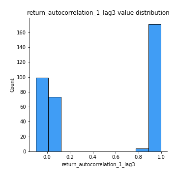
## Feature : return_autocorrelation_2_lag1
- **Feature type** : continous
- **Missing** : 0.0%
- **Unique** : 347
- **Count** :347.0
- **Mean** :0.4964969931549778
- **Std** :0.499671500000975
- **Min** :-0.14335108684419343
- **25%th Percentile** : -0.0009083367496099967
- **50%th Percentile** : 0.961251289560043
- **75%th Percentile** : 0.9923328980212776
- **Max** :0.9990075551978286

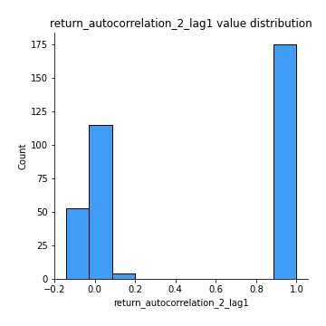
## Feature : return_autocorrelation_2_lag2
- **Feature type** : continous
- **Missing** : 0.0%
- **Unique** : 347
- **Count** :347.0
- **Mean** :0.495012086635235
- **Std** :0.4912537590737704
- **Min** :-0.10826559530308276
- **25%th Percentile** : 0.0016995184382777879
- **50%th Percentile** : 0.9181007061137118
- **75%th Percentile** : 0.9850063486133144
- **Max** :0.9980152731102225

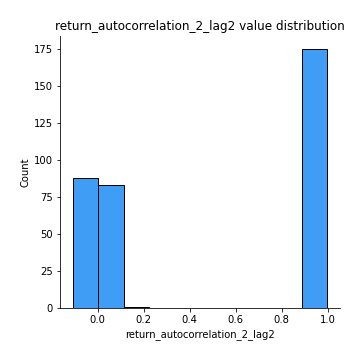
## Feature : return_autocorrelation_2_lag3
- **Feature type** : continous
- **Missing** : 0.0%
- **Unique** : 347
- **Count** :347.0
- **Mean** :0.4887876843438538
- **Std** :0.4882952426282684
- **Min** :-0.1226739384975781
- **25%th Percentile** : -0.0004165893775607179
- **50%th Percentile** : 0.8783385001119621
- **75%th Percentile** : 0.9779477670702489
- **Max** :0.9970922117201266

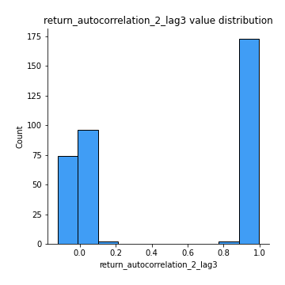
## Feature : return_correlation_ts1_lag_0
- **Feature type** : continous
- **Missing** : 0.0%
- **Unique** : 347
- **Count** :347.0
- **Mean** :0.22953066868316788
- **Std** :0.3939442227042161
- **Min** :-0.8251828119339379
- **25%th Percentile** : -0.02167864165371968
- **50%th Percentile** : 0.030157101794141834
- **75%th Percentile** : 0.6295157786897524
- **Max** :0.9657060675245052

## Feature : return_correlation_ts1_lag_1
- **Feature type** : continous
- **Missing** : 0.0%
- **Unique** : 347
- **Count** :347.0
- **Mean** :0.23328098854862947
- **Std** :0.3901416775881189
- **Min** :-0.823886760833548
- **25%th Percentile** : -0.008683668613795326
- **50%th Percentile** : 0.038120609747591135
- **75%th Percentile** : 0.6235266865970981
- **Max** :0.9655060959411687

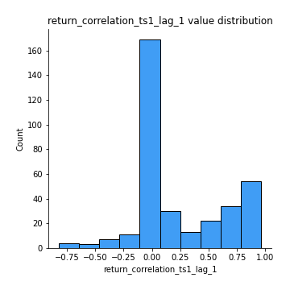
## Feature : return_correlation_ts1_lag_2
- **Feature type** : continous
- **Missing** : 0.0%
- **Unique** : 347
- **Count** :347.0
- **Mean** :0.2274244272979305
- **Std** :0.392456394301638
- **Min** :-0.8232390456803415
- **25%th Percentile** : -0.020141804692001698
- **50%th Percentile** : 0.03943683387857759
- **75%th Percentile** : 0.6164953293151546
- **Max** :0.9655528894956359

## Feature : return_correlation_ts1_lag_3
- **Feature type** : continous
- **Missing** : 0.0%
- **Unique** : 347
- **Count** :347.0
- **Mean** :0.2292182392768732
- **Std** :0.3900883586153371
- **Min** :-0.8224601023724137
- **25%th Percentile** : -0.01132888762735318
- **50%th Percentile** : 0.04086541164057763
- **75%th Percentile** : 0.6115212617243113
- **Max** :0.965480488388089

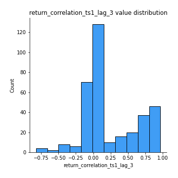
## Feature : return_correlation_ts2_lag_1
- **Feature type** : continous
- **Missing** : 0.0%
- **Unique** : 347
- **Count** :347.0
- **Mean** :0.2285283642429705
- **Std** :0.39307406052957183
- **Min** :-0.8277343984631227
- **25%th Percentile** : -0.019793030741787086
- **50%th Percentile** : 0.03355542628389337
- **75%th Percentile** : 0.6252184626685564
- **Max** :0.9653492015905041

## Feature : return_correlation_ts2_lag_2
- **Feature type** : continous
- **Missing** : 0.0%
- **Unique** : 347
- **Count** :347.0
- **Mean** :0.23014009810509875
- **Std** :0.39090498415917607
- **Min** :-0.8297969346663087
- **25%th Percentile** : -0.01785710295142766
- **50%th Percentile** : 0.03859326516934563
- **75%th Percentile** : 0.6188399061932823
- **Max** :0.9648220784284761

## Feature : return_correlation_ts2_lag_3
- **Feature type** : continous
- **Missing** : 0.0%
- **Unique** : 347
- **Count** :347.0
- **Mean** :0.22577038584349438
- **Std** :0.3921893156704862
- **Min** :-0.8316877963362261
- **25%th Percentile** : -0.018742195670801133
- **50%th Percentile** : 0.033474194222725774
- **75%th Percentile** : 0.6128461814728802
- **Max** :0.9641714645667581

## Feature : sqreturn_autocorrelation_ts1_lag1
- **Feature type** : continous
- **Missing** : 0.0%
- **Unique** : 347
- **Count** :347.0
- **Mean** :0.49865937889761497
- **Std** :0.4965812438551977
- **Min** :-0.11400195759256666
- **25%th Percentile** : 0.0006744027470776564
- **50%th Percentile** : 0.9337477128474155
- **75%th Percentile** : 0.9921244487715668
- **Max** :0.9984349069917865

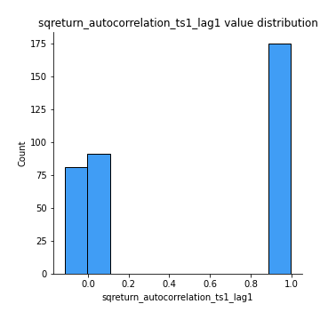
## Feature : sqreturn_autocorrelation_ts1_lag2
- **Feature type** : continous
- **Missing** : 0.0%
- **Unique** : 347
- **Count** :347.0
- **Mean** :0.49481426635847336
- **Std** :0.49089202108804114
- **Min** :-0.10144465591662269
- **25%th Percentile** : 0.0015983097433286836
- **50%th Percentile** : 0.8971805322182641
- **75%th Percentile** : 0.9843890658048426
- **Max** :0.9970968172935939

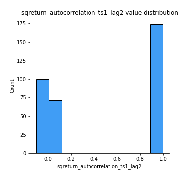
## Feature : sqreturn_autocorrelation_ts1_lag3
- **Feature type** : continous
- **Missing** : 0.0%
- **Unique** : 347
- **Count** :347.0
- **Mean** :0.48944871949126684
- **Std** :0.4871202964738576
- **Min** :-0.11408294170290487
- **25%th Percentile** : -0.00037977176205223365
- **50%th Percentile** : 0.8535993233028852
- **75%th Percentile** : 0.9778512542728789
- **Max** :0.9955304893640124

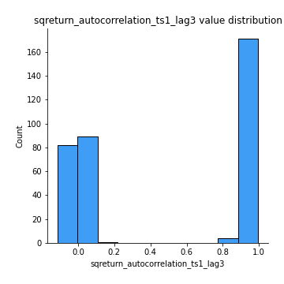
## Feature : sqreturn_autocorrelation_ts2_lag1
- **Feature type** : continous
- **Missing** : 0.0%
- **Unique** : 347
- **Count** :347.0
- **Mean** :0.49631169920394164
- **Std** :0.4996734155089265
- **Min** :-0.13877319766331184
- **25%th Percentile** : -0.0017597258201873995
- **50%th Percentile** : 0.9604446597294015
- **75%th Percentile** : 0.9920206290151937
- **Max** :0.9988745118390566

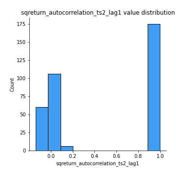
## Feature : sqreturn_autocorrelation_ts2_lag2
- **Feature type** : continous
- **Missing** : 0.0%
- **Unique** : 347
- **Count** :347.0
- **Mean** :0.4932683663194296
- **Std** :0.4925455975018942
- **Min** :-0.11525781309319276
- **25%th Percentile** : 0.0015143795894611207
- **50%th Percentile** : 0.9171334422938444
- **75%th Percentile** : 0.9843614899637352
- **Max** :0.9976921088288594

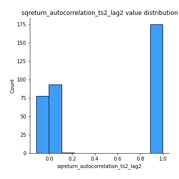
## Feature : sqreturn_autocorrelation_ts2_lag3
- **Feature type** : continous
- **Missing** : 0.0%
- **Unique** : 347
- **Count** :347.0
- **Mean** :0.4895037009013222
- **Std** :0.4867777476009541
- **Min** :-0.11893346773468856
- **25%th Percentile** : -0.0003624936661229696
- **50%th Percentile** : 0.8766322531820853
- **75%th Percentile** : 0.9772655808088866
- **Max** :0.9965698341282454

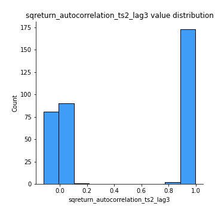
## Feature : sqreturn_correlation_ts1_lag_0
- **Feature type** : continous
- **Missing** : 0.0%
- **Unique** : 347
- **Count** :347.0
- **Mean** :0.22953066868316788
- **Std** :0.3939442227042161
- **Min** :-0.8251828119339379
- **25%th Percentile** : -0.02167864165371968
- **50%th Percentile** : 0.030157101794141834
- **75%th Percentile** : 0.6295157786897524
- **Max** :0.9657060675245052

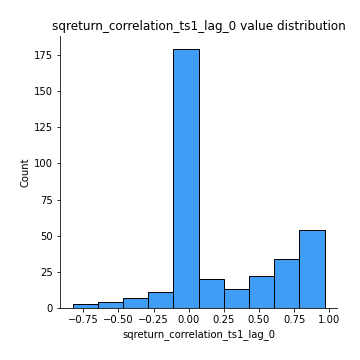
## Feature : sqreturn_correlation_ts1_lag_1
- **Feature type** : continous
- **Missing** : 0.0%
- **Unique** : 347
- **Count** :347.0
- **Mean** :0.23328098854862947
- **Std** :0.3901416775881189
- **Min** :-0.823886760833548
- **25%th Percentile** : -0.008683668613795326
- **50%th Percentile** : 0.038120609747591135
- **75%th Percentile** : 0.6235266865970981
- **Max** :0.9655060959411687

## Feature : sqreturn_correlation_ts1_lag_2
- **Feature type** : continous
- **Missing** : 0.0%
- **Unique** : 347
- **Count** :347.0
- **Mean** :0.2274244272979305
- **Std** :0.392456394301638
- **Min** :-0.8232390456803415
- **25%th Percentile** : -0.020141804692001698
- **50%th Percentile** : 0.03943683387857759
- **75%th Percentile** : 0.6164953293151546
- **Max** :0.9655528894956359

## Feature : sqreturn_correlation_ts1_lag_3
- **Feature type** : continous
- **Missing** : 0.0%
- **Unique** : 347
- **Count** :347.0
- **Mean** :0.2292182392768732
- **Std** :0.3900883586153371
- **Min** :-0.8224601023724137
- **25%th Percentile** : -0.01132888762735318
- **50%th Percentile** : 0.04086541164057763
- **75%th Percentile** : 0.6115212617243113
- **Max** :0.965480488388089

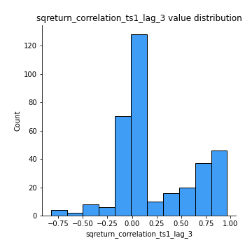
## Feature : sqreturn_correlation_ts2_lag_1
- **Feature type** : continous
- **Missing** : 0.0%
- **Unique** : 347
- **Count** :347.0
- **Mean** :0.2285283642429705
- **Std** :0.39307406052957183
- **Min** :-0.8277343984631227
- **25%th Percentile** : -0.019793030741787086
- **50%th Percentile** : 0.03355542628389337
- **75%th Percentile** : 0.6252184626685564
- **Max** :0.9653492015905041

## Feature : sqreturn_correlation_ts2_lag_2
- **Feature type** : continous
- **Missing** : 0.0%
- **Unique** : 347
- **Count** :347.0
- **Mean** :0.23014009810509875
- **Std** :0.39090498415917607
- **Min** :-0.8297969346663087
- **25%th Percentile** : -0.01785710295142766
- **50%th Percentile** : 0.03859326516934563
- **75%th Percentile** : 0.6188399061932823
- **Max** :0.9648220784284761

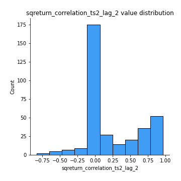
## Feature : sqreturn_correlation_ts2_lag_3
- **Feature type** : continous
- **Missing** : 0.0%
- **Unique** : 347
- **Count** :347.0
- **Mean** :0.22577038584349438
- **Std** :0.3921893156704862
- **Min** :-0.8316877963362261
- **25%th Percentile** : -0.018742195670801133
- **50%th Percentile** : 0.033474194222725774
- **75%th Percentile** : 0.6128461814728802
- **Max** :0.9641714645667581

## Feature : price2_granger_cause_price1
- **Feature type** : continous
- **Missing** : 0.0%
- **Unique** : 347
- **Count** :347.0
- **Mean** :0.42416918851822133
- **Std** :0.29769914655475294
- **Min** :5.063123743918868e-06
- **25%th Percentile** : 0.15130150322298025
- **50%th Percentile** : 0.3973443139827647
- **75%th Percentile** : 0.6682064059144116
- **Max** :0.979092957018188

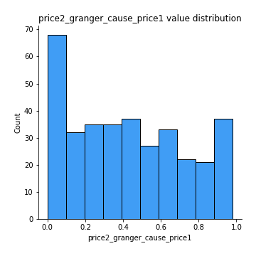
## Feature : price1_granger_cause_price2
- **Feature type** : continous
- **Missing** : 0.0%
- **Unique** : 347
- **Count** :347.0
- **Mean** :0.3957077304622348
- **Std** :0.2951078924921611
- **Min** :8.101068402988115e-10
- **25%th Percentile** : 0.14211507527894715
- **50%th Percentile** : 0.34826703610106535
- **75%th Percentile** : 0.6372067081855126
- **Max** :0.9967863152536168

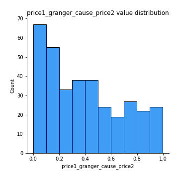

[<< Go back](../README.md)
