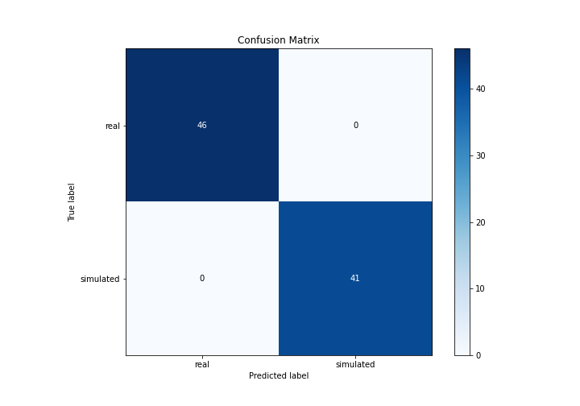
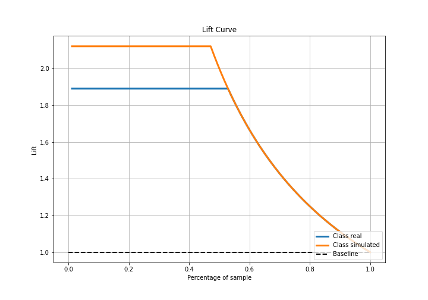
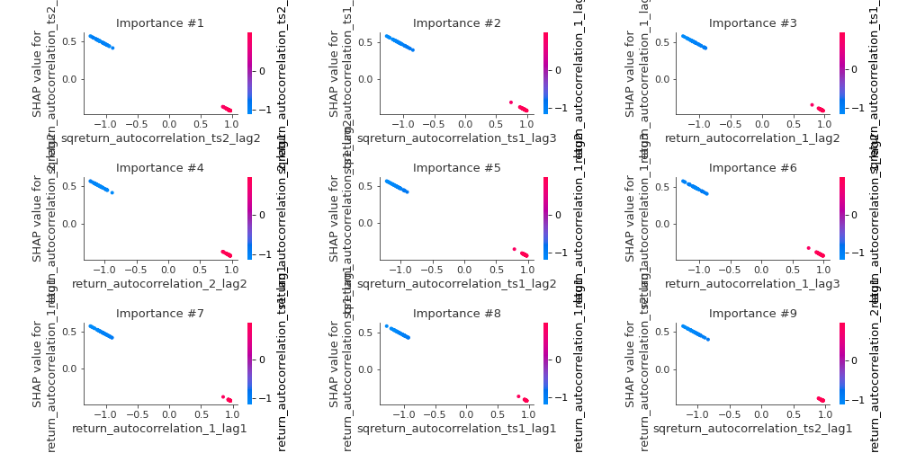

# Summary of 3_Linear

[<< Go back](../README.md)

## Logistic Regression (Linear)
- **n_jobs**: -1
- **explain_level**: 2

## Validation
 - **validation_type**: split
 - **train_ratio**: 0.75
 - **shuffle**: True
 - **stratify**: True

## Optimized metric
accuracy

## Training time

3.9 seconds

## Metric details
|           |      score |    threshold |
|:----------|-----------:|-------------:|
| logloss   | 0.00165453 | nan          |
| auc       | 1          | nan          |
| f1        | 1          |   0.499444   |
| accuracy  | 1          |   0.499444   |
| precision | 1          |   0.499444   |
| recall    | 1          |   0.00038954 |
| mcc       | 1          |   0.499444   |

## Confusion matrix (at threshold=0.499444)
|                      |   Predicted as real |   Predicted as simulated |
|:---------------------|--------------------:|-------------------------:|
| Labeled as real      |                  46 |                        0 |
| Labeled as simulated |                   0 |                       41 |

## Learning curves

## Coefficients
| feature                           |   Learner_1 |
|:----------------------------------|------------:|
| return_sd2                        |  0.370964   |
| return_sd1                        |  0.307151   |
| price2_granger_cause_price1       |  0.021242   |
| price1_granger_cause_price2       |  0.00522795 |
| return_skew2                      | -0.0150932  |
| return_skew1                      | -0.0198407  |
| return_mean2                      | -0.0603786  |
| sqreturn_correlation_ts1_lag_3    | -0.0621413  |
| return_correlation_ts1_lag_3      | -0.0621413  |
| return_correlation_ts2_lag_2      | -0.0640607  |
| sqreturn_correlation_ts2_lag_2    | -0.0640607  |
| sqreturn_correlation_ts1_lag_1    | -0.064092   |
| return_correlation_ts1_lag_1      | -0.064092   |
| sqreturn_correlation_ts1_lag_2    | -0.0648772  |
| return_correlation_ts1_lag_2      | -0.0648772  |
| sqreturn_correlation_ts2_lag_3    | -0.0653273  |
| return_correlation_ts2_lag_3      | -0.0653273  |
| return_correlation_ts2_lag_1      | -0.0666419  |
| sqreturn_correlation_ts2_lag_1    | -0.0666419  |
| sqreturn_correlation_ts1_lag_0    | -0.067138   |
| return_correlation_ts1_lag_0      | -0.067138   |
| return_mean1                      | -0.0703492  |
| return_kurtosis2                  | -0.207645   |
| return_kurtosis1                  | -0.209543   |
| intercept                         | -0.243525   |
| return_autocorrelation_2_lag3     | -0.450796   |
| sqreturn_autocorrelation_ts2_lag3 | -0.451208   |
| return_autocorrelation_2_lag2     | -0.452008   |
| sqreturn_autocorrelation_ts2_lag2 | -0.452026   |
| return_autocorrelation_2_lag1     | -0.452294   |
| sqreturn_autocorrelation_ts1_lag1 | -0.452323   |
| sqreturn_autocorrelation_ts2_lag1 | -0.452422   |
| sqreturn_autocorrelation_ts1_lag2 | -0.45249    |
| return_autocorrelation_1_lag1     | -0.452517   |
| return_autocorrelation_1_lag2     | -0.452716   |
| sqreturn_autocorrelation_ts1_lag3 | -0.452731   |
| return_autocorrelation_1_lag3     | -0.452938   |

## Permutation-based Importance

## Confusion Matrix

## Normalized Confusion Matrix

## ROC Curve

## Kolmogorov-Smirnov Statistic

## Precision-Recall Curve

## Calibration Curve

## Cumulative Gains Curve

## Lift Curve

## SHAP Importance

## SHAP Dependence plots

### Dependence (Fold 1)

## SHAP Decision plots

### Top-10 Worst decisions for class 0 (Fold 1)

### Top-10 Best decisions for class 0 (Fold 1)

### Top-10 Worst decisions for class 1 (Fold 1)

### Top-10 Best decisions for class 1 (Fold 1)

[<< Go back](../README.md)
