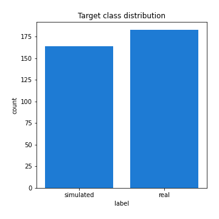

# Exploratory Data Analysis

[<< Go back](../README.md)
## Feature : target
- **Feature type** : categorical
- **Missing** : 0.0%
- **Unique** : 2
- **Count** :347
- **Unique** :2
- **Top** :real
- **Freq** :183

## Feature : return_mean1
- **Feature type** : continous
- **Missing** : 0.0%
- **Unique** : 347
- **Count** :347.0
- **Mean** :49.979902245362496
- **Std** :39.81004520366555
- **Min** :2.041832174
- **25%th Percentile** : 31.296328219000003
- **50%th Percentile** : 49.29437641948739
- **75%th Percentile** : 51.25539007972076
- **Max** :514.7209599040001

## Feature : return_mean2
- **Feature type** : continous
- **Missing** : 0.0%
- **Unique** : 347
- **Count** :347.0
- **Mean** :46.94244769712527
- **Std** :34.08371326579529
- **Min** :1.6535761199999999
- **25%th Percentile** : 27.904989634000003
- **50%th Percentile** : 48.97920265488151
- **75%th Percentile** : 50.967146178923414
- **Max** :317.158071294

## Feature : return_sd1
- **Feature type** : continous
- **Missing** : 0.0%
- **Unique** : 347
- **Count** :347.0
- **Mean** :17.86062278556164
- **Std** :12.749171179727828
- **Min** :0.17075448275615598
- **25%th Percentile** : 4.464997838394469
- **50%th Percentile** : 25.217980094257197
- **75%th Percentile** : 28.84256621536746
- **Max** :77.43304734442235

## Feature : return_sd2
- **Feature type** : continous
- **Missing** : 0.0%
- **Unique** : 347
- **Count** :347.0
- **Mean** :17.144197075975057
- **Std** :12.384435268496476
- **Min** :0.2834854899391288
- **25%th Percentile** : 4.45004504338924
- **50%th Percentile** : 17.609551169353264
- **75%th Percentile** : 28.846069379344385
- **Max** :54.554197862901134

## Feature : return_skew1
- **Feature type** : continous
- **Missing** : 0.0%
- **Unique** : 347
- **Count** :347.0
- **Mean** :0.042471999998671545
- **Std** :0.3802912683321594
- **Min** :-1.1720704684568715
- **25%th Percentile** : -0.09683214868751153
- **50%th Percentile** : 0.006369388452556439
- **75%th Percentile** : 0.11154307116338208
- **Max** :1.3650668171612657

## Feature : return_skew2
- **Feature type** : continous
- **Missing** : 0.0%
- **Unique** : 347
- **Count** :347.0
- **Mean** :0.06268672078845541
- **Std** :0.37024014004967715
- **Min** :-1.2034724878713534
- **25%th Percentile** : -0.08400829761892672
- **50%th Percentile** : 0.012139832892924739
- **75%th Percentile** : 0.1574378041846016
- **Max** :1.519021778095084

## Feature : return_kurtosis1
- **Feature type** : continous
- **Missing** : 0.0%
- **Unique** : 347
- **Count** :347.0
- **Mean** :-0.8527005758416305
- **Std** :0.5873746356015375
- **Min** :-1.5936521214358073
- **25%th Percentile** : -1.2068118600964715
- **50%th Percentile** : -1.1424252379243724
- **75%th Percentile** : -0.660562198722852
- **Max** :2.7204133903766734

## Feature : return_kurtosis2
- **Feature type** : continous
- **Missing** : 0.0%
- **Unique** : 347
- **Count** :347.0
- **Mean** :-0.8572036108030675
- **Std** :0.6046763825091023
- **Min** :-1.5119259840116597
- **25%th Percentile** : -1.2090869004930083
- **50%th Percentile** : -1.1267820822915793
- **75%th Percentile** : -0.6822204662317255
- **Max** :3.67606360130176

## Feature : return_autocorrelation_1_lag1
- **Feature type** : continous
- **Missing** : 0.0%
- **Unique** : 347
- **Count** :347.0
- **Mean** :0.5200703522489943
- **Std** :0.4981370000557997
- **Min** :-0.1125484975936569
- **25%th Percentile** : 0.003294232772197107
- **50%th Percentile** : 0.9714880738361039
- **75%th Percentile** : 0.9930003671550556
- **Max** :0.9987958286634394

## Feature : return_autocorrelation_1_lag2
- **Feature type** : continous
- **Missing** : 0.0%
- **Unique** : 347
- **Count** :347.0
- **Mean** :0.5177572709055591
- **Std** :0.4909663925223528
- **Min** :-0.09921180071930628
- **25%th Percentile** : 0.000999397929797318
- **50%th Percentile** : 0.9461802052599052
- **75%th Percentile** : 0.9861225153967088
- **Max** :0.9975950806151487

## Feature : return_autocorrelation_1_lag3
- **Feature type** : continous
- **Missing** : 0.0%
- **Unique** : 347
- **Count** :347.0
- **Mean** :0.5136064944951234
- **Std** :0.48585152292080663
- **Min** :-0.09745451039371347
- **25%th Percentile** : 0.003957377663792892
- **50%th Percentile** : 0.9258534712892432
- **75%th Percentile** : 0.9798134025401128
- **Max** :0.9965600149544981

## Feature : return_autocorrelation_2_lag1
- **Feature type** : continous
- **Missing** : 0.0%
- **Unique** : 347
- **Count** :347.0
- **Mean** :0.5178605991922183
- **Std** :0.500514968008988
- **Min** :-0.14335108684419343
- **25%th Percentile** : -0.003528373173805024
- **50%th Percentile** : 0.9722124253263893
- **75%th Percentile** : 0.9929548749273249
- **Max** :0.9985035871279235

## Feature : return_autocorrelation_2_lag2
- **Feature type** : continous
- **Missing** : 0.0%
- **Unique** : 347
- **Count** :347.0
- **Mean** :0.5162242031097115
- **Std** :0.4919147018984294
- **Min** :-0.09481551969491797
- **25%th Percentile** : -0.000835120066782208
- **50%th Percentile** : 0.9446308430568959
- **75%th Percentile** : 0.9863473175775923
- **Max** :0.9969561419113389

## Feature : return_autocorrelation_2_lag3
- **Feature type** : continous
- **Missing** : 0.0%
- **Unique** : 347
- **Count** :347.0
- **Mean** :0.5100668445415717
- **Std** :0.4889738314352119
- **Min** :-0.1226739384975781
- **25%th Percentile** : -0.0017729141580944232
- **50%th Percentile** : 0.9225142747366196
- **75%th Percentile** : 0.9801277937624524
- **Max** :0.9955523041927082

## Feature : return_correlation_ts1_lag_0
- **Feature type** : continous
- **Missing** : 0.0%
- **Unique** : 347
- **Count** :347.0
- **Mean** :0.25172125114040045
- **Std** :0.39562833779099055
- **Min** :-0.7502952401289426
- **25%th Percentile** : -0.018199122860249738
- **50%th Percentile** : 0.0404054116046026
- **75%th Percentile** : 0.646457319350692
- **Max** :0.9652680339257566

## Feature : return_correlation_ts1_lag_1
- **Feature type** : continous
- **Missing** : 0.0%
- **Unique** : 347
- **Count** :347.0
- **Mean** :0.25466597307734196
- **Std** :0.3919268467687566
- **Min** :-0.7493781402753671
- **25%th Percentile** : -0.007737429965176854
- **50%th Percentile** : 0.05327908592458432
- **75%th Percentile** : 0.6432884830254897
- **Max** :0.9655060959411687

## Feature : return_correlation_ts1_lag_2
- **Feature type** : continous
- **Missing** : 0.0%
- **Unique** : 347
- **Count** :347.0
- **Mean** :0.24783948208248519
- **Std** :0.3948039236043117
- **Min** :-0.7487143616524923
- **25%th Percentile** : -0.02030699453903289
- **50%th Percentile** : 0.04342002691635841
- **75%th Percentile** : 0.6424879079853001
- **Max** :0.9655528894956359

## Feature : return_correlation_ts1_lag_3
- **Feature type** : continous
- **Missing** : 0.0%
- **Unique** : 347
- **Count** :347.0
- **Mean** :0.2517180140017832
- **Std** :0.3906652140285761
- **Min** :-0.7481683823585469
- **25%th Percentile** : -0.009174137014825074
- **50%th Percentile** : 0.052277398645473004
- **75%th Percentile** : 0.6417568071641183
- **Max** :0.965480488388089

## Feature : return_correlation_ts2_lag_1
- **Feature type** : continous
- **Missing** : 0.0%
- **Unique** : 347
- **Count** :347.0
- **Mean** :0.2531785361948387
- **Std** :0.3930683575280588
- **Min** :-0.7527591237929364
- **25%th Percentile** : -0.010189717309167491
- **50%th Percentile** : 0.05600314046199509
- **75%th Percentile** : 0.6479643822409948
- **Max** :0.9641732497647877

## Feature : return_correlation_ts2_lag_2
- **Feature type** : continous
- **Missing** : 0.0%
- **Unique** : 347
- **Count** :347.0
- **Mean** :0.2519032373441928
- **Std** :0.39199170147389
- **Min** :-0.7555475465441047
- **25%th Percentile** : -0.012870870825986177
- **50%th Percentile** : 0.04835314620298308
- **75%th Percentile** : 0.6474014922766221
- **Max** :0.9632401452572252

## Feature : return_correlation_ts2_lag_3
- **Feature type** : continous
- **Missing** : 0.0%
- **Unique** : 347
- **Count** :347.0
- **Mean** :0.24636329378682373
- **Std** :0.39405436819225964
- **Min** :-0.7582243488618021
- **25%th Percentile** : -0.017088435083080507
- **50%th Percentile** : 0.04134951574129218
- **75%th Percentile** : 0.6504421391432132
- **Max** :0.9626030498699537

## Feature : sqreturn_autocorrelation_ts1_lag1
- **Feature type** : continous
- **Missing** : 0.0%
- **Unique** : 347
- **Count** :347.0
- **Mean** :0.5199085345002823
- **Std** :0.4979442741974544
- **Min** :-0.11400195759256666
- **25%th Percentile** : -0.0019415267383015118
- **50%th Percentile** : 0.9716383106283191
- **75%th Percentile** : 0.992591923707349
- **Max** :0.9984433232250934

## Feature : sqreturn_autocorrelation_ts1_lag2
- **Feature type** : continous
- **Missing** : 0.0%
- **Unique** : 347
- **Count** :347.0
- **Mean** :0.5168385180507943
- **Std** :0.4912312865018178
- **Min** :-0.10322695597800068
- **25%th Percentile** : 0.0023716890083692213
- **50%th Percentile** : 0.950923739005113
- **75%th Percentile** : 0.9856598483791428
- **Max** :0.9969274171205735

## Feature : sqreturn_autocorrelation_ts1_lag3
- **Feature type** : continous
- **Missing** : 0.0%
- **Unique** : 347
- **Count** :347.0
- **Mean** :0.5118858452784127
- **Std** :0.4868958463400722
- **Min** :-0.10295321527981878
- **25%th Percentile** : -0.0006208503010330974
- **50%th Percentile** : 0.9266617622200914
- **75%th Percentile** : 0.9786416540419649
- **Max** :0.9956917620790442

## Feature : sqreturn_autocorrelation_ts2_lag1
- **Feature type** : continous
- **Missing** : 0.0%
- **Unique** : 347
- **Count** :347.0
- **Mean** :0.5183391729500249
- **Std** :0.49954528794352004
- **Min** :-0.13877319766331184
- **25%th Percentile** : 0.0002414800447695419
- **50%th Percentile** : 0.9693689994755837
- **75%th Percentile** : 0.9927925696583728
- **Max** :0.9986746606786123

## Feature : sqreturn_autocorrelation_ts2_lag2
- **Feature type** : continous
- **Missing** : 0.0%
- **Unique** : 347
- **Count** :347.0
- **Mean** :0.5144738512633333
- **Std** :0.49291235125986843
- **Min** :-0.09603933592100986
- **25%th Percentile** : -1.9290957556795778e-05
- **50%th Percentile** : 0.9413666078617651
- **75%th Percentile** : 0.9860805371006502
- **Max** :0.9970506340171775

## Feature : sqreturn_autocorrelation_ts2_lag3
- **Feature type** : continous
- **Missing** : 0.0%
- **Unique** : 347
- **Count** :347.0
- **Mean** :0.510174846445023
- **Std** :0.48759553320144466
- **Min** :-0.11893346773468856
- **25%th Percentile** : -0.002249481764343245
- **50%th Percentile** : 0.9175232498464658
- **75%th Percentile** : 0.9792395396333496
- **Max** :0.9954645996237411

## Feature : sqreturn_correlation_ts1_lag_0
- **Feature type** : continous
- **Missing** : 0.0%
- **Unique** : 347
- **Count** :347.0
- **Mean** :0.25172125114040045
- **Std** :0.39562833779099055
- **Min** :-0.7502952401289426
- **25%th Percentile** : -0.018199122860249738
- **50%th Percentile** : 0.0404054116046026
- **75%th Percentile** : 0.646457319350692
- **Max** :0.9652680339257566

## Feature : sqreturn_correlation_ts1_lag_1
- **Feature type** : continous
- **Missing** : 0.0%
- **Unique** : 347
- **Count** :347.0
- **Mean** :0.25466597307734196
- **Std** :0.3919268467687566
- **Min** :-0.7493781402753671
- **25%th Percentile** : -0.007737429965176854
- **50%th Percentile** : 0.05327908592458432
- **75%th Percentile** : 0.6432884830254897
- **Max** :0.9655060959411687

## Feature : sqreturn_correlation_ts1_lag_2
- **Feature type** : continous
- **Missing** : 0.0%
- **Unique** : 347
- **Count** :347.0
- **Mean** :0.24783948208248519
- **Std** :0.3948039236043117
- **Min** :-0.7487143616524923
- **25%th Percentile** : -0.02030699453903289
- **50%th Percentile** : 0.04342002691635841
- **75%th Percentile** : 0.6424879079853001
- **Max** :0.9655528894956359

## Feature : sqreturn_correlation_ts1_lag_3
- **Feature type** : continous
- **Missing** : 0.0%
- **Unique** : 347
- **Count** :347.0
- **Mean** :0.2517180140017832
- **Std** :0.3906652140285761
- **Min** :-0.7481683823585469
- **25%th Percentile** : -0.009174137014825074
- **50%th Percentile** : 0.052277398645473004
- **75%th Percentile** : 0.6417568071641183
- **Max** :0.965480488388089

## Feature : sqreturn_correlation_ts2_lag_1
- **Feature type** : continous
- **Missing** : 0.0%
- **Unique** : 347
- **Count** :347.0
- **Mean** :0.2531785361948387
- **Std** :0.3930683575280588
- **Min** :-0.7527591237929364
- **25%th Percentile** : -0.010189717309167491
- **50%th Percentile** : 0.05600314046199509
- **75%th Percentile** : 0.6479643822409948
- **Max** :0.9641732497647877

## Feature : sqreturn_correlation_ts2_lag_2
- **Feature type** : continous
- **Missing** : 0.0%
- **Unique** : 347
- **Count** :347.0
- **Mean** :0.2519032373441928
- **Std** :0.39199170147389
- **Min** :-0.7555475465441047
- **25%th Percentile** : -0.012870870825986177
- **50%th Percentile** : 0.04835314620298308
- **75%th Percentile** : 0.6474014922766221
- **Max** :0.9632401452572252

## Feature : sqreturn_correlation_ts2_lag_3
- **Feature type** : continous
- **Missing** : 0.0%
- **Unique** : 347
- **Count** :347.0
- **Mean** :0.24636329378682373
- **Std** :0.39405436819225964
- **Min** :-0.7582243488618021
- **25%th Percentile** : -0.017088435083080507
- **50%th Percentile** : 0.04134951574129218
- **75%th Percentile** : 0.6504421391432132
- **Max** :0.9626030498699537

## Feature : price2_granger_cause_price1
- **Feature type** : continous
- **Missing** : 0.0%
- **Unique** : 347
- **Count** :347.0
- **Mean** :0.43332991383657427
- **Std** :0.2955031703762851
- **Min** :5.063123743918868e-06
- **25%th Percentile** : 0.1665182739776644
- **50%th Percentile** : 0.4005713377305937
- **75%th Percentile** : 0.6781270413777833
- **Max** :0.9887885544657823

## Feature : price1_granger_cause_price2
- **Feature type** : continous
- **Missing** : 0.0%
- **Unique** : 347
- **Count** :347.0
- **Mean** :0.40077224367048386
- **Std** :0.2898282085336877
- **Min** :1.6674455312589196e-07
- **25%th Percentile** : 0.15702912348636994
- **50%th Percentile** : 0.3518573766762209
- **75%th Percentile** : 0.6086268761237399
- **Max** :0.9967863152536168

[<< Go back](../README.md)
