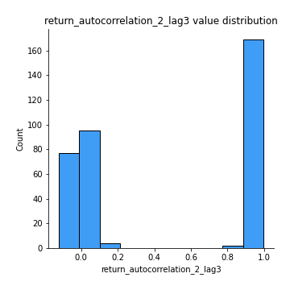

# Exploratory Data Analysis

[<< Go back](../README.md)
## Feature : target
- **Feature type** : categorical
- **Missing** : 0.0%
- **Unique** : 2
- **Count** :347
- **Unique** :2
- **Top** :simulated
- **Freq** :176

## Feature : return_mean1
- **Feature type** : continous
- **Missing** : 0.0%
- **Unique** : 347
- **Count** :347.0
- **Mean** :50.513409890139265
- **Std** :37.6839813554882
- **Min** :4.496205197999999
- **25%th Percentile** : 35.64012542500001
- **50%th Percentile** : 49.52604484585944
- **75%th Percentile** : 51.348267319259485
- **Max** :514.7209599040001

## Feature : return_mean2
- **Feature type** : continous
- **Missing** : 0.0%
- **Unique** : 347
- **Count** :347.0
- **Mean** :51.10964316128862
- **Std** :68.85718584464755
- **Min** :2.7526800000000002
- **25%th Percentile** : 30.06124639
- **50%th Percentile** : 49.40157013161185
- **75%th Percentile** : 51.00854568928267
- **Max** :968.654841336

## Feature : return_sd1
- **Feature type** : continous
- **Missing** : 0.0%
- **Unique** : 347
- **Count** :347.0
- **Mean** :19.009824855235966
- **Std** :13.743735119648516
- **Min** :0.5184879616807083
- **25%th Percentile** : 5.002014614745489
- **50%th Percentile** : 27.980156526888713
- **75%th Percentile** : 28.855660114475832
- **Max** :113.75913244339056

## Feature : return_sd2
- **Feature type** : continous
- **Missing** : 0.0%
- **Unique** : 347
- **Count** :347.0
- **Mean** :18.84682896343659
- **Std** :17.45051577937868
- **Min** :0.4647156360616042
- **25%th Percentile** : 4.943260270197365
- **50%th Percentile** : 27.85879893539923
- **75%th Percentile** : 28.924390719333715
- **Max** :221.10527467938883

## Feature : return_skew1
- **Feature type** : continous
- **Missing** : 0.0%
- **Unique** : 347
- **Count** :347.0
- **Mean** :0.06282667276755757
- **Std** :0.3552450068598434
- **Min** :-1.115547456019272
- **25%th Percentile** : -0.08122104784102031
- **50%th Percentile** : 0.011380712934755738
- **75%th Percentile** : 0.10375617229925449
- **Max** :1.3650668171612657

## Feature : return_skew2
- **Feature type** : continous
- **Missing** : 0.0%
- **Unique** : 347
- **Count** :347.0
- **Mean** :0.043069774103183064
- **Std** :0.3446844637123477
- **Min** :-1.2832038823397423
- **25%th Percentile** : -0.06774136686743212
- **50%th Percentile** : -0.0018531465233401613
- **75%th Percentile** : 0.10908175263858988
- **Max** :1.519021778095084

## Feature : return_kurtosis1
- **Feature type** : continous
- **Missing** : 0.0%
- **Unique** : 347
- **Count** :347.0
- **Mean** :-0.8913160392037031
- **Std** :0.5364859040892973
- **Min** :-1.5936521214358073
- **25%th Percentile** : -1.2076547328452956
- **50%th Percentile** : -1.1442564239282345
- **75%th Percentile** : -0.7638098353071787
- **Max** :2.7204133903766734

## Feature : return_kurtosis2
- **Feature type** : continous
- **Missing** : 0.0%
- **Unique** : 347
- **Count** :347.0
- **Mean** :-0.9112994383015468
- **Std** :0.5505320631144617
- **Min** :-1.5119259840116597
- **25%th Percentile** : -1.2135357941476
- **50%th Percentile** : -1.1467800536898929
- **75%th Percentile** : -0.7931444751435148
- **Max** :3.67606360130176

## Feature : return_autocorrelation_1_lag1
- **Feature type** : continous
- **Missing** : 0.0%
- **Unique** : 347
- **Count** :347.0
- **Mean** :0.4864040761373699
- **Std** :0.49816842393507565
- **Min** :-0.12626475992794053
- **25%th Percentile** : -0.0008227932704297663
- **50%th Percentile** : 0.08919714781670222
- **75%th Percentile** : 0.9922725291693915
- **Max** :0.9987958286634394

## Feature : return_autocorrelation_1_lag2
- **Feature type** : continous
- **Missing** : 0.0%
- **Unique** : 347
- **Count** :347.0
- **Mean** :0.4826200806579824
- **Std** :0.49259113104957125
- **Min** :-0.09921180071930628
- **25%th Percentile** : -0.00233008989515001
- **50%th Percentile** : 0.08780260929242913
- **75%th Percentile** : 0.9855166529853712
- **Max** :0.9975950806151487

## Feature : return_autocorrelation_1_lag3
- **Feature type** : continous
- **Missing** : 0.0%
- **Unique** : 347
- **Count** :347.0
- **Mean** :0.480815637627775
- **Std** :0.48544182166073824
- **Min** :-0.09745451039371347
- **25%th Percentile** : 0.003476838442482222
- **50%th Percentile** : 0.08907947740912954
- **75%th Percentile** : 0.978382463132996
- **Max** :0.9965600149544981

## Feature : return_autocorrelation_2_lag1
- **Feature type** : continous
- **Missing** : 0.0%
- **Unique** : 347
- **Count** :347.0
- **Mean** :0.48334359685652195
- **Std** :0.5011321265361518
- **Min** :-0.14335108684419343
- **25%th Percentile** : -0.004790850911053646
- **50%th Percentile** : 0.08112166252498491
- **75%th Percentile** : 0.9920257371702255
- **Max** :0.9990075551978286

## Feature : return_autocorrelation_2_lag2
- **Feature type** : continous
- **Missing** : 0.0%
- **Unique** : 347
- **Count** :347.0
- **Mean** :0.4813258827306416
- **Std** :0.49365432655184865
- **Min** :-0.10826559530308276
- **25%th Percentile** : -0.0028898116035903096
- **50%th Percentile** : 0.10616866799340738
- **75%th Percentile** : 0.9847420628840838
- **Max** :0.9980152731102225

## Feature : return_autocorrelation_2_lag3
- **Feature type** : continous
- **Missing** : 0.0%
- **Unique** : 347
- **Count** :347.0
- **Mean** :0.47768764532299574
- **Std** :0.487916298649238
- **Min** :-0.1226739384975781
- **25%th Percentile** : -0.0035954594327151984
- **50%th Percentile** : 0.10277028843570336
- **75%th Percentile** : 0.9775600307926335
- **Max** :0.9970922117201266

## Feature : return_correlation_ts1_lag_0
- **Feature type** : continous
- **Missing** : 0.0%
- **Unique** : 347
- **Count** :347.0
- **Mean** :0.21508397804803092
- **Std** :0.398523677516943
- **Min** :-0.8430691081512005
- **25%th Percentile** : -0.02614291381580967
- **50%th Percentile** : 0.027392244737668665
- **75%th Percentile** : 0.5710819633209372
- **Max** :0.9657060675245052

## Feature : return_correlation_ts1_lag_1
- **Feature type** : continous
- **Missing** : 0.0%
- **Unique** : 347
- **Count** :347.0
- **Mean** :0.2183331164836163
- **Std** :0.394901159181475
- **Min** :-0.8477371479268198
- **25%th Percentile** : -0.012009777083515829
- **50%th Percentile** : 0.0393151110562104
- **75%th Percentile** : 0.5624941045675083
- **Max** :0.9655060959411687

## Feature : return_correlation_ts1_lag_2
- **Feature type** : continous
- **Missing** : 0.0%
- **Unique** : 347
- **Count** :347.0
- **Mean** :0.21198673561492776
- **Std** :0.3968057328169205
- **Min** :-0.8526854582503749
- **25%th Percentile** : -0.02475361644064048
- **50%th Percentile** : 0.0307133021992961
- **75%th Percentile** : 0.5575995510847227
- **Max** :0.9655528894956359

## Feature : return_correlation_ts1_lag_3
- **Feature type** : continous
- **Missing** : 0.0%
- **Unique** : 347
- **Count** :347.0
- **Mean** :0.21539280705855324
- **Std** :0.39340173701964715
- **Min** :-0.8563145423083878
- **25%th Percentile** : -0.015892415662893726
- **50%th Percentile** : 0.038848049310888096
- **75%th Percentile** : 0.5592488793396393
- **Max** :0.965480488388089

## Feature : return_correlation_ts2_lag_1
- **Feature type** : continous
- **Missing** : 0.0%
- **Unique** : 347
- **Count** :347.0
- **Mean** :0.21573132328550776
- **Std** :0.3966703146339141
- **Min** :-0.8419620696123573
- **25%th Percentile** : -0.021757756875445074
- **50%th Percentile** : 0.033897077951344945
- **75%th Percentile** : 0.5596675696794233
- **Max** :0.9653492015905041

## Feature : return_correlation_ts2_lag_2
- **Feature type** : continous
- **Missing** : 0.0%
- **Unique** : 347
- **Count** :347.0
- **Mean** :0.21549964281950873
- **Std** :0.3953916580689729
- **Min** :-0.8407733129095517
- **25%th Percentile** : -0.022716752361407945
- **50%th Percentile** : 0.034028910389291955
- **75%th Percentile** : 0.5515854960339737
- **Max** :0.9648220784284761

## Feature : return_correlation_ts2_lag_3
- **Feature type** : continous
- **Missing** : 0.0%
- **Unique** : 347
- **Count** :347.0
- **Mean** :0.21058448740875985
- **Std** :0.3968130123438842
- **Min** :-0.8390925417171665
- **25%th Percentile** : -0.026446565846888828
- **50%th Percentile** : 0.030426364735823837
- **75%th Percentile** : 0.5517110262847765
- **Max** :0.9641714645667581

## Feature : sqreturn_autocorrelation_ts1_lag1
- **Feature type** : continous
- **Missing** : 0.0%
- **Unique** : 347
- **Count** :347.0
- **Mean** :0.486099034009935
- **Std** :0.49803917036238504
- **Min** :-0.11524990849377359
- **25%th Percentile** : -0.006557256939313411
- **50%th Percentile** : 0.08396113860296722
- **75%th Percentile** : 0.991554028526676
- **Max** :0.9984433232250934

## Feature : sqreturn_autocorrelation_ts1_lag2
- **Feature type** : continous
- **Missing** : 0.0%
- **Unique** : 347
- **Count** :347.0
- **Mean** :0.4824681053258651
- **Std** :0.4920089450702602
- **Min** :-0.10322695597800068
- **25%th Percentile** : -0.0011766574502218021
- **50%th Percentile** : 0.08331455436094459
- **75%th Percentile** : 0.9836824138610256
- **Max** :0.9970968172935939

## Feature : sqreturn_autocorrelation_ts1_lag3
- **Feature type** : continous
- **Missing** : 0.0%
- **Unique** : 347
- **Count** :347.0
- **Mean** :0.47936580775352244
- **Std** :0.4860520516249766
- **Min** :-0.11408294170290487
- **25%th Percentile** : -0.000999998020794062
- **50%th Percentile** : 0.10235089609000528
- **75%th Percentile** : 0.9765815604827311
- **Max** :0.9956917620790442

## Feature : sqreturn_autocorrelation_ts2_lag1
- **Feature type** : continous
- **Missing** : 0.0%
- **Unique** : 347
- **Count** :347.0
- **Mean** :0.48327879572309174
- **Std** :0.500843126059626
- **Min** :-0.13877319766331184
- **25%th Percentile** : -0.004044818034544687
- **50%th Percentile** : 0.0885954855763482
- **75%th Percentile** : 0.9916402967557778
- **Max** :0.9988745118390566

## Feature : sqreturn_autocorrelation_ts2_lag2
- **Feature type** : continous
- **Missing** : 0.0%
- **Unique** : 347
- **Count** :347.0
- **Mean** :0.4793355851455313
- **Std** :0.4948920614758001
- **Min** :-0.12007054642491884
- **25%th Percentile** : -0.00440816762809083
- **50%th Percentile** : 0.09603130682043927
- **75%th Percentile** : 0.9836812201157572
- **Max** :0.9976921088288594

## Feature : sqreturn_autocorrelation_ts2_lag3
- **Feature type** : continous
- **Missing** : 0.0%
- **Unique** : 347
- **Count** :347.0
- **Mean** :0.4770758796393533
- **Std** :0.4875017650893235
- **Min** :-0.11893346773468856
- **25%th Percentile** : -0.007539784097382714
- **50%th Percentile** : 0.08184618734372162
- **75%th Percentile** : 0.9752211221386327
- **Max** :0.9965698341282454

## Feature : sqreturn_correlation_ts1_lag_0
- **Feature type** : continous
- **Missing** : 0.0%
- **Unique** : 347
- **Count** :347.0
- **Mean** :0.21508397804803092
- **Std** :0.398523677516943
- **Min** :-0.8430691081512005
- **25%th Percentile** : -0.02614291381580967
- **50%th Percentile** : 0.027392244737668665
- **75%th Percentile** : 0.5710819633209372
- **Max** :0.9657060675245052

## Feature : sqreturn_correlation_ts1_lag_1
- **Feature type** : continous
- **Missing** : 0.0%
- **Unique** : 347
- **Count** :347.0
- **Mean** :0.2183331164836163
- **Std** :0.394901159181475
- **Min** :-0.8477371479268198
- **25%th Percentile** : -0.012009777083515829
- **50%th Percentile** : 0.0393151110562104
- **75%th Percentile** : 0.5624941045675083
- **Max** :0.9655060959411687

## Feature : sqreturn_correlation_ts1_lag_2
- **Feature type** : continous
- **Missing** : 0.0%
- **Unique** : 347
- **Count** :347.0
- **Mean** :0.21198673561492776
- **Std** :0.3968057328169205
- **Min** :-0.8526854582503749
- **25%th Percentile** : -0.02475361644064048
- **50%th Percentile** : 0.0307133021992961
- **75%th Percentile** : 0.5575995510847227
- **Max** :0.9655528894956359

## Feature : sqreturn_correlation_ts1_lag_3
- **Feature type** : continous
- **Missing** : 0.0%
- **Unique** : 347
- **Count** :347.0
- **Mean** :0.21539280705855324
- **Std** :0.39340173701964715
- **Min** :-0.8563145423083878
- **25%th Percentile** : -0.015892415662893726
- **50%th Percentile** : 0.038848049310888096
- **75%th Percentile** : 0.5592488793396393
- **Max** :0.965480488388089

## Feature : sqreturn_correlation_ts2_lag_1
- **Feature type** : continous
- **Missing** : 0.0%
- **Unique** : 347
- **Count** :347.0
- **Mean** :0.21573132328550776
- **Std** :0.3966703146339141
- **Min** :-0.8419620696123573
- **25%th Percentile** : -0.021757756875445074
- **50%th Percentile** : 0.033897077951344945
- **75%th Percentile** : 0.5596675696794233
- **Max** :0.9653492015905041

## Feature : sqreturn_correlation_ts2_lag_2
- **Feature type** : continous
- **Missing** : 0.0%
- **Unique** : 347
- **Count** :347.0
- **Mean** :0.21549964281950873
- **Std** :0.3953916580689729
- **Min** :-0.8407733129095517
- **25%th Percentile** : -0.022716752361407945
- **50%th Percentile** : 0.034028910389291955
- **75%th Percentile** : 0.5515854960339737
- **Max** :0.9648220784284761

## Feature : sqreturn_correlation_ts2_lag_3
- **Feature type** : continous
- **Missing** : 0.0%
- **Unique** : 347
- **Count** :347.0
- **Mean** :0.21058448740875985
- **Std** :0.3968130123438842
- **Min** :-0.8390925417171665
- **25%th Percentile** : -0.026446565846888828
- **50%th Percentile** : 0.030426364735823837
- **75%th Percentile** : 0.5517110262847765
- **Max** :0.9641714645667581

## Feature : price2_granger_cause_price1
- **Feature type** : continous
- **Missing** : 0.0%
- **Unique** : 347
- **Count** :347.0
- **Mean** :0.44200822573104825
- **Std** :0.30156005389998736
- **Min** :5.063123743918868e-06
- **25%th Percentile** : 0.155552024889774
- **50%th Percentile** : 0.4312903212624839
- **75%th Percentile** : 0.7017909801070714
- **Max** :0.9887885544657823

## Feature : price1_granger_cause_price2
- **Feature type** : continous
- **Missing** : 0.0%
- **Unique** : 347
- **Count** :347.0
- **Mean** :0.41315318681283253
- **Std** :0.29607480487907306
- **Min** :1.6674455312589196e-07
- **25%th Percentile** : 0.15262429012968587
- **50%th Percentile** : 0.37956696282929575
- **75%th Percentile** : 0.6556849161507468
- **Max** :0.9917881290208964

[<< Go back](../README.md)
