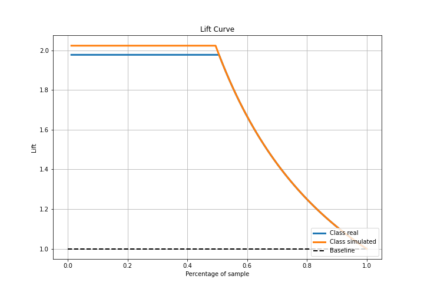

# Summary of 3_Linear

[<< Go back](../README.md)

## Logistic Regression (Linear)
- **n_jobs**: -1
- **explain_level**: 2

## Validation
 - **validation_type**: split
 - **train_ratio**: 0.75
 - **shuffle**: True
 - **stratify**: True

## Optimized metric
accuracy

## Training time

4.5 seconds

## Metric details
|           |      score |    threshold |
|:----------|-----------:|-------------:|
| logloss   | 0.00492347 | nan          |
| auc       | 1          | nan          |
| f1        | 1          |   0.498746   |
| accuracy  | 1          |   0.498746   |
| precision | 1          |   0.498746   |
| recall    | 1          |   0.00075019 |
| mcc       | 1          |   0.498746   |

## Confusion matrix (at threshold=0.498746)
|                      |   Predicted as real |   Predicted as simulated |
|:---------------------|--------------------:|-------------------------:|
| Labeled as real      |                  44 |                        0 |
| Labeled as simulated |                   0 |                       43 |

## Learning curves

## Coefficients
| feature                           |   Learner_1 |
|:----------------------------------|------------:|
| intercept                         |   2.46758   |
| return_sd1                        |   0.460605  |
| return_sd2                        |   0.33335   |
| price2_granger_cause_price1       |   0.0433886 |
| price1_granger_cause_price2       |   0.032917  |
| return_skew2                      |   0.0143176 |
| return_correlation_ts1_lag_3      |  -0.082474  |
| sqreturn_correlation_ts1_lag_3    |  -0.082474  |
| return_correlation_ts1_lag_1      |  -0.085734  |
| sqreturn_correlation_ts1_lag_1    |  -0.085734  |
| sqreturn_correlation_ts2_lag_2    |  -0.0884387 |
| return_correlation_ts2_lag_2      |  -0.0884387 |
| sqreturn_correlation_ts2_lag_3    |  -0.088759  |
| return_correlation_ts2_lag_3      |  -0.088759  |
| return_correlation_ts1_lag_2      |  -0.0888551 |
| sqreturn_correlation_ts1_lag_2    |  -0.0888551 |
| return_correlation_ts2_lag_1      |  -0.0902861 |
| sqreturn_correlation_ts2_lag_1    |  -0.0902861 |
| sqreturn_correlation_ts1_lag_0    |  -0.0933495 |
| return_correlation_ts1_lag_0      |  -0.0933495 |
| return_skew1                      |  -0.101599  |
| return_mean1                      |  -0.195016  |
| return_mean2                      |  -0.195695  |
| return_kurtosis1                  |  -0.401434  |
| return_kurtosis2                  |  -0.429266  |
| sqreturn_autocorrelation_ts1_lag3 |  -0.494859  |
| return_autocorrelation_1_lag3     |  -0.495119  |
| sqreturn_autocorrelation_ts2_lag3 |  -0.497546  |
| return_autocorrelation_2_lag3     |  -0.498525  |
| sqreturn_autocorrelation_ts1_lag2 |  -0.499236  |
| return_autocorrelation_1_lag2     |  -0.499462  |
| return_autocorrelation_2_lag2     |  -0.501342  |
| sqreturn_autocorrelation_ts2_lag2 |  -0.502259  |
| return_autocorrelation_2_lag1     |  -0.509379  |
| sqreturn_autocorrelation_ts2_lag1 |  -0.509557  |
| return_autocorrelation_1_lag1     |  -1.01387   |
| sqreturn_autocorrelation_ts1_lag1 |  -1.01461   |

## Permutation-based Importance

## Confusion Matrix

## Normalized Confusion Matrix

## ROC Curve

## Kolmogorov-Smirnov Statistic

## Precision-Recall Curve

## Calibration Curve

## Cumulative Gains Curve

## Lift Curve

## SHAP Importance

## SHAP Dependence plots

### Dependence (Fold 1)

## SHAP Decision plots

### Top-10 Worst decisions for class 0 (Fold 1)

### Top-10 Best decisions for class 0 (Fold 1)

### Top-10 Worst decisions for class 1 (Fold 1)

### Top-10 Best decisions for class 1 (Fold 1)

[<< Go back](../README.md)
