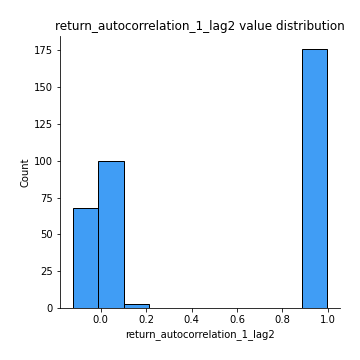
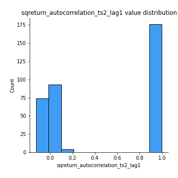
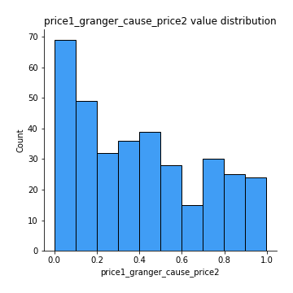

# Exploratory Data Analysis

[<< Go back](../README.md)
## Feature : target
- **Feature type** : categorical
- **Missing** : 0.0%
- **Unique** : 2
- **Count** :347
- **Unique** :2
- **Top** :real
- **Freq** :176

## Feature : return_mean1
- **Feature type** : continous
- **Missing** : 0.0%
- **Unique** : 347
- **Count** :347.0
- **Mean** :51.24589409644491
- **Std** :41.14180761985044
- **Min** :2.041832174
- **25%th Percentile** : 34.087295899
- **50%th Percentile** : 49.356707583550524
- **75%th Percentile** : 51.383256546421364
- **Max** :514.7209599040001

## Feature : return_mean2
- **Feature type** : continous
- **Missing** : 0.0%
- **Unique** : 347
- **Count** :347.0
- **Mean** :49.8013183567574
- **Std** :67.31560024466708
- **Min** :1.6535761199999999
- **25%th Percentile** : 29.877439463
- **50%th Percentile** : 49.13967360042642
- **75%th Percentile** : 50.97550760810407
- **Max** :968.654841336

## Feature : return_sd1
- **Feature type** : continous
- **Missing** : 0.0%
- **Unique** : 347
- **Count** :347.0
- **Mean** :19.008377374959064
- **Std** :14.768001192947867
- **Min** :0.17075448275615598
- **25%th Percentile** : 4.6313333916168276
- **50%th Percentile** : 27.962779477886908
- **75%th Percentile** : 28.842004081873377
- **Max** :113.75913244339056

## Feature : return_sd2
- **Feature type** : continous
- **Missing** : 0.0%
- **Unique** : 347
- **Count** :347.0
- **Mean** :18.240690217474803
- **Std** :17.358872642904814
- **Min** :0.2834854899391288
- **25%th Percentile** : 4.545912091660375
- **50%th Percentile** : 27.19558004150557
- **75%th Percentile** : 28.924862518009185
- **Max** :221.10527467938883

## Feature : return_skew1
- **Feature type** : continous
- **Missing** : 0.0%
- **Unique** : 347
- **Count** :347.0
- **Mean** :0.06898448849313313
- **Std** :0.35841243546623763
- **Min** :-1.115547456019272
- **25%th Percentile** : -0.06274375499480107
- **50%th Percentile** : 0.016833367428082655
- **75%th Percentile** : 0.15893103433678166
- **Max** :1.3650668171612657

## Feature : return_skew2
- **Feature type** : continous
- **Missing** : 0.0%
- **Unique** : 347
- **Count** :347.0
- **Mean** :0.06736953180928507
- **Std** :0.3399232655136169
- **Min** :-1.1179671336557087
- **25%th Percentile** : -0.06246969450882063
- **50%th Percentile** : 0.005179667814567606
- **75%th Percentile** : 0.14203462806780476
- **Max** :1.519021778095084

## Feature : return_kurtosis1
- **Feature type** : continous
- **Missing** : 0.0%
- **Unique** : 347
- **Count** :347.0
- **Mean** :-0.8736878947364188
- **Std** :0.5537501719952154
- **Min** :-1.5936521214358073
- **25%th Percentile** : -1.2012934901881425
- **50%th Percentile** : -1.1411548939308591
- **75%th Percentile** : -0.6965780254106009
- **Max** :2.7204133903766734

## Feature : return_kurtosis2
- **Feature type** : continous
- **Missing** : 0.0%
- **Unique** : 347
- **Count** :347.0
- **Mean** :-0.9033757154241282
- **Std** :0.5434453545875988
- **Min** :-1.5032634888501737
- **25%th Percentile** : -1.2146297648671913
- **50%th Percentile** : -1.1447406391251207
- **75%th Percentile** : -0.7569287528193149
- **Max** :3.67606360130176

## Feature : return_autocorrelation_1_lag1
- **Feature type** : continous
- **Missing** : 0.0%
- **Unique** : 347
- **Count** :347.0
- **Mean** :0.5020986570897852
- **Std** :0.49621530293635135
- **Min** :-0.12626475992794053
- **25%th Percentile** : 0.004434555813297519
- **50%th Percentile** : 0.9442938941999663
- **75%th Percentile** : 0.9927181843527072
- **Max** :0.9987958286634394

## Feature : return_autocorrelation_1_lag2
- **Feature type** : continous
- **Missing** : 0.0%
- **Unique** : 347
- **Count** :347.0
- **Mean** :0.49853088076577873
- **Std** :0.4901317280501698
- **Min** :-0.12252861440754487
- **25%th Percentile** : 0.0011257946956607008
- **50%th Percentile** : 0.9017820920753983
- **75%th Percentile** : 0.9857159345547322
- **Max** :0.9975950806151487

## Feature : return_autocorrelation_1_lag3
- **Feature type** : continous
- **Missing** : 0.0%
- **Unique** : 347
- **Count** :347.0
- **Mean** :0.49365621112068336
- **Std** :0.48550118557257776
- **Min** :-0.09745451039371347
- **25%th Percentile** : 0.0033505164981812953
- **50%th Percentile** : 0.8655446315350278
- **75%th Percentile** : 0.978382463132996
- **Max** :0.9965600149544981

## Feature : return_autocorrelation_2_lag1
- **Feature type** : continous
- **Missing** : 0.0%
- **Unique** : 347
- **Count** :347.0
- **Mean** :0.49946881979074076
- **Std** :0.49992271973285995
- **Min** :-0.14335108684419343
- **25%th Percentile** : -0.003298660739701758
- **50%th Percentile** : 0.9630618468122705
- **75%th Percentile** : 0.9928123297258488
- **Max** :0.9985035871279235

## Feature : return_autocorrelation_2_lag2
- **Feature type** : continous
- **Missing** : 0.0%
- **Unique** : 347
- **Count** :347.0
- **Mean** :0.4978121329690618
- **Std** :0.4919942026953318
- **Min** :-0.10826559530308276
- **25%th Percentile** : 0.0015821666405233708
- **50%th Percentile** : 0.929563256742045
- **75%th Percentile** : 0.9857920580779307
- **Max** :0.9969561419113389

## Feature : return_autocorrelation_2_lag3
- **Feature type** : continous
- **Missing** : 0.0%
- **Unique** : 347
- **Count** :347.0
- **Mean** :0.4919696781348032
- **Std** :0.4888238472728627
- **Min** :-0.1226739384975781
- **25%th Percentile** : -0.00499280430076591
- **50%th Percentile** : 0.8973643853054535
- **75%th Percentile** : 0.979155297632848
- **Max** :0.9955523041927082

## Feature : return_correlation_ts1_lag_0
- **Feature type** : continous
- **Missing** : 0.0%
- **Unique** : 347
- **Count** :347.0
- **Mean** :0.22401324221786081
- **Std** :0.38715253909907527
- **Min** :-0.8251828119339379
- **25%th Percentile** : -0.018199122860249738
- **50%th Percentile** : 0.03326370896542421
- **75%th Percentile** : 0.5868942810299114
- **Max** :0.9657060675245052

## Feature : return_correlation_ts1_lag_1
- **Feature type** : continous
- **Missing** : 0.0%
- **Unique** : 347
- **Count** :347.0
- **Mean** :0.22627838745200635
- **Std** :0.38452161564252413
- **Min** :-0.823886760833548
- **25%th Percentile** : -0.01185615294501461
- **50%th Percentile** : 0.044259263537878735
- **75%th Percentile** : 0.5824091378408616
- **Max** :0.9655060959411687

## Feature : return_correlation_ts1_lag_2
- **Feature type** : continous
- **Missing** : 0.0%
- **Unique** : 347
- **Count** :347.0
- **Mean** :0.22091531730031747
- **Std** :0.38610041798338884
- **Min** :-0.8232390456803415
- **25%th Percentile** : -0.01955276025641213
- **50%th Percentile** : 0.03623562324880737
- **75%th Percentile** : 0.5788133797841961
- **Max** :0.9655528894956359

## Feature : return_correlation_ts1_lag_3
- **Feature type** : continous
- **Missing** : 0.0%
- **Unique** : 347
- **Count** :347.0
- **Mean** :0.22436297198214442
- **Std** :0.3827721287591127
- **Min** :-0.8224601023724137
- **25%th Percentile** : -0.011958637439784543
- **50%th Percentile** : 0.042517858378464383
- **75%th Percentile** : 0.5762467880299387
- **Max** :0.965480488388089

## Feature : return_correlation_ts2_lag_1
- **Feature type** : continous
- **Missing** : 0.0%
- **Unique** : 347
- **Count** :347.0
- **Mean** :0.22319433610325595
- **Std** :0.3863025171930081
- **Min** :-0.8277343984631227
- **25%th Percentile** : -0.019658138842455368
- **50%th Percentile** : 0.03688087461334767
- **75%th Percentile** : 0.5821357428189867
- **Max** :0.9653492015905041

## Feature : return_correlation_ts2_lag_2
- **Feature type** : continous
- **Missing** : 0.0%
- **Unique** : 347
- **Count** :347.0
- **Mean** :0.22270862279009554
- **Std** :0.38500534915772405
- **Min** :-0.8297969346663087
- **25%th Percentile** : -0.019814872119545447
- **50%th Percentile** : 0.03597087832890811
- **75%th Percentile** : 0.5789454682186643
- **Max** :0.9648220784284761

## Feature : return_correlation_ts2_lag_3
- **Feature type** : continous
- **Missing** : 0.0%
- **Unique** : 347
- **Count** :347.0
- **Mean** :0.21889544661922172
- **Std** :0.3860386765731224
- **Min** :-0.8316877963362261
- **25%th Percentile** : -0.020076302706125426
- **50%th Percentile** : 0.0369491761072149
- **75%th Percentile** : 0.5819322325313372
- **Max** :0.9641714645667581

## Feature : sqreturn_autocorrelation_ts1_lag1
- **Feature type** : continous
- **Missing** : 0.0%
- **Unique** : 347
- **Count** :347.0
- **Mean** :0.5018997866925109
- **Std** :0.4959100865835157
- **Min** :-0.11524990849377359
- **25%th Percentile** : 0.0011836262849034688
- **50%th Percentile** : 0.9353860802490429
- **75%th Percentile** : 0.9922547551303932
- **Max** :0.9984433232250934

## Feature : sqreturn_autocorrelation_ts1_lag2
- **Feature type** : continous
- **Missing** : 0.0%
- **Unique** : 347
- **Count** :347.0
- **Mean** :0.4978721632176065
- **Std** :0.4900053179126381
- **Min** :-0.10882442984565852
- **25%th Percentile** : 0.0035947195536531027
- **50%th Percentile** : 0.9011539463042845
- **75%th Percentile** : 0.9846582084740862
- **Max** :0.9970968172935939

## Feature : sqreturn_autocorrelation_ts1_lag3
- **Feature type** : continous
- **Missing** : 0.0%
- **Unique** : 347
- **Count** :347.0
- **Mean** :0.49262941642035424
- **Std** :0.48561930455164504
- **Min** :-0.11114645454197775
- **25%th Percentile** : 0.0005325294715035552
- **50%th Percentile** : 0.8656149174514609
- **75%th Percentile** : 0.977073421206216
- **Max** :0.9956917620790442

## Feature : sqreturn_autocorrelation_ts2_lag1
- **Feature type** : continous
- **Missing** : 0.0%
- **Unique** : 347
- **Count** :347.0
- **Mean** :0.49970386619069834
- **Std** :0.49933968713988963
- **Min** :-0.12572267277872007
- **25%th Percentile** : 0.0010343431596557858
- **50%th Percentile** : 0.9628282044345794
- **75%th Percentile** : 0.9926479653137076
- **Max** :0.9986746606786123

## Feature : sqreturn_autocorrelation_ts2_lag2
- **Feature type** : continous
- **Missing** : 0.0%
- **Unique** : 347
- **Count** :347.0
- **Mean** :0.49605713853801575
- **Std** :0.4930200941650022
- **Min** :-0.10501469523627556
- **25%th Percentile** : 0.0008090255457880091
- **50%th Percentile** : 0.929734066627738
- **75%th Percentile** : 0.9854362567364161
- **Max** :0.9970506340171775

## Feature : sqreturn_autocorrelation_ts2_lag3
- **Feature type** : continous
- **Missing** : 0.0%
- **Unique** : 347
- **Count** :347.0
- **Mean** :0.49236029784512403
- **Std** :0.4873892185222154
- **Min** :-0.11893346773468856
- **25%th Percentile** : -0.0036799675396284167
- **50%th Percentile** : 0.898374180532492
- **75%th Percentile** : 0.9788667180403114
- **Max** :0.9957895086263276

## Feature : sqreturn_correlation_ts1_lag_0
- **Feature type** : continous
- **Missing** : 0.0%
- **Unique** : 347
- **Count** :347.0
- **Mean** :0.22401324221786081
- **Std** :0.38715253909907527
- **Min** :-0.8251828119339379
- **25%th Percentile** : -0.018199122860249738
- **50%th Percentile** : 0.03326370896542421
- **75%th Percentile** : 0.5868942810299114
- **Max** :0.9657060675245052

## Feature : sqreturn_correlation_ts1_lag_1
- **Feature type** : continous
- **Missing** : 0.0%
- **Unique** : 347
- **Count** :347.0
- **Mean** :0.22627838745200635
- **Std** :0.38452161564252413
- **Min** :-0.823886760833548
- **25%th Percentile** : -0.01185615294501461
- **50%th Percentile** : 0.044259263537878735
- **75%th Percentile** : 0.5824091378408616
- **Max** :0.9655060959411687

## Feature : sqreturn_correlation_ts1_lag_2
- **Feature type** : continous
- **Missing** : 0.0%
- **Unique** : 347
- **Count** :347.0
- **Mean** :0.22091531730031747
- **Std** :0.38610041798338884
- **Min** :-0.8232390456803415
- **25%th Percentile** : -0.01955276025641213
- **50%th Percentile** : 0.03623562324880737
- **75%th Percentile** : 0.5788133797841961
- **Max** :0.9655528894956359

## Feature : sqreturn_correlation_ts1_lag_3
- **Feature type** : continous
- **Missing** : 0.0%
- **Unique** : 347
- **Count** :347.0
- **Mean** :0.22436297198214442
- **Std** :0.3827721287591127
- **Min** :-0.8224601023724137
- **25%th Percentile** : -0.011958637439784543
- **50%th Percentile** : 0.042517858378464383
- **75%th Percentile** : 0.5762467880299387
- **Max** :0.965480488388089

## Feature : sqreturn_correlation_ts2_lag_1
- **Feature type** : continous
- **Missing** : 0.0%
- **Unique** : 347
- **Count** :347.0
- **Mean** :0.22319433610325595
- **Std** :0.3863025171930081
- **Min** :-0.8277343984631227
- **25%th Percentile** : -0.019658138842455368
- **50%th Percentile** : 0.03688087461334767
- **75%th Percentile** : 0.5821357428189867
- **Max** :0.9653492015905041

## Feature : sqreturn_correlation_ts2_lag_2
- **Feature type** : continous
- **Missing** : 0.0%
- **Unique** : 347
- **Count** :347.0
- **Mean** :0.22270862279009554
- **Std** :0.38500534915772405
- **Min** :-0.8297969346663087
- **25%th Percentile** : -0.019814872119545447
- **50%th Percentile** : 0.03597087832890811
- **75%th Percentile** : 0.5789454682186643
- **Max** :0.9648220784284761

## Feature : sqreturn_correlation_ts2_lag_3
- **Feature type** : continous
- **Missing** : 0.0%
- **Unique** : 347
- **Count** :347.0
- **Mean** :0.21889544661922172
- **Std** :0.3860386765731224
- **Min** :-0.8316877963362261
- **25%th Percentile** : -0.020076302706125426
- **50%th Percentile** : 0.0369491761072149
- **75%th Percentile** : 0.5819322325313372
- **Max** :0.9641714645667581

## Feature : price2_granger_cause_price1
- **Feature type** : continous
- **Missing** : 0.0%
- **Unique** : 347
- **Count** :347.0
- **Mean** :0.43959768319790044
- **Std** :0.30080747419479953
- **Min** :0.00036528990147542234
- **25%th Percentile** : 0.16243841017364014
- **50%th Percentile** : 0.4186439184562053
- **75%th Percentile** : 0.7046439096615986
- **Max** :0.9887885544657823

## Feature : price1_granger_cause_price2
- **Feature type** : continous
- **Missing** : 0.0%
- **Unique** : 347
- **Count** :347.0
- **Mean** :0.40210170515495597
- **Std** :0.29764624017848784
- **Min** :1.6674455312589196e-07
- **25%th Percentile** : 0.13633190980527843
- **50%th Percentile** : 0.3670629323154637
- **75%th Percentile** : 0.6407009569732061
- **Max** :0.9967863152536168

[<< Go back](../README.md)
