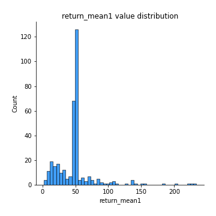
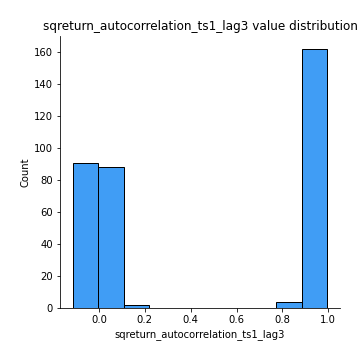

# Exploratory Data Analysis

[<< Go back](../README.md)
## Feature : target
- **Feature type** : categorical
- **Missing** : 0.0%
- **Unique** : 2
- **Count** :347
- **Unique** :2
- **Top** :simulated
- **Freq** :181

## Feature : return_mean1
- **Feature type** : continous
- **Missing** : 0.0%
- **Unique** : 347
- **Count** :347.0
- **Mean** :49.56947358360234
- **Std** :30.909301978074534
- **Min** :2.041832174
- **25%th Percentile** : 34.555159943999996
- **50%th Percentile** : 49.398093633919174
- **75%th Percentile** : 51.315506451534404
- **Max** :233.603018394

## Feature : return_mean2
- **Feature type** : continous
- **Missing** : 0.0%
- **Unique** : 347
- **Count** :347.0
- **Mean** :50.0829402548729
- **Std** :69.05841797140818
- **Min** :1.6535761199999999
- **25%th Percentile** : 30.587172121
- **50%th Percentile** : 49.25940367733383
- **75%th Percentile** : 50.92085241328949
- **Max** :968.654841336

## Feature : return_sd1
- **Feature type** : continous
- **Missing** : 0.0%
- **Unique** : 347
- **Count** :347.0
- **Mean** :19.46177042073433
- **Std** :14.22070460852575
- **Min** :0.17075448275615598
- **25%th Percentile** : 4.972589070316227
- **50%th Percentile** : 28.1480758615974
- **75%th Percentile** : 28.855660114475832
- **Max** :113.75913244339056

## Feature : return_sd2
- **Feature type** : continous
- **Missing** : 0.0%
- **Unique** : 347
- **Count** :347.0
- **Mean** :18.969569578069212
- **Std** :17.414238555436775
- **Min** :0.2834854899391288
- **25%th Percentile** : 4.640345459028948
- **50%th Percentile** : 28.05031032887789
- **75%th Percentile** : 28.967099165399542
- **Max** :221.10527467938883

## Feature : return_skew1
- **Feature type** : continous
- **Missing** : 0.0%
- **Unique** : 347
- **Count** :347.0
- **Mean** :0.06913299100742525
- **Std** :0.35318999732957673
- **Min** :-1.0990562057103326
- **25%th Percentile** : -0.06464279002853594
- **50%th Percentile** : 0.015002051165181236
- **75%th Percentile** : 0.12308120389963359
- **Max** :1.3650668171612657

## Feature : return_skew2
- **Feature type** : continous
- **Missing** : 0.0%
- **Unique** : 347
- **Count** :347.0
- **Mean** :0.03567813532634246
- **Std** :0.33333799408689974
- **Min** :-1.2832038823397423
- **25%th Percentile** : -0.07800960134512434
- **50%th Percentile** : -0.004278335793803276
- **75%th Percentile** : 0.09687738674532245
- **Max** :1.519021778095084

## Feature : return_kurtosis1
- **Feature type** : continous
- **Missing** : 0.0%
- **Unique** : 347
- **Count** :347.0
- **Mean** :-0.915543515251149
- **Std** :0.5154400153043286
- **Min** :-1.5936521214358073
- **25%th Percentile** : -1.2062739857496854
- **50%th Percentile** : -1.1467159956278312
- **75%th Percentile** : -0.777623645907003
- **Max** :2.7204133903766734

## Feature : return_kurtosis2
- **Feature type** : continous
- **Missing** : 0.0%
- **Unique** : 347
- **Count** :347.0
- **Mean** :-0.9165538647805975
- **Std** :0.5654363997084896
- **Min** :-1.5119259840116597
- **25%th Percentile** : -1.2135357941476
- **50%th Percentile** : -1.1533352798735022
- **75%th Percentile** : -0.819680891613364
- **Max** :3.67606360130176

## Feature : return_autocorrelation_1_lag1
- **Feature type** : continous
- **Missing** : 0.0%
- **Unique** : 347
- **Count** :347.0
- **Mean** :0.47201458658878226
- **Std** :0.49775607532465077
- **Min** :-0.12626475992794053
- **25%th Percentile** : 0.00019710929283178942
- **50%th Percentile** : 0.0699385800209348
- **75%th Percentile** : 0.9921593427759183
- **Max** :0.9987958286634394

## Feature : return_autocorrelation_1_lag2
- **Feature type** : continous
- **Missing** : 0.0%
- **Unique** : 347
- **Count** :347.0
- **Mean** :0.46876484497202936
- **Std** :0.49213445294898833
- **Min** :-0.12252861440754487
- **25%th Percentile** : -0.007043378424788995
- **50%th Percentile** : 0.08058715998029205
- **75%th Percentile** : 0.9847424340223383
- **Max** :0.9975950806151487

## Feature : return_autocorrelation_1_lag3
- **Feature type** : continous
- **Missing** : 0.0%
- **Unique** : 347
- **Count** :347.0
- **Mean** :0.4659182434674726
- **Std** :0.48634943008834813
- **Min** :-0.09745451039371347
- **25%th Percentile** : -0.000885379685019555
- **50%th Percentile** : 0.07855826915378754
- **75%th Percentile** : 0.9778600571234364
- **Max** :0.9965600149544981

## Feature : return_autocorrelation_2_lag1
- **Feature type** : continous
- **Missing** : 0.0%
- **Unique** : 347
- **Count** :347.0
- **Mean** :0.4710323119685846
- **Std** :0.49941846105915455
- **Min** :-0.14335108684419343
- **25%th Percentile** : -0.00392998986885503
- **50%th Percentile** : 0.07034108707965304
- **75%th Percentile** : 0.9926389712053136
- **Max** :0.9985035871279235

## Feature : return_autocorrelation_2_lag2
- **Feature type** : continous
- **Missing** : 0.0%
- **Unique** : 347
- **Count** :347.0
- **Mean** :0.4680025500715813
- **Std** :0.49351271090588267
- **Min** :-0.10315811082807302
- **25%th Percentile** : -0.0025486070112832413
- **50%th Percentile** : 0.07003967142141053
- **75%th Percentile** : 0.9854386255904386
- **Max** :0.9969561419113389

## Feature : return_autocorrelation_2_lag3
- **Feature type** : continous
- **Missing** : 0.0%
- **Unique** : 347
- **Count** :347.0
- **Mean** :0.46519501831989835
- **Std** :0.488058232824857
- **Min** :-0.10870571127073526
- **25%th Percentile** : -0.00585651531114373
- **50%th Percentile** : 0.0757572561976914
- **75%th Percentile** : 0.9786189095929613
- **Max** :0.9955523041927082

## Feature : return_correlation_ts1_lag_0
- **Feature type** : continous
- **Missing** : 0.0%
- **Unique** : 347
- **Count** :347.0
- **Mean** :0.2055770739807004
- **Std** :0.3986515746445364
- **Min** :-0.8430691081512005
- **25%th Percentile** : -0.02546382720304086
- **50%th Percentile** : 0.025427951527871785
- **75%th Percentile** : 0.6137719070598999
- **Max** :0.9657060675245052

## Feature : return_correlation_ts1_lag_1
- **Feature type** : continous
- **Missing** : 0.0%
- **Unique** : 347
- **Count** :347.0
- **Mean** :0.2095764514305442
- **Std** :0.39540549260675895
- **Min** :-0.8477371479268198
- **25%th Percentile** : -0.01185615294501461
- **50%th Percentile** : 0.03522186170152569
- **75%th Percentile** : 0.611917338462767
- **Max** :0.9655060959411687

## Feature : return_correlation_ts1_lag_2
- **Feature type** : continous
- **Missing** : 0.0%
- **Unique** : 347
- **Count** :347.0
- **Mean** :0.20412419483320768
- **Std** :0.3975012841370243
- **Min** :-0.8526854582503749
- **25%th Percentile** : -0.02475361644064048
- **50%th Percentile** : 0.03242110467736324
- **75%th Percentile** : 0.6095092510154975
- **Max** :0.9655528894956359

## Feature : return_correlation_ts1_lag_3
- **Feature type** : continous
- **Missing** : 0.0%
- **Unique** : 347
- **Count** :347.0
- **Mean** :0.20573320924348668
- **Std** :0.39555397118559427
- **Min** :-0.8563145423083878
- **25%th Percentile** : -0.01716783435682883
- **50%th Percentile** : 0.03397203886683761
- **75%th Percentile** : 0.6071098211472078
- **Max** :0.965480488388089

## Feature : return_correlation_ts2_lag_1
- **Feature type** : continous
- **Missing** : 0.0%
- **Unique** : 347
- **Count** :347.0
- **Mean** :0.2047048867058709
- **Std** :0.3979824078361863
- **Min** :-0.8419620696123573
- **25%th Percentile** : -0.024286380707125202
- **50%th Percentile** : 0.03190985862577339
- **75%th Percentile** : 0.6077395039534463
- **Max** :0.9653492015905041

## Feature : return_correlation_ts2_lag_2
- **Feature type** : continous
- **Missing** : 0.0%
- **Unique** : 347
- **Count** :347.0
- **Mean** :0.2055122956674602
- **Std** :0.39625283756059737
- **Min** :-0.8407733129095517
- **25%th Percentile** : -0.022150744429999314
- **50%th Percentile** : 0.034028910389291955
- **75%th Percentile** : 0.5968558792826675
- **Max** :0.9648220784284761

## Feature : return_correlation_ts2_lag_3
- **Feature type** : continous
- **Missing** : 0.0%
- **Unique** : 347
- **Count** :347.0
- **Mean** :0.2004366456598543
- **Std** :0.39780783611684684
- **Min** :-0.8390925417171665
- **25%th Percentile** : -0.02637358993167542
- **50%th Percentile** : 0.03200320503637119
- **75%th Percentile** : 0.5859756831415435
- **Max** :0.9641714645667581

## Feature : sqreturn_autocorrelation_ts1_lag1
- **Feature type** : continous
- **Missing** : 0.0%
- **Unique** : 347
- **Count** :347.0
- **Mean** :0.4713432688694047
- **Std** :0.49791799084114813
- **Min** :-0.11524990849377359
- **25%th Percentile** : -0.006903379926833946
- **50%th Percentile** : 0.06779485706276292
- **75%th Percentile** : 0.9917459284608723
- **Max** :0.9984433232250934

## Feature : sqreturn_autocorrelation_ts1_lag2
- **Feature type** : continous
- **Missing** : 0.0%
- **Unique** : 347
- **Count** :347.0
- **Mean** :0.4681669345549553
- **Std** :0.4919226308156449
- **Min** :-0.10882442984565852
- **25%th Percentile** : -0.0032196027283985943
- **50%th Percentile** : 0.07916160988064534
- **75%th Percentile** : 0.9836429095209177
- **Max** :0.9970968172935939

## Feature : sqreturn_autocorrelation_ts1_lag3
- **Feature type** : continous
- **Missing** : 0.0%
- **Unique** : 347
- **Count** :347.0
- **Mean** :0.4643770245769869
- **Std** :0.48699047526405886
- **Min** :-0.11408294170290487
- **25%th Percentile** : -0.005963641759059609
- **50%th Percentile** : 0.07602001489512095
- **75%th Percentile** : 0.9764538854277199
- **Max** :0.9956917620790442

## Feature : sqreturn_autocorrelation_ts2_lag1
- **Feature type** : continous
- **Missing** : 0.0%
- **Unique** : 347
- **Count** :347.0
- **Mean** :0.4715877867467844
- **Std** :0.49854233937704884
- **Min** :-0.13877319766331184
- **25%th Percentile** : -0.004044818034544687
- **50%th Percentile** : 0.06715882228265518
- **75%th Percentile** : 0.9922105916506898
- **Max** :0.9986746606786123

## Feature : sqreturn_autocorrelation_ts2_lag2
- **Feature type** : continous
- **Missing** : 0.0%
- **Unique** : 347
- **Count** :347.0
- **Mean** :0.46624933538381225
- **Std** :0.49447669236718117
- **Min** :-0.12007054642491884
- **25%th Percentile** : -0.003898681148052351
- **50%th Percentile** : 0.06609647361350832
- **75%th Percentile** : 0.984602234943704
- **Max** :0.9970506340171775

## Feature : sqreturn_autocorrelation_ts2_lag3
- **Feature type** : continous
- **Missing** : 0.0%
- **Unique** : 347
- **Count** :347.0
- **Mean** :0.4655968460814274
- **Std** :0.4866012465469687
- **Min** :-0.1100443832398177
- **25%th Percentile** : -0.005907715483489263
- **50%th Percentile** : 0.07523812677596141
- **75%th Percentile** : 0.9774690755125321
- **Max** :0.9954645996237411

## Feature : sqreturn_correlation_ts1_lag_0
- **Feature type** : continous
- **Missing** : 0.0%
- **Unique** : 347
- **Count** :347.0
- **Mean** :0.2055770739807004
- **Std** :0.3986515746445364
- **Min** :-0.8430691081512005
- **25%th Percentile** : -0.02546382720304086
- **50%th Percentile** : 0.025427951527871785
- **75%th Percentile** : 0.6137719070598999
- **Max** :0.9657060675245052

## Feature : sqreturn_correlation_ts1_lag_1
- **Feature type** : continous
- **Missing** : 0.0%
- **Unique** : 347
- **Count** :347.0
- **Mean** :0.2095764514305442
- **Std** :0.39540549260675895
- **Min** :-0.8477371479268198
- **25%th Percentile** : -0.01185615294501461
- **50%th Percentile** : 0.03522186170152569
- **75%th Percentile** : 0.611917338462767
- **Max** :0.9655060959411687

## Feature : sqreturn_correlation_ts1_lag_2
- **Feature type** : continous
- **Missing** : 0.0%
- **Unique** : 347
- **Count** :347.0
- **Mean** :0.20412419483320768
- **Std** :0.3975012841370243
- **Min** :-0.8526854582503749
- **25%th Percentile** : -0.02475361644064048
- **50%th Percentile** : 0.03242110467736324
- **75%th Percentile** : 0.6095092510154975
- **Max** :0.9655528894956359

## Feature : sqreturn_correlation_ts1_lag_3
- **Feature type** : continous
- **Missing** : 0.0%
- **Unique** : 347
- **Count** :347.0
- **Mean** :0.20573320924348668
- **Std** :0.39555397118559427
- **Min** :-0.8563145423083878
- **25%th Percentile** : -0.01716783435682883
- **50%th Percentile** : 0.03397203886683761
- **75%th Percentile** : 0.6071098211472078
- **Max** :0.965480488388089

## Feature : sqreturn_correlation_ts2_lag_1
- **Feature type** : continous
- **Missing** : 0.0%
- **Unique** : 347
- **Count** :347.0
- **Mean** :0.2047048867058709
- **Std** :0.3979824078361863
- **Min** :-0.8419620696123573
- **25%th Percentile** : -0.024286380707125202
- **50%th Percentile** : 0.03190985862577339
- **75%th Percentile** : 0.6077395039534463
- **Max** :0.9653492015905041

## Feature : sqreturn_correlation_ts2_lag_2
- **Feature type** : continous
- **Missing** : 0.0%
- **Unique** : 347
- **Count** :347.0
- **Mean** :0.2055122956674602
- **Std** :0.39625283756059737
- **Min** :-0.8407733129095517
- **25%th Percentile** : -0.022150744429999314
- **50%th Percentile** : 0.034028910389291955
- **75%th Percentile** : 0.5968558792826675
- **Max** :0.9648220784284761

## Feature : sqreturn_correlation_ts2_lag_3
- **Feature type** : continous
- **Missing** : 0.0%
- **Unique** : 347
- **Count** :347.0
- **Mean** :0.2004366456598543
- **Std** :0.39780783611684684
- **Min** :-0.8390925417171665
- **25%th Percentile** : -0.02637358993167542
- **50%th Percentile** : 0.03200320503637119
- **75%th Percentile** : 0.5859756831415435
- **Max** :0.9641714645667581

## Feature : price2_granger_cause_price1
- **Feature type** : continous
- **Missing** : 0.0%
- **Unique** : 347
- **Count** :347.0
- **Mean** :0.42193340369040416
- **Std** :0.2978778960163175
- **Min** :5.063123743918868e-06
- **25%th Percentile** : 0.155552024889774
- **50%th Percentile** : 0.3923071207729877
- **75%th Percentile** : 0.6661436299090867
- **Max** :0.9887885544657823

## Feature : price1_granger_cause_price2
- **Feature type** : continous
- **Missing** : 0.0%
- **Unique** : 347
- **Count** :347.0
- **Mean** :0.404897954573404
- **Std** :0.2886301772647274
- **Min** :8.101068402988115e-10
- **25%th Percentile** : 0.16467175665391295
- **50%th Percentile** : 0.3693837914511823
- **75%th Percentile** : 0.636150620277169
- **Max** :0.9916369674989517

[<< Go back](../README.md)
