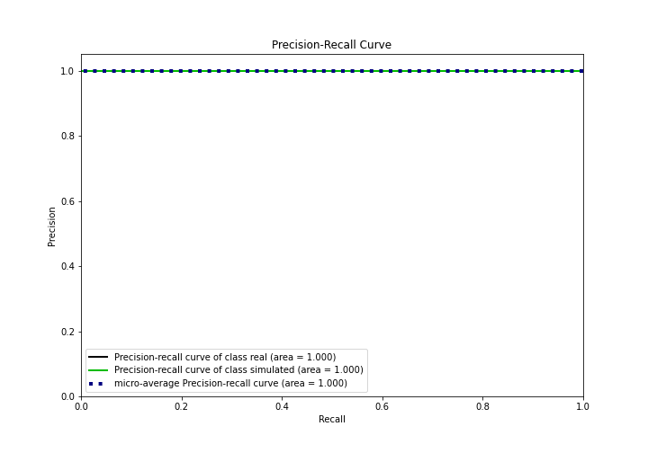
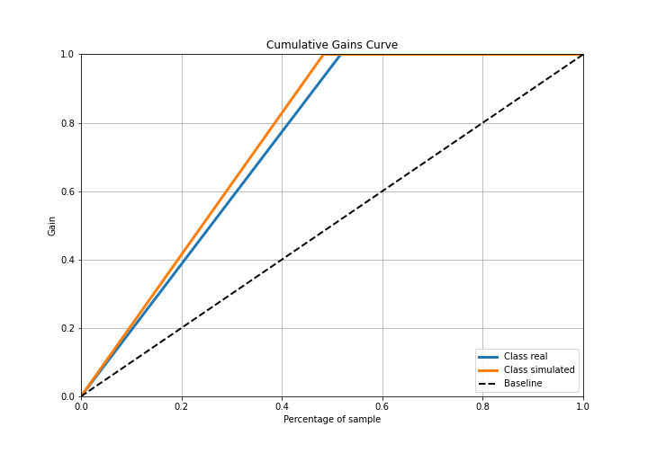

# Summary of 3_Linear

[<< Go back](../README.md)

## Logistic Regression (Linear)
- **n_jobs**: -1
- **explain_level**: 2

## Validation
 - **validation_type**: split
 - **train_ratio**: 0.75
 - **shuffle**: True
 - **stratify**: True

## Optimized metric
accuracy

## Training time

4.7 seconds

## Metric details
|           |      score |     threshold |
|:----------|-----------:|--------------:|
| logloss   | 0.00587743 | nan           |
| auc       | 1          | nan           |
| f1        | 1          |   0.504616    |
| accuracy  | 1          |   0.504616    |
| precision | 1          |   0.504616    |
| recall    | 1          |   0.000667257 |
| mcc       | 1          |   0.504616    |

## Confusion matrix (at threshold=0.504616)
|                      |   Predicted as real |   Predicted as simulated |
|:---------------------|--------------------:|-------------------------:|
| Labeled as real      |                  45 |                        0 |
| Labeled as simulated |                   0 |                       42 |

## Learning curves

## Coefficients
| feature                           |   Learner_1 |
|:----------------------------------|------------:|
| intercept                         |   0.707319  |
| return_sd2                        |   0.396829  |
| return_sd1                        |   0.319559  |
| price2_granger_cause_price1       |   0.0234894 |
| price1_granger_cause_price2       |   0.0155494 |
| return_skew2                      |  -0.0198712 |
| return_skew1                      |  -0.0300634 |
| sqreturn_correlation_ts1_lag_3    |  -0.0706644 |
| return_correlation_ts1_lag_3      |  -0.0706644 |
| sqreturn_correlation_ts1_lag_1    |  -0.0733803 |
| return_correlation_ts1_lag_1      |  -0.0733803 |
| sqreturn_correlation_ts2_lag_2    |  -0.0742187 |
| return_correlation_ts2_lag_2      |  -0.0742187 |
| sqreturn_correlation_ts1_lag_2    |  -0.0744149 |
| return_correlation_ts1_lag_2      |  -0.0744149 |
| sqreturn_correlation_ts2_lag_1    |  -0.0754415 |
| return_correlation_ts2_lag_1      |  -0.0754415 |
| sqreturn_correlation_ts2_lag_3    |  -0.0758518 |
| return_correlation_ts2_lag_3      |  -0.0758518 |
| return_correlation_ts1_lag_0      |  -0.0776915 |
| sqreturn_correlation_ts1_lag_0    |  -0.0776915 |
| return_mean1                      |  -0.092592  |
| return_mean2                      |  -0.119893  |
| return_kurtosis2                  |  -0.241239  |
| return_kurtosis1                  |  -0.288404  |
| return_autocorrelation_1_lag3     |  -0.305032  |
| sqreturn_autocorrelation_ts2_lag3 |  -0.305507  |
| sqreturn_autocorrelation_ts1_lag3 |  -0.305547  |
| return_autocorrelation_2_lag3     |  -0.305878  |
| sqreturn_autocorrelation_ts2_lag2 |  -0.309141  |
| return_autocorrelation_1_lag1     |  -0.624095  |
| return_autocorrelation_2_lag1     |  -0.624153  |
| sqreturn_autocorrelation_ts1_lag1 |  -0.624154  |
| sqreturn_autocorrelation_ts2_lag1 |  -0.624256  |
| return_autocorrelation_2_lag2     |  -0.624601  |
| return_autocorrelation_1_lag2     |  -0.625008  |
| sqreturn_autocorrelation_ts1_lag2 |  -0.625128  |

## Permutation-based Importance

## Confusion Matrix

## Normalized Confusion Matrix

## ROC Curve

## Kolmogorov-Smirnov Statistic

## Precision-Recall Curve

## Calibration Curve

## Cumulative Gains Curve

## Lift Curve

## SHAP Importance

## SHAP Dependence plots

### Dependence (Fold 1)

## SHAP Decision plots

### Top-10 Worst decisions for class 0 (Fold 1)

### Top-10 Best decisions for class 0 (Fold 1)

### Top-10 Worst decisions for class 1 (Fold 1)

### Top-10 Best decisions for class 1 (Fold 1)

[<< Go back](../README.md)
