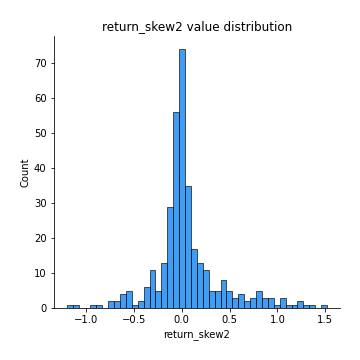

# Exploratory Data Analysis

[<< Go back](../README.md)
## Feature : target
- **Feature type** : categorical
- **Missing** : 0.0%
- **Unique** : 2
- **Count** :347
- **Unique** :2
- **Top** :real
- **Freq** :178

## Feature : return_mean1
- **Feature type** : continous
- **Missing** : 0.0%
- **Unique** : 347
- **Count** :347.0
- **Mean** :50.398699515741505
- **Std** :33.15992480231849
- **Min** :2.041832174
- **25%th Percentile** : 33.351136431
- **50%th Percentile** : 49.356707583550524
- **75%th Percentile** : 51.42247248396575
- **Max** :233.603018394

## Feature : return_mean2
- **Feature type** : continous
- **Missing** : 0.0%
- **Unique** : 347
- **Count** :347.0
- **Mean** :52.050848231343004
- **Std** :71.22093572893651
- **Min** :1.6535761199999999
- **25%th Percentile** : 27.758855429999997
- **50%th Percentile** : 49.40157013161185
- **75%th Percentile** : 51.090368667395325
- **Max** :968.654841336

## Feature : return_sd1
- **Feature type** : continous
- **Missing** : 0.0%
- **Unique** : 347
- **Count** :347.0
- **Mean** :18.75517532861055
- **Std** :14.450371136379678
- **Min** :0.17075448275615598
- **25%th Percentile** : 4.6590474384061675
- **50%th Percentile** : 27.847863554701682
- **75%th Percentile** : 28.896481492566
- **Max** :113.75913244339056

## Feature : return_sd2
- **Feature type** : continous
- **Missing** : 0.0%
- **Unique** : 347
- **Count** :347.0
- **Mean** :18.51449891517105
- **Std** :17.61883276902763
- **Min** :0.2834854899391288
- **25%th Percentile** : 4.473598187030485
- **50%th Percentile** : 27.523541354749746
- **75%th Percentile** : 28.924862518009185
- **Max** :221.10527467938883

## Feature : return_skew1
- **Feature type** : continous
- **Missing** : 0.0%
- **Unique** : 347
- **Count** :347.0
- **Mean** :0.056981628319111556
- **Std** :0.3866531882560172
- **Min** :-1.1720704684568715
- **25%th Percentile** : -0.0915405553929339
- **50%th Percentile** : 0.011540635908916496
- **75%th Percentile** : 0.13891341812184616
- **Max** :1.3650668171612657

## Feature : return_skew2
- **Feature type** : continous
- **Missing** : 0.0%
- **Unique** : 347
- **Count** :347.0
- **Mean** :0.05815149069839906
- **Std** :0.3656784226904334
- **Min** :-1.2034724878713534
- **25%th Percentile** : -0.0845281664065724
- **50%th Percentile** : -0.004115095939211771
- **75%th Percentile** : 0.13315729553991873
- **Max** :1.519021778095084

## Feature : return_kurtosis1
- **Feature type** : continous
- **Missing** : 0.0%
- **Unique** : 347
- **Count** :347.0
- **Mean** :-0.8651316396109467
- **Std** :0.5596144099014415
- **Min** :-1.5936521214358073
- **25%th Percentile** : -1.2068118600964715
- **50%th Percentile** : -1.1334685330956698
- **75%th Percentile** : -0.6763029571645434
- **Max** :2.7204133903766734

## Feature : return_kurtosis2
- **Feature type** : continous
- **Missing** : 0.0%
- **Unique** : 347
- **Count** :347.0
- **Mean** :-0.86981268764693
- **Std** :0.6024904581703524
- **Min** :-1.5119259840116597
- **25%th Percentile** : -1.2092031275334354
- **50%th Percentile** : -1.1437539995914527
- **75%th Percentile** : -0.757353441156646
- **Max** :3.67606360130176

## Feature : return_autocorrelation_1_lag1
- **Feature type** : continous
- **Missing** : 0.0%
- **Unique** : 347
- **Count** :347.0
- **Mean** :0.5063041004860673
- **Std** :0.49774083345135967
- **Min** :-0.1125484975936569
- **25%th Percentile** : 0.002355788950698567
- **50%th Percentile** : 0.9594500016227631
- **75%th Percentile** : 0.9922725291693915
- **Max** :0.9987958286634394

## Feature : return_autocorrelation_1_lag2
- **Feature type** : continous
- **Missing** : 0.0%
- **Unique** : 347
- **Count** :347.0
- **Mean** :0.5029062043522444
- **Std** :0.4915016869174081
- **Min** :-0.12252861440754487
- **25%th Percentile** : -0.0011539344420264423
- **50%th Percentile** : 0.9275578840603287
- **75%th Percentile** : 0.9857061188337342
- **Max** :0.9975950806151487

## Feature : return_autocorrelation_1_lag3
- **Feature type** : continous
- **Missing** : 0.0%
- **Unique** : 347
- **Count** :347.0
- **Mean** :0.49748778097743723
- **Std** :0.4875061462267676
- **Min** :-0.09745451039371347
- **25%th Percentile** : 0.00039448896838638526
- **50%th Percentile** : 0.8920436183587889
- **75%th Percentile** : 0.9788665224042048
- **Max** :0.9965600149544981

## Feature : return_autocorrelation_2_lag1
- **Feature type** : continous
- **Missing** : 0.0%
- **Unique** : 347
- **Count** :347.0
- **Mean** :0.5035940686274503
- **Std** :0.5008267003121806
- **Min** :-0.14335108684419343
- **25%th Percentile** : -0.004271844945938205
- **50%th Percentile** : 0.9630618468122705
- **75%th Percentile** : 0.9924245091437247
- **Max** :0.9990075551978286

## Feature : return_autocorrelation_2_lag2
- **Feature type** : continous
- **Missing** : 0.0%
- **Unique** : 347
- **Count** :347.0
- **Mean** :0.5011294659929119
- **Std** :0.493374030481646
- **Min** :-0.10826559530308276
- **25%th Percentile** : -0.001721565848800474
- **50%th Percentile** : 0.9356373808200389
- **75%th Percentile** : 0.9853641645428075
- **Max** :0.9980152731102225

## Feature : return_autocorrelation_2_lag3
- **Feature type** : continous
- **Missing** : 0.0%
- **Unique** : 347
- **Count** :347.0
- **Mean** :0.4957500702696389
- **Std** :0.4893597686896246
- **Min** :-0.10870571127073526
- **25%th Percentile** : -0.0045516783245036895
- **50%th Percentile** : 0.905815657622676
- **75%th Percentile** : 0.9785484724186828
- **Max** :0.9970922117201266

## Feature : return_correlation_ts1_lag_0
- **Feature type** : continous
- **Missing** : 0.0%
- **Unique** : 347
- **Count** :347.0
- **Mean** :0.20211036921128814
- **Std** :0.38512644264672696
- **Min** :-0.8430691081512005
- **25%th Percentile** : -0.02546382720304086
- **50%th Percentile** : 0.03326370896542421
- **75%th Percentile** : 0.5653209880617981
- **Max** :0.958378881454789

## Feature : return_correlation_ts1_lag_1
- **Feature type** : continous
- **Missing** : 0.0%
- **Unique** : 347
- **Count** :347.0
- **Mean** :0.2032031036297507
- **Std** :0.38305357576120896
- **Min** :-0.8477371479268198
- **25%th Percentile** : -0.017599672414161466
- **50%th Percentile** : 0.035734601637579064
- **75%th Percentile** : 0.5533447909162781
- **Max** :0.9571724518484322

## Feature : return_correlation_ts1_lag_2
- **Feature type** : continous
- **Missing** : 0.0%
- **Unique** : 347
- **Count** :347.0
- **Mean** :0.1986687587549765
- **Std** :0.38440761178894994
- **Min** :-0.8526854582503749
- **25%th Percentile** : -0.027213274460899353
- **50%th Percentile** : 0.03623562324880737
- **75%th Percentile** : 0.5459677780067671
- **Max** :0.9560698360530218

## Feature : return_correlation_ts1_lag_3
- **Feature type** : continous
- **Missing** : 0.0%
- **Unique** : 347
- **Count** :347.0
- **Mean** :0.20063338957364057
- **Std** :0.3821227847314492
- **Min** :-0.8563145423083878
- **25%th Percentile** : -0.013042142539805224
- **50%th Percentile** : 0.03684885482095592
- **75%th Percentile** : 0.5440409742498591
- **Max** :0.9548746242994077

## Feature : return_correlation_ts2_lag_1
- **Feature type** : continous
- **Missing** : 0.0%
- **Unique** : 347
- **Count** :347.0
- **Mean** :0.20117533380075914
- **Std** :0.38390925275372423
- **Min** :-0.8419620696123573
- **25%th Percentile** : -0.019793030741787086
- **50%th Percentile** : 0.033268296022025676
- **75%th Percentile** : 0.5538600641899063
- **Max** :0.9577967394768053

## Feature : return_correlation_ts2_lag_2
- **Feature type** : continous
- **Missing** : 0.0%
- **Unique** : 347
- **Count** :347.0
- **Mean** :0.19921613716569353
- **Std** :0.38353671830208097
- **Min** :-0.8407733129095517
- **25%th Percentile** : -0.023463806924177582
- **50%th Percentile** : 0.031254319644298034
- **75%th Percentile** : 0.5494804537151077
- **Max** :0.9573084646636364

## Feature : return_correlation_ts2_lag_3
- **Feature type** : continous
- **Missing** : 0.0%
- **Unique** : 347
- **Count** :347.0
- **Mean** :0.19493186245051888
- **Std** :0.3845817086435005
- **Min** :-0.8390925417171665
- **25%th Percentile** : -0.02712729013662514
- **50%th Percentile** : 0.03263970614683557
- **75%th Percentile** : 0.5423347395883241
- **Max** :0.9570016616355986

## Feature : sqreturn_autocorrelation_ts1_lag1
- **Feature type** : continous
- **Missing** : 0.0%
- **Unique** : 347
- **Count** :347.0
- **Mean** :0.5055674290338754
- **Std** :0.49812342540092186
- **Min** :-0.11400195759256666
- **25%th Percentile** : -0.0025006385139307048
- **50%th Percentile** : 0.9602449312055842
- **75%th Percentile** : 0.9917817910838673
- **Max** :0.9984433232250934

## Feature : sqreturn_autocorrelation_ts1_lag2
- **Feature type** : continous
- **Missing** : 0.0%
- **Unique** : 347
- **Count** :347.0
- **Mean** :0.5026792600261119
- **Std** :0.4910514576799019
- **Min** :-0.10882442984565852
- **25%th Percentile** : 0.0015248494807675432
- **50%th Percentile** : 0.9257359121295026
- **75%th Percentile** : 0.9839517133705173
- **Max** :0.9970968172935939

## Feature : sqreturn_autocorrelation_ts1_lag3
- **Feature type** : continous
- **Missing** : 0.0%
- **Unique** : 347
- **Count** :347.0
- **Mean** :0.49617925530623275
- **Std** :0.48813337384789396
- **Min** :-0.11408294170290487
- **25%th Percentile** : -0.006538603211596301
- **50%th Percentile** : 0.8881899215993099
- **75%th Percentile** : 0.9773883758993691
- **Max** :0.9956917620790442

## Feature : sqreturn_autocorrelation_ts2_lag1
- **Feature type** : continous
- **Missing** : 0.0%
- **Unique** : 347
- **Count** :347.0
- **Mean** :0.5037313398811859
- **Std** :0.500355806164402
- **Min** :-0.13877319766331184
- **25%th Percentile** : -0.004044818034544687
- **50%th Percentile** : 0.9629259557122668
- **75%th Percentile** : 0.99249406064768
- **Max** :0.9988745118390566

## Feature : sqreturn_autocorrelation_ts2_lag2
- **Feature type** : continous
- **Missing** : 0.0%
- **Unique** : 347
- **Count** :347.0
- **Mean** :0.4989809012002668
- **Std** :0.49491888277690094
- **Min** :-0.12007054642491884
- **25%th Percentile** : -0.003898681148052351
- **50%th Percentile** : 0.9355399314823771
- **75%th Percentile** : 0.9851860860734328
- **Max** :0.9976921088288594

## Feature : sqreturn_autocorrelation_ts2_lag3
- **Feature type** : continous
- **Missing** : 0.0%
- **Unique** : 347
- **Count** :347.0
- **Mean** :0.495795444424981
- **Std** :0.48829545024745474
- **Min** :-0.1100443832398177
- **25%th Percentile** : -0.007539784097382714
- **50%th Percentile** : 0.905429682163167
- **75%th Percentile** : 0.9782055957021933
- **Max** :0.9965698341282454

## Feature : sqreturn_correlation_ts1_lag_0
- **Feature type** : continous
- **Missing** : 0.0%
- **Unique** : 347
- **Count** :347.0
- **Mean** :0.20211036921128814
- **Std** :0.38512644264672696
- **Min** :-0.8430691081512005
- **25%th Percentile** : -0.02546382720304086
- **50%th Percentile** : 0.03326370896542421
- **75%th Percentile** : 0.5653209880617981
- **Max** :0.958378881454789

## Feature : sqreturn_correlation_ts1_lag_1
- **Feature type** : continous
- **Missing** : 0.0%
- **Unique** : 347
- **Count** :347.0
- **Mean** :0.2032031036297507
- **Std** :0.38305357576120896
- **Min** :-0.8477371479268198
- **25%th Percentile** : -0.017599672414161466
- **50%th Percentile** : 0.035734601637579064
- **75%th Percentile** : 0.5533447909162781
- **Max** :0.9571724518484322

## Feature : sqreturn_correlation_ts1_lag_2
- **Feature type** : continous
- **Missing** : 0.0%
- **Unique** : 347
- **Count** :347.0
- **Mean** :0.1986687587549765
- **Std** :0.38440761178894994
- **Min** :-0.8526854582503749
- **25%th Percentile** : -0.027213274460899353
- **50%th Percentile** : 0.03623562324880737
- **75%th Percentile** : 0.5459677780067671
- **Max** :0.9560698360530218

## Feature : sqreturn_correlation_ts1_lag_3
- **Feature type** : continous
- **Missing** : 0.0%
- **Unique** : 347
- **Count** :347.0
- **Mean** :0.20063338957364057
- **Std** :0.3821227847314492
- **Min** :-0.8563145423083878
- **25%th Percentile** : -0.013042142539805224
- **50%th Percentile** : 0.03684885482095592
- **75%th Percentile** : 0.5440409742498591
- **Max** :0.9548746242994077

## Feature : sqreturn_correlation_ts2_lag_1
- **Feature type** : continous
- **Missing** : 0.0%
- **Unique** : 347
- **Count** :347.0
- **Mean** :0.20117533380075914
- **Std** :0.38390925275372423
- **Min** :-0.8419620696123573
- **25%th Percentile** : -0.019793030741787086
- **50%th Percentile** : 0.033268296022025676
- **75%th Percentile** : 0.5538600641899063
- **Max** :0.9577967394768053

## Feature : sqreturn_correlation_ts2_lag_2
- **Feature type** : continous
- **Missing** : 0.0%
- **Unique** : 347
- **Count** :347.0
- **Mean** :0.19921613716569353
- **Std** :0.38353671830208097
- **Min** :-0.8407733129095517
- **25%th Percentile** : -0.023463806924177582
- **50%th Percentile** : 0.031254319644298034
- **75%th Percentile** : 0.5494804537151077
- **Max** :0.9573084646636364

## Feature : sqreturn_correlation_ts2_lag_3
- **Feature type** : continous
- **Missing** : 0.0%
- **Unique** : 347
- **Count** :347.0
- **Mean** :0.19493186245051888
- **Std** :0.3845817086435005
- **Min** :-0.8390925417171665
- **25%th Percentile** : -0.02712729013662514
- **50%th Percentile** : 0.03263970614683557
- **75%th Percentile** : 0.5423347395883241
- **Max** :0.9570016616355986

## Feature : price2_granger_cause_price1
- **Feature type** : continous
- **Missing** : 0.0%
- **Unique** : 347
- **Count** :347.0
- **Mean** :0.4110660047725756
- **Std** :0.3048759514416029
- **Min** :5.063123743918868e-06
- **25%th Percentile** : 0.13006638975947413
- **50%th Percentile** : 0.36391002657673366
- **75%th Percentile** : 0.661434226214797
- **Max** :0.9887885544657823

## Feature : price1_granger_cause_price2
- **Feature type** : continous
- **Missing** : 0.0%
- **Unique** : 347
- **Count** :347.0
- **Mean** :0.394113390443906
- **Std** :0.29601617981468903
- **Min** :8.101068402988115e-10
- **25%th Percentile** : 0.14226887377687703
- **50%th Percentile** : 0.3432686702144787
- **75%th Percentile** : 0.6283745169475301
- **Max** :0.9967863152536168

[<< Go back](../README.md)
