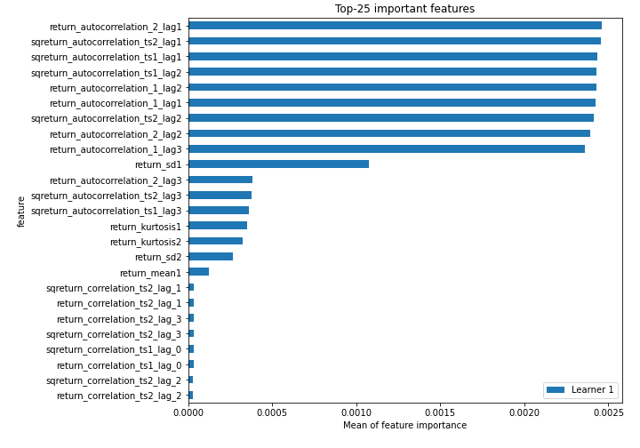
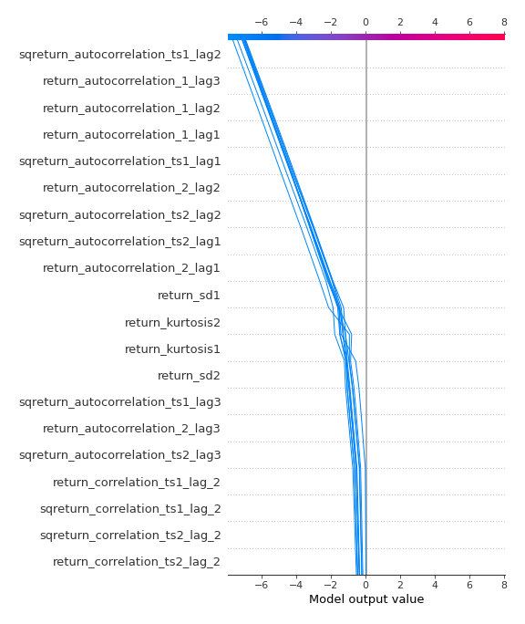

# Summary of 3_Linear

[<< Go back](../README.md)

## Logistic Regression (Linear)
- **n_jobs**: -1
- **explain_level**: 2

## Validation
 - **validation_type**: split
 - **train_ratio**: 0.75
 - **shuffle**: True
 - **stratify**: True

## Optimized metric
accuracy

## Training time

6.9 seconds

## Metric details
|           |      score |     threshold |
|:----------|-----------:|--------------:|
| logloss   | 0.00288618 | nan           |
| auc       | 1          | nan           |
| f1        | 1          |   0.499576    |
| accuracy  | 1          |   0.499576    |
| precision | 1          |   0.499576    |
| recall    | 1          |   0.000437671 |
| mcc       | 1          |   0.499576    |

## Confusion matrix (at threshold=0.499576)
|                      |   Predicted as real |   Predicted as simulated |
|:---------------------|--------------------:|-------------------------:|
| Labeled as real      |                  45 |                        0 |
| Labeled as simulated |                   0 |                       42 |

## Learning curves

## Coefficients
| feature                           |   Learner_1 |
|:----------------------------------|------------:|
| return_sd1                        |  0.438552   |
| intercept                         |  0.371313   |
| return_sd2                        |  0.196429   |
| price1_granger_cause_price2       |  0.0274669  |
| price2_granger_cause_price1       |  0.0181528  |
| return_skew2                      |  0.00371323 |
| return_mean1                      | -0.0303789  |
| return_skew1                      | -0.0314603  |
| sqreturn_correlation_ts1_lag_3    | -0.0664259  |
| return_correlation_ts1_lag_3      | -0.0664259  |
| return_correlation_ts2_lag_3      | -0.0700788  |
| sqreturn_correlation_ts2_lag_3    | -0.0700788  |
| sqreturn_correlation_ts1_lag_1    | -0.0712269  |
| return_correlation_ts1_lag_1      | -0.0712269  |
| sqreturn_correlation_ts1_lag_0    | -0.0720747  |
| return_correlation_ts1_lag_0      | -0.0720747  |
| sqreturn_correlation_ts2_lag_1    | -0.0721188  |
| return_correlation_ts2_lag_1      | -0.0721188  |
| return_correlation_ts1_lag_2      | -0.0721979  |
| sqreturn_correlation_ts1_lag_2    | -0.0721979  |
| sqreturn_correlation_ts2_lag_2    | -0.0724012  |
| return_correlation_ts2_lag_2      | -0.0724012  |
| return_mean2                      | -0.0889093  |
| return_kurtosis1                  | -0.238597   |
| return_kurtosis2                  | -0.240766   |
| return_autocorrelation_2_lag3     | -0.265423   |
| sqreturn_autocorrelation_ts2_lag3 | -0.265444   |
| sqreturn_autocorrelation_ts1_lag3 | -0.265876   |
| sqreturn_autocorrelation_ts2_lag1 | -0.543382   |
| return_autocorrelation_1_lag1     | -0.543655   |
| sqreturn_autocorrelation_ts2_lag2 | -0.543682   |
| return_autocorrelation_2_lag1     | -0.543716   |
| return_autocorrelation_2_lag2     | -0.543905   |
| sqreturn_autocorrelation_ts1_lag1 | -0.544069   |
| return_autocorrelation_1_lag2     | -0.54491    |
| sqreturn_autocorrelation_ts1_lag2 | -0.545044   |
| return_autocorrelation_1_lag3     | -0.54593    |

## Permutation-based Importance

## Confusion Matrix

## Normalized Confusion Matrix

## ROC Curve

## Kolmogorov-Smirnov Statistic

## Precision-Recall Curve

## Calibration Curve

## Cumulative Gains Curve

## Lift Curve

## SHAP Importance

## SHAP Dependence plots

### Dependence (Fold 1)

## SHAP Decision plots

### Top-10 Worst decisions for class 0 (Fold 1)

### Top-10 Best decisions for class 0 (Fold 1)

### Top-10 Worst decisions for class 1 (Fold 1)

### Top-10 Best decisions for class 1 (Fold 1)

[<< Go back](../README.md)
