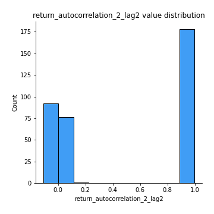

# Exploratory Data Analysis

[<< Go back](../README.md)
## Feature : target
- **Feature type** : categorical
- **Missing** : 0.0%
- **Unique** : 2
- **Count** :347
- **Unique** :2
- **Top** :real
- **Freq** :178

## Feature : return_mean1
- **Feature type** : continous
- **Missing** : 0.0%
- **Unique** : 347
- **Count** :347.0
- **Mean** :47.15440922123389
- **Std** :27.531643594072836
- **Min** :2.041832174
- **25%th Percentile** : 31.928968402000002
- **50%th Percentile** : 49.26591678399999
- **75%th Percentile** : 51.243694396702566
- **Max** :233.603018394

## Feature : return_mean2
- **Feature type** : continous
- **Missing** : 0.0%
- **Unique** : 347
- **Count** :347.0
- **Mean** :50.948956487927326
- **Std** :69.2558320364045
- **Min** :1.6535761199999999
- **25%th Percentile** : 29.342429817
- **50%th Percentile** : 49.16556216471798
- **75%th Percentile** : 51.149370560844005
- **Max** :968.654841336

## Feature : return_sd1
- **Feature type** : continous
- **Missing** : 0.0%
- **Unique** : 347
- **Count** :347.0
- **Mean** :17.70738619180178
- **Std** :13.2486621338847
- **Min** :0.17075448275615598
- **25%th Percentile** : 4.4343801519838095
- **50%th Percentile** : 27.042615201499817
- **75%th Percentile** : 28.781008196539844
- **Max** :113.75913244339056

## Feature : return_sd2
- **Feature type** : continous
- **Missing** : 0.0%
- **Unique** : 347
- **Count** :347.0
- **Mean** :18.34096710929084
- **Std** :17.380938123184045
- **Min** :0.2834854899391288
- **25%th Percentile** : 4.545912091660375
- **50%th Percentile** : 27.19558004150557
- **75%th Percentile** : 28.806044275164716
- **Max** :221.10527467938883

## Feature : return_skew1
- **Feature type** : continous
- **Missing** : 0.0%
- **Unique** : 347
- **Count** :347.0
- **Mean** :0.035343349135148465
- **Std** :0.3558531005310272
- **Min** :-1.115547456019272
- **25%th Percentile** : -0.09015258913839694
- **50%th Percentile** : 0.006784531599423431
- **75%th Percentile** : 0.114874292730201
- **Max** :1.3650668171612657

## Feature : return_skew2
- **Feature type** : continous
- **Missing** : 0.0%
- **Unique** : 347
- **Count** :347.0
- **Mean** :0.04418104227134358
- **Std** :0.35932284831058314
- **Min** :-1.2832038823397423
- **25%th Percentile** : -0.07672563956857202
- **50%th Percentile** : -0.0006781744466639299
- **75%th Percentile** : 0.13622161255787113
- **Max** :1.519021778095084

## Feature : return_kurtosis1
- **Feature type** : continous
- **Missing** : 0.0%
- **Unique** : 347
- **Count** :347.0
- **Mean** :-0.8863141900160405
- **Std** :0.528281333479041
- **Min** :-1.4983782058481485
- **25%th Percentile** : -1.1954094085997746
- **50%th Percentile** : -1.1334685330956698
- **75%th Percentile** : -0.7316185258303947
- **Max** :2.7204133903766734

## Feature : return_kurtosis2
- **Feature type** : continous
- **Missing** : 0.0%
- **Unique** : 347
- **Count** :347.0
- **Mean** :-0.8771595822062778
- **Std** :0.5957204070587147
- **Min** :-1.5119259840116597
- **25%th Percentile** : -1.2087479527930332
- **50%th Percentile** : -1.1431887567249719
- **75%th Percentile** : -0.7405099390664445
- **Max** :3.67606360130176

## Feature : return_autocorrelation_1_lag1
- **Feature type** : continous
- **Missing** : 0.0%
- **Unique** : 347
- **Count** :347.0
- **Mean** :0.506304871090713
- **Std** :0.49816749607107336
- **Min** :-0.12626475992794053
- **25%th Percentile** : 0.0007846730148666513
- **50%th Percentile** : 0.9594500016227631
- **75%th Percentile** : 0.9926017669759735
- **Max** :0.9986434654217642

## Feature : return_autocorrelation_1_lag2
- **Feature type** : continous
- **Missing** : 0.0%
- **Unique** : 347
- **Count** :347.0
- **Mean** :0.5029169148811091
- **Std** :0.49207344338531983
- **Min** :-0.12252861440754487
- **25%th Percentile** : 0.0012154728464821422
- **50%th Percentile** : 0.9275578840603287
- **75%th Percentile** : 0.9857879993339644
- **Max** :0.9973077069474119

## Feature : return_autocorrelation_1_lag3
- **Feature type** : continous
- **Missing** : 0.0%
- **Unique** : 347
- **Count** :347.0
- **Mean** :0.5002172254490874
- **Std** :0.4855450603192751
- **Min** :-0.09745451039371347
- **25%th Percentile** : 0.005796877765641618
- **50%th Percentile** : 0.8920436183587889
- **75%th Percentile** : 0.9788665224042048
- **Max** :0.9958719390898783

## Feature : return_autocorrelation_2_lag1
- **Feature type** : continous
- **Missing** : 0.0%
- **Unique** : 347
- **Count** :347.0
- **Mean** :0.5071964421879175
- **Std** :0.49726591110808366
- **Min** :-0.14335108684419343
- **25%th Percentile** : 0.005942353465960259
- **50%th Percentile** : 0.9622381804022352
- **75%th Percentile** : 0.9925823675411183
- **Max** :0.9990075551978286

## Feature : return_autocorrelation_2_lag2
- **Feature type** : continous
- **Missing** : 0.0%
- **Unique** : 347
- **Count** :347.0
- **Mean** :0.5023083064969908
- **Std** :0.4922186884298327
- **Min** :-0.10826559530308276
- **25%th Percentile** : -0.000835120066782208
- **50%th Percentile** : 0.930735467191792
- **75%th Percentile** : 0.9853693046584707
- **Max** :0.9980152731102225

## Feature : return_autocorrelation_2_lag3
- **Feature type** : continous
- **Missing** : 0.0%
- **Unique** : 347
- **Count** :347.0
- **Mean** :0.49662748564262627
- **Std** :0.48875824737497514
- **Min** :-0.09086755294663292
- **25%th Percentile** : -0.0038362396627720334
- **50%th Percentile** : 0.9007534547386755
- **75%th Percentile** : 0.9789771258663704
- **Max** :0.9970922117201266

## Feature : return_correlation_ts1_lag_0
- **Feature type** : continous
- **Missing** : 0.0%
- **Unique** : 347
- **Count** :347.0
- **Mean** :0.240637107150535
- **Std** :0.3947387139359484
- **Min** :-0.8430691081512005
- **25%th Percentile** : -0.01734133485094689
- **50%th Percentile** : 0.03819859593323641
- **75%th Percentile** : 0.6338511403567222
- **Max** :0.9657060675245052

## Feature : return_correlation_ts1_lag_1
- **Feature type** : continous
- **Missing** : 0.0%
- **Unique** : 347
- **Count** :347.0
- **Mean** :0.2410393884198816
- **Std** :0.39264865118951653
- **Min** :-0.8477371479268198
- **25%th Percentile** : -0.008683668613795326
- **50%th Percentile** : 0.043126373523312
- **75%th Percentile** : 0.6335525673519399
- **Max** :0.9655060959411687

## Feature : return_correlation_ts1_lag_2
- **Feature type** : continous
- **Missing** : 0.0%
- **Unique** : 347
- **Count** :347.0
- **Mean** :0.23550569804006224
- **Std** :0.39442739260949466
- **Min** :-0.8526854582503749
- **25%th Percentile** : -0.022040029787398947
- **50%th Percentile** : 0.03814292183999772
- **75%th Percentile** : 0.6299283062049673
- **Max** :0.9655528894956359

## Feature : return_correlation_ts1_lag_3
- **Feature type** : continous
- **Missing** : 0.0%
- **Unique** : 347
- **Count** :347.0
- **Mean** :0.23900001713582683
- **Std** :0.3909015541231515
- **Min** :-0.8563145423083878
- **25%th Percentile** : -0.010365614523205273
- **50%th Percentile** : 0.04450842727479571
- **75%th Percentile** : 0.6247955850962708
- **Max** :0.965480488388089

## Feature : return_correlation_ts2_lag_1
- **Feature type** : continous
- **Missing** : 0.0%
- **Unique** : 347
- **Count** :347.0
- **Mean** :0.23678583296261962
- **Std** :0.39546409737625254
- **Min** :-0.8419620696123573
- **25%th Percentile** : -0.019793030741787086
- **50%th Percentile** : 0.036201359991947506
- **75%th Percentile** : 0.6328470129017255
- **Max** :0.9653492015905041

## Feature : return_correlation_ts2_lag_2
- **Feature type** : continous
- **Missing** : 0.0%
- **Unique** : 347
- **Count** :347.0
- **Mean** :0.23689100095526885
- **Std** :0.3939130929895421
- **Min** :-0.8407733129095517
- **25%th Percentile** : -0.022257404793131024
- **50%th Percentile** : 0.03746393552482001
- **75%th Percentile** : 0.63449243815177
- **Max** :0.9648220784284761

## Feature : return_correlation_ts2_lag_3
- **Feature type** : continous
- **Missing** : 0.0%
- **Unique** : 347
- **Count** :347.0
- **Mean** :0.2347138550363802
- **Std** :0.3942113172409855
- **Min** :-0.8390925417171665
- **25%th Percentile** : -0.018742195670801133
- **50%th Percentile** : 0.0402557445714109
- **75%th Percentile** : 0.6362040525618549
- **Max** :0.9641714645667581

## Feature : sqreturn_autocorrelation_ts1_lag1
- **Feature type** : continous
- **Missing** : 0.0%
- **Unique** : 347
- **Count** :347.0
- **Mean** :0.5056654500807424
- **Std** :0.49835881860320014
- **Min** :-0.11524990849377359
- **25%th Percentile** : -0.0020087445982070982
- **50%th Percentile** : 0.9602449312055842
- **75%th Percentile** : 0.9923307696780383
- **Max** :0.9984349069917865

## Feature : sqreturn_autocorrelation_ts1_lag2
- **Feature type** : continous
- **Missing** : 0.0%
- **Unique** : 347
- **Count** :347.0
- **Mean** :0.5026127522408239
- **Std** :0.49173492709057276
- **Min** :-0.10882442984565852
- **25%th Percentile** : 0.0022220578395822743
- **50%th Percentile** : 0.9257359121295026
- **75%th Percentile** : 0.9851009189310453
- **Max** :0.9970968172935939

## Feature : sqreturn_autocorrelation_ts1_lag3
- **Feature type** : continous
- **Missing** : 0.0%
- **Unique** : 347
- **Count** :347.0
- **Mean** :0.4993359002577723
- **Std** :0.4857730763570634
- **Min** :-0.11114645454197775
- **25%th Percentile** : 0.002695872793082617
- **50%th Percentile** : 0.8881899215993099
- **75%th Percentile** : 0.9780536594504678
- **Max** :0.9955304893640124

## Feature : sqreturn_autocorrelation_ts2_lag1
- **Feature type** : continous
- **Missing** : 0.0%
- **Unique** : 347
- **Count** :347.0
- **Mean** :0.5070174429798184
- **Std** :0.4970547384951863
- **Min** :-0.12572267277872007
- **25%th Percentile** : 0.006776267349370436
- **50%th Percentile** : 0.9621299028558035
- **75%th Percentile** : 0.9924113690134522
- **Max** :0.9988745118390566

## Feature : sqreturn_autocorrelation_ts2_lag2
- **Feature type** : continous
- **Missing** : 0.0%
- **Unique** : 347
- **Count** :347.0
- **Mean** :0.5005402847838304
- **Std** :0.4932516107130626
- **Min** :-0.12007054642491884
- **25%th Percentile** : -0.0014035734386395628
- **50%th Percentile** : 0.929734066627738
- **75%th Percentile** : 0.9848415488753889
- **Max** :0.9976921088288594

## Feature : sqreturn_autocorrelation_ts2_lag3
- **Feature type** : continous
- **Missing** : 0.0%
- **Unique** : 347
- **Count** :347.0
- **Mean** :0.4963265761860544
- **Std** :0.48787350481590835
- **Min** :-0.10668577332116921
- **25%th Percentile** : -0.008961762555590246
- **50%th Percentile** : 0.8994436699550771
- **75%th Percentile** : 0.9780215613496523
- **Max** :0.9965698341282454

## Feature : sqreturn_correlation_ts1_lag_0
- **Feature type** : continous
- **Missing** : 0.0%
- **Unique** : 347
- **Count** :347.0
- **Mean** :0.240637107150535
- **Std** :0.3947387139359484
- **Min** :-0.8430691081512005
- **25%th Percentile** : -0.01734133485094689
- **50%th Percentile** : 0.03819859593323641
- **75%th Percentile** : 0.6338511403567222
- **Max** :0.9657060675245052

## Feature : sqreturn_correlation_ts1_lag_1
- **Feature type** : continous
- **Missing** : 0.0%
- **Unique** : 347
- **Count** :347.0
- **Mean** :0.2410393884198816
- **Std** :0.39264865118951653
- **Min** :-0.8477371479268198
- **25%th Percentile** : -0.008683668613795326
- **50%th Percentile** : 0.043126373523312
- **75%th Percentile** : 0.6335525673519399
- **Max** :0.9655060959411687

## Feature : sqreturn_correlation_ts1_lag_2
- **Feature type** : continous
- **Missing** : 0.0%
- **Unique** : 347
- **Count** :347.0
- **Mean** :0.23550569804006224
- **Std** :0.39442739260949466
- **Min** :-0.8526854582503749
- **25%th Percentile** : -0.022040029787398947
- **50%th Percentile** : 0.03814292183999772
- **75%th Percentile** : 0.6299283062049673
- **Max** :0.9655528894956359

## Feature : sqreturn_correlation_ts1_lag_3
- **Feature type** : continous
- **Missing** : 0.0%
- **Unique** : 347
- **Count** :347.0
- **Mean** :0.23900001713582683
- **Std** :0.3909015541231515
- **Min** :-0.8563145423083878
- **25%th Percentile** : -0.010365614523205273
- **50%th Percentile** : 0.04450842727479571
- **75%th Percentile** : 0.6247955850962708
- **Max** :0.965480488388089

## Feature : sqreturn_correlation_ts2_lag_1
- **Feature type** : continous
- **Missing** : 0.0%
- **Unique** : 347
- **Count** :347.0
- **Mean** :0.23678583296261962
- **Std** :0.39546409737625254
- **Min** :-0.8419620696123573
- **25%th Percentile** : -0.019793030741787086
- **50%th Percentile** : 0.036201359991947506
- **75%th Percentile** : 0.6328470129017255
- **Max** :0.9653492015905041

## Feature : sqreturn_correlation_ts2_lag_2
- **Feature type** : continous
- **Missing** : 0.0%
- **Unique** : 347
- **Count** :347.0
- **Mean** :0.23689100095526885
- **Std** :0.3939130929895421
- **Min** :-0.8407733129095517
- **25%th Percentile** : -0.022257404793131024
- **50%th Percentile** : 0.03746393552482001
- **75%th Percentile** : 0.63449243815177
- **Max** :0.9648220784284761

## Feature : sqreturn_correlation_ts2_lag_3
- **Feature type** : continous
- **Missing** : 0.0%
- **Unique** : 347
- **Count** :347.0
- **Mean** :0.2347138550363802
- **Std** :0.3942113172409855
- **Min** :-0.8390925417171665
- **25%th Percentile** : -0.018742195670801133
- **50%th Percentile** : 0.0402557445714109
- **75%th Percentile** : 0.6362040525618549
- **Max** :0.9641714645667581

## Feature : price2_granger_cause_price1
- **Feature type** : continous
- **Missing** : 0.0%
- **Unique** : 347
- **Count** :347.0
- **Mean** :0.4080167529532448
- **Std** :0.29409589052851726
- **Min** :5.063123743918868e-06
- **25%th Percentile** : 0.13042306594623787
- **50%th Percentile** : 0.3835058110934064
- **75%th Percentile** : 0.6326005688246287
- **Max** :0.969259810797256

## Feature : price1_granger_cause_price2
- **Feature type** : continous
- **Missing** : 0.0%
- **Unique** : 347
- **Count** :347.0
- **Mean** :0.4056528856469909
- **Std** :0.2946313024302864
- **Min** :1.6674455312589196e-07
- **25%th Percentile** : 0.1427727157767792
- **50%th Percentile** : 0.37956696282929575
- **75%th Percentile** : 0.6389400036322989
- **Max** :0.9917881290208964

[<< Go back](../README.md)
