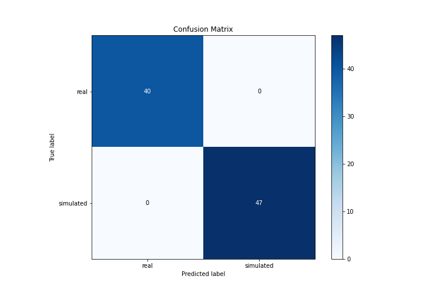
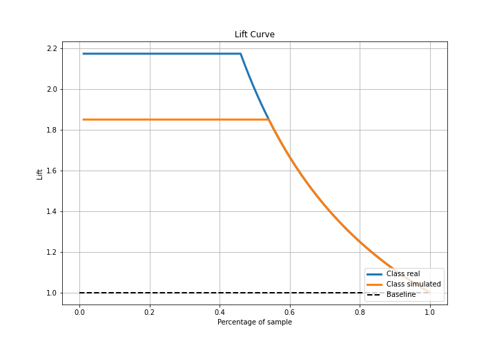

# Summary of 3_Linear

[<< Go back](../README.md)

## Logistic Regression (Linear)
- **n_jobs**: -1
- **explain_level**: 2

## Validation
 - **validation_type**: split
 - **train_ratio**: 0.75
 - **shuffle**: True
 - **stratify**: True

## Optimized metric
accuracy

## Training time

9.3 seconds

## Metric details
|           |     score |     threshold |
|:----------|----------:|--------------:|
| logloss   | 0.0121481 | nan           |
| auc       | 1         | nan           |
| f1        | 1         |   0.498567    |
| accuracy  | 1         |   0.498567    |
| precision | 1         |   0.498567    |
| recall    | 1         |   0.000179811 |
| mcc       | 1         |   0.498567    |

## Confusion matrix (at threshold=0.498567)
|                      |   Predicted as real |   Predicted as simulated |
|:---------------------|--------------------:|-------------------------:|
| Labeled as real      |                  40 |                        0 |
| Labeled as simulated |                   0 |                       47 |

## Learning curves

## Coefficients
| feature                           |   Learner_1 |
|:----------------------------------|------------:|
| intercept                         |   3.9482    |
| return_sd1                        |   0.6865    |
| return_sd2                        |   0.496415  |
| price2_granger_cause_price1       |   0.080489  |
| price1_granger_cause_price2       |   0.0160931 |
| return_skew2                      |  -0.0182772 |
| return_correlation_ts1_lag_3      |  -0.0744045 |
| sqreturn_correlation_ts1_lag_3    |  -0.0744045 |
| sqreturn_correlation_ts1_lag_1    |  -0.0802639 |
| return_correlation_ts1_lag_1      |  -0.0802639 |
| sqreturn_correlation_ts1_lag_2    |  -0.0830347 |
| return_correlation_ts1_lag_2      |  -0.0830347 |
| sqreturn_correlation_ts1_lag_0    |  -0.0835737 |
| return_correlation_ts1_lag_0      |  -0.0835737 |
| sqreturn_correlation_ts2_lag_2    |  -0.0837279 |
| return_correlation_ts2_lag_2      |  -0.0837279 |
| return_correlation_ts2_lag_1      |  -0.0851381 |
| sqreturn_correlation_ts2_lag_1    |  -0.0851381 |
| sqreturn_correlation_ts2_lag_3    |  -0.0869229 |
| return_correlation_ts2_lag_3      |  -0.0869229 |
| return_skew1                      |  -0.11537   |
| return_mean1                      |  -0.163119  |
| return_mean2                      |  -0.281864  |
| return_kurtosis1                  |  -0.445167  |
| return_kurtosis2                  |  -0.543353  |
| sqreturn_autocorrelation_ts2_lag3 |  -0.64104   |
| return_autocorrelation_2_lag3     |  -0.641463  |
| sqreturn_autocorrelation_ts1_lag3 |  -0.645477  |
| return_autocorrelation_1_lag3     |  -0.647296  |
| return_autocorrelation_2_lag2     |  -0.649592  |
| sqreturn_autocorrelation_ts2_lag2 |  -0.651007  |
| sqreturn_autocorrelation_ts1_lag2 |  -0.653267  |
| return_autocorrelation_1_lag2     |  -0.654097  |
| sqreturn_autocorrelation_ts2_lag1 |  -0.657739  |
| return_autocorrelation_2_lag1     |  -0.657869  |
| return_autocorrelation_1_lag1     |  -0.661567  |
| sqreturn_autocorrelation_ts1_lag1 |  -0.661839  |

## Permutation-based Importance

## Confusion Matrix

## Normalized Confusion Matrix

## ROC Curve

## Kolmogorov-Smirnov Statistic

## Precision-Recall Curve

## Calibration Curve

## Cumulative Gains Curve

## Lift Curve

## SHAP Importance

## SHAP Dependence plots

### Dependence (Fold 1)

## SHAP Decision plots

### Top-10 Worst decisions for class 0 (Fold 1)

### Top-10 Best decisions for class 0 (Fold 1)

### Top-10 Worst decisions for class 1 (Fold 1)

### Top-10 Best decisions for class 1 (Fold 1)

[<< Go back](../README.md)
