# Exploratory Data Analysis

[<< Go back](../README.md)
## Feature : target
- **Feature type** : categorical
- **Missing** : 0.0%
- **Unique** : 2
- **Count** :347
- **Unique** :2
- **Top** :simulated
- **Freq** :186

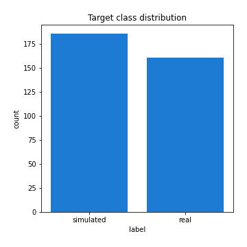
## Feature : return_mean1
- **Feature type** : continous
- **Missing** : 0.0%
- **Unique** : 347
- **Count** :347.0
- **Mean** :49.81975389460988
- **Std** :27.520852412761105
- **Min** :3.6876183260000004
- **25%th Percentile** : 42.805816088
- **50%th Percentile** : 49.703031831372165
- **75%th Percentile** : 51.63589644546134
- **Max** :220.540493312

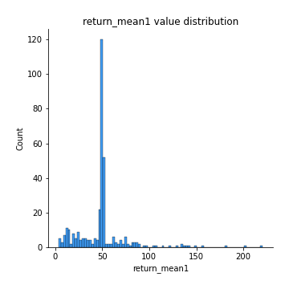
## Feature : return_mean2
- **Feature type** : continous
- **Missing** : 0.0%
- **Unique** : 347
- **Count** :347.0
- **Mean** :51.95449481504428
- **Std** :68.83600222359047
- **Min** :1.7059544
- **25%th Percentile** : 35.093637675
- **50%th Percentile** : 49.45784354507361
- **75%th Percentile** : 51.1755239227119
- **Max** :968.654841336

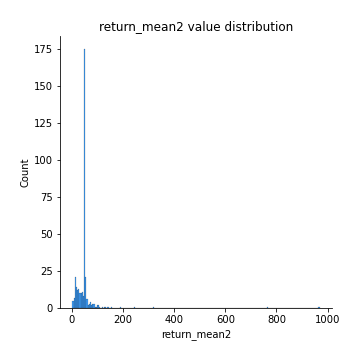
## Feature : return_sd1
- **Feature type** : continous
- **Missing** : 0.0%
- **Unique** : 347
- **Count** :347.0
- **Mean** :19.401115314070328
- **Std** :13.114649883408559
- **Min** :0.5184879616807083
- **25%th Percentile** : 5.666022230132024
- **50%th Percentile** : 28.15134241651281
- **75%th Percentile** : 28.853435908389674
- **Max** :113.75913244339056

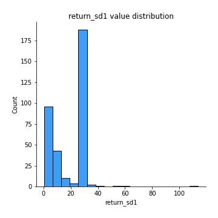
## Feature : return_sd2
- **Feature type** : continous
- **Missing** : 0.0%
- **Unique** : 347
- **Count** :347.0
- **Mean** :19.464272660740615
- **Std** :17.274716170610773
- **Min** :0.2834854899391288
- **25%th Percentile** : 4.9508787787005115
- **50%th Percentile** : 28.104766784890295
- **75%th Percentile** : 28.967099165399542
- **Max** :221.10527467938883

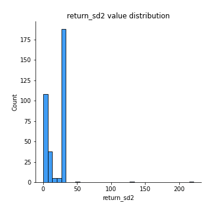
## Feature : return_skew1
- **Feature type** : continous
- **Missing** : 0.0%
- **Unique** : 347
- **Count** :347.0
- **Mean** :0.04806070709115311
- **Std** :0.3635486155819473
- **Min** :-1.1720704684568715
- **25%th Percentile** : -0.08122104784102031
- **50%th Percentile** : 0.006369388452556439
- **75%th Percentile** : 0.1014343631517105
- **Max** :1.3047732227343656

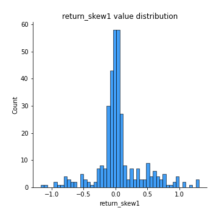
## Feature : return_skew2
- **Feature type** : continous
- **Missing** : 0.0%
- **Unique** : 347
- **Count** :347.0
- **Mean** :0.05850323401705792
- **Std** :0.3435950731709715
- **Min** :-1.2832038823397423
- **25%th Percentile** : -0.061066862815574316
- **50%th Percentile** : 0.007090885344491075
- **75%th Percentile** : 0.12967538685278537
- **Max** :1.519021778095084

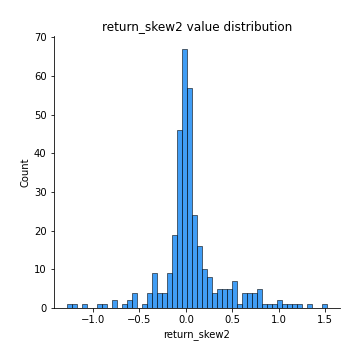
## Feature : return_kurtosis1
- **Feature type** : continous
- **Missing** : 0.0%
- **Unique** : 347
- **Count** :347.0
- **Mean** :-0.9049694255830972
- **Std** :0.5122728378391339
- **Min** :-1.5936521214358073
- **25%th Percentile** : -1.2035800946907564
- **50%th Percentile** : -1.1447200625273204
- **75%th Percentile** : -0.7828154111918495
- **Max** :1.0613278582110062

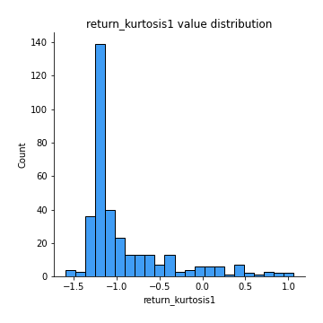
## Feature : return_kurtosis2
- **Feature type** : continous
- **Missing** : 0.0%
- **Unique** : 347
- **Count** :347.0
- **Mean** :-0.8983738491830592
- **Std** :0.5876529849169451
- **Min** :-1.5119259840116597
- **25%th Percentile** : -1.2128333580003203
- **50%th Percentile** : -1.1520954828425192
- **75%th Percentile** : -0.7768490070290563
- **Max** :3.67606360130176

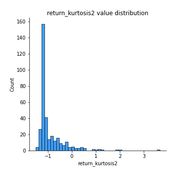
## Feature : return_autocorrelation_1_lag1
- **Feature type** : continous
- **Missing** : 0.0%
- **Unique** : 347
- **Count** :347.0
- **Mean** :0.4558052910870034
- **Std** :0.49951408882266357
- **Min** :-0.12626475992794053
- **25%th Percentile** : -0.008986357529633004
- **50%th Percentile** : 0.059924020815070936
- **75%th Percentile** : 0.9916263737377184
- **Max** :0.9987958286634394

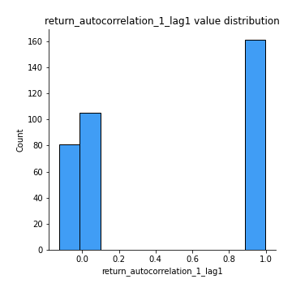
## Feature : return_autocorrelation_1_lag2
- **Feature type** : continous
- **Missing** : 0.0%
- **Unique** : 347
- **Count** :347.0
- **Mean** :0.45488861750903087
- **Std** :0.4924232185407386
- **Min** :-0.12252861440754487
- **25%th Percentile** : -0.0074400536341309095
- **50%th Percentile** : 0.06978812291891141
- **75%th Percentile** : 0.9834502733837387
- **Max** :0.9975950806151487

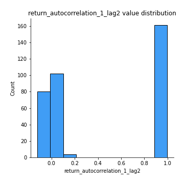
## Feature : return_autocorrelation_1_lag3
- **Feature type** : continous
- **Missing** : 0.0%
- **Unique** : 347
- **Count** :347.0
- **Mean** :0.4516238125970658
- **Std** :0.4873198325747398
- **Min** :-0.09745451039371347
- **25%th Percentile** : -0.0026302331086307017
- **50%th Percentile** : 0.06215973797581656
- **75%th Percentile** : 0.9762757303702054
- **Max** :0.9965600149544981

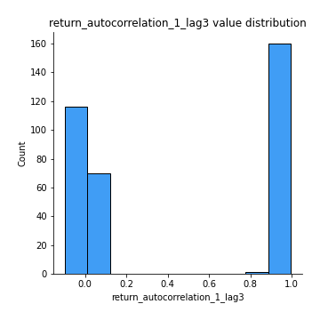
## Feature : return_autocorrelation_2_lag1
- **Feature type** : continous
- **Missing** : 0.0%
- **Unique** : 347
- **Count** :347.0
- **Mean** :0.456360854166304
- **Std** :0.49804359099277157
- **Min** :-0.11738501734092209
- **25%th Percentile** : -0.004434354694570444
- **50%th Percentile** : 0.0604561060301334
- **75%th Percentile** : 0.9917865415868159
- **Max** :0.9990075551978286

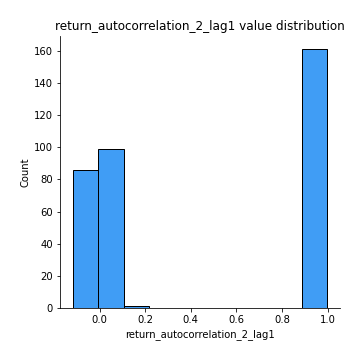
## Feature : return_autocorrelation_2_lag2
- **Feature type** : continous
- **Missing** : 0.0%
- **Unique** : 347
- **Count** :347.0
- **Mean** :0.4521841300982316
- **Std** :0.4927003340688197
- **Min** :-0.10315811082807302
- **25%th Percentile** : -0.006870269658475052
- **50%th Percentile** : 0.06760366753811982
- **75%th Percentile** : 0.9839780162971605
- **Max** :0.9980152731102225

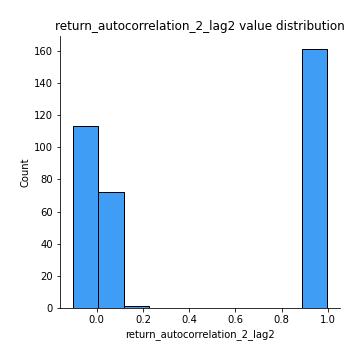
## Feature : return_autocorrelation_2_lag3
- **Feature type** : continous
- **Missing** : 0.0%
- **Unique** : 347
- **Count** :347.0
- **Mean** :0.45020793085220373
- **Std** :0.4857957057763942
- **Min** :-0.10870571127073526
- **25%th Percentile** : -0.003937113667026612
- **50%th Percentile** : 0.06776155842693966
- **75%th Percentile** : 0.9764935391595533
- **Max** :0.9970922117201266

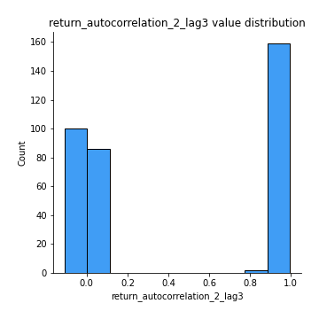
## Feature : return_correlation_ts1_lag_0
- **Feature type** : continous
- **Missing** : 0.0%
- **Unique** : 347
- **Count** :347.0
- **Mean** :0.20296517147907583
- **Std** :0.37535226667716864
- **Min** :-0.8430691081512005
- **25%th Percentile** : -0.018851795283152766
- **50%th Percentile** : 0.027470393074522096
- **75%th Percentile** : 0.5317372935259947
- **Max** :0.9629314841496843

## Feature : return_correlation_ts1_lag_1
- **Feature type** : continous
- **Missing** : 0.0%
- **Unique** : 347
- **Count** :347.0
- **Mean** :0.20334807125716486
- **Std** :0.373473669494356
- **Min** :-0.8477371479268198
- **25%th Percentile** : -0.01545489589807893
- **50%th Percentile** : 0.035277798388397855
- **75%th Percentile** : 0.5261917767571631
- **Max** :0.9622575959379156

## Feature : return_correlation_ts1_lag_2
- **Feature type** : continous
- **Missing** : 0.0%
- **Unique** : 347
- **Count** :347.0
- **Mean** :0.1987558910198462
- **Std** :0.37463638195167637
- **Min** :-0.8526854582503749
- **25%th Percentile** : -0.026531129769623157
- **50%th Percentile** : 0.033100576703791185
- **75%th Percentile** : 0.519208400477222
- **Max** :0.961475687521161

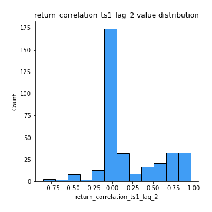
## Feature : return_correlation_ts1_lag_3
- **Feature type** : continous
- **Missing** : 0.0%
- **Unique** : 347
- **Count** :347.0
- **Mean** :0.20010181089227605
- **Std** :0.3723571090018737
- **Min** :-0.8563145423083878
- **25%th Percentile** : -0.01615300165766597
- **50%th Percentile** : 0.03188119840628025
- **75%th Percentile** : 0.5150758537137526
- **Max** :0.9609166269912282

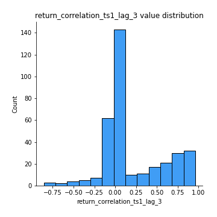
## Feature : return_correlation_ts2_lag_1
- **Feature type** : continous
- **Missing** : 0.0%
- **Unique** : 347
- **Count** :347.0
- **Mean** :0.2017270141570809
- **Std** :0.3750010905390894
- **Min** :-0.8419620696123573
- **25%th Percentile** : -0.019793030741787086
- **50%th Percentile** : 0.03487894657506518
- **75%th Percentile** : 0.5282992240742279
- **Max** :0.9618819791386621

## Feature : return_correlation_ts2_lag_2
- **Feature type** : continous
- **Missing** : 0.0%
- **Unique** : 347
- **Count** :347.0
- **Mean** :0.19908663692510314
- **Std** :0.37500839073570696
- **Min** :-0.8407733129095517
- **25%th Percentile** : -0.022878260844521055
- **50%th Percentile** : 0.029516767594983753
- **75%th Percentile** : 0.5196778243128934
- **Max** :0.9612484058484547

## Feature : return_correlation_ts2_lag_3
- **Feature type** : continous
- **Missing** : 0.0%
- **Unique** : 347
- **Count** :347.0
- **Mean** :0.19648848065665436
- **Std** :0.3754733693209883
- **Min** :-0.8390925417171665
- **25%th Percentile** : -0.023262007731762367
- **50%th Percentile** : 0.02770548342858949
- **75%th Percentile** : 0.5134017389876431
- **Max** :0.9606559891023181

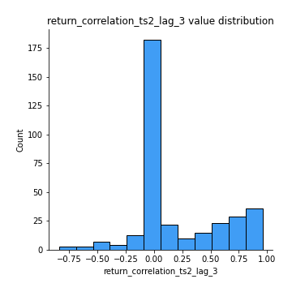
## Feature : sqreturn_autocorrelation_ts1_lag1
- **Feature type** : continous
- **Missing** : 0.0%
- **Unique** : 347
- **Count** :347.0
- **Mean** :0.4553496960944456
- **Std** :0.49959824626568755
- **Min** :-0.11524990849377359
- **25%th Percentile** : -0.013251525744664226
- **50%th Percentile** : 0.063009309396029
- **75%th Percentile** : 0.9911743033894039
- **Max** :0.9984433232250934

## Feature : sqreturn_autocorrelation_ts1_lag2
- **Feature type** : continous
- **Missing** : 0.0%
- **Unique** : 347
- **Count** :347.0
- **Mean** :0.4543135548926268
- **Std** :0.49233815620840016
- **Min** :-0.10882442984565852
- **25%th Percentile** : -0.003072568340205071
- **50%th Percentile** : 0.06818756300493026
- **75%th Percentile** : 0.9827733269431846
- **Max** :0.9970968172935939

## Feature : sqreturn_autocorrelation_ts1_lag3
- **Feature type** : continous
- **Missing** : 0.0%
- **Unique** : 347
- **Count** :347.0
- **Mean** :0.45058854645832624
- **Std** :0.4875789290701681
- **Min** :-0.11408294170290487
- **25%th Percentile** : -0.007983640658250551
- **50%th Percentile** : 0.06499623987488184
- **75%th Percentile** : 0.9748355904626582
- **Max** :0.9956917620790442

## Feature : sqreturn_autocorrelation_ts2_lag1
- **Feature type** : continous
- **Missing** : 0.0%
- **Unique** : 347
- **Count** :347.0
- **Mean** :0.45610929608320344
- **Std** :0.49811228150937636
- **Min** :-0.12175979929530081
- **25%th Percentile** : -0.008306902872770801
- **50%th Percentile** : 0.06569235844527994
- **75%th Percentile** : 0.9912855364730199
- **Max** :0.9988745118390566

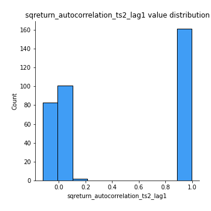
## Feature : sqreturn_autocorrelation_ts2_lag2
- **Feature type** : continous
- **Missing** : 0.0%
- **Unique** : 347
- **Count** :347.0
- **Mean** :0.4506270016525873
- **Std** :0.4936629979702056
- **Min** :-0.12007054642491884
- **25%th Percentile** : -0.008277655907293211
- **50%th Percentile** : 0.06483579795128008
- **75%th Percentile** : 0.9830148430303565
- **Max** :0.9976921088288594

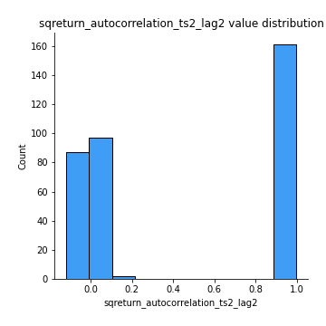
## Feature : sqreturn_autocorrelation_ts2_lag3
- **Feature type** : continous
- **Missing** : 0.0%
- **Unique** : 347
- **Count** :347.0
- **Mean** :0.4501656163857934
- **Std** :0.48513828646141627
- **Min** :-0.1100443832398177
- **25%th Percentile** : -0.008425244798677213
- **50%th Percentile** : 0.06952480697991911
- **75%th Percentile** : 0.9748641300795706
- **Max** :0.9965698341282454

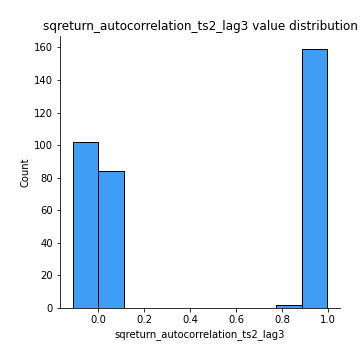
## Feature : sqreturn_correlation_ts1_lag_0
- **Feature type** : continous
- **Missing** : 0.0%
- **Unique** : 347
- **Count** :347.0
- **Mean** :0.20296517147907583
- **Std** :0.37535226667716864
- **Min** :-0.8430691081512005
- **25%th Percentile** : -0.018851795283152766
- **50%th Percentile** : 0.027470393074522096
- **75%th Percentile** : 0.5317372935259947
- **Max** :0.9629314841496843

## Feature : sqreturn_correlation_ts1_lag_1
- **Feature type** : continous
- **Missing** : 0.0%
- **Unique** : 347
- **Count** :347.0
- **Mean** :0.20334807125716486
- **Std** :0.373473669494356
- **Min** :-0.8477371479268198
- **25%th Percentile** : -0.01545489589807893
- **50%th Percentile** : 0.035277798388397855
- **75%th Percentile** : 0.5261917767571631
- **Max** :0.9622575959379156

## Feature : sqreturn_correlation_ts1_lag_2
- **Feature type** : continous
- **Missing** : 0.0%
- **Unique** : 347
- **Count** :347.0
- **Mean** :0.1987558910198462
- **Std** :0.37463638195167637
- **Min** :-0.8526854582503749
- **25%th Percentile** : -0.026531129769623157
- **50%th Percentile** : 0.033100576703791185
- **75%th Percentile** : 0.519208400477222
- **Max** :0.961475687521161

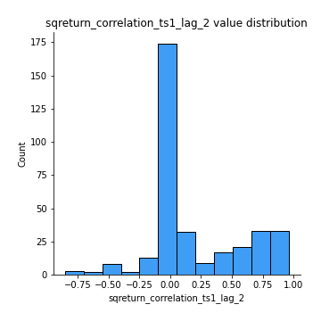
## Feature : sqreturn_correlation_ts1_lag_3
- **Feature type** : continous
- **Missing** : 0.0%
- **Unique** : 347
- **Count** :347.0
- **Mean** :0.20010181089227605
- **Std** :0.3723571090018737
- **Min** :-0.8563145423083878
- **25%th Percentile** : -0.01615300165766597
- **50%th Percentile** : 0.03188119840628025
- **75%th Percentile** : 0.5150758537137526
- **Max** :0.9609166269912282

## Feature : sqreturn_correlation_ts2_lag_1
- **Feature type** : continous
- **Missing** : 0.0%
- **Unique** : 347
- **Count** :347.0
- **Mean** :0.2017270141570809
- **Std** :0.3750010905390894
- **Min** :-0.8419620696123573
- **25%th Percentile** : -0.019793030741787086
- **50%th Percentile** : 0.03487894657506518
- **75%th Percentile** : 0.5282992240742279
- **Max** :0.9618819791386621

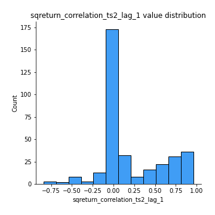
## Feature : sqreturn_correlation_ts2_lag_2
- **Feature type** : continous
- **Missing** : 0.0%
- **Unique** : 347
- **Count** :347.0
- **Mean** :0.19908663692510314
- **Std** :0.37500839073570696
- **Min** :-0.8407733129095517
- **25%th Percentile** : -0.022878260844521055
- **50%th Percentile** : 0.029516767594983753
- **75%th Percentile** : 0.5196778243128934
- **Max** :0.9612484058484547

## Feature : sqreturn_correlation_ts2_lag_3
- **Feature type** : continous
- **Missing** : 0.0%
- **Unique** : 347
- **Count** :347.0
- **Mean** :0.19648848065665436
- **Std** :0.3754733693209883
- **Min** :-0.8390925417171665
- **25%th Percentile** : -0.023262007731762367
- **50%th Percentile** : 0.02770548342858949
- **75%th Percentile** : 0.5134017389876431
- **Max** :0.9606559891023181

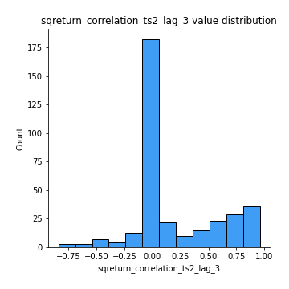
## Feature : price2_granger_cause_price1
- **Feature type** : continous
- **Missing** : 0.0%
- **Unique** : 347
- **Count** :347.0
- **Mean** :0.4174393007525818
- **Std** :0.3014917038315129
- **Min** :5.063123743918868e-06
- **25%th Percentile** : 0.1417319843070075
- **50%th Percentile** : 0.3728848034885992
- **75%th Percentile** : 0.6682064059144116
- **Max** :0.9887885544657823

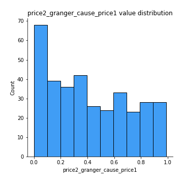
## Feature : price1_granger_cause_price2
- **Feature type** : continous
- **Missing** : 0.0%
- **Unique** : 347
- **Count** :347.0
- **Mean** :0.4143981899252496
- **Std** :0.2885127724843031
- **Min** :8.101068402988115e-10
- **25%th Percentile** : 0.17434051496435965
- **50%th Percentile** : 0.38705392017249285
- **75%th Percentile** : 0.6503317293706692
- **Max** :0.9967863152536168

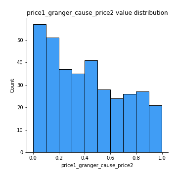

[<< Go back](../README.md)
