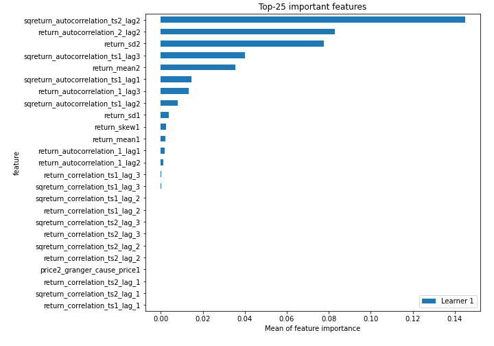

# Summary of 3_Linear

[<< Go back](../README.md)

## Logistic Regression (Linear)
- **n_jobs**: -1
- **explain_level**: 2

## Validation
 - **validation_type**: split
 - **train_ratio**: 0.75
 - **shuffle**: True
 - **stratify**: True

## Optimized metric
accuracy

## Training time

3.1 seconds

## Metric details
|           |    score |   threshold |
|:----------|---------:|------------:|
| logloss   | 0.706172 |  nan        |
| auc       | 0.504757 |  nan        |
| f1        | 0.661538 |    0.29048  |
| accuracy  | 0.586207 |    0.558847 |
| precision | 0.684211 |    0.563842 |
| recall    | 1        |    0.29048  |
| mcc       | 0.200834 |    0.563842 |

## Confusion matrix (at threshold=0.558847)
|                      |   Predicted as real |   Predicted as simulated |
|:---------------------|--------------------:|-------------------------:|
| Labeled as real      |                  37 |                        7 |
| Labeled as simulated |                  29 |                       14 |

## Learning curves

## Coefficients
| feature                           |   Learner_1 |
|:----------------------------------|------------:|
| sqreturn_autocorrelation_ts2_lag2 |  0.526386   |
| sqreturn_autocorrelation_ts1_lag1 |  0.500305   |
| price1_granger_cause_price2       |  0.470811   |
| return_sd2                        |  0.422877   |
| return_autocorrelation_2_lag2     |  0.338949   |
| return_mean1                      |  0.275791   |
| return_autocorrelation_1_lag1     |  0.272929   |
| return_skew1                      |  0.132923   |
| return_kurtosis2                  |  0.106264   |
| price2_granger_cause_price1       |  0.0600816  |
| sqreturn_correlation_ts1_lag_3    |  0.0240856  |
| return_correlation_ts1_lag_3      |  0.0240856  |
| sqreturn_correlation_ts1_lag_2    | -0.00296002 |
| return_correlation_ts1_lag_2      | -0.00296002 |
| return_correlation_ts2_lag_3      | -0.00589903 |
| sqreturn_correlation_ts2_lag_3    | -0.00589903 |
| sqreturn_correlation_ts2_lag_2    | -0.0241961  |
| return_correlation_ts2_lag_2      | -0.0241961  |
| return_autocorrelation_1_lag2     | -0.033646   |
| sqreturn_autocorrelation_ts2_lag3 | -0.0380709  |
| return_correlation_ts1_lag_1      | -0.0436443  |
| sqreturn_correlation_ts1_lag_1    | -0.0436443  |
| sqreturn_correlation_ts2_lag_1    | -0.0521328  |
| return_correlation_ts2_lag_1      | -0.0521328  |
| intercept                         | -0.0651263  |
| sqreturn_correlation_ts1_lag_0    | -0.0864146  |
| return_correlation_ts1_lag_0      | -0.0864146  |
| sqreturn_autocorrelation_ts1_lag2 | -0.144383   |
| return_kurtosis1                  | -0.153978   |
| return_skew2                      | -0.18484    |
| return_mean2                      | -0.185936   |
| return_autocorrelation_1_lag3     | -0.192444   |
| sqreturn_autocorrelation_ts2_lag1 | -0.207291   |
| return_autocorrelation_2_lag3     | -0.219805   |
| return_autocorrelation_2_lag1     | -0.320605   |
| return_sd1                        | -0.361397   |
| sqreturn_autocorrelation_ts1_lag3 | -0.396407   |

## Permutation-based Importance

## Confusion Matrix

## Normalized Confusion Matrix

## ROC Curve

## Kolmogorov-Smirnov Statistic

## Precision-Recall Curve

## Calibration Curve

## Cumulative Gains Curve

## Lift Curve

## SHAP Importance

## SHAP Dependence plots

### Dependence (Fold 1)

## SHAP Decision plots

### Top-10 Worst decisions for class 0 (Fold 1)

### Top-10 Best decisions for class 0 (Fold 1)

### Top-10 Worst decisions for class 1 (Fold 1)

### Top-10 Best decisions for class 1 (Fold 1)

[<< Go back](../README.md)
