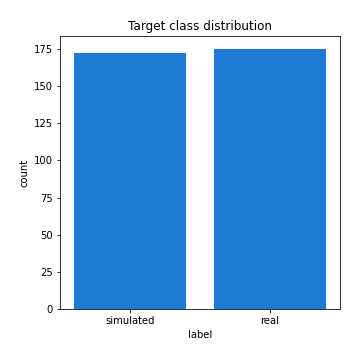

# Exploratory Data Analysis

[<< Go back](../README.md)
## Feature : target
- **Feature type** : categorical
- **Missing** : 0.0%
- **Unique** : 2
- **Count** :347
- **Unique** :2
- **Top** :real
- **Freq** :175

## Feature : return_mean1
- **Feature type** : continous
- **Missing** : 0.0%
- **Unique** : 347
- **Count** :347.0
- **Mean** :49.13502730515274
- **Std** :50.90806371380051
- **Min** :1.885538416
- **25%th Percentile** : 20.127576713
- **50%th Percentile** : 34.284694355999996
- **75%th Percentile** : 62.924034168000006
- **Max** :514.7209599040001

## Feature : return_mean2
- **Feature type** : continous
- **Missing** : 0.0%
- **Unique** : 347
- **Count** :347.0
- **Mean** :50.688813296616715
- **Std** :90.37526584185163
- **Min** :0.122436238
- **25%th Percentile** : 18.407883036
- **50%th Percentile** : 30.001943848
- **75%th Percentile** : 52.977335827000005
- **Max** :968.654841336

## Feature : return_sd1
- **Feature type** : continous
- **Missing** : 0.0%
- **Unique** : 347
- **Count** :347.0
- **Mean** :7.60630413713704
- **Std** :10.603014355825577
- **Min** :0.17075448275615598
- **25%th Percentile** : 2.6409695642805193
- **50%th Percentile** : 4.784522137901791
- **75%th Percentile** : 8.894379751602788
- **Max** :106.16133416858058

## Feature : return_sd2
- **Feature type** : continous
- **Missing** : 0.0%
- **Unique** : 347
- **Count** :347.0
- **Mean** :7.605093712107762
- **Std** :15.327705986856191
- **Min** :0.06022746901081144
- **25%th Percentile** : 2.4831537735069675
- **50%th Percentile** : 4.288135307484764
- **75%th Percentile** : 7.515974505584227
- **Max** :199.5289511545672

## Feature : return_skew1
- **Feature type** : continous
- **Missing** : 0.0%
- **Unique** : 347
- **Count** :347.0
- **Mean** :0.08423946973644303
- **Std** :0.488998306020949
- **Min** :-1.2969383077901073
- **25%th Percentile** : -0.21806039159385776
- **50%th Percentile** : 0.09269589217042147
- **75%th Percentile** : 0.4190424712566555
- **Max** :1.5010388367538123

## Feature : return_skew2
- **Feature type** : continous
- **Missing** : 0.0%
- **Unique** : 347
- **Count** :347.0
- **Mean** :0.08941693070887374
- **Std** :0.5013644735942043
- **Min** :-1.6146280688819945
- **25%th Percentile** : -0.26622250326362473
- **50%th Percentile** : 0.044312206630624094
- **75%th Percentile** : 0.3889624544655427
- **Max** :1.723087490745204

## Feature : return_kurtosis1
- **Feature type** : continous
- **Missing** : 0.0%
- **Unique** : 347
- **Count** :347.0
- **Mean** :-0.6040485961105921
- **Std** :0.6367452474633577
- **Min** :-1.6303358279290296
- **25%th Percentile** : -1.000710102037553
- **50%th Percentile** : -0.7413501471802242
- **75%th Percentile** : -0.3689680719586046
- **Max** :2.7204133903766734

## Feature : return_kurtosis2
- **Feature type** : continous
- **Missing** : 0.0%
- **Unique** : 347
- **Count** :347.0
- **Mean** :-0.5987458226035588
- **Std** :0.6429585764695614
- **Min** :-1.5105773902152024
- **25%th Percentile** : -1.0381620472694992
- **50%th Percentile** : -0.7565353046483527
- **75%th Percentile** : -0.35197134767037475
- **Max** :2.158848846238605

## Feature : return_autocorrelation_1_lag1
- **Feature type** : continous
- **Missing** : 0.0%
- **Unique** : 347
- **Count** :347.0
- **Mean** :0.9895383905312228
- **Std** :0.008872010740922172
- **Min** :0.9355613544071343
- **25%th Percentile** : 0.9863867046033803
- **50%th Percentile** : 0.9922473641957136
- **75%th Percentile** : 0.9954574088096227
- **Max** :0.998907093145209

## Feature : return_autocorrelation_1_lag2
- **Feature type** : continous
- **Missing** : 0.0%
- **Unique** : 347
- **Count** :347.0
- **Mean** :0.9798737775808505
- **Std** :0.016219478263455375
- **Min** :0.8975005092899148
- **25%th Percentile** : 0.9731646127589282
- **50%th Percentile** : 0.9851603353625644
- **75%th Percentile** : 0.9910552880449423
- **Max** :0.9978622646293857

## Feature : return_autocorrelation_1_lag3
- **Feature type** : continous
- **Missing** : 0.0%
- **Unique** : 347
- **Count** :347.0
- **Mean** :0.9705063492059935
- **Std** :0.02328200705712586
- **Min** :0.8527377034295596
- **25%th Percentile** : 0.96077186021796
- **50%th Percentile** : 0.978167384507497
- **75%th Percentile** : 0.9869629280029542
- **Max** :0.9968227021901522

## Feature : return_autocorrelation_2_lag1
- **Feature type** : continous
- **Missing** : 0.0%
- **Unique** : 347
- **Count** :347.0
- **Mean** :0.9903001448761005
- **Std** :0.008002138810542724
- **Min** :0.9442109633563541
- **25%th Percentile** : 0.9874403089163215
- **50%th Percentile** : 0.9925257031353618
- **75%th Percentile** : 0.9959929431380394
- **Max** :0.9990075551978286

## Feature : return_autocorrelation_2_lag2
- **Feature type** : continous
- **Missing** : 0.0%
- **Unique** : 347
- **Count** :347.0
- **Mean** :0.9811138163953259
- **Std** :0.015392405258488336
- **Min** :0.8945372386327647
- **25%th Percentile** : 0.9755108415721175
- **50%th Percentile** : 0.985530089521682
- **75%th Percentile** : 0.9921543299087284
- **Max** :0.9980152731102225

## Feature : return_autocorrelation_2_lag3
- **Feature type** : continous
- **Missing** : 0.0%
- **Unique** : 347
- **Count** :347.0
- **Mean** :0.9722660378204913
- **Std** :0.022331378707342902
- **Min** :0.8556938656298004
- **25%th Percentile** : 0.9638101601859994
- **50%th Percentile** : 0.9784167505504158
- **75%th Percentile** : 0.9882784820763393
- **Max** :0.9970922117201266

## Feature : return_correlation_ts1_lag_0
- **Feature type** : continous
- **Missing** : 0.0%
- **Unique** : 347
- **Count** :347.0
- **Mean** :0.4309307420079608
- **Std** :0.4587130845646893
- **Min** :-0.9454212056869181
- **25%th Percentile** : 0.12496125003064404
- **50%th Percentile** : 0.5714461583630243
- **75%th Percentile** : 0.8071220715248837
- **Max** :0.9737538981965371

## Feature : return_correlation_ts1_lag_1
- **Feature type** : continous
- **Missing** : 0.0%
- **Unique** : 347
- **Count** :347.0
- **Mean** :0.4279076097164314
- **Std** :0.45913461664737465
- **Min** :-0.9452305740471955
- **25%th Percentile** : 0.12653231771253254
- **50%th Percentile** : 0.5626778124237836
- **75%th Percentile** : 0.8057404304805866
- **Max** :0.9711085570505825

## Feature : return_correlation_ts1_lag_2
- **Feature type** : continous
- **Missing** : 0.0%
- **Unique** : 347
- **Count** :347.0
- **Mean** :0.42521528376362316
- **Std** :0.4594577345054823
- **Min** :-0.9451440682595582
- **25%th Percentile** : 0.12143939658872073
- **50%th Percentile** : 0.564160606708383
- **75%th Percentile** : 0.800534321310667
- **Max** :0.9689525049465741

## Feature : return_correlation_ts1_lag_3
- **Feature type** : continous
- **Missing** : 0.0%
- **Unique** : 347
- **Count** :347.0
- **Mean** :0.42264459670917126
- **Std** :0.45976941113119485
- **Min** :-0.9448708035067677
- **25%th Percentile** : 0.11628162906560238
- **50%th Percentile** : 0.5668651967056872
- **75%th Percentile** : 0.7981755068559144
- **Max** :0.9661881898387052

## Feature : return_correlation_ts2_lag_1
- **Feature type** : continous
- **Missing** : 0.0%
- **Unique** : 347
- **Count** :347.0
- **Mean** :0.42765465203207353
- **Std** :0.45946269066277806
- **Min** :-0.9457910375143614
- **25%th Percentile** : 0.12332859338204133
- **50%th Percentile** : 0.5627663721905369
- **75%th Percentile** : 0.8047264441388708
- **Max** :0.9724436077344459

## Feature : return_correlation_ts2_lag_2
- **Feature type** : continous
- **Missing** : 0.0%
- **Unique** : 347
- **Count** :347.0
- **Mean** :0.4246792534052399
- **Std** :0.4601691237552068
- **Min** :-0.9463260196248172
- **25%th Percentile** : 0.1226471588169332
- **50%th Percentile** : 0.5591218691998562
- **75%th Percentile** : 0.8035456419497256
- **Max** :0.9717047956671369

## Feature : return_correlation_ts2_lag_3
- **Feature type** : continous
- **Missing** : 0.0%
- **Unique** : 347
- **Count** :347.0
- **Mean** :0.4218920678603972
- **Std** :0.46065849290597294
- **Min** :-0.9467149428568907
- **25%th Percentile** : 0.11984046596232623
- **50%th Percentile** : 0.5577621440013779
- **75%th Percentile** : 0.8016651943113635
- **Max** :0.970545073163944

## Feature : sqreturn_autocorrelation_ts1_lag1
- **Feature type** : continous
- **Missing** : 0.0%
- **Unique** : 347
- **Count** :347.0
- **Mean** :0.9892258165927247
- **Std** :0.009154224521571558
- **Min** :0.9332773406178796
- **25%th Percentile** : 0.9859891173391784
- **50%th Percentile** : 0.9919253572825536
- **75%th Percentile** : 0.9953182182491374
- **Max** :0.9986169228928321

## Feature : sqreturn_autocorrelation_ts1_lag2
- **Feature type** : continous
- **Missing** : 0.0%
- **Unique** : 347
- **Count** :347.0
- **Mean** :0.9793058824805867
- **Std** :0.01653180229865522
- **Min** :0.8823581818725827
- **25%th Percentile** : 0.9724554875130029
- **50%th Percentile** : 0.9836720639710052
- **75%th Percentile** : 0.990817157387792
- **Max** :0.9972727873616056

## Feature : sqreturn_autocorrelation_ts1_lag3
- **Feature type** : continous
- **Missing** : 0.0%
- **Unique** : 347
- **Count** :347.0
- **Mean** :0.9697297767098159
- **Std** :0.023453465619880817
- **Min** :0.8522889535016422
- **25%th Percentile** : 0.9595273541996383
- **50%th Percentile** : 0.9754156411808299
- **75%th Percentile** : 0.9864799560392203
- **Max** :0.9959512789640361

## Feature : sqreturn_autocorrelation_ts2_lag1
- **Feature type** : continous
- **Missing** : 0.0%
- **Unique** : 347
- **Count** :347.0
- **Mean** :0.9900273643972762
- **Std** :0.007907999679927114
- **Min** :0.9458029581929804
- **25%th Percentile** : 0.9872531659249112
- **50%th Percentile** : 0.9922906449385014
- **75%th Percentile** : 0.9957635238139653
- **Max** :0.9988745118390566

## Feature : sqreturn_autocorrelation_ts2_lag2
- **Feature type** : continous
- **Missing** : 0.0%
- **Unique** : 347
- **Count** :347.0
- **Mean** :0.9805883558622066
- **Std** :0.015274528422132776
- **Min** :0.8967532017908393
- **25%th Percentile** : 0.9745654297326405
- **50%th Percentile** : 0.9853199781437383
- **75%th Percentile** : 0.9914406541115108
- **Max** :0.9976921088288594

## Feature : sqreturn_autocorrelation_ts2_lag3
- **Feature type** : continous
- **Missing** : 0.0%
- **Unique** : 347
- **Count** :347.0
- **Mean** :0.9714833171764333
- **Std** :0.022236151025492517
- **Min** :0.8580676146054256
- **25%th Percentile** : 0.9630448400451689
- **50%th Percentile** : 0.9783338744037484
- **75%th Percentile** : 0.9873665709775435
- **Max** :0.9965698341282454

## Feature : sqreturn_correlation_ts1_lag_0
- **Feature type** : continous
- **Missing** : 0.0%
- **Unique** : 347
- **Count** :347.0
- **Mean** :0.4309307420079608
- **Std** :0.4587130845646893
- **Min** :-0.9454212056869181
- **25%th Percentile** : 0.12496125003064404
- **50%th Percentile** : 0.5714461583630243
- **75%th Percentile** : 0.8071220715248837
- **Max** :0.9737538981965371

## Feature : sqreturn_correlation_ts1_lag_1
- **Feature type** : continous
- **Missing** : 0.0%
- **Unique** : 347
- **Count** :347.0
- **Mean** :0.4279076097164314
- **Std** :0.45913461664737465
- **Min** :-0.9452305740471955
- **25%th Percentile** : 0.12653231771253254
- **50%th Percentile** : 0.5626778124237836
- **75%th Percentile** : 0.8057404304805866
- **Max** :0.9711085570505825

## Feature : sqreturn_correlation_ts1_lag_2
- **Feature type** : continous
- **Missing** : 0.0%
- **Unique** : 347
- **Count** :347.0
- **Mean** :0.42521528376362316
- **Std** :0.4594577345054823
- **Min** :-0.9451440682595582
- **25%th Percentile** : 0.12143939658872073
- **50%th Percentile** : 0.564160606708383
- **75%th Percentile** : 0.800534321310667
- **Max** :0.9689525049465741

## Feature : sqreturn_correlation_ts1_lag_3
- **Feature type** : continous
- **Missing** : 0.0%
- **Unique** : 347
- **Count** :347.0
- **Mean** :0.42264459670917126
- **Std** :0.45976941113119485
- **Min** :-0.9448708035067677
- **25%th Percentile** : 0.11628162906560238
- **50%th Percentile** : 0.5668651967056872
- **75%th Percentile** : 0.7981755068559144
- **Max** :0.9661881898387052

## Feature : sqreturn_correlation_ts2_lag_1
- **Feature type** : continous
- **Missing** : 0.0%
- **Unique** : 347
- **Count** :347.0
- **Mean** :0.42765465203207353
- **Std** :0.45946269066277806
- **Min** :-0.9457910375143614
- **25%th Percentile** : 0.12332859338204133
- **50%th Percentile** : 0.5627663721905369
- **75%th Percentile** : 0.8047264441388708
- **Max** :0.9724436077344459

## Feature : sqreturn_correlation_ts2_lag_2
- **Feature type** : continous
- **Missing** : 0.0%
- **Unique** : 347
- **Count** :347.0
- **Mean** :0.4246792534052399
- **Std** :0.4601691237552068
- **Min** :-0.9463260196248172
- **25%th Percentile** : 0.1226471588169332
- **50%th Percentile** : 0.5591218691998562
- **75%th Percentile** : 0.8035456419497256
- **Max** :0.9717047956671369

## Feature : sqreturn_correlation_ts2_lag_3
- **Feature type** : continous
- **Missing** : 0.0%
- **Unique** : 347
- **Count** :347.0
- **Mean** :0.4218920678603972
- **Std** :0.46065849290597294
- **Min** :-0.9467149428568907
- **25%th Percentile** : 0.11984046596232623
- **50%th Percentile** : 0.5577621440013779
- **75%th Percentile** : 0.8016651943113635
- **Max** :0.970545073163944

## Feature : price2_granger_cause_price1
- **Feature type** : continous
- **Missing** : 0.0%
- **Unique** : 347
- **Count** :347.0
- **Mean** :0.3838591514502865
- **Std** :0.3048821468647686
- **Min** :7.442002876220672e-07
- **25%th Percentile** : 0.08989578725038198
- **50%th Percentile** : 0.3353167130976647
- **75%th Percentile** : 0.6483190594309787
- **Max** :0.9991604192257109

## Feature : price1_granger_cause_price2
- **Feature type** : continous
- **Missing** : 0.0%
- **Unique** : 347
- **Count** :347.0
- **Mean** :0.3788212023454403
- **Std** :0.30923745521316265
- **Min** :8.101068402988115e-10
- **25%th Percentile** : 0.09736128613469269
- **50%th Percentile** : 0.301908775846766
- **75%th Percentile** : 0.6317218311097799
- **Max** :0.9969138565505037

[<< Go back](../README.md)
