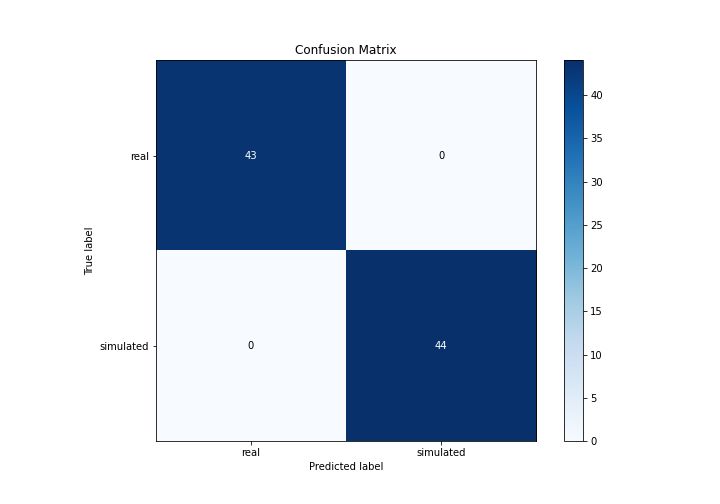

# Summary of 3_Linear

[<< Go back](../README.md)

## Logistic Regression (Linear)
- **n_jobs**: -1
- **explain_level**: 2

## Validation
 - **validation_type**: split
 - **train_ratio**: 0.75
 - **shuffle**: True
 - **stratify**: True

## Optimized metric
accuracy

## Training time

10.4 seconds

## Metric details
|           |      score |   threshold |
|:----------|-----------:|------------:|
| logloss   | 0.00412964 | nan         |
| auc       | 1          | nan         |
| f1        | 1          |   0.499331  |
| accuracy  | 1          |   0.499331  |
| precision | 1          |   0.499331  |
| recall    | 1          |   1.949e-05 |
| mcc       | 1          |   0.499331  |

## Confusion matrix (at threshold=0.499331)
|                      |   Predicted as real |   Predicted as simulated |
|:---------------------|--------------------:|-------------------------:|
| Labeled as real      |                  43 |                        0 |
| Labeled as simulated |                   0 |                       44 |

## Learning curves

## Coefficients
| feature                           |   Learner_1 |
|:----------------------------------|------------:|
| intercept                         |   4.03916   |
| return_sd2                        |   0.524637  |
| return_sd1                        |   0.446164  |
| price2_granger_cause_price1       |   0.0911143 |
| return_skew2                      |   0.0596841 |
| price1_granger_cause_price2       |   0.0342414 |
| return_correlation_ts1_lag_3      |  -0.0802852 |
| sqreturn_correlation_ts1_lag_3    |  -0.0802852 |
| sqreturn_correlation_ts1_lag_1    |  -0.0841247 |
| return_correlation_ts1_lag_1      |  -0.0841247 |
| sqreturn_correlation_ts2_lag_1    |  -0.0883759 |
| return_correlation_ts2_lag_1      |  -0.0883759 |
| sqreturn_correlation_ts2_lag_2    |  -0.0903275 |
| return_correlation_ts2_lag_2      |  -0.0903275 |
| return_correlation_ts1_lag_2      |  -0.0915421 |
| sqreturn_correlation_ts1_lag_2    |  -0.0915421 |
| sqreturn_correlation_ts2_lag_3    |  -0.0919311 |
| return_correlation_ts2_lag_3      |  -0.0919311 |
| return_correlation_ts1_lag_0      |  -0.0929116 |
| sqreturn_correlation_ts1_lag_0    |  -0.0929116 |
| return_skew1                      |  -0.110856  |
| return_mean1                      |  -0.208505  |
| return_mean2                      |  -0.293649  |
| return_kurtosis1                  |  -0.493105  |
| return_kurtosis2                  |  -0.507035  |
| sqreturn_autocorrelation_ts2_lag3 |  -0.677619  |
| return_autocorrelation_2_lag3     |  -0.677894  |
| return_autocorrelation_1_lag3     |  -0.680094  |
| sqreturn_autocorrelation_ts1_lag3 |  -0.680239  |
| sqreturn_autocorrelation_ts1_lag2 |  -0.683094  |
| return_autocorrelation_1_lag2     |  -0.683758  |
| return_autocorrelation_2_lag2     |  -0.686716  |
| sqreturn_autocorrelation_ts2_lag2 |  -0.688328  |
| return_autocorrelation_1_lag1     |  -0.69194   |
| sqreturn_autocorrelation_ts1_lag1 |  -0.691961  |
| sqreturn_autocorrelation_ts2_lag1 |  -0.693747  |
| return_autocorrelation_2_lag1     |  -0.69412   |

## Permutation-based Importance

## Confusion Matrix

## Normalized Confusion Matrix

## ROC Curve

## Kolmogorov-Smirnov Statistic

## Precision-Recall Curve

## Calibration Curve

## Cumulative Gains Curve

## Lift Curve

## SHAP Importance

## SHAP Dependence plots

### Dependence (Fold 1)

## SHAP Decision plots

### Top-10 Worst decisions for class 0 (Fold 1)

### Top-10 Best decisions for class 0 (Fold 1)

### Top-10 Worst decisions for class 1 (Fold 1)

### Top-10 Best decisions for class 1 (Fold 1)

[<< Go back](../README.md)
