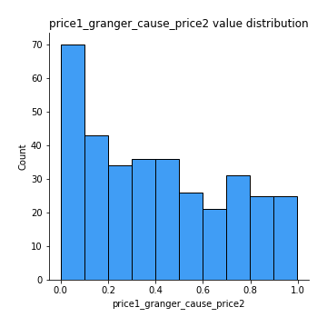

# Exploratory Data Analysis

[<< Go back](../README.md)
## Feature : target
- **Feature type** : categorical
- **Missing** : 0.0%
- **Unique** : 2
- **Count** :347
- **Unique** :2
- **Top** :simulated
- **Freq** :177

## Feature : return_mean1
- **Feature type** : continous
- **Missing** : 0.0%
- **Unique** : 347
- **Count** :347.0
- **Mean** :50.72757090408535
- **Std** :37.536457610776345
- **Min** :2.041832174
- **25%th Percentile** : 36.44312439
- **50%th Percentile** : 49.58070993413414
- **75%th Percentile** : 51.47399439755829
- **Max** :514.7209599040001

## Feature : return_mean2
- **Feature type** : continous
- **Missing** : 0.0%
- **Unique** : 347
- **Count** :347.0
- **Mean** :52.15781421318015
- **Std** :69.82962468193146
- **Min** :1.6535761199999999
- **25%th Percentile** : 32.038208416
- **50%th Percentile** : 49.40157013161185
- **75%th Percentile** : 51.01060169223871
- **Max** :968.654841336

## Feature : return_sd1
- **Feature type** : continous
- **Missing** : 0.0%
- **Unique** : 347
- **Count** :347.0
- **Mean** :18.963069570848166
- **Std** :13.710885754406908
- **Min** :0.17075448275615598
- **25%th Percentile** : 4.872160314414543
- **50%th Percentile** : 28.031455600264067
- **75%th Percentile** : 28.84256621536746
- **Max** :113.75913244339056

## Feature : return_sd2
- **Feature type** : continous
- **Missing** : 0.0%
- **Unique** : 347
- **Count** :347.0
- **Mean** :19.036656733510192
- **Std** :17.396663741363163
- **Min** :0.2834854899391288
- **25%th Percentile** : 5.278881620855
- **50%th Percentile** : 27.96275519783292
- **75%th Percentile** : 28.967099165399542
- **Max** :221.10527467938883

## Feature : return_skew1
- **Feature type** : continous
- **Missing** : 0.0%
- **Unique** : 347
- **Count** :347.0
- **Mean** :0.05022424978741884
- **Std** :0.3604237665929834
- **Min** :-1.1720704684568715
- **25%th Percentile** : -0.08656834925139575
- **50%th Percentile** : 0.005434835990777607
- **75%th Percentile** : 0.11367986364195551
- **Max** :1.3650668171612657

## Feature : return_skew2
- **Feature type** : continous
- **Missing** : 0.0%
- **Unique** : 347
- **Count** :347.0
- **Mean** :0.044244303919190674
- **Std** :0.3361795440918172
- **Min** :-1.1179671336557087
- **25%th Percentile** : -0.08021110349887416
- **50%th Percentile** : 0.0019350546977722548
- **75%th Percentile** : 0.10464443769641356
- **Max** :1.519021778095084

## Feature : return_kurtosis1
- **Feature type** : continous
- **Missing** : 0.0%
- **Unique** : 347
- **Count** :347.0
- **Mean** :-0.8885853384544389
- **Std** :0.5543913743377741
- **Min** :-1.5936521214358073
- **25%th Percentile** : -1.206940968317788
- **50%th Percentile** : -1.1457024590387004
- **75%th Percentile** : -0.7591714288880671
- **Max** :2.7204133903766734

## Feature : return_kurtosis2
- **Feature type** : continous
- **Missing** : 0.0%
- **Unique** : 347
- **Count** :347.0
- **Mean** :-0.9280146142481851
- **Std** :0.51712605894476
- **Min** :-1.5119259840116597
- **25%th Percentile** : -1.2148656871957912
- **50%th Percentile** : -1.1477871672164126
- **75%th Percentile** : -0.7776064499742477
- **Max** :3.67606360130176

## Feature : return_autocorrelation_1_lag1
- **Feature type** : continous
- **Missing** : 0.0%
- **Unique** : 347
- **Count** :347.0
- **Mean** :0.48410363478044555
- **Std** :0.4973889682502362
- **Min** :-0.09814710918831764
- **25%th Percentile** : -0.00032568316990002423
- **50%th Percentile** : 0.08919714781670222
- **75%th Percentile** : 0.9927237290952711
- **Max** :0.9987958286634394

## Feature : return_autocorrelation_1_lag2
- **Feature type** : continous
- **Missing** : 0.0%
- **Unique** : 347
- **Count** :347.0
- **Mean** :0.4817572342688679
- **Std** :0.49083225028693833
- **Min** :-0.08952978090521943
- **25%th Percentile** : -0.0012814903165828961
- **50%th Percentile** : 0.08915988669925878
- **75%th Percentile** : 0.9857061188337342
- **Max** :0.9975950806151487

## Feature : return_autocorrelation_1_lag3
- **Feature type** : continous
- **Missing** : 0.0%
- **Unique** : 347
- **Count** :347.0
- **Mean** :0.47658261104836014
- **Std** :0.48745844169300817
- **Min** :-0.09745451039371347
- **25%th Percentile** : 0.0032782390117100384
- **50%th Percentile** : 0.08892244726069815
- **75%th Percentile** : 0.9787533357822148
- **Max** :0.9965600149544981

## Feature : return_autocorrelation_2_lag1
- **Feature type** : continous
- **Missing** : 0.0%
- **Unique** : 347
- **Count** :347.0
- **Mean** :0.48277030916491975
- **Std** :0.5000414196088431
- **Min** :-0.14335108684419343
- **25%th Percentile** : -0.004248710883948087
- **50%th Percentile** : 0.0901947600912686
- **75%th Percentile** : 0.9931886852272795
- **Max** :0.9990075551978286

## Feature : return_autocorrelation_2_lag2
- **Feature type** : continous
- **Missing** : 0.0%
- **Unique** : 347
- **Count** :347.0
- **Mean** :0.48000962122954594
- **Std** :0.49414063836095584
- **Min** :-0.10826559530308276
- **25%th Percentile** : -0.0036230070787224957
- **50%th Percentile** : 0.0855981137133537
- **75%th Percentile** : 0.9864402738033774
- **Max** :0.9980152731102225

## Feature : return_autocorrelation_2_lag3
- **Feature type** : continous
- **Missing** : 0.0%
- **Unique** : 347
- **Count** :347.0
- **Mean** :0.47770274265387935
- **Std** :0.4883042078463699
- **Min** :-0.09004920757711965
- **25%th Percentile** : -0.0013537599942019714
- **50%th Percentile** : 0.09918967028216699
- **75%th Percentile** : 0.9799065519072676
- **Max** :0.9970922117201266

## Feature : return_correlation_ts1_lag_0
- **Feature type** : continous
- **Missing** : 0.0%
- **Unique** : 347
- **Count** :347.0
- **Mean** :0.2200579067350699
- **Std** :0.39922024803709383
- **Min** :-0.8430691081512005
- **25%th Percentile** : -0.022393526248650743
- **50%th Percentile** : 0.02755296836951888
- **75%th Percentile** : 0.6303282890486992
- **Max** :0.9652680339257566

## Feature : return_correlation_ts1_lag_1
- **Feature type** : continous
- **Missing** : 0.0%
- **Unique** : 347
- **Count** :347.0
- **Mean** :0.2226578813370754
- **Std** :0.39650142310174924
- **Min** :-0.8477371479268198
- **25%th Percentile** : -0.011451692679685708
- **50%th Percentile** : 0.036304570611078536
- **75%th Percentile** : 0.6259184340072355
- **Max** :0.9655060959411687

## Feature : return_correlation_ts1_lag_2
- **Feature type** : continous
- **Missing** : 0.0%
- **Unique** : 347
- **Count** :347.0
- **Mean** :0.21517289677441928
- **Std** :0.39962407647329135
- **Min** :-0.8526854582503749
- **25%th Percentile** : -0.02736617646231375
- **50%th Percentile** : 0.0307133021992961
- **75%th Percentile** : 0.6183527480258718
- **Max** :0.9655528894956359

## Feature : return_correlation_ts1_lag_3
- **Feature type** : continous
- **Missing** : 0.0%
- **Unique** : 347
- **Count** :347.0
- **Mean** :0.2188611324026196
- **Std** :0.3968419948493707
- **Min** :-0.8563145423083878
- **25%th Percentile** : -0.01716783435682883
- **50%th Percentile** : 0.0396123894071053
- **75%th Percentile** : 0.6113935289319353
- **Max** :0.965480488388089

## Feature : return_correlation_ts2_lag_1
- **Feature type** : continous
- **Missing** : 0.0%
- **Unique** : 347
- **Count** :347.0
- **Mean** :0.2207114327120256
- **Std** :0.3975028699366883
- **Min** :-0.8419620696123573
- **25%th Percentile** : -0.018546193681412255
- **50%th Percentile** : 0.033897077951344945
- **75%th Percentile** : 0.6214600395735639
- **Max** :0.9641732497647877

## Feature : return_correlation_ts2_lag_2
- **Feature type** : continous
- **Missing** : 0.0%
- **Unique** : 347
- **Count** :347.0
- **Mean** :0.21817655108673306
- **Std** :0.39751202567907
- **Min** :-0.8407733129095517
- **25%th Percentile** : -0.022716752361407945
- **50%th Percentile** : 0.034028910389291955
- **75%th Percentile** : 0.6176124752040546
- **Max** :0.9632401452572252

## Feature : return_correlation_ts2_lag_3
- **Feature type** : continous
- **Missing** : 0.0%
- **Unique** : 347
- **Count** :347.0
- **Mean** :0.21435344843349827
- **Std** :0.3984987168399728
- **Min** :-0.8390925417171665
- **25%th Percentile** : -0.025399674611962075
- **50%th Percentile** : 0.03262810916136686
- **75%th Percentile** : 0.6132493388011926
- **Max** :0.9626030498699537

## Feature : sqreturn_autocorrelation_ts1_lag1
- **Feature type** : continous
- **Missing** : 0.0%
- **Unique** : 347
- **Count** :347.0
- **Mean** :0.4834038745479954
- **Std** :0.49769030323109015
- **Min** :-0.11400195759256666
- **25%th Percentile** : -0.004835689865126304
- **50%th Percentile** : 0.0786381672885653
- **75%th Percentile** : 0.992321038889206
- **Max** :0.9984433232250934

## Feature : sqreturn_autocorrelation_ts1_lag2
- **Feature type** : continous
- **Missing** : 0.0%
- **Unique** : 347
- **Count** :347.0
- **Mean** :0.4808708764455446
- **Std** :0.49107266502748026
- **Min** :-0.10322695597800068
- **25%th Percentile** : 0.0010493315400132107
- **50%th Percentile** : 0.09425449494280758
- **75%th Percentile** : 0.9847591910081142
- **Max** :0.9970968172935939

## Feature : sqreturn_autocorrelation_ts1_lag3
- **Feature type** : continous
- **Missing** : 0.0%
- **Unique** : 347
- **Count** :347.0
- **Mean** :0.47521790097767924
- **Std** :0.48812850449842365
- **Min** :-0.11408294170290487
- **25%th Percentile** : -0.004776291782270511
- **50%th Percentile** : 0.08339948235287807
- **75%th Percentile** : 0.9778512542728789
- **Max** :0.9956917620790442

## Feature : sqreturn_autocorrelation_ts2_lag1
- **Feature type** : continous
- **Missing** : 0.0%
- **Unique** : 347
- **Count** :347.0
- **Mean** :0.48306720196566605
- **Std** :0.49935835826772423
- **Min** :-0.13877319766331184
- **25%th Percentile** : -0.0005470465895528818
- **50%th Percentile** : 0.09098960370602496
- **75%th Percentile** : 0.9929484677110745
- **Max** :0.9988745118390566

## Feature : sqreturn_autocorrelation_ts2_lag2
- **Feature type** : continous
- **Missing** : 0.0%
- **Unique** : 347
- **Count** :347.0
- **Mean** :0.477936654621338
- **Std** :0.49536401575139555
- **Min** :-0.12007054642491884
- **25%th Percentile** : -0.00440816762809083
- **50%th Percentile** : 0.08083555078676809
- **75%th Percentile** : 0.9863021882766674
- **Max** :0.9976921088288594

## Feature : sqreturn_autocorrelation_ts2_lag3
- **Feature type** : continous
- **Missing** : 0.0%
- **Unique** : 347
- **Count** :347.0
- **Mean** :0.47757248839884686
- **Std** :0.4871942386554203
- **Min** :-0.10668577332116921
- **25%th Percentile** : -0.002249481764343245
- **50%th Percentile** : 0.07976537917585595
- **75%th Percentile** : 0.9799511828010689
- **Max** :0.9965698341282454

## Feature : sqreturn_correlation_ts1_lag_0
- **Feature type** : continous
- **Missing** : 0.0%
- **Unique** : 347
- **Count** :347.0
- **Mean** :0.2200579067350699
- **Std** :0.39922024803709383
- **Min** :-0.8430691081512005
- **25%th Percentile** : -0.022393526248650743
- **50%th Percentile** : 0.02755296836951888
- **75%th Percentile** : 0.6303282890486992
- **Max** :0.9652680339257566

## Feature : sqreturn_correlation_ts1_lag_1
- **Feature type** : continous
- **Missing** : 0.0%
- **Unique** : 347
- **Count** :347.0
- **Mean** :0.2226578813370754
- **Std** :0.39650142310174924
- **Min** :-0.8477371479268198
- **25%th Percentile** : -0.011451692679685708
- **50%th Percentile** : 0.036304570611078536
- **75%th Percentile** : 0.6259184340072355
- **Max** :0.9655060959411687

## Feature : sqreturn_correlation_ts1_lag_2
- **Feature type** : continous
- **Missing** : 0.0%
- **Unique** : 347
- **Count** :347.0
- **Mean** :0.21517289677441928
- **Std** :0.39962407647329135
- **Min** :-0.8526854582503749
- **25%th Percentile** : -0.02736617646231375
- **50%th Percentile** : 0.0307133021992961
- **75%th Percentile** : 0.6183527480258718
- **Max** :0.9655528894956359

## Feature : sqreturn_correlation_ts1_lag_3
- **Feature type** : continous
- **Missing** : 0.0%
- **Unique** : 347
- **Count** :347.0
- **Mean** :0.2188611324026196
- **Std** :0.3968419948493707
- **Min** :-0.8563145423083878
- **25%th Percentile** : -0.01716783435682883
- **50%th Percentile** : 0.0396123894071053
- **75%th Percentile** : 0.6113935289319353
- **Max** :0.965480488388089

## Feature : sqreturn_correlation_ts2_lag_1
- **Feature type** : continous
- **Missing** : 0.0%
- **Unique** : 347
- **Count** :347.0
- **Mean** :0.2207114327120256
- **Std** :0.3975028699366883
- **Min** :-0.8419620696123573
- **25%th Percentile** : -0.018546193681412255
- **50%th Percentile** : 0.033897077951344945
- **75%th Percentile** : 0.6214600395735639
- **Max** :0.9641732497647877

## Feature : sqreturn_correlation_ts2_lag_2
- **Feature type** : continous
- **Missing** : 0.0%
- **Unique** : 347
- **Count** :347.0
- **Mean** :0.21817655108673306
- **Std** :0.39751202567907
- **Min** :-0.8407733129095517
- **25%th Percentile** : -0.022716752361407945
- **50%th Percentile** : 0.034028910389291955
- **75%th Percentile** : 0.6176124752040546
- **Max** :0.9632401452572252

## Feature : sqreturn_correlation_ts2_lag_3
- **Feature type** : continous
- **Missing** : 0.0%
- **Unique** : 347
- **Count** :347.0
- **Mean** :0.21435344843349827
- **Std** :0.3984987168399728
- **Min** :-0.8390925417171665
- **25%th Percentile** : -0.025399674611962075
- **50%th Percentile** : 0.03262810916136686
- **75%th Percentile** : 0.6132493388011926
- **Max** :0.9626030498699537

## Feature : price2_granger_cause_price1
- **Feature type** : continous
- **Missing** : 0.0%
- **Unique** : 347
- **Count** :347.0
- **Mean** :0.42117700372677214
- **Std** :0.2955228280114261
- **Min** :7.072266119304259e-06
- **25%th Percentile** : 0.1528738333799715
- **50%th Percentile** : 0.3853315800095001
- **75%th Percentile** : 0.6642410890175836
- **Max** :0.9887885544657823

## Feature : price1_granger_cause_price2
- **Feature type** : continous
- **Missing** : 0.0%
- **Unique** : 347
- **Count** :347.0
- **Mean** :0.4102774447378446
- **Std** :0.2991469815223574
- **Min** :1.6674455312589196e-07
- **25%th Percentile** : 0.14093537334419043
- **50%th Percentile** : 0.37956696282929575
- **75%th Percentile** : 0.67996891248774
- **Max** :0.9967863152536168

[<< Go back](../README.md)
