# Summary of 2_DecisionTree

[<< Go back](../README.md)

## Decision Tree
- **n_jobs**: -1
- **criterion**: gini
- **max_depth**: 3
- **explain_level**: 2

## Validation
 - **validation_type**: split
 - **train_ratio**: 0.75
 - **shuffle**: True
 - **stratify**: True

## Optimized metric
accuracy

## Training time

4.9 seconds

## Metric details
|           |    score |   threshold |
|:----------|---------:|------------:|
| logloss   | 0.90825  |  nan        |
| auc       | 0.441941 |  nan        |
| f1        | 0.645669 |    0        |
| accuracy  | 0.505747 |    0.540741 |
| precision | 0.476744 |    0        |
| recall    | 1        |    0        |
| mcc       | 0.101804 |    0.025    |

## Confusion matrix (at threshold=0.540741)
|                      |   Predicted as real |   Predicted as simulated |
|:---------------------|--------------------:|-------------------------:|
| Labeled as real      |                  41 |                        5 |
| Labeled as simulated |                  38 |                        3 |

## Learning curves
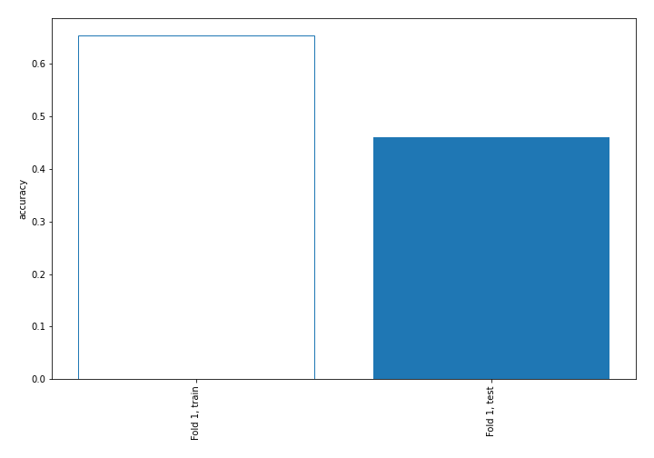

## Decision Tree 

### Tree #1
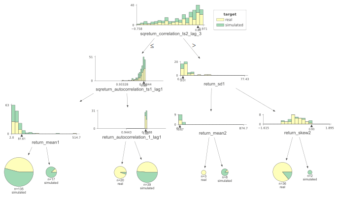

### Rules

if (sqreturn_correlation_ts2_lag_3 <= 0.837) and (sqreturn_autocorrelation_ts1_lag1 <= 0.994) and (return_mean1 <= 81.612) then class: simulated (proba: 54.07%) | based on 135 samples

if (sqreturn_correlation_ts2_lag_3 <= 0.837) and (sqreturn_autocorrelation_ts1_lag1 > 0.994) and (return_autocorrelation_1_lag1 > 0.995) then class: simulated (proba: 51.28%) | based on 39 samples

if (sqreturn_correlation_ts2_lag_3 > 0.837) and (return_sd1 > 3.01) and (return_skew2 <= 0.934) then class: real (proba: 86.11%) | based on 36 samples

if (sqreturn_correlation_ts2_lag_3 <= 0.837) and (sqreturn_autocorrelation_ts1_lag1 > 0.994) and (return_autocorrelation_1_lag1 <= 0.995) then class: real (proba: 95.0%) | based on 20 samples

if (sqreturn_correlation_ts2_lag_3 <= 0.837) and (sqreturn_autocorrelation_ts1_lag1 <= 0.994) and (return_mean1 > 81.612) then class: simulated (proba: 88.24%) | based on 17 samples

if (sqreturn_correlation_ts2_lag_3 > 0.837) and (return_sd1 <= 3.01) and (return_mean2 > 15.568) then class: simulated (proba: 87.5%) | based on 8 samples

if (sqreturn_correlation_ts2_lag_3 > 0.837) and (return_sd1 <= 3.01) and (return_mean2 <= 15.568) then class: real (proba: 100.0%) | based on 3 samples

if (sqreturn_correlation_ts2_lag_3 > 0.837) and (return_sd1 > 3.01) and (return_skew2 > 0.934) then class: simulated (proba: 100.0%) | based on 2 samples

## Permutation-based Importance
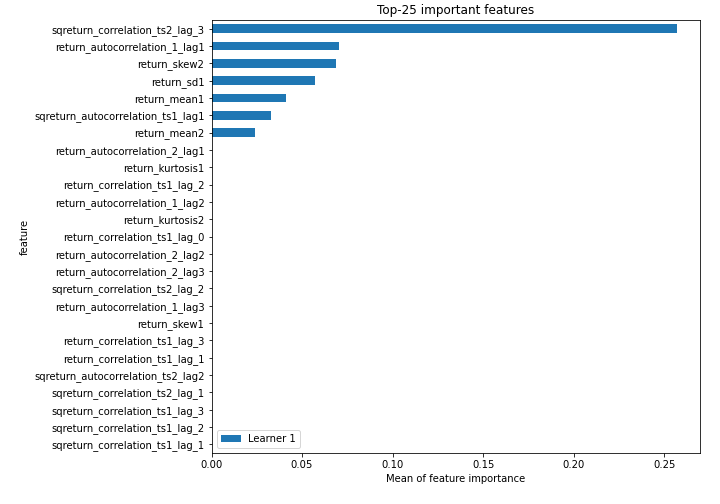
## Confusion Matrix

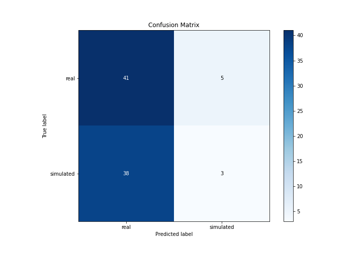

## Normalized Confusion Matrix

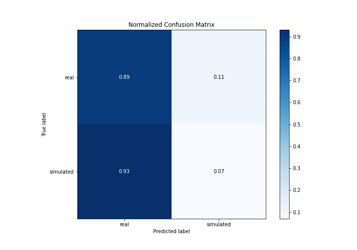

## ROC Curve

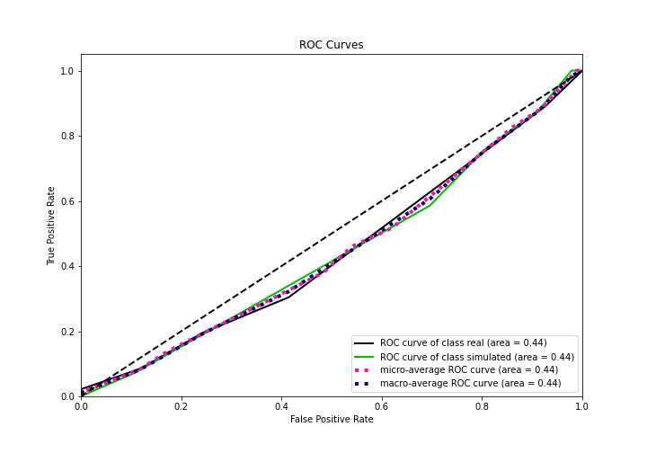

## Kolmogorov-Smirnov Statistic

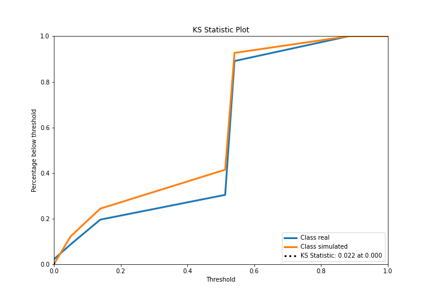

## Precision-Recall Curve

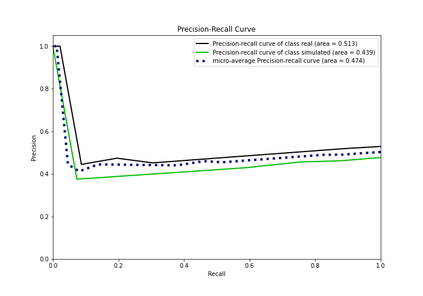

## Calibration Curve

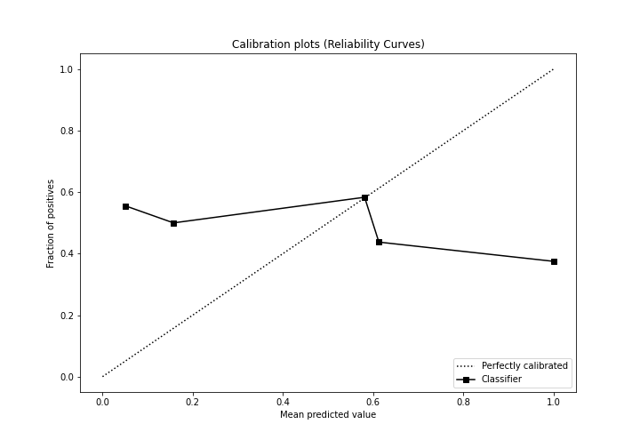

## Cumulative Gains Curve

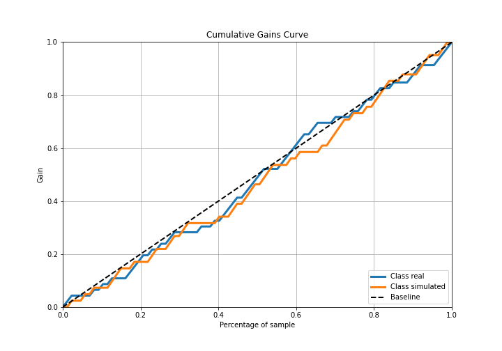

## Lift Curve

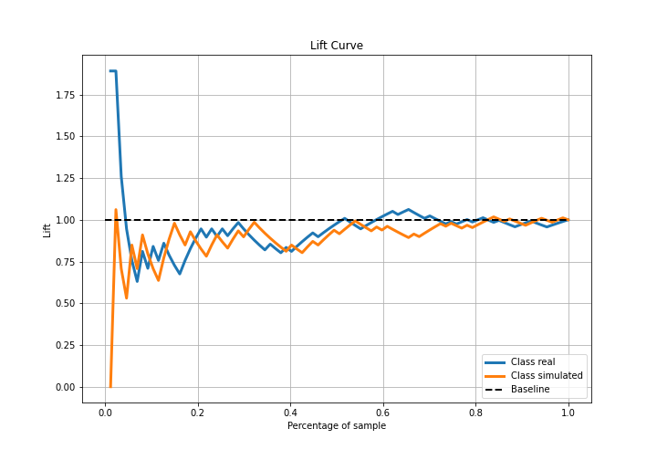

## SHAP Importance
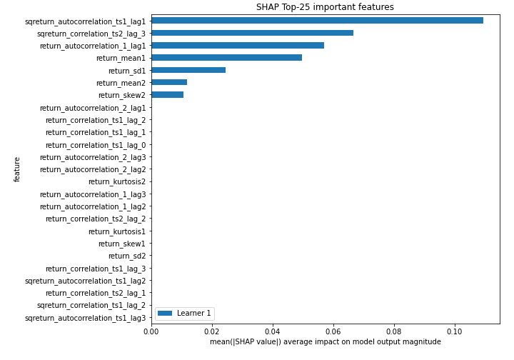

## SHAP Dependence plots

### Dependence (Fold 1)
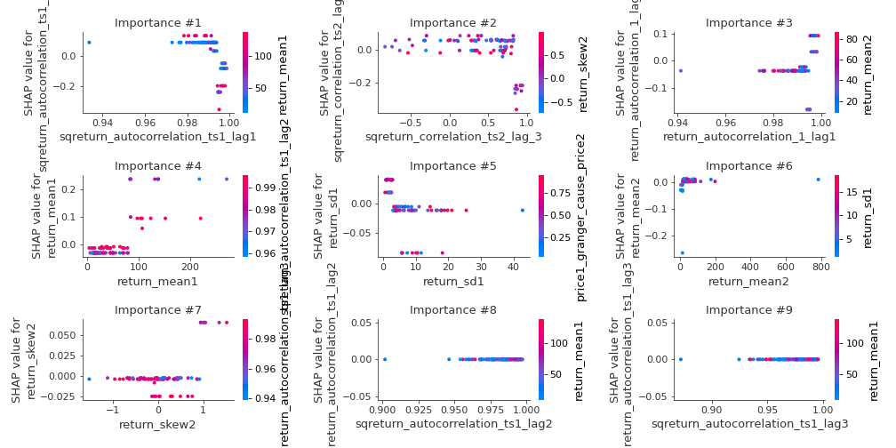

## SHAP Decision plots

### Top-10 Worst decisions for class 0 (Fold 1)
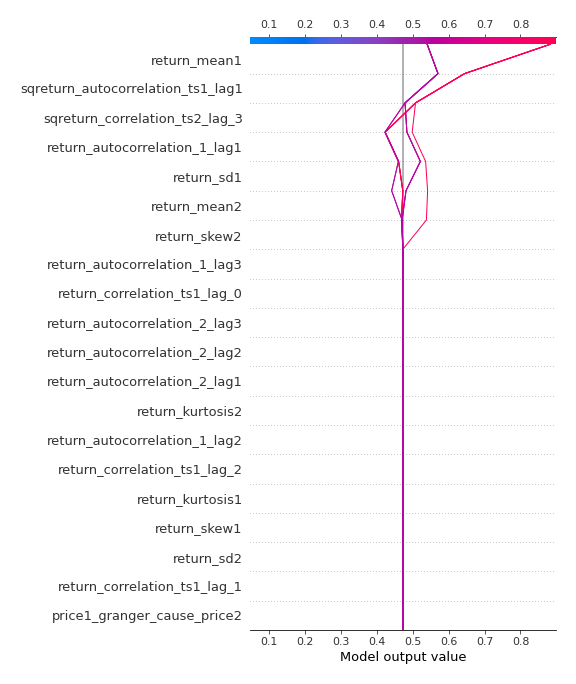
### Top-10 Best decisions for class 0 (Fold 1)
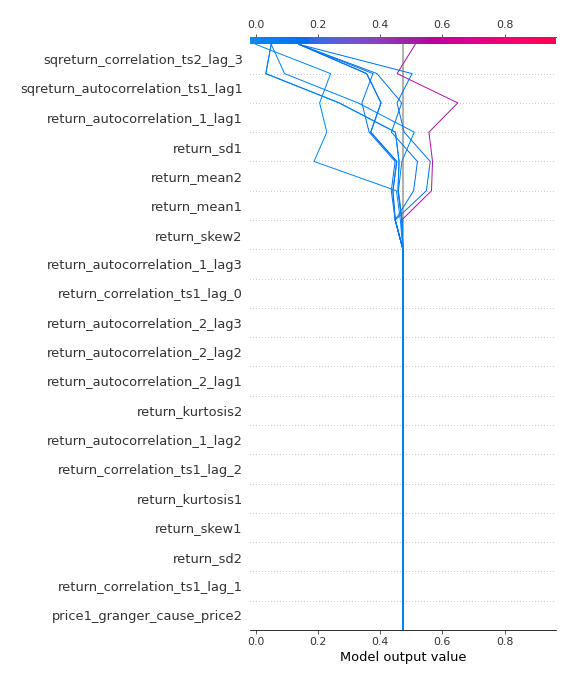
### Top-10 Worst decisions for class 1 (Fold 1)
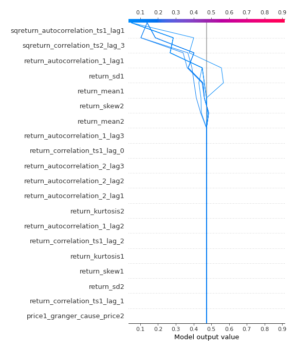
### Top-10 Best decisions for class 1 (Fold 1)
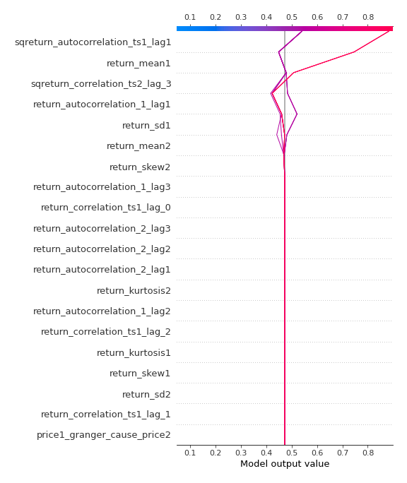

[<< Go back](../README.md)
