# Summary of 3_Linear

[<< Go back](../README.md)

## Logistic Regression (Linear)
- **n_jobs**: -1
- **explain_level**: 2

## Validation
 - **validation_type**: split
 - **train_ratio**: 0.75
 - **shuffle**: True
 - **stratify**: True

## Optimized metric
accuracy

## Training time

3.7 seconds

## Metric details
|           |    score |   threshold |
|:----------|---------:|------------:|
| logloss   | 0.699974 |  nan        |
| auc       | 0.494698 |  nan        |
| f1        | 0.661157 |    0.353098 |
| accuracy  | 0.597701 |    0.539982 |
| precision | 1        |    0.804078 |
| recall    | 1        |    0.146519 |
| mcc       | 0.19461  |    0.353098 |

## Confusion matrix (at threshold=0.539982)
|                      |   Predicted as real |   Predicted as simulated |
|:---------------------|--------------------:|-------------------------:|
| Labeled as real      |                  38 |                        8 |
| Labeled as simulated |                  27 |                       14 |

## Learning curves
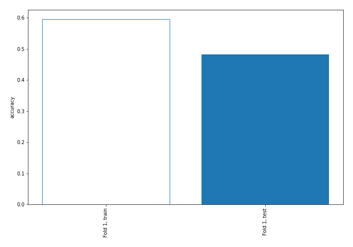

## Coefficients
| feature                           |    Learner_1 |
|:----------------------------------|-------------:|
| sqreturn_autocorrelation_ts2_lag2 |  0.52901     |
| return_autocorrelation_1_lag1     |  0.416851    |
| price2_granger_cause_price1       |  0.381182    |
| return_sd2                        |  0.333569    |
| sqreturn_autocorrelation_ts1_lag1 |  0.28563     |
| return_autocorrelation_2_lag2     |  0.237499    |
| return_mean1                      |  0.155026    |
| intercept                         |  0.109474    |
| return_kurtosis2                  |  0.0594033   |
| sqreturn_correlation_ts1_lag_3    |  0.0462551   |
| return_correlation_ts1_lag_3      |  0.0462551   |
| sqreturn_autocorrelation_ts2_lag3 |  0.0130174   |
| sqreturn_correlation_ts1_lag_2    | -0.000552481 |
| return_correlation_ts1_lag_2      | -0.000552481 |
| sqreturn_autocorrelation_ts2_lag1 | -0.00953725  |
| return_autocorrelation_1_lag2     | -0.0480578   |
| sqreturn_correlation_ts1_lag_1    | -0.0482564   |
| return_correlation_ts1_lag_1      | -0.0482564   |
| return_correlation_ts2_lag_3      | -0.0532341   |
| sqreturn_correlation_ts2_lag_3    | -0.0532341   |
| return_correlation_ts2_lag_2      | -0.0619325   |
| sqreturn_correlation_ts2_lag_2    | -0.0619325   |
| return_correlation_ts2_lag_1      | -0.0765467   |
| sqreturn_correlation_ts2_lag_1    | -0.0765467   |
| return_correlation_ts1_lag_0      | -0.100198    |
| sqreturn_correlation_ts1_lag_0    | -0.100198    |
| return_skew1                      | -0.105144    |
| return_kurtosis1                  | -0.153894    |
| sqreturn_autocorrelation_ts1_lag2 | -0.168976    |
| return_skew2                      | -0.196439    |
| price1_granger_cause_price2       | -0.198922    |
| return_autocorrelation_1_lag3     | -0.209697    |
| return_sd1                        | -0.24132     |
| return_autocorrelation_2_lag1     | -0.281174    |
| return_mean2                      | -0.292062    |
| return_autocorrelation_2_lag3     | -0.34452     |
| sqreturn_autocorrelation_ts1_lag3 | -0.349568    |

## Permutation-based Importance
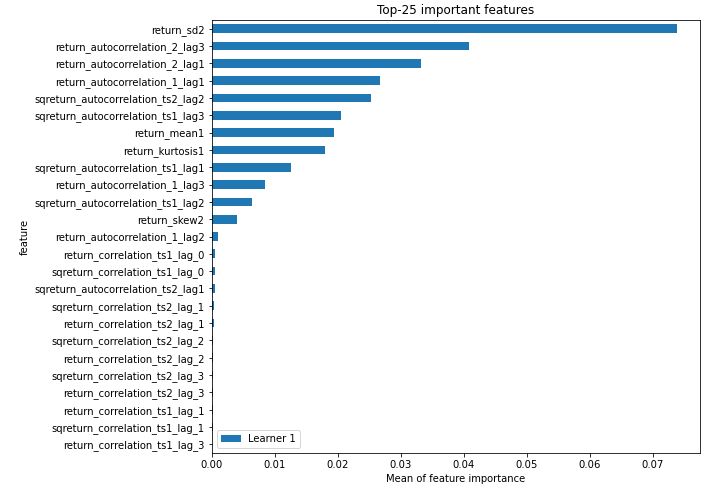
## Confusion Matrix

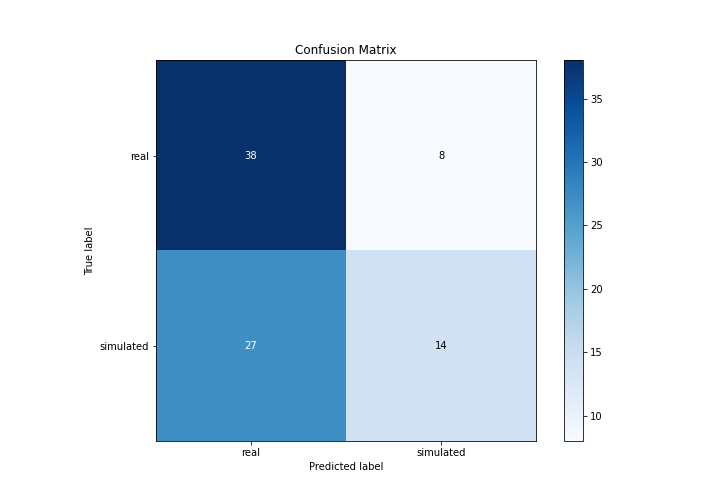

## Normalized Confusion Matrix

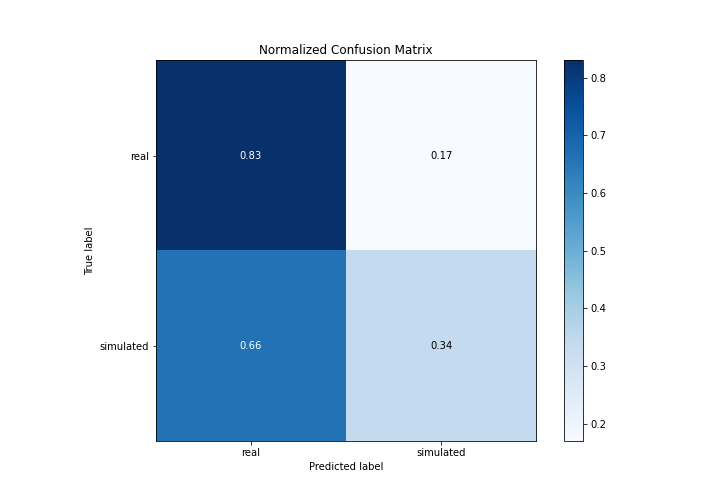

## ROC Curve

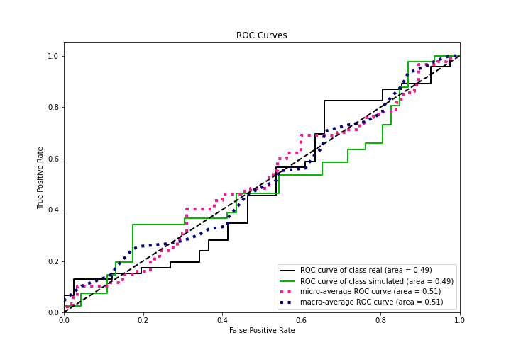

## Kolmogorov-Smirnov Statistic

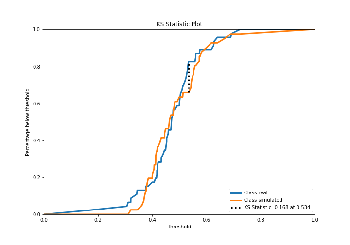

## Precision-Recall Curve

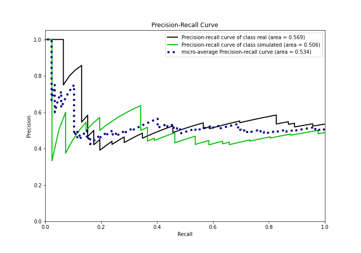

## Calibration Curve

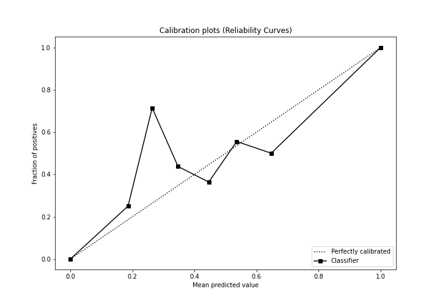

## Cumulative Gains Curve

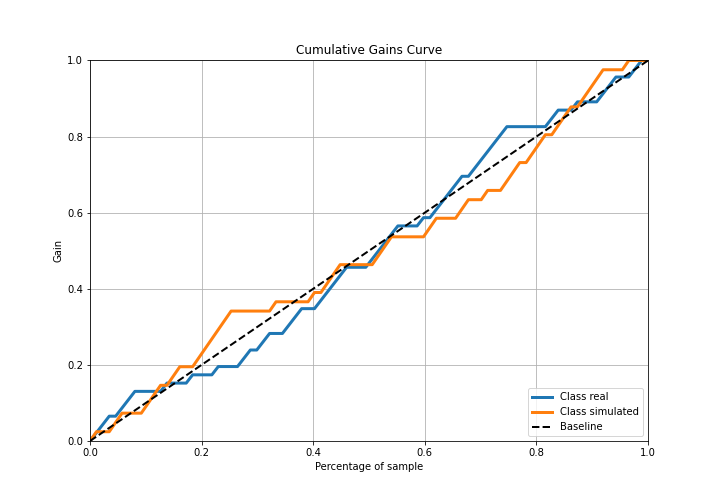

## Lift Curve

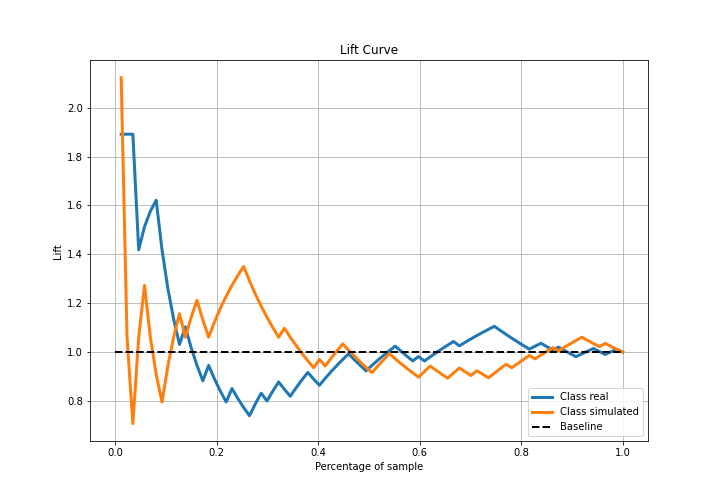

## SHAP Importance
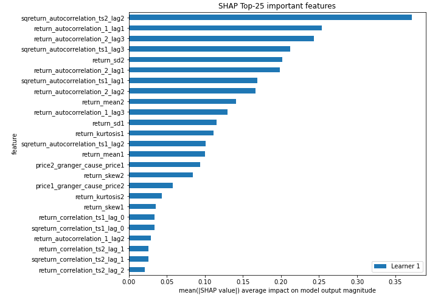

## SHAP Dependence plots

### Dependence (Fold 1)
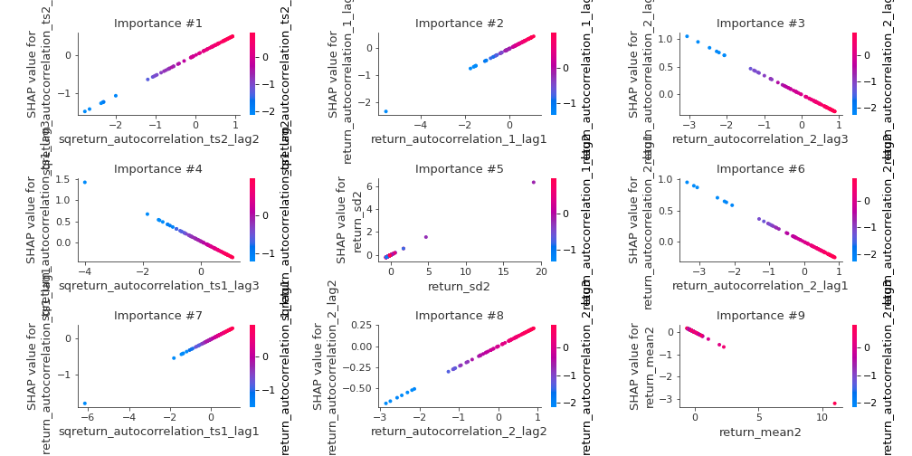

## SHAP Decision plots

### Top-10 Worst decisions for class 0 (Fold 1)
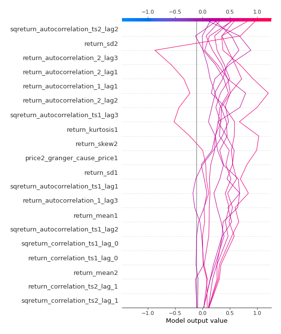
### Top-10 Best decisions for class 0 (Fold 1)
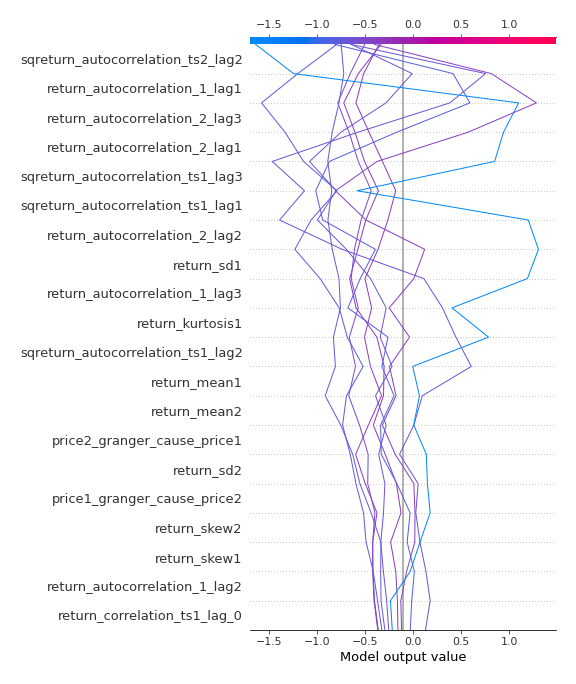
### Top-10 Worst decisions for class 1 (Fold 1)
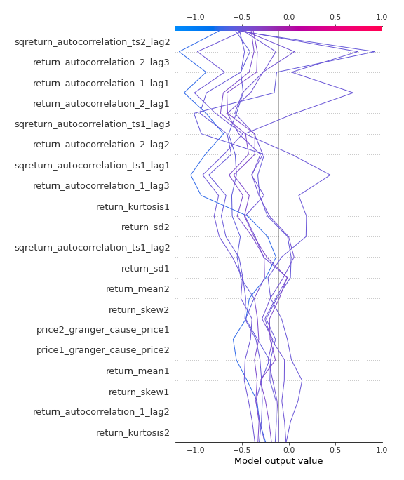
### Top-10 Best decisions for class 1 (Fold 1)
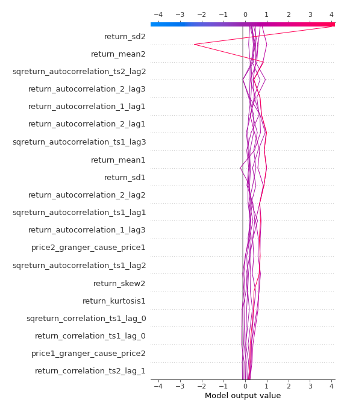

[<< Go back](../README.md)
