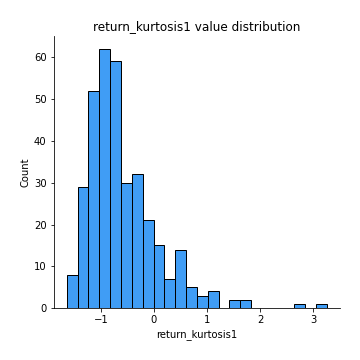
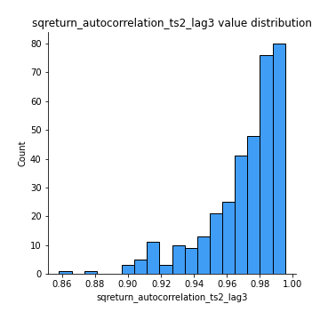

# Exploratory Data Analysis

[<< Go back](../README.md)
## Feature : target
- **Feature type** : categorical
- **Missing** : 0.0%
- **Unique** : 2
- **Count** :347
- **Unique** :2
- **Top** :real
- **Freq** :183

## Feature : return_mean1
- **Feature type** : continous
- **Missing** : 0.0%
- **Unique** : 347
- **Count** :347.0
- **Mean** :50.17706881564842
- **Std** :51.710307041866265
- **Min** :2.041832174
- **25%th Percentile** : 19.299148354
- **50%th Percentile** : 34.72859175999999
- **75%th Percentile** : 64.508805651
- **Max** :514.7209599040001

## Feature : return_mean2
- **Feature type** : continous
- **Missing** : 0.0%
- **Unique** : 347
- **Count** :347.0
- **Mean** :47.02036340165994
- **Std** :72.47757467901621
- **Min** :0.122436238
- **25%th Percentile** : 18.14258697
- **50%th Percentile** : 31.472082032
- **75%th Percentile** : 53.22590675800001
- **Max** :874.655761742

## Feature : return_sd1
- **Feature type** : continous
- **Missing** : 0.0%
- **Unique** : 347
- **Count** :347.0
- **Mean** :7.722114391335226
- **Std** :9.37331553931704
- **Min** :0.17075448275615598
- **25%th Percentile** : 2.5639383057142653
- **50%th Percentile** : 4.833465582681084
- **75%th Percentile** : 9.328399833188204
- **Max** :77.43304734442235

## Feature : return_sd2
- **Feature type** : continous
- **Missing** : 0.0%
- **Unique** : 347
- **Count** :347.0
- **Mean** :7.361649202266235
- **Std** :13.971811607385828
- **Min** :0.06022746901081144
- **25%th Percentile** : 2.5046747322607574
- **50%th Percentile** : 4.517303933428743
- **75%th Percentile** : 7.745925811138173
- **Max** :199.5289511545672

## Feature : return_skew1
- **Feature type** : continous
- **Missing** : 0.0%
- **Unique** : 347
- **Count** :347.0
- **Mean** :0.07495193257811322
- **Std** :0.4878314398622677
- **Min** :-1.2378291916774504
- **25%th Percentile** : -0.24201859836195144
- **50%th Percentile** : 0.041259248876535606
- **75%th Percentile** : 0.42524092849179196
- **Max** :1.5535808520192136

## Feature : return_skew2
- **Feature type** : continous
- **Missing** : 0.0%
- **Unique** : 347
- **Count** :347.0
- **Mean** :0.10807440598770762
- **Std** :0.5226566554812906
- **Min** :-1.6146280688819945
- **25%th Percentile** : -0.24644718996657505
- **50%th Percentile** : 0.06596563232470462
- **75%th Percentile** : 0.4310853773206822
- **Max** :1.8950824286933763

## Feature : return_kurtosis1
- **Feature type** : continous
- **Missing** : 0.0%
- **Unique** : 347
- **Count** :347.0
- **Mean** :-0.5912005965594307
- **Std** :0.6668511245489009
- **Min** :-1.6435775800393035
- **25%th Percentile** : -1.0464434549700496
- **50%th Percentile** : -0.7634880196656297
- **75%th Percentile** : -0.3114823775126927
- **Max** :3.256924497920797

## Feature : return_kurtosis2
- **Feature type** : continous
- **Missing** : 0.0%
- **Unique** : 347
- **Count** :347.0
- **Mean** :-0.5654713064505377
- **Std** :0.7148613471932909
- **Min** :-1.5537576053359181
- **25%th Percentile** : -1.0381620472694992
- **50%th Percentile** : -0.7390830133534658
- **75%th Percentile** : -0.301555775857687
- **Max** :3.67606360130176

## Feature : return_autocorrelation_1_lag1
- **Feature type** : continous
- **Missing** : 0.0%
- **Unique** : 347
- **Count** :347.0
- **Mean** :0.9896270951794126
- **Std** :0.008508538376855668
- **Min** :0.9413419342077411
- **25%th Percentile** : 0.9864816613379321
- **50%th Percentile** : 0.9922473641957136
- **75%th Percentile** : 0.9954574088096227
- **Max** :0.998907093145209

## Feature : return_autocorrelation_1_lag2
- **Feature type** : continous
- **Missing** : 0.0%
- **Unique** : 347
- **Count** :347.0
- **Mean** :0.979934921089732
- **Std** :0.01587186589486563
- **Min** :0.8983702502230806
- **25%th Percentile** : 0.9733637273902273
- **50%th Percentile** : 0.9851589603161475
- **75%th Percentile** : 0.9910266733869681
- **Max** :0.9978622646293857

## Feature : return_autocorrelation_1_lag3
- **Feature type** : continous
- **Missing** : 0.0%
- **Unique** : 347
- **Count** :347.0
- **Mean** :0.9705142500319608
- **Std** :0.023030849541416074
- **Min** :0.8527377034295596
- **25%th Percentile** : 0.96129536548593
- **50%th Percentile** : 0.9779814966559487
- **75%th Percentile** : 0.986808488795984
- **Max** :0.9968227021901522

## Feature : return_autocorrelation_2_lag1
- **Feature type** : continous
- **Missing** : 0.0%
- **Unique** : 347
- **Count** :347.0
- **Mean** :0.9899002922874311
- **Std** :0.008435810131461673
- **Min** :0.9442109633563541
- **25%th Percentile** : 0.9869525097106202
- **50%th Percentile** : 0.9925257031353618
- **75%th Percentile** : 0.9960835026035797
- **Max** :0.9985035871279235

## Feature : return_autocorrelation_2_lag2
- **Feature type** : continous
- **Missing** : 0.0%
- **Unique** : 347
- **Count** :347.0
- **Mean** :0.9804040636244071
- **Std** :0.01606443389899066
- **Min** :0.8945372386327647
- **25%th Percentile** : 0.9739158447765208
- **50%th Percentile** : 0.9855403697530083
- **75%th Percentile** : 0.9921543299087284
- **Max** :0.9970835167082134

## Feature : return_autocorrelation_2_lag3
- **Feature type** : continous
- **Missing** : 0.0%
- **Unique** : 347
- **Count** :347.0
- **Mean** :0.971251694898156
- **Std** :0.02319148784415671
- **Min** :0.8556938656298004
- **25%th Percentile** : 0.9612520847543542
- **50%th Percentile** : 0.9788344843036318
- **75%th Percentile** : 0.9884389923888892
- **Max** :0.9955523041927082

## Feature : return_correlation_ts1_lag_0
- **Feature type** : continous
- **Missing** : 0.0%
- **Unique** : 347
- **Count** :347.0
- **Mean** :0.44236098739833735
- **Std** :0.44210616835955685
- **Min** :-0.8334340537025081
- **25%th Percentile** : 0.14602060754063334
- **50%th Percentile** : 0.5912180765959401
- **75%th Percentile** : 0.7990597593216847
- **Max** :0.9737538981965371

## Feature : return_correlation_ts1_lag_1
- **Feature type** : continous
- **Missing** : 0.0%
- **Unique** : 347
- **Count** :347.0
- **Mean** :0.43917262157269604
- **Std** :0.442505054755907
- **Min** :-0.8346675252923418
- **25%th Percentile** : 0.14370737752104246
- **50%th Percentile** : 0.5971109980852367
- **75%th Percentile** : 0.7959573202903498
- **Max** :0.9711085570505825

## Feature : return_correlation_ts1_lag_2
- **Feature type** : continous
- **Missing** : 0.0%
- **Unique** : 347
- **Count** :347.0
- **Mean** :0.4362534041417191
- **Std** :0.44283413225304114
- **Min** :-0.8367224187341976
- **25%th Percentile** : 0.1428424502214131
- **50%th Percentile** : 0.5903578970505392
- **75%th Percentile** : 0.7951854685976979
- **Max** :0.9689525049465741

## Feature : return_correlation_ts1_lag_3
- **Feature type** : continous
- **Missing** : 0.0%
- **Unique** : 347
- **Count** :347.0
- **Mean** :0.43349687916680024
- **Std** :0.4431628921399098
- **Min** :-0.8388916031002075
- **25%th Percentile** : 0.14248922981612236
- **50%th Percentile** : 0.5815484976458343
- **75%th Percentile** : 0.7913896404971295
- **Max** :0.9661881898387052

## Feature : return_correlation_ts2_lag_1
- **Feature type** : continous
- **Missing** : 0.0%
- **Unique** : 347
- **Count** :347.0
- **Mean** :0.43910354264111034
- **Std** :0.44282437530204605
- **Min** :-0.8337220955797312
- **25%th Percentile** : 0.14797202322907324
- **50%th Percentile** : 0.5903924420731008
- **75%th Percentile** : 0.7967376517921672
- **Max** :0.9724436077344459

## Feature : return_correlation_ts2_lag_2
- **Feature type** : continous
- **Missing** : 0.0%
- **Unique** : 347
- **Count** :347.0
- **Mean** :0.43619412548865105
- **Std** :0.44349794901663125
- **Min** :-0.8344164079788429
- **25%th Percentile** : 0.14612203526542003
- **50%th Percentile** : 0.5844918247272919
- **75%th Percentile** : 0.7956182998381944
- **Max** :0.9717047956671369

## Feature : return_correlation_ts2_lag_3
- **Feature type** : continous
- **Missing** : 0.0%
- **Unique** : 347
- **Count** :347.0
- **Mean** :0.4334486619093506
- **Std** :0.4440731614680215
- **Min** :-0.8357138888028842
- **25%th Percentile** : 0.14418821014236832
- **50%th Percentile** : 0.5762642695524419
- **75%th Percentile** : 0.7941117047265228
- **Max** :0.970545073163944

## Feature : sqreturn_autocorrelation_ts1_lag1
- **Feature type** : continous
- **Missing** : 0.0%
- **Unique** : 347
- **Count** :347.0
- **Mean** :0.9892812704872757
- **Std** :0.008842050057327465
- **Min** :0.9332773406178796
- **25%th Percentile** : 0.9862905190004188
- **50%th Percentile** : 0.9918955783440613
- **75%th Percentile** : 0.9951571068497335
- **Max** :0.9986169228928321

## Feature : sqreturn_autocorrelation_ts1_lag2
- **Feature type** : continous
- **Missing** : 0.0%
- **Unique** : 347
- **Count** :347.0
- **Mean** :0.9793317483447714
- **Std** :0.01620231754156134
- **Min** :0.8823581818725827
- **25%th Percentile** : 0.9724554875130029
- **50%th Percentile** : 0.9837915360716541
- **75%th Percentile** : 0.9907073133060524
- **Max** :0.9972727873616056

## Feature : sqreturn_autocorrelation_ts1_lag3
- **Feature type** : continous
- **Missing** : 0.0%
- **Unique** : 347
- **Count** :347.0
- **Mean** :0.9697154240877659
- **Std** :0.023191718904868666
- **Min** :0.8522889535016422
- **25%th Percentile** : 0.9599936567856553
- **50%th Percentile** : 0.97628853397928
- **75%th Percentile** : 0.9863341421633556
- **Max** :0.9959512789640361

## Feature : sqreturn_autocorrelation_ts2_lag1
- **Feature type** : continous
- **Missing** : 0.0%
- **Unique** : 347
- **Count** :347.0
- **Mean** :0.9894786698271995
- **Std** :0.008526936518639422
- **Min** :0.9458029581929804
- **25%th Percentile** : 0.9865659686381607
- **50%th Percentile** : 0.9922738346847848
- **75%th Percentile** : 0.9958272114054492
- **Max** :0.9986746606786123

## Feature : sqreturn_autocorrelation_ts2_lag2
- **Feature type** : continous
- **Missing** : 0.0%
- **Unique** : 347
- **Count** :347.0
- **Mean** :0.9796221029158615
- **Std** :0.016241300569456326
- **Min** :0.8967532017908393
- **25%th Percentile** : 0.9730444765589232
- **50%th Percentile** : 0.9854332010086267
- **75%th Percentile** : 0.991396374080193
- **Max** :0.9970506340171775

## Feature : sqreturn_autocorrelation_ts2_lag3
- **Feature type** : continous
- **Missing** : 0.0%
- **Unique** : 347
- **Count** :347.0
- **Mean** :0.9701332697523212
- **Std** :0.023413696333828483
- **Min** :0.8580676146054256
- **25%th Percentile** : 0.9601233379107796
- **50%th Percentile** : 0.9783338744037484
- **75%th Percentile** : 0.9872462672184039
- **Max** :0.9954645996237411

## Feature : sqreturn_correlation_ts1_lag_0
- **Feature type** : continous
- **Missing** : 0.0%
- **Unique** : 347
- **Count** :347.0
- **Mean** :0.44236098739833735
- **Std** :0.44210616835955685
- **Min** :-0.8334340537025081
- **25%th Percentile** : 0.14602060754063334
- **50%th Percentile** : 0.5912180765959401
- **75%th Percentile** : 0.7990597593216847
- **Max** :0.9737538981965371

## Feature : sqreturn_correlation_ts1_lag_1
- **Feature type** : continous
- **Missing** : 0.0%
- **Unique** : 347
- **Count** :347.0
- **Mean** :0.43917262157269604
- **Std** :0.442505054755907
- **Min** :-0.8346675252923418
- **25%th Percentile** : 0.14370737752104246
- **50%th Percentile** : 0.5971109980852367
- **75%th Percentile** : 0.7959573202903498
- **Max** :0.9711085570505825

## Feature : sqreturn_correlation_ts1_lag_2
- **Feature type** : continous
- **Missing** : 0.0%
- **Unique** : 347
- **Count** :347.0
- **Mean** :0.4362534041417191
- **Std** :0.44283413225304114
- **Min** :-0.8367224187341976
- **25%th Percentile** : 0.1428424502214131
- **50%th Percentile** : 0.5903578970505392
- **75%th Percentile** : 0.7951854685976979
- **Max** :0.9689525049465741

## Feature : sqreturn_correlation_ts1_lag_3
- **Feature type** : continous
- **Missing** : 0.0%
- **Unique** : 347
- **Count** :347.0
- **Mean** :0.43349687916680024
- **Std** :0.4431628921399098
- **Min** :-0.8388916031002075
- **25%th Percentile** : 0.14248922981612236
- **50%th Percentile** : 0.5815484976458343
- **75%th Percentile** : 0.7913896404971295
- **Max** :0.9661881898387052

## Feature : sqreturn_correlation_ts2_lag_1
- **Feature type** : continous
- **Missing** : 0.0%
- **Unique** : 347
- **Count** :347.0
- **Mean** :0.43910354264111034
- **Std** :0.44282437530204605
- **Min** :-0.8337220955797312
- **25%th Percentile** : 0.14797202322907324
- **50%th Percentile** : 0.5903924420731008
- **75%th Percentile** : 0.7967376517921672
- **Max** :0.9724436077344459

## Feature : sqreturn_correlation_ts2_lag_2
- **Feature type** : continous
- **Missing** : 0.0%
- **Unique** : 347
- **Count** :347.0
- **Mean** :0.43619412548865105
- **Std** :0.44349794901663125
- **Min** :-0.8344164079788429
- **25%th Percentile** : 0.14612203526542003
- **50%th Percentile** : 0.5844918247272919
- **75%th Percentile** : 0.7956182998381944
- **Max** :0.9717047956671369

## Feature : sqreturn_correlation_ts2_lag_3
- **Feature type** : continous
- **Missing** : 0.0%
- **Unique** : 347
- **Count** :347.0
- **Mean** :0.4334486619093506
- **Std** :0.4440731614680215
- **Min** :-0.8357138888028842
- **25%th Percentile** : 0.14418821014236832
- **50%th Percentile** : 0.5762642695524419
- **75%th Percentile** : 0.7941117047265228
- **Max** :0.970545073163944

## Feature : price2_granger_cause_price1
- **Feature type** : continous
- **Missing** : 0.0%
- **Unique** : 347
- **Count** :347.0
- **Mean** :0.39277871869049763
- **Std** :0.2995089167059147
- **Min** :7.442002876220672e-07
- **25%th Percentile** : 0.10358034003159514
- **50%th Percentile** : 0.34475478207291693
- **75%th Percentile** : 0.6536615850205402
- **Max** :0.9991604192257109

## Feature : price1_granger_cause_price2
- **Feature type** : continous
- **Missing** : 0.0%
- **Unique** : 347
- **Count** :347.0
- **Mean** :0.40211580438312006
- **Std** :0.3113955492327281
- **Min** :1.6674455312589196e-07
- **25%th Percentile** : 0.1131780977884019
- **50%th Percentile** : 0.341661274740061
- **75%th Percentile** : 0.651707323333732
- **Max** :0.9987360641740829

[<< Go back](../README.md)
