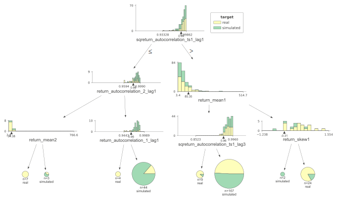
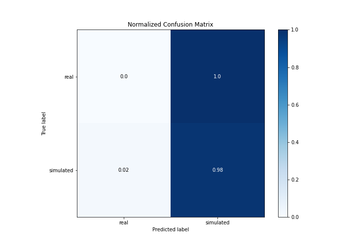

# Summary of 2_DecisionTree

[<< Go back](../README.md)

## Decision Tree
- **n_jobs**: -1
- **criterion**: gini
- **max_depth**: 3
- **explain_level**: 2

## Validation
 - **validation_type**: split
 - **train_ratio**: 0.75
 - **shuffle**: True
 - **stratify**: True

## Optimized metric
accuracy

## Training time

5.3 seconds

## Metric details
|           |    score |   threshold |
|:----------|---------:|------------:|
| logloss   | 1.16095  |         nan |
| auc       | 0.465381 |         nan |
| f1        | 0.661538 |           0 |
| accuracy  | 0.494253 |           0 |
| precision | 0.5      |           0 |
| recall    | 0.977273 |           0 |
| mcc       | 0        |           0 |

## Confusion matrix (at threshold=0.0)
|                      |   Predicted as real |   Predicted as simulated |
|:---------------------|--------------------:|-------------------------:|
| Labeled as real      |                   0 |                       43 |
| Labeled as simulated |                   1 |                       43 |

## Learning curves

## Decision Tree 

### Tree #1

### Rules

if (sqreturn_autocorrelation_ts1_lag1 > 0.984) and (return_mean1 <= 85.353) and (sqreturn_autocorrelation_ts1_lag3 > 0.959) then class: simulated (proba: 50.9%) | based on 167 samples

if (sqreturn_autocorrelation_ts1_lag1 <= 0.984) and (return_autocorrelation_2_lag1 > 0.982) and (return_autocorrelation_1_lag1 > 0.964) then class: simulated (proba: 86.36%) | based on 44 samples

if (sqreturn_autocorrelation_ts1_lag1 > 0.984) and (return_mean1 > 85.353) and (return_skew1 > -0.308) then class: real (proba: 83.33%) | based on 24 samples

if (sqreturn_autocorrelation_ts1_lag1 > 0.984) and (return_mean1 <= 85.353) and (sqreturn_autocorrelation_ts1_lag3 <= 0.959) then class: real (proba: 88.89%) | based on 9 samples

if (sqreturn_autocorrelation_ts1_lag1 <= 0.984) and (return_autocorrelation_2_lag1 <= 0.982) and (return_mean2 <= 34.377) then class: real (proba: 100.0%) | based on 7 samples

if (sqreturn_autocorrelation_ts1_lag1 <= 0.984) and (return_autocorrelation_2_lag1 > 0.982) and (return_autocorrelation_1_lag1 <= 0.964) then class: real (proba: 100.0%) | based on 4 samples

if (sqreturn_autocorrelation_ts1_lag1 <= 0.984) and (return_autocorrelation_2_lag1 <= 0.982) and (return_mean2 > 34.377) then class: simulated (proba: 66.67%) | based on 3 samples

if (sqreturn_autocorrelation_ts1_lag1 > 0.984) and (return_mean1 > 85.353) and (return_skew1 <= -0.308) then class: simulated (proba: 100.0%) | based on 2 samples

## Permutation-based Importance

## Confusion Matrix

## Normalized Confusion Matrix

## ROC Curve

## Kolmogorov-Smirnov Statistic

## Precision-Recall Curve

## Calibration Curve

## Cumulative Gains Curve

## Lift Curve

## SHAP Importance

## SHAP Dependence plots

### Dependence (Fold 1)

## SHAP Decision plots

### Top-10 Worst decisions for class 0 (Fold 1)

### Top-10 Best decisions for class 0 (Fold 1)

### Top-10 Worst decisions for class 1 (Fold 1)

### Top-10 Best decisions for class 1 (Fold 1)

[<< Go back](../README.md)
