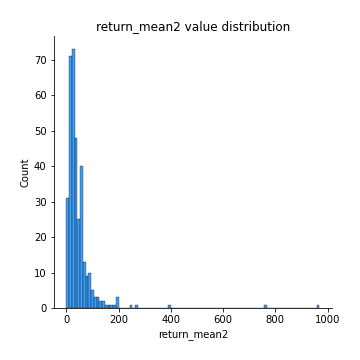
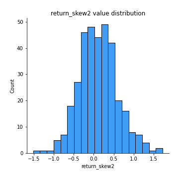
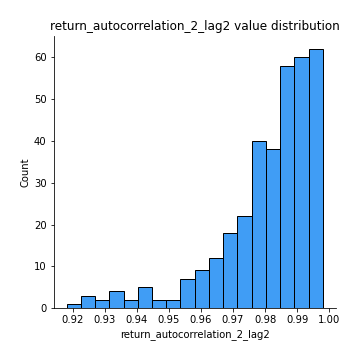

# Exploratory Data Analysis

[<< Go back](../README.md)
## Feature : target
- **Feature type** : categorical
- **Missing** : 0.0%
- **Unique** : 2
- **Count** :347
- **Unique** :2
- **Top** :simulated
- **Freq** :176

## Feature : return_mean1
- **Feature type** : continous
- **Missing** : 0.0%
- **Unique** : 347
- **Count** :347.0
- **Mean** :49.46658236013833
- **Std** :50.08480238620185
- **Min** :3.44340636
- **25%th Percentile** : 19.331974379000002
- **50%th Percentile** : 36.561724144
- **75%th Percentile** : 61.856406304000004
- **Max** :514.7209599040001

## Feature : return_mean2
- **Feature type** : continous
- **Missing** : 0.0%
- **Unique** : 347
- **Count** :347.0
- **Mean** :47.94291709868011
- **Std** :75.52012458557842
- **Min** :0.122436238
- **25%th Percentile** : 18.211550752999997
- **50%th Percentile** : 31.472082032
- **75%th Percentile** : 55.526416899
- **Max** :968.654841336

## Feature : return_sd1
- **Feature type** : continous
- **Missing** : 0.0%
- **Unique** : 347
- **Count** :347.0
- **Mean** :7.996039586636591
- **Std** :11.601851250521745
- **Min** :0.5131959878985739
- **25%th Percentile** : 2.592515665408084
- **50%th Percentile** : 4.792644063807213
- **75%th Percentile** : 9.02353686465043
- **Max** :113.75913244339056

## Feature : return_sd2
- **Feature type** : continous
- **Missing** : 0.0%
- **Unique** : 347
- **Count** :347.0
- **Mean** :7.632718749699435
- **Std** :15.128959670673243
- **Min** :0.06022746901081144
- **25%th Percentile** : 2.4831537735069675
- **50%th Percentile** : 4.809286892324796
- **75%th Percentile** : 7.986177246208721
- **Max** :221.10527467938883

## Feature : return_skew1
- **Feature type** : continous
- **Missing** : 0.0%
- **Unique** : 347
- **Count** :347.0
- **Mean** :0.10210816233585852
- **Std** :0.48749083941486254
- **Min** :-1.2969383077901073
- **25%th Percentile** : -0.21130684546887052
- **50%th Percentile** : 0.057700140495764114
- **75%th Percentile** : 0.4300383037228128
- **Max** :1.5535808520192136

## Feature : return_skew2
- **Feature type** : continous
- **Missing** : 0.0%
- **Unique** : 347
- **Count** :347.0
- **Mean** :0.10544842760713453
- **Std** :0.4843801056935225
- **Min** :-1.5143013373937064
- **25%th Percentile** : -0.20937413144859002
- **50%th Percentile** : 0.08686451183489
- **75%th Percentile** : 0.404050660835458
- **Max** :1.723087490745204

## Feature : return_kurtosis1
- **Feature type** : continous
- **Missing** : 0.0%
- **Unique** : 347
- **Count** :347.0
- **Mean** :-0.5903747255299991
- **Std** :0.6471922301055836
- **Min** :-1.6435775800393035
- **25%th Percentile** : -0.9947037606156133
- **50%th Percentile** : -0.7264159460804871
- **75%th Percentile** : -0.35391551537517607
- **Max** :3.256924497920797

## Feature : return_kurtosis2
- **Feature type** : continous
- **Missing** : 0.0%
- **Unique** : 347
- **Count** :347.0
- **Mean** :-0.6281751489742187
- **Std** :0.6508087128796259
- **Min** :-1.5537576053359181
- **25%th Percentile** : -1.0626922107440762
- **50%th Percentile** : -0.7767073920885448
- **75%th Percentile** : -0.390574924931671
- **Max** :3.67606360130176

## Feature : return_autocorrelation_1_lag1
- **Feature type** : continous
- **Missing** : 0.0%
- **Unique** : 347
- **Count** :347.0
- **Mean** :0.9894844262486352
- **Std** :0.008352035191687824
- **Min** :0.9442938941999663
- **25%th Percentile** : 0.9856774736595177
- **50%th Percentile** : 0.9922732248403382
- **75%th Percentile** : 0.995498437751715
- **Max** :0.998907093145209

## Feature : return_autocorrelation_1_lag2
- **Feature type** : continous
- **Missing** : 0.0%
- **Unique** : 347
- **Count** :347.0
- **Mean** :0.9795476948372601
- **Std** :0.016047765662332614
- **Min** :0.8983702502230806
- **25%th Percentile** : 0.972116359297114
- **50%th Percentile** : 0.9849056509540868
- **75%th Percentile** : 0.9911525324435311
- **Max** :0.9978622646293857

## Feature : return_autocorrelation_1_lag3
- **Feature type** : continous
- **Missing** : 0.0%
- **Unique** : 347
- **Count** :347.0
- **Mean** :0.9698917118222501
- **Std** :0.02356075731402991
- **Min** :0.8527377034295596
- **25%th Percentile** : 0.9596122679611915
- **50%th Percentile** : 0.9780181642281258
- **75%th Percentile** : 0.987183874353809
- **Max** :0.9968227021901522

## Feature : return_autocorrelation_2_lag1
- **Feature type** : continous
- **Missing** : 0.0%
- **Unique** : 347
- **Count** :347.0
- **Mean** :0.9901468476244973
- **Std** :0.00799087404653776
- **Min** :0.9535838386842562
- **25%th Percentile** : 0.987518557787399
- **50%th Percentile** : 0.9922008426486738
- **75%th Percentile** : 0.9959410263903791
- **Max** :0.9990075551978286

## Feature : return_autocorrelation_2_lag2
- **Feature type** : continous
- **Missing** : 0.0%
- **Unique** : 347
- **Count** :347.0
- **Mean** :0.9808720126398977
- **Std** :0.015135476251685702
- **Min** :0.9181007061137118
- **25%th Percentile** : 0.9754904097141466
- **50%th Percentile** : 0.9850000297668248
- **75%th Percentile** : 0.9919024171985136
- **Max** :0.9980152731102225

## Feature : return_autocorrelation_2_lag3
- **Feature type** : continous
- **Missing** : 0.0%
- **Unique** : 347
- **Count** :347.0
- **Mean** :0.9717814411183164
- **Std** :0.022230686924564164
- **Min** :0.8783385001119621
- **25%th Percentile** : 0.9635529012387873
- **50%th Percentile** : 0.9778255313154667
- **75%th Percentile** : 0.9880171835027574
- **Max** :0.9970922117201266

## Feature : return_correlation_ts1_lag_0
- **Feature type** : continous
- **Missing** : 0.0%
- **Unique** : 347
- **Count** :347.0
- **Mean** :0.425498012532866
- **Std** :0.46479546110180997
- **Min** :-0.9454212056869181
- **25%th Percentile** : 0.14099447757294248
- **50%th Percentile** : 0.5559641740861027
- **75%th Percentile** : 0.7986217066024628
- **Max** :0.9657060675245052

## Feature : return_correlation_ts1_lag_1
- **Feature type** : continous
- **Missing** : 0.0%
- **Unique** : 347
- **Count** :347.0
- **Mean** :0.42221304702562606
- **Std** :0.464956547792668
- **Min** :-0.9452305740471955
- **25%th Percentile** : 0.13477839626787497
- **50%th Percentile** : 0.5478667532470592
- **75%th Percentile** : 0.7924694714502497
- **Max** :0.9655060959411687

## Feature : return_correlation_ts1_lag_2
- **Feature type** : continous
- **Missing** : 0.0%
- **Unique** : 347
- **Count** :347.0
- **Mean** :0.41927788623370416
- **Std** :0.4650643088405956
- **Min** :-0.9451440682595582
- **25%th Percentile** : 0.12834048307319912
- **50%th Percentile** : 0.5440053163619418
- **75%th Percentile** : 0.7911730870747586
- **Max** :0.9655528894956359

## Feature : return_correlation_ts1_lag_3
- **Feature type** : continous
- **Missing** : 0.0%
- **Unique** : 347
- **Count** :347.0
- **Mean** :0.41645969422453255
- **Std** :0.46519717313517095
- **Min** :-0.9448708035067677
- **25%th Percentile** : 0.11891258371405013
- **50%th Percentile** : 0.5444787334737557
- **75%th Percentile** : 0.7890441853956336
- **Max** :0.965480488388089

## Feature : return_correlation_ts2_lag_1
- **Feature type** : continous
- **Missing** : 0.0%
- **Unique** : 347
- **Count** :347.0
- **Mean** :0.42224412527802546
- **Std** :0.4653670304052053
- **Min** :-0.9457910375143614
- **25%th Percentile** : 0.14275682092313224
- **50%th Percentile** : 0.5507055052941564
- **75%th Percentile** : 0.7959177347302784
- **Max** :0.9653492015905041

## Feature : return_correlation_ts2_lag_2
- **Feature type** : continous
- **Missing** : 0.0%
- **Unique** : 347
- **Count** :347.0
- **Mean** :0.4192854807896939
- **Std** :0.46592950975885283
- **Min** :-0.9463260196248172
- **25%th Percentile** : 0.14037520622372546
- **50%th Percentile** : 0.5496600438848293
- **75%th Percentile** : 0.7936158043890195
- **Max** :0.9648220784284761

## Feature : return_correlation_ts2_lag_3
- **Feature type** : continous
- **Missing** : 0.0%
- **Unique** : 347
- **Count** :347.0
- **Mean** :0.41643051969335093
- **Std** :0.46643781038739546
- **Min** :-0.9467149428568907
- **25%th Percentile** : 0.13839632939712615
- **50%th Percentile** : 0.5456599085681751
- **75%th Percentile** : 0.7911223631647015
- **Max** :0.9641714645667581

## Feature : sqreturn_autocorrelation_ts1_lag1
- **Feature type** : continous
- **Missing** : 0.0%
- **Unique** : 347
- **Count** :347.0
- **Mean** :0.9891312797464329
- **Std** :0.008570305326559127
- **Min** :0.9332773406178796
- **25%th Percentile** : 0.9853518387478248
- **50%th Percentile** : 0.9917593745445706
- **75%th Percentile** : 0.9953649101152419
- **Max** :0.9986169228928321

## Feature : sqreturn_autocorrelation_ts1_lag2
- **Feature type** : continous
- **Missing** : 0.0%
- **Unique** : 347
- **Count** :347.0
- **Mean** :0.9788853464097426
- **Std** :0.016313722602968126
- **Min** :0.8823581818725827
- **25%th Percentile** : 0.9713780342147852
- **50%th Percentile** : 0.9836581284990844
- **75%th Percentile** : 0.9910743612231226
- **Max** :0.9972727873616056

## Feature : sqreturn_autocorrelation_ts1_lag3
- **Feature type** : continous
- **Missing** : 0.0%
- **Unique** : 347
- **Count** :347.0
- **Mean** :0.9690068730314765
- **Std** :0.02365981695665849
- **Min** :0.8522889535016422
- **25%th Percentile** : 0.9586880396432913
- **50%th Percentile** : 0.9760764117143169
- **75%th Percentile** : 0.9866809362994531
- **Max** :0.9959512789640361

## Feature : sqreturn_autocorrelation_ts2_lag1
- **Feature type** : continous
- **Missing** : 0.0%
- **Unique** : 347
- **Count** :347.0
- **Mean** :0.9898160048839986
- **Std** :0.007952161864233573
- **Min** :0.954192546987486
- **25%th Percentile** : 0.9872914229042546
- **50%th Percentile** : 0.9918717387673527
- **75%th Percentile** : 0.9955760169426188
- **Max** :0.9988745118390566

## Feature : sqreturn_autocorrelation_ts2_lag2
- **Feature type** : continous
- **Missing** : 0.0%
- **Unique** : 347
- **Count** :347.0
- **Mean** :0.98024517106341
- **Std** :0.015071947860704205
- **Min** :0.9171334422938444
- **25%th Percentile** : 0.9748879963300385
- **50%th Percentile** : 0.9842129720458707
- **75%th Percentile** : 0.9911795026912724
- **Max** :0.9976921088288594

## Feature : sqreturn_autocorrelation_ts2_lag3
- **Feature type** : continous
- **Missing** : 0.0%
- **Unique** : 347
- **Count** :347.0
- **Mean** :0.9708649642786713
- **Std** :0.022151264728528325
- **Min** :0.8766322531820853
- **25%th Percentile** : 0.9622190496816752
- **50%th Percentile** : 0.976753205855147
- **75%th Percentile** : 0.9870201218402328
- **Max** :0.9965698341282454

## Feature : sqreturn_correlation_ts1_lag_0
- **Feature type** : continous
- **Missing** : 0.0%
- **Unique** : 347
- **Count** :347.0
- **Mean** :0.425498012532866
- **Std** :0.46479546110180997
- **Min** :-0.9454212056869181
- **25%th Percentile** : 0.14099447757294248
- **50%th Percentile** : 0.5559641740861027
- **75%th Percentile** : 0.7986217066024628
- **Max** :0.9657060675245052

## Feature : sqreturn_correlation_ts1_lag_1
- **Feature type** : continous
- **Missing** : 0.0%
- **Unique** : 347
- **Count** :347.0
- **Mean** :0.42221304702562606
- **Std** :0.464956547792668
- **Min** :-0.9452305740471955
- **25%th Percentile** : 0.13477839626787497
- **50%th Percentile** : 0.5478667532470592
- **75%th Percentile** : 0.7924694714502497
- **Max** :0.9655060959411687

## Feature : sqreturn_correlation_ts1_lag_2
- **Feature type** : continous
- **Missing** : 0.0%
- **Unique** : 347
- **Count** :347.0
- **Mean** :0.41927788623370416
- **Std** :0.4650643088405956
- **Min** :-0.9451440682595582
- **25%th Percentile** : 0.12834048307319912
- **50%th Percentile** : 0.5440053163619418
- **75%th Percentile** : 0.7911730870747586
- **Max** :0.9655528894956359

## Feature : sqreturn_correlation_ts1_lag_3
- **Feature type** : continous
- **Missing** : 0.0%
- **Unique** : 347
- **Count** :347.0
- **Mean** :0.41645969422453255
- **Std** :0.46519717313517095
- **Min** :-0.9448708035067677
- **25%th Percentile** : 0.11891258371405013
- **50%th Percentile** : 0.5444787334737557
- **75%th Percentile** : 0.7890441853956336
- **Max** :0.965480488388089

## Feature : sqreturn_correlation_ts2_lag_1
- **Feature type** : continous
- **Missing** : 0.0%
- **Unique** : 347
- **Count** :347.0
- **Mean** :0.42224412527802546
- **Std** :0.4653670304052053
- **Min** :-0.9457910375143614
- **25%th Percentile** : 0.14275682092313224
- **50%th Percentile** : 0.5507055052941564
- **75%th Percentile** : 0.7959177347302784
- **Max** :0.9653492015905041

## Feature : sqreturn_correlation_ts2_lag_2
- **Feature type** : continous
- **Missing** : 0.0%
- **Unique** : 347
- **Count** :347.0
- **Mean** :0.4192854807896939
- **Std** :0.46592950975885283
- **Min** :-0.9463260196248172
- **25%th Percentile** : 0.14037520622372546
- **50%th Percentile** : 0.5496600438848293
- **75%th Percentile** : 0.7936158043890195
- **Max** :0.9648220784284761

## Feature : sqreturn_correlation_ts2_lag_3
- **Feature type** : continous
- **Missing** : 0.0%
- **Unique** : 347
- **Count** :347.0
- **Mean** :0.41643051969335093
- **Std** :0.46643781038739546
- **Min** :-0.9467149428568907
- **25%th Percentile** : 0.13839632939712615
- **50%th Percentile** : 0.5456599085681751
- **75%th Percentile** : 0.7911223631647015
- **Max** :0.9641714645667581

## Feature : price2_granger_cause_price1
- **Feature type** : continous
- **Missing** : 0.0%
- **Unique** : 347
- **Count** :347.0
- **Mean** :0.4031305164801919
- **Std** :0.30828715813247537
- **Min** :7.442002876220672e-07
- **25%th Percentile** : 0.10924268211544036
- **50%th Percentile** : 0.34475478207291693
- **75%th Percentile** : 0.6926154076671086
- **Max** :0.9991604192257109

## Feature : price1_granger_cause_price2
- **Feature type** : continous
- **Missing** : 0.0%
- **Unique** : 347
- **Count** :347.0
- **Mean** :0.3926100431668031
- **Std** :0.31484798138067616
- **Min** :1.6674455312589196e-07
- **25%th Percentile** : 0.10699897947342253
- **50%th Percentile** : 0.32373959404900854
- **75%th Percentile** : 0.651889332218796
- **Max** :0.9969138565505037

[<< Go back](../README.md)
