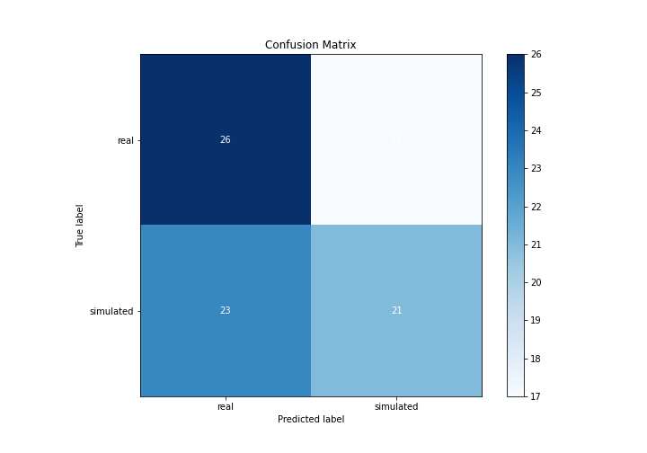

# Summary of Ensemble

[<< Go back](../README.md)

## Ensemble structure
| Model                  |   Weight |
|:-----------------------|---------:|
| 2_DecisionTree         |        1 |
| 6_Default_RandomForest |        1 |

## Metric details
|           |     score |   threshold |
|:----------|----------:|------------:|
| logloss   | 0.800031  |  nan        |
| auc       | 0.475687  |  nan        |
| f1        | 0.671756  |    0.153716 |
| accuracy  | 0.54023   |    0.495128 |
| precision | 0.552632  |    0.495128 |
| recall    | 1         |    0.153716 |
| mcc       | 0.0825812 |    0.495128 |

## Confusion matrix (at threshold=0.495128)
|                      |   Predicted as real |   Predicted as simulated |
|:---------------------|--------------------:|-------------------------:|
| Labeled as real      |                  26 |                       17 |
| Labeled as simulated |                  23 |                       21 |

## Learning curves

## Confusion Matrix

## Normalized Confusion Matrix

## ROC Curve

## Kolmogorov-Smirnov Statistic

## Precision-Recall Curve

## Calibration Curve

## Cumulative Gains Curve

## Lift Curve

[<< Go back](../README.md)
