# Summary of 3_Linear

[<< Go back](../README.md)

## Logistic Regression (Linear)
- **n_jobs**: -1
- **explain_level**: 2

## Validation
 - **validation_type**: split
 - **train_ratio**: 0.75
 - **shuffle**: True
 - **stratify**: True

## Optimized metric
accuracy

## Training time

6.0 seconds

## Metric details
|           |    score |   threshold |
|:----------|---------:|------------:|
| logloss   | 0.714978 |  nan        |
| auc       | 0.504228 |  nan        |
| f1        | 0.666667 |    0.390006 |
| accuracy  | 0.551724 |    0.490881 |
| precision | 0.588235 |    0.564526 |
| recall    | 1        |    0.10296  |
| mcc       | 0.123381 |    0.390006 |

## Confusion matrix (at threshold=0.490881)
|                      |   Predicted as real |   Predicted as simulated |
|:---------------------|--------------------:|-------------------------:|
| Labeled as real      |                  21 |                       23 |
| Labeled as simulated |                  16 |                       27 |

## Learning curves
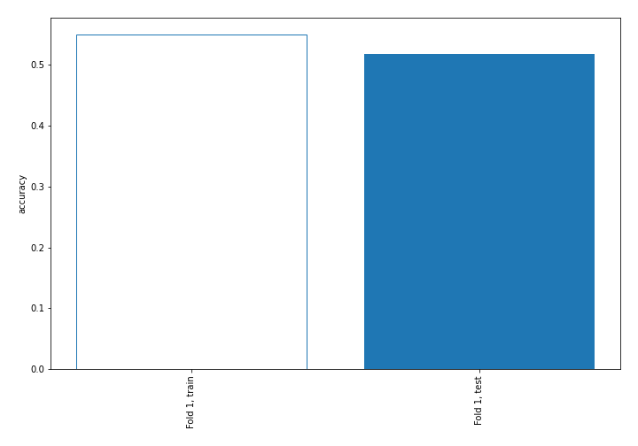

## Coefficients
| feature                           |   Learner_1 |
|:----------------------------------|------------:|
| sqreturn_autocorrelation_ts2_lag2 |  0.49158    |
| sqreturn_autocorrelation_ts1_lag1 |  0.382458   |
| return_autocorrelation_2_lag2     |  0.329163   |
| price1_granger_cause_price2       |  0.284491   |
| sqreturn_autocorrelation_ts1_lag2 |  0.157435   |
| return_mean1                      |  0.15175    |
| intercept                         |  0.119991   |
| return_correlation_ts1_lag_3      |  0.0881852  |
| sqreturn_correlation_ts1_lag_3    |  0.0881852  |
| return_kurtosis2                  |  0.0623865  |
| return_autocorrelation_1_lag1     |  0.0560477  |
| sqreturn_correlation_ts1_lag_2    |  0.0504403  |
| return_correlation_ts1_lag_2      |  0.0504403  |
| sqreturn_correlation_ts1_lag_1    | -0.00532449 |
| return_correlation_ts1_lag_1      | -0.00532449 |
| sqreturn_autocorrelation_ts2_lag1 | -0.0381074  |
| sqreturn_correlation_ts2_lag_2    | -0.0680056  |
| return_correlation_ts2_lag_2      | -0.0680056  |
| return_correlation_ts2_lag_3      | -0.0685531  |
| sqreturn_correlation_ts2_lag_3    | -0.0685531  |
| return_autocorrelation_1_lag2     | -0.0723831  |
| return_kurtosis1                  | -0.0736306  |
| sqreturn_correlation_ts1_lag_0    | -0.0741032  |
| return_correlation_ts1_lag_0      | -0.0741032  |
| return_correlation_ts2_lag_1      | -0.0749812  |
| sqreturn_correlation_ts2_lag_1    | -0.0749812  |
| return_autocorrelation_2_lag1     | -0.0965176  |
| return_sd2                        | -0.0990086  |
| return_mean2                      | -0.117445   |
| return_skew2                      | -0.125207   |
| sqreturn_autocorrelation_ts1_lag3 | -0.18462    |
| sqreturn_autocorrelation_ts2_lag3 | -0.194157   |
| return_skew1                      | -0.2125     |
| price2_granger_cause_price1       | -0.23643    |
| return_sd1                        | -0.241498   |
| return_autocorrelation_1_lag3     | -0.331417   |
| return_autocorrelation_2_lag3     | -0.343926   |

## Permutation-based Importance
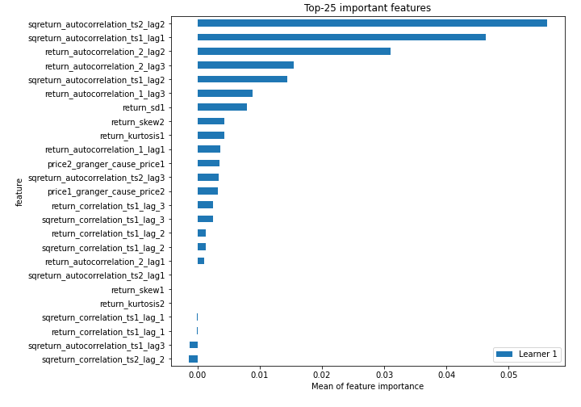
## Confusion Matrix

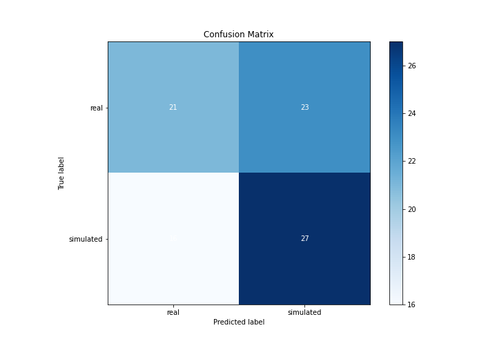

## Normalized Confusion Matrix

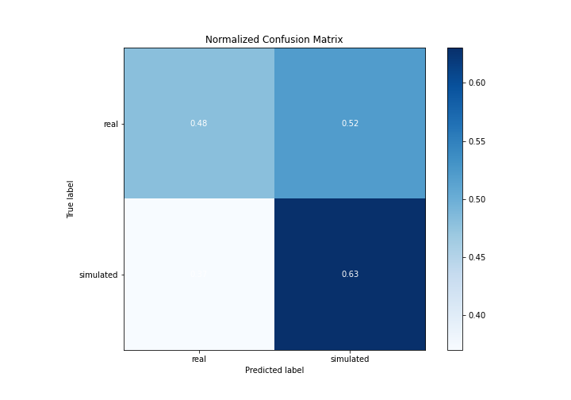

## ROC Curve

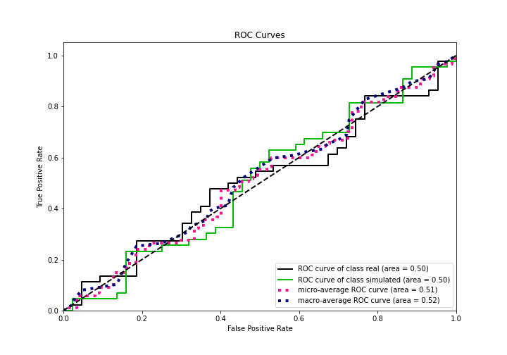

## Kolmogorov-Smirnov Statistic

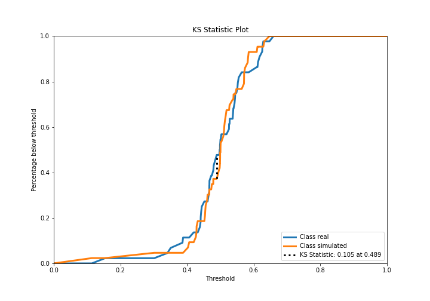

## Precision-Recall Curve

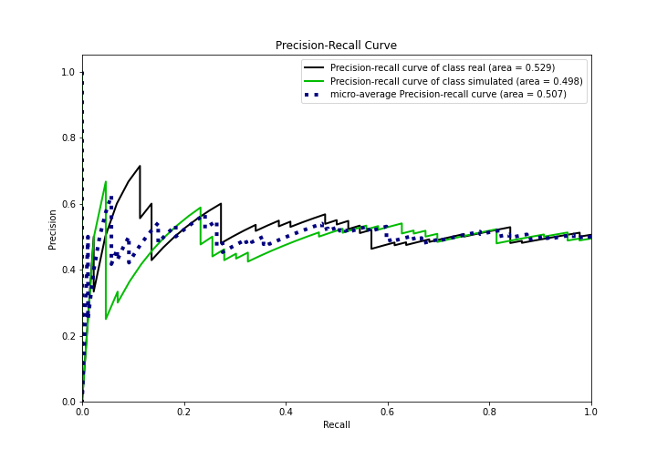

## Calibration Curve

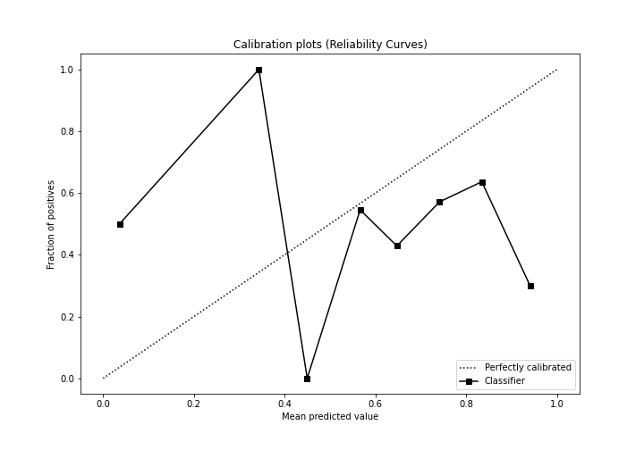

## Cumulative Gains Curve

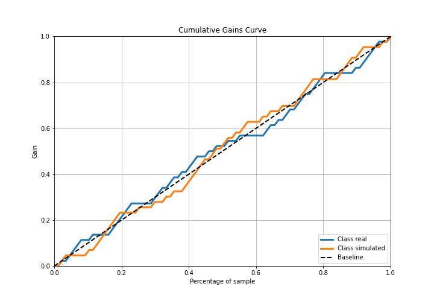

## Lift Curve

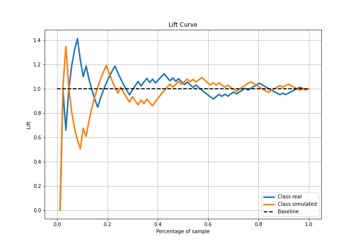

## SHAP Importance
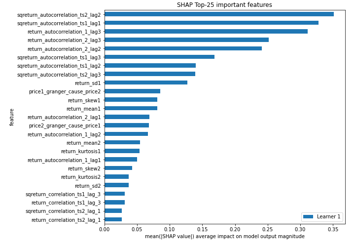

## SHAP Dependence plots

### Dependence (Fold 1)
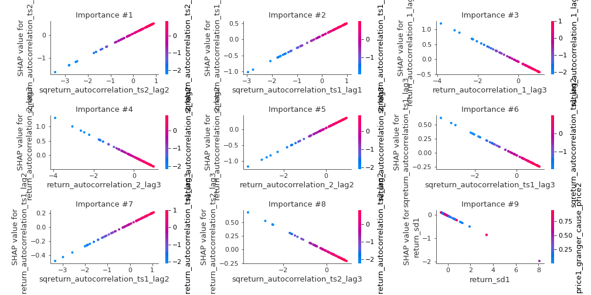

## SHAP Decision plots

### Top-10 Worst decisions for class 0 (Fold 1)
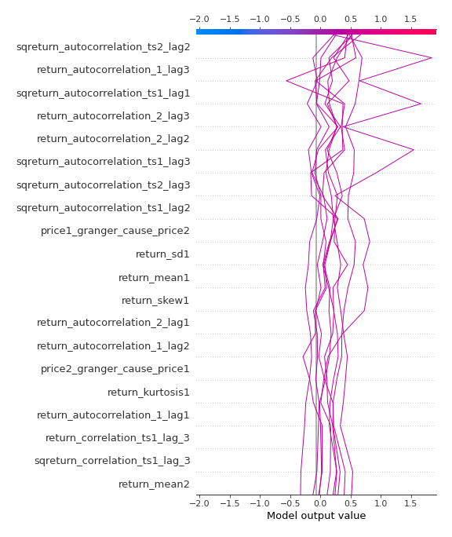
### Top-10 Best decisions for class 0 (Fold 1)
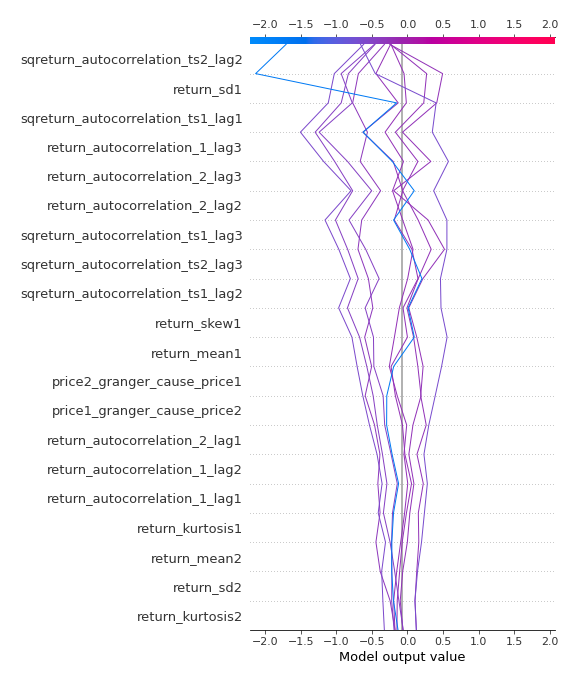
### Top-10 Worst decisions for class 1 (Fold 1)
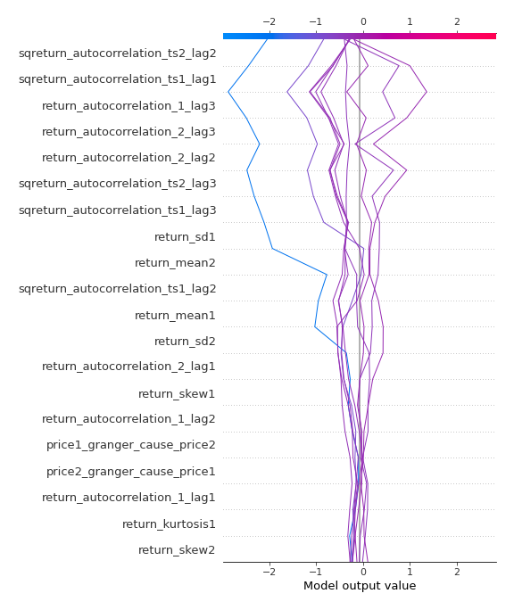
### Top-10 Best decisions for class 1 (Fold 1)
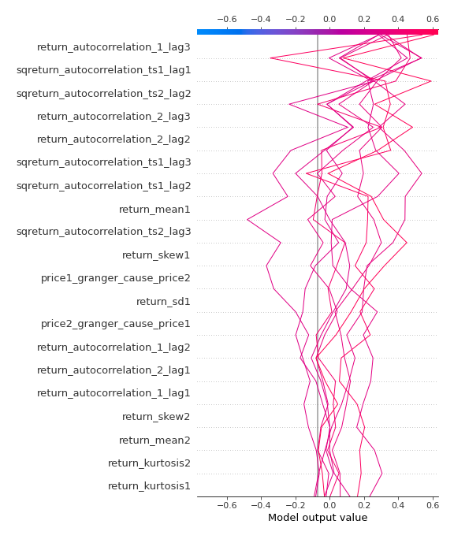

[<< Go back](../README.md)
