# Exploratory Data Analysis

[<< Go back](../README.md)
## Feature : target
- **Feature type** : categorical
- **Missing** : 0.0%
- **Unique** : 2
- **Count** :347
- **Unique** :2
- **Top** :real
- **Freq** :176

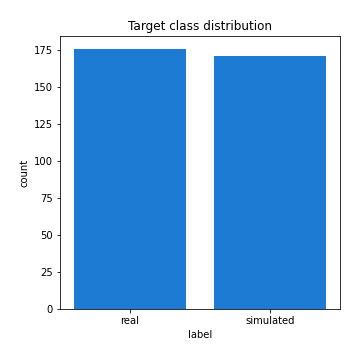
## Feature : return_mean1
- **Feature type** : continous
- **Missing** : 0.0%
- **Unique** : 347
- **Count** :347.0
- **Mean** :51.1068115376196
- **Std** :53.57182716651299
- **Min** :2.041832174
- **25%th Percentile** : 19.772949118
- **50%th Percentile** : 37.426232702
- **75%th Percentile** : 64.191344505
- **Max** :514.7209599040001

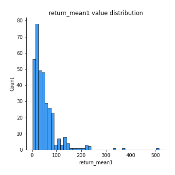
## Feature : return_mean2
- **Feature type** : continous
- **Missing** : 0.0%
- **Unique** : 347
- **Count** :347.0
- **Mean** :48.90116214227089
- **Std** :86.61284014814952
- **Min** :0.122436238
- **25%th Percentile** : 18.555479251
- **50%th Percentile** : 31.472082032
- **75%th Percentile** : 53.623469169
- **Max** :968.654841336

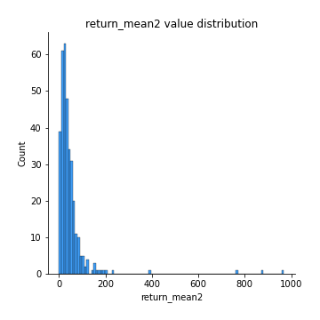
## Feature : return_sd1
- **Feature type** : continous
- **Missing** : 0.0%
- **Unique** : 347
- **Count** :347.0
- **Mean** :8.5757566181062
- **Std** :13.475607713458494
- **Min** :0.17075448275615598
- **25%th Percentile** : 2.5276782634220707
- **50%th Percentile** : 4.792644063807213
- **75%th Percentile** : 8.980262825397112
- **Max** :113.75913244339056

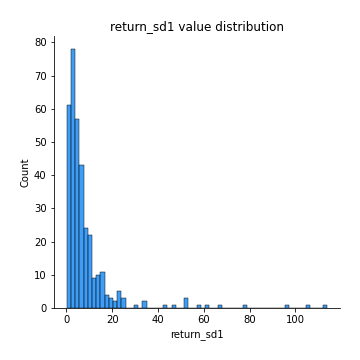
## Feature : return_sd2
- **Feature type** : continous
- **Missing** : 0.0%
- **Unique** : 347
- **Count** :347.0
- **Mean** :7.511163951744892
- **Std** :15.832159885333375
- **Min** :0.06022746901081144
- **25%th Percentile** : 2.5046747322607574
- **50%th Percentile** : 4.523056897981553
- **75%th Percentile** : 7.550637763946671
- **Max** :221.10527467938883

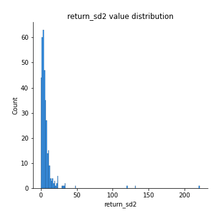
## Feature : return_skew1
- **Feature type** : continous
- **Missing** : 0.0%
- **Unique** : 347
- **Count** :347.0
- **Mean** :0.10541218677352254
- **Std** :0.48608815070347494
- **Min** :-1.2378291916774504
- **25%th Percentile** : -0.2097060867340587
- **50%th Percentile** : 0.08673731232345905
- **75%th Percentile** : 0.4308597720375731
- **Max** :1.5010388367538123

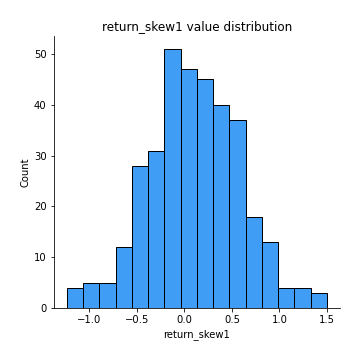
## Feature : return_skew2
- **Feature type** : continous
- **Missing** : 0.0%
- **Unique** : 347
- **Count** :347.0
- **Mean** :0.1324552825245943
- **Std** :0.48776343197627814
- **Min** :-1.6146280688819945
- **25%th Percentile** : -0.17890718033659309
- **50%th Percentile** : 0.09357782964714544
- **75%th Percentile** : 0.43831301361547625
- **Max** :1.723087490745204

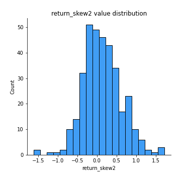
## Feature : return_kurtosis1
- **Feature type** : continous
- **Missing** : 0.0%
- **Unique** : 347
- **Count** :347.0
- **Mean** :-0.5878826226016064
- **Std** :0.6400721990660546
- **Min** :-1.6435775800393035
- **25%th Percentile** : -0.9832363250366796
- **50%th Percentile** : -0.7395215228075074
- **75%th Percentile** : -0.3486421992814521
- **Max** :2.7204133903766734

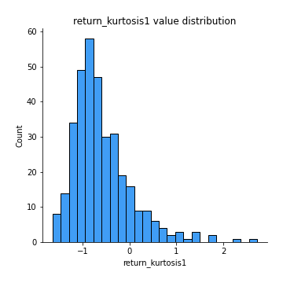
## Feature : return_kurtosis2
- **Feature type** : continous
- **Missing** : 0.0%
- **Unique** : 347
- **Count** :347.0
- **Mean** :-0.6087155317805286
- **Std** :0.654148490338439
- **Min** :-1.5506486769568644
- **25%th Percentile** : -1.060814521436472
- **50%th Percentile** : -0.7581715776649394
- **75%th Percentile** : -0.35197134767037475
- **Max** :3.67606360130176

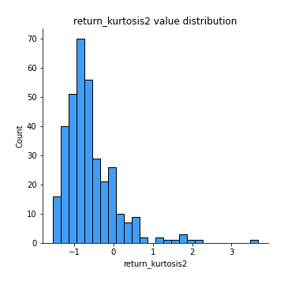
## Feature : return_autocorrelation_1_lag1
- **Feature type** : continous
- **Missing** : 0.0%
- **Unique** : 347
- **Count** :347.0
- **Mean** :0.9891962407052546
- **Std** :0.009149977740546761
- **Min** :0.9355613544071343
- **25%th Percentile** : 0.9858095436594468
- **50%th Percentile** : 0.9921315103304474
- **75%th Percentile** : 0.9954354507191536
- **Max** :0.9987958286634394

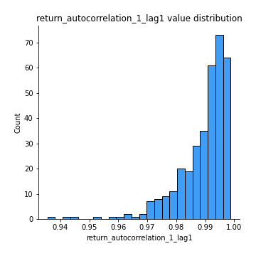
## Feature : return_autocorrelation_1_lag2
- **Feature type** : continous
- **Missing** : 0.0%
- **Unique** : 347
- **Count** :347.0
- **Mean** :0.9791814766223224
- **Std** :0.01688909709776991
- **Min** :0.8975005092899148
- **25%th Percentile** : 0.9723205709166871
- **50%th Percentile** : 0.9847375927232298
- **75%th Percentile** : 0.9910929366094149
- **Max** :0.9975950806151487

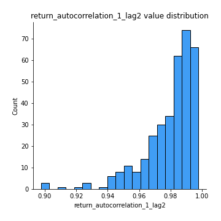
## Feature : return_autocorrelation_1_lag3
- **Feature type** : continous
- **Missing** : 0.0%
- **Unique** : 347
- **Count** :347.0
- **Mean** :0.9694375022779613
- **Std** :0.024461484852247684
- **Min** :0.8527377034295596
- **25%th Percentile** : 0.9602737859775892
- **50%th Percentile** : 0.977760459317892
- **75%th Percentile** : 0.9870602255673434
- **Max** :0.9965600149544981

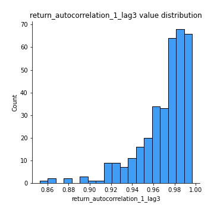
## Feature : return_autocorrelation_2_lag1
- **Feature type** : continous
- **Missing** : 0.0%
- **Unique** : 347
- **Count** :347.0
- **Mean** :0.9902956847614625
- **Std** :0.008057217869653589
- **Min** :0.9442109633563541
- **25%th Percentile** : 0.987518557787399
- **50%th Percentile** : 0.9925257031353618
- **75%th Percentile** : 0.9959156671036576
- **Max** :0.998559478547249

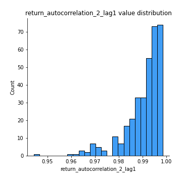
## Feature : return_autocorrelation_2_lag2
- **Feature type** : continous
- **Missing** : 0.0%
- **Unique** : 347
- **Count** :347.0
- **Mean** :0.9810970099655602
- **Std** :0.015489264515396083
- **Min** :0.8945372386327647
- **25%th Percentile** : 0.9754904097141466
- **50%th Percentile** : 0.9855364113049044
- **75%th Percentile** : 0.9919225179974854
- **Max** :0.9972933788707106

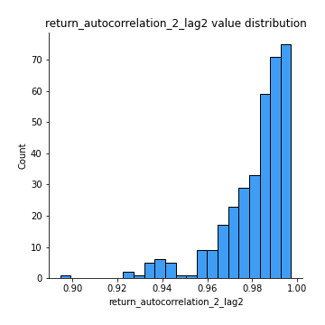
## Feature : return_autocorrelation_2_lag3
- **Feature type** : continous
- **Missing** : 0.0%
- **Unique** : 347
- **Count** :347.0
- **Mean** :0.972237194553945
- **Std** :0.02250382066627498
- **Min** :0.8556938656298004
- **25%th Percentile** : 0.9641526241940188
- **50%th Percentile** : 0.9788344843036318
- **75%th Percentile** : 0.988102072059903
- **Max** :0.9958538038681604

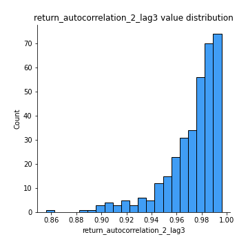
## Feature : return_correlation_ts1_lag_0
- **Feature type** : continous
- **Missing** : 0.0%
- **Unique** : 347
- **Count** :347.0
- **Mean** :0.4195788051043716
- **Std** :0.45556672249348495
- **Min** :-0.9454212056869181
- **25%th Percentile** : 0.11942845288281084
- **50%th Percentile** : 0.5559641740861027
- **75%th Percentile** : 0.7851926101230375
- **Max** :0.9657060675245052

## Feature : return_correlation_ts1_lag_1
- **Feature type** : continous
- **Missing** : 0.0%
- **Unique** : 347
- **Count** :347.0
- **Mean** :0.41653479709910235
- **Std** :0.45594877951987456
- **Min** :-0.9452305740471955
- **25%th Percentile** : 0.11804003850796876
- **50%th Percentile** : 0.5453004322840387
- **75%th Percentile** : 0.7847646608674707
- **Max** :0.9655060959411687

## Feature : return_correlation_ts1_lag_2
- **Feature type** : continous
- **Missing** : 0.0%
- **Unique** : 347
- **Count** :347.0
- **Mean** :0.41379862277269025
- **Std** :0.45625957135047046
- **Min** :-0.9451440682595582
- **25%th Percentile** : 0.11748434830991887
- **50%th Percentile** : 0.5403199139837574
- **75%th Percentile** : 0.7829612274478586
- **Max** :0.9655528894956359

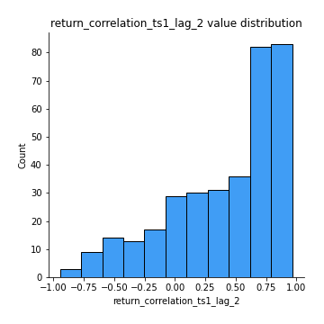
## Feature : return_correlation_ts1_lag_3
- **Feature type** : continous
- **Missing** : 0.0%
- **Unique** : 347
- **Count** :347.0
- **Mean** :0.41122261764706924
- **Std** :0.45658116037667446
- **Min** :-0.9448708035067677
- **25%th Percentile** : 0.11511061901182597
- **50%th Percentile** : 0.5346852585995941
- **75%th Percentile** : 0.7843906016568357
- **Max** :0.965480488388089

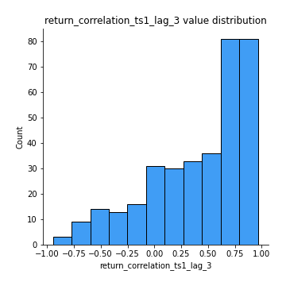
## Feature : return_correlation_ts2_lag_1
- **Feature type** : continous
- **Missing** : 0.0%
- **Unique** : 347
- **Count** :347.0
- **Mean** :0.416387917969997
- **Std** :0.4561678170422222
- **Min** :-0.9457910375143614
- **25%th Percentile** : 0.11244554524707709
- **50%th Percentile** : 0.549355439807996
- **75%th Percentile** : 0.7805108842996182
- **Max** :0.9653492015905041

## Feature : return_correlation_ts2_lag_2
- **Feature type** : continous
- **Missing** : 0.0%
- **Unique** : 347
- **Count** :347.0
- **Mean** :0.41356694587942516
- **Std** :0.45669848925177603
- **Min** :-0.9463260196248172
- **25%th Percentile** : 0.1119833158646456
- **50%th Percentile** : 0.5496600438848293
- **75%th Percentile** : 0.7774145879667941
- **Max** :0.9648220784284761

## Feature : return_correlation_ts2_lag_3
- **Feature type** : continous
- **Missing** : 0.0%
- **Unique** : 347
- **Count** :347.0
- **Mean** :0.4108773227401176
- **Std** :0.45709078990610497
- **Min** :-0.9467149428568907
- **25%th Percentile** : 0.11200734434102948
- **50%th Percentile** : 0.543895703225387
- **75%th Percentile** : 0.7721638279915464
- **Max** :0.9641714645667581

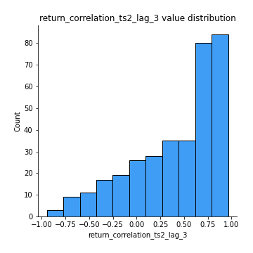
## Feature : sqreturn_autocorrelation_ts1_lag1
- **Feature type** : continous
- **Missing** : 0.0%
- **Unique** : 347
- **Count** :347.0
- **Mean** :0.988813262437121
- **Std** :0.009467382770916574
- **Min** :0.9332773406178796
- **25%th Percentile** : 0.9853362969447611
- **50%th Percentile** : 0.991699423773002
- **75%th Percentile** : 0.9951021459198852
- **Max** :0.9984433232250934

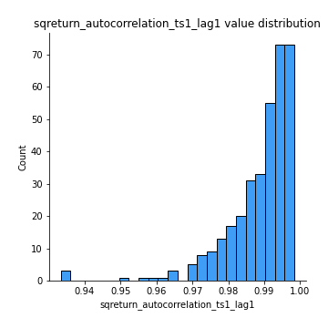
## Feature : sqreturn_autocorrelation_ts1_lag2
- **Feature type** : continous
- **Missing** : 0.0%
- **Unique** : 347
- **Count** :347.0
- **Mean** :0.9784927832371191
- **Std** :0.0172115529995201
- **Min** :0.8823581818725827
- **25%th Percentile** : 0.9713780342147852
- **50%th Percentile** : 0.9835658045888549
- **75%th Percentile** : 0.990535857851821
- **Max** :0.9970968172935939

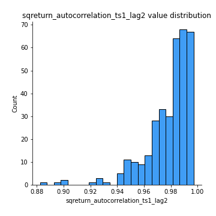
## Feature : sqreturn_autocorrelation_ts1_lag3
- **Feature type** : continous
- **Missing** : 0.0%
- **Unique** : 347
- **Count** :347.0
- **Mean** :0.9685222301418397
- **Std** :0.02461002655394775
- **Min** :0.8522889535016422
- **25%th Percentile** : 0.9588284522285162
- **50%th Percentile** : 0.9759323439296367
- **75%th Percentile** : 0.9861841426533592
- **Max** :0.9956917620790442

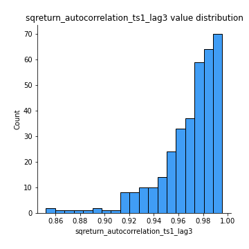
## Feature : sqreturn_autocorrelation_ts2_lag1
- **Feature type** : continous
- **Missing** : 0.0%
- **Unique** : 347
- **Count** :347.0
- **Mean** :0.989938033445116
- **Std** :0.0081399339879204
- **Min** :0.9458029581929804
- **25%th Percentile** : 0.9871623153065598
- **50%th Percentile** : 0.9924585837964487
- **75%th Percentile** : 0.9957604480093486
- **Max** :0.9986746606786123

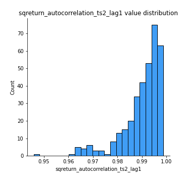
## Feature : sqreturn_autocorrelation_ts2_lag2
- **Feature type** : continous
- **Missing** : 0.0%
- **Unique** : 347
- **Count** :347.0
- **Mean** :0.9803913118803351
- **Std** :0.01569364752823523
- **Min** :0.8967532017908393
- **25%th Percentile** : 0.9745541831737972
- **50%th Percentile** : 0.9853316049301353
- **75%th Percentile** : 0.9914689959236505
- **Max** :0.9970506340171775

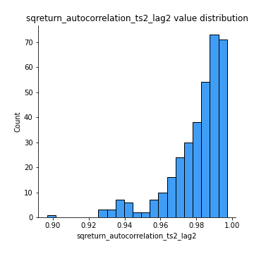
## Feature : sqreturn_autocorrelation_ts2_lag3
- **Feature type** : continous
- **Missing** : 0.0%
- **Unique** : 347
- **Count** :347.0
- **Mean** :0.971217515055872
- **Std** :0.02279632660021927
- **Min** :0.8580676146054256
- **25%th Percentile** : 0.963280166318585
- **50%th Percentile** : 0.9784154965829263
- **75%th Percentile** : 0.987408549796891
- **Max** :0.9957895086263276

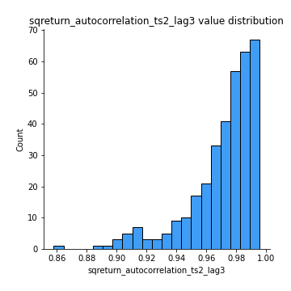
## Feature : sqreturn_correlation_ts1_lag_0
- **Feature type** : continous
- **Missing** : 0.0%
- **Unique** : 347
- **Count** :347.0
- **Mean** :0.4195788051043716
- **Std** :0.45556672249348495
- **Min** :-0.9454212056869181
- **25%th Percentile** : 0.11942845288281084
- **50%th Percentile** : 0.5559641740861027
- **75%th Percentile** : 0.7851926101230375
- **Max** :0.9657060675245052

## Feature : sqreturn_correlation_ts1_lag_1
- **Feature type** : continous
- **Missing** : 0.0%
- **Unique** : 347
- **Count** :347.0
- **Mean** :0.41653479709910235
- **Std** :0.45594877951987456
- **Min** :-0.9452305740471955
- **25%th Percentile** : 0.11804003850796876
- **50%th Percentile** : 0.5453004322840387
- **75%th Percentile** : 0.7847646608674707
- **Max** :0.9655060959411687

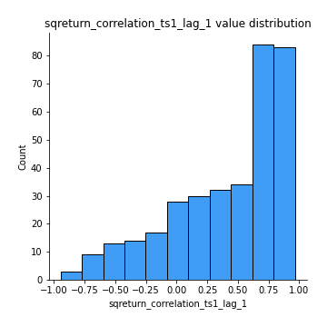
## Feature : sqreturn_correlation_ts1_lag_2
- **Feature type** : continous
- **Missing** : 0.0%
- **Unique** : 347
- **Count** :347.0
- **Mean** :0.41379862277269025
- **Std** :0.45625957135047046
- **Min** :-0.9451440682595582
- **25%th Percentile** : 0.11748434830991887
- **50%th Percentile** : 0.5403199139837574
- **75%th Percentile** : 0.7829612274478586
- **Max** :0.9655528894956359

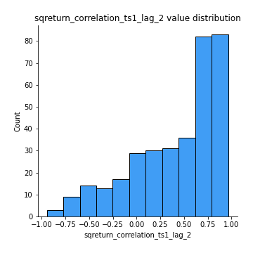
## Feature : sqreturn_correlation_ts1_lag_3
- **Feature type** : continous
- **Missing** : 0.0%
- **Unique** : 347
- **Count** :347.0
- **Mean** :0.41122261764706924
- **Std** :0.45658116037667446
- **Min** :-0.9448708035067677
- **25%th Percentile** : 0.11511061901182597
- **50%th Percentile** : 0.5346852585995941
- **75%th Percentile** : 0.7843906016568357
- **Max** :0.965480488388089

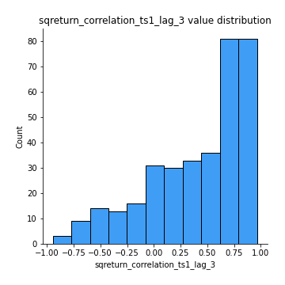
## Feature : sqreturn_correlation_ts2_lag_1
- **Feature type** : continous
- **Missing** : 0.0%
- **Unique** : 347
- **Count** :347.0
- **Mean** :0.416387917969997
- **Std** :0.4561678170422222
- **Min** :-0.9457910375143614
- **25%th Percentile** : 0.11244554524707709
- **50%th Percentile** : 0.549355439807996
- **75%th Percentile** : 0.7805108842996182
- **Max** :0.9653492015905041

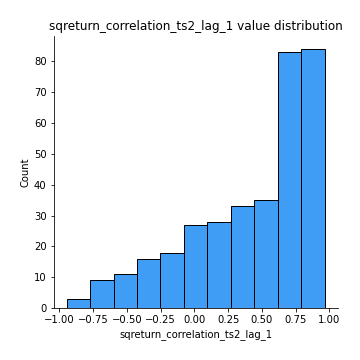
## Feature : sqreturn_correlation_ts2_lag_2
- **Feature type** : continous
- **Missing** : 0.0%
- **Unique** : 347
- **Count** :347.0
- **Mean** :0.41356694587942516
- **Std** :0.45669848925177603
- **Min** :-0.9463260196248172
- **25%th Percentile** : 0.1119833158646456
- **50%th Percentile** : 0.5496600438848293
- **75%th Percentile** : 0.7774145879667941
- **Max** :0.9648220784284761

## Feature : sqreturn_correlation_ts2_lag_3
- **Feature type** : continous
- **Missing** : 0.0%
- **Unique** : 347
- **Count** :347.0
- **Mean** :0.4108773227401176
- **Std** :0.45709078990610497
- **Min** :-0.9467149428568907
- **25%th Percentile** : 0.11200734434102948
- **50%th Percentile** : 0.543895703225387
- **75%th Percentile** : 0.7721638279915464
- **Max** :0.9641714645667581

## Feature : price2_granger_cause_price1
- **Feature type** : continous
- **Missing** : 0.0%
- **Unique** : 347
- **Count** :347.0
- **Mean** :0.39415937348377206
- **Std** :0.30847521647716636
- **Min** :7.442002876220672e-07
- **25%th Percentile** : 0.08778098453705913
- **50%th Percentile** : 0.3425608390258486
- **75%th Percentile** : 0.685111007994501
- **Max** :0.9923417706683243

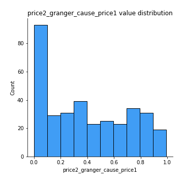
## Feature : price1_granger_cause_price2
- **Feature type** : continous
- **Missing** : 0.0%
- **Unique** : 347
- **Count** :347.0
- **Mean** :0.38802120806498197
- **Std** :0.31219065452014844
- **Min** :1.6674455312589196e-07
- **25%th Percentile** : 0.09519051825195524
- **50%th Percentile** : 0.3229668746076254
- **75%th Percentile** : 0.6407986893851516
- **Max** :0.9987360641740829

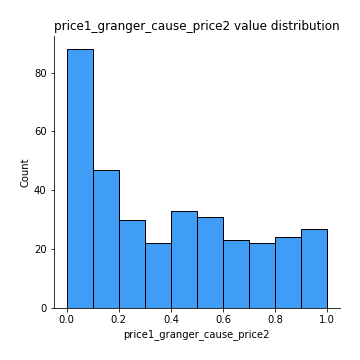

[<< Go back](../README.md)
