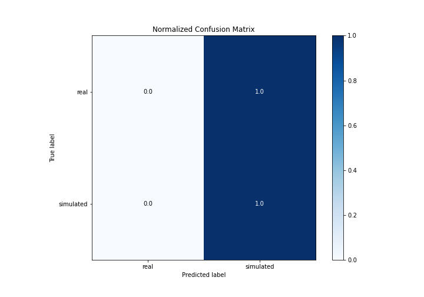

# Summary of 3_Linear

[<< Go back](../README.md)

## Logistic Regression (Linear)
- **n_jobs**: -1
- **explain_level**: 2

## Validation
 - **validation_type**: split
 - **train_ratio**: 0.75
 - **shuffle**: True
 - **stratify**: True

## Optimized metric
accuracy

## Training time

7.5 seconds

## Metric details
|           |     score |    threshold |
|:----------|----------:|-------------:|
| logloss   | 0.774719  | nan          |
| auc       | 0.460847  | nan          |
| f1        | 0.681818  |   0.00185034 |
| accuracy  | 0.517241  |   0.00185034 |
| precision | 0.55      |   0.613087   |
| recall    | 1         |   0.00185034 |
| mcc       | 0.0358172 |   0.613087   |

## Confusion matrix (at threshold=0.00185)
|                      |   Predicted as real |   Predicted as simulated |
|:---------------------|--------------------:|-------------------------:|
| Labeled as real      |                   0 |                       42 |
| Labeled as simulated |                   0 |                       45 |

## Learning curves

## Coefficients
| feature                           |   Learner_1 |
|:----------------------------------|------------:|
| sqreturn_autocorrelation_ts1_lag1 |   0.462593  |
| return_autocorrelation_2_lag2     |   0.461396  |
| price2_granger_cause_price1       |   0.451711  |
| return_mean1                      |   0.451484  |
| return_autocorrelation_1_lag1     |   0.413935  |
| sqreturn_autocorrelation_ts2_lag2 |   0.406264  |
| return_skew2                      |   0.397132  |
| return_sd2                        |   0.187915  |
| return_kurtosis1                  |   0.161678  |
| return_autocorrelation_2_lag3     |   0.153483  |
| return_correlation_ts2_lag_3      |   0.1361    |
| sqreturn_correlation_ts2_lag_3    |   0.1361    |
| price1_granger_cause_price2       |   0.129086  |
| sqreturn_autocorrelation_ts2_lag3 |   0.123557  |
| sqreturn_correlation_ts2_lag_2    |   0.0873134 |
| return_correlation_ts2_lag_2      |   0.0873134 |
| return_autocorrelation_1_lag2     |   0.0322597 |
| sqreturn_correlation_ts2_lag_1    |   0.0317419 |
| return_correlation_ts2_lag_1      |   0.0317419 |
| sqreturn_correlation_ts1_lag_0    |  -0.0180372 |
| return_correlation_ts1_lag_0      |  -0.0180372 |
| return_autocorrelation_1_lag3     |  -0.0344873 |
| intercept                         |  -0.0504727 |
| return_correlation_ts1_lag_1      |  -0.0653576 |
| sqreturn_correlation_ts1_lag_1    |  -0.0653576 |
| return_correlation_ts1_lag_2      |  -0.107397  |
| sqreturn_correlation_ts1_lag_2    |  -0.107397  |
| return_kurtosis2                  |  -0.143477  |
| return_mean2                      |  -0.162208  |
| sqreturn_correlation_ts1_lag_3    |  -0.163349  |
| return_correlation_ts1_lag_3      |  -0.163349  |
| sqreturn_autocorrelation_ts1_lag2 |  -0.205503  |
| sqreturn_autocorrelation_ts1_lag3 |  -0.401762  |
| return_skew1                      |  -0.424578  |
| sqreturn_autocorrelation_ts2_lag1 |  -0.491149  |
| return_autocorrelation_2_lag1     |  -0.665094  |
| return_sd1                        |  -0.760041  |

## Permutation-based Importance

## Confusion Matrix

## Normalized Confusion Matrix

## ROC Curve

## Kolmogorov-Smirnov Statistic

## Precision-Recall Curve

## Calibration Curve

## Cumulative Gains Curve

## Lift Curve

## SHAP Importance

## SHAP Dependence plots

### Dependence (Fold 1)

## SHAP Decision plots

### Top-10 Worst decisions for class 0 (Fold 1)

### Top-10 Best decisions for class 0 (Fold 1)

### Top-10 Worst decisions for class 1 (Fold 1)

### Top-10 Best decisions for class 1 (Fold 1)

[<< Go back](../README.md)
