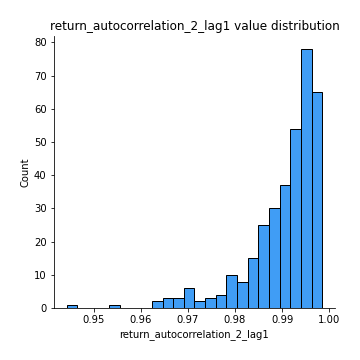

# Exploratory Data Analysis

[<< Go back](../README.md)
## Feature : target
- **Feature type** : categorical
- **Missing** : 0.0%
- **Unique** : 2
- **Count** :347
- **Unique** :2
- **Top** :simulated
- **Freq** :181

## Feature : return_mean1
- **Feature type** : continous
- **Missing** : 0.0%
- **Unique** : 347
- **Count** :347.0
- **Mean** :49.333840818265124
- **Std** :48.531431328840625
- **Min** :1.885538416
- **25%th Percentile** : 18.97606691
- **50%th Percentile** : 34.16062004
- **75%th Percentile** : 62.211847721
- **Max** :368.637599734

## Feature : return_mean2
- **Feature type** : continous
- **Missing** : 0.0%
- **Unique** : 347
- **Count** :347.0
- **Mean** :48.370483123406345
- **Std** :86.86923941570214
- **Min** :0.122436238
- **25%th Percentile** : 17.488959982
- **50%th Percentile** : 29.303902042
- **75%th Percentile** : 51.03641775999999
- **Max** :968.654841336

## Feature : return_sd1
- **Feature type** : continous
- **Missing** : 0.0%
- **Unique** : 347
- **Count** :347.0
- **Mean** :8.156245510232289
- **Std** :12.733063000896628
- **Min** :0.17075448275615598
- **25%th Percentile** : 2.5686522182648535
- **50%th Percentile** : 4.784961017283851
- **75%th Percentile** : 8.795077507779297
- **Max** :113.75913244339056

## Feature : return_sd2
- **Feature type** : continous
- **Missing** : 0.0%
- **Unique** : 347
- **Count** :347.0
- **Mean** :7.761034218458239
- **Std** :18.184248631456832
- **Min** :0.06022746901081144
- **25%th Percentile** : 2.3575249529372915
- **50%th Percentile** : 4.435024024599195
- **75%th Percentile** : 7.310378541744777
- **Max** :221.10527467938883

## Feature : return_skew1
- **Feature type** : continous
- **Missing** : 0.0%
- **Unique** : 347
- **Count** :347.0
- **Mean** :0.10919249885533977
- **Std** :0.4873672761012929
- **Min** :-1.2969383077901073
- **25%th Percentile** : -0.21130684546887052
- **50%th Percentile** : 0.09793714580814103
- **75%th Percentile** : 0.43893064807533455
- **Max** :1.5535808520192136

## Feature : return_skew2
- **Feature type** : continous
- **Missing** : 0.0%
- **Unique** : 347
- **Count** :347.0
- **Mean** :0.1040894342782398
- **Std** :0.4827618024278969
- **Min** :-1.6146280688819945
- **25%th Percentile** : -0.19969475214040416
- **50%th Percentile** : 0.06370302339470368
- **75%th Percentile** : 0.3839113819149428
- **Max** :1.8950824286933763

## Feature : return_kurtosis1
- **Feature type** : continous
- **Missing** : 0.0%
- **Unique** : 347
- **Count** :347.0
- **Mean** :-0.6063513915732467
- **Std** :0.6550402175417935
- **Min** :-1.5936521214358073
- **25%th Percentile** : -0.9959924020633424
- **50%th Percentile** : -0.7634880196656297
- **75%th Percentile** : -0.3874802026948956
- **Max** :3.256924497920797

## Feature : return_kurtosis2
- **Feature type** : continous
- **Missing** : 0.0%
- **Unique** : 347
- **Count** :347.0
- **Mean** :-0.631768786477362
- **Std** :0.66538017001256
- **Min** :-1.5537576053359181
- **25%th Percentile** : -1.070463562609714
- **50%th Percentile** : -0.7841155140634362
- **75%th Percentile** : -0.4112521779021554
- **Max** :3.67606360130176

## Feature : return_autocorrelation_1_lag1
- **Feature type** : continous
- **Missing** : 0.0%
- **Unique** : 347
- **Count** :347.0
- **Mean** :0.9895580137613775
- **Std** :0.008619460926002796
- **Min** :0.9355613544071343
- **25%th Percentile** : 0.9861891774848397
- **50%th Percentile** : 0.9920845254229346
- **75%th Percentile** : 0.9954574088096227
- **Max** :0.9987958286634394

## Feature : return_autocorrelation_1_lag2
- **Feature type** : continous
- **Missing** : 0.0%
- **Unique** : 347
- **Count** :347.0
- **Mean** :0.9798445659472574
- **Std** :0.01574571201671675
- **Min** :0.8975005092899148
- **25%th Percentile** : 0.9727473294543382
- **50%th Percentile** : 0.9842742566573484
- **75%th Percentile** : 0.9907836888214516
- **Max** :0.9975950806151487

## Feature : return_autocorrelation_1_lag3
- **Feature type** : continous
- **Missing** : 0.0%
- **Unique** : 347
- **Count** :347.0
- **Mean** :0.9704407386801294
- **Std** :0.022719223189172234
- **Min** :0.8527377034295596
- **25%th Percentile** : 0.9604782337394636
- **50%th Percentile** : 0.9776864197679511
- **75%th Percentile** : 0.986808488795984
- **Max** :0.9965600149544981

## Feature : return_autocorrelation_2_lag1
- **Feature type** : continous
- **Missing** : 0.0%
- **Unique** : 347
- **Count** :347.0
- **Mean** :0.9904358449695374
- **Std** :0.007862952929014615
- **Min** :0.9442109633563541
- **25%th Percentile** : 0.9876150685552842
- **50%th Percentile** : 0.9928305469657592
- **75%th Percentile** : 0.9958770390878526
- **Max** :0.998559478547249

## Feature : return_autocorrelation_2_lag2
- **Feature type** : continous
- **Missing** : 0.0%
- **Unique** : 347
- **Count** :347.0
- **Mean** :0.9814305476544484
- **Std** :0.014900997532855474
- **Min** :0.8945372386327647
- **25%th Percentile** : 0.9756228590873213
- **50%th Percentile** : 0.9858150095573895
- **75%th Percentile** : 0.9918349510878681
- **Max** :0.9972933788707106

## Feature : return_autocorrelation_2_lag3
- **Feature type** : continous
- **Missing** : 0.0%
- **Unique** : 347
- **Count** :347.0
- **Mean** :0.9727560288459995
- **Std** :0.021472712285219433
- **Min** :0.8556938656298004
- **25%th Percentile** : 0.9641526241940188
- **50%th Percentile** : 0.9790938594882336
- **75%th Percentile** : 0.987897167463214
- **Max** :0.9958538038681604

## Feature : return_correlation_ts1_lag_0
- **Feature type** : continous
- **Missing** : 0.0%
- **Unique** : 347
- **Count** :347.0
- **Mean** :0.4154227102952716
- **Std** :0.47426880460254756
- **Min** :-0.8430691081512005
- **25%th Percentile** : 0.11246895798076875
- **50%th Percentile** : 0.5707177682788501
- **75%th Percentile** : 0.8017419691269794
- **Max** :0.9737538981965371

## Feature : return_correlation_ts1_lag_1
- **Feature type** : continous
- **Missing** : 0.0%
- **Unique** : 347
- **Count** :347.0
- **Mean** :0.412385085972898
- **Std** :0.4745357090510749
- **Min** :-0.8477371479268198
- **25%th Percentile** : 0.10831529781574764
- **50%th Percentile** : 0.5677072775964865
- **75%th Percentile** : 0.7999283590297103
- **Max** :0.9711085570505825

## Feature : return_correlation_ts1_lag_2
- **Feature type** : continous
- **Missing** : 0.0%
- **Unique** : 347
- **Count** :347.0
- **Mean** :0.40969260391521356
- **Std** :0.4747419404142003
- **Min** :-0.8526854582503749
- **25%th Percentile** : 0.10901787499712898
- **50%th Percentile** : 0.5672688625178531
- **75%th Percentile** : 0.7953366427733911
- **Max** :0.9689525049465741

## Feature : return_correlation_ts1_lag_3
- **Feature type** : continous
- **Missing** : 0.0%
- **Unique** : 347
- **Count** :347.0
- **Mean** :0.407161806306792
- **Std** :0.474928971059988
- **Min** :-0.8563145423083878
- **25%th Percentile** : 0.10867459009275103
- **50%th Percentile** : 0.5680810474563854
- **75%th Percentile** : 0.7913896404971295
- **Max** :0.9661881898387052

## Feature : return_correlation_ts2_lag_1
- **Feature type** : continous
- **Missing** : 0.0%
- **Unique** : 347
- **Count** :347.0
- **Mean** :0.41217936579029496
- **Std** :0.4747785852571939
- **Min** :-0.8419620696123573
- **25%th Percentile** : 0.1062301662440443
- **50%th Percentile** : 0.563463291244164
- **75%th Percentile** : 0.8005151274495945
- **Max** :0.9724436077344459

## Feature : return_correlation_ts2_lag_2
- **Feature type** : continous
- **Missing** : 0.0%
- **Unique** : 347
- **Count** :347.0
- **Mean** :0.40921362003740014
- **Std** :0.4753321908725624
- **Min** :-0.8407733129095517
- **25%th Percentile** : 0.10530369863092343
- **50%th Percentile** : 0.5641602596242805
- **75%th Percentile** : 0.7995034090906957
- **Max** :0.9717047956671369

## Feature : return_correlation_ts2_lag_3
- **Feature type** : continous
- **Missing** : 0.0%
- **Unique** : 347
- **Count** :347.0
- **Mean** :0.40643127141611696
- **Std** :0.47573910557680676
- **Min** :-0.8390925417171665
- **25%th Percentile** : 0.10537383333210554
- **50%th Percentile** : 0.5669450046120008
- **75%th Percentile** : 0.7961526865195274
- **Max** :0.970545073163944

## Feature : sqreturn_autocorrelation_ts1_lag1
- **Feature type** : continous
- **Missing** : 0.0%
- **Unique** : 347
- **Count** :347.0
- **Mean** :0.9892381781174687
- **Std** :0.008916764825556037
- **Min** :0.9332773406178796
- **25%th Percentile** : 0.985696064566115
- **50%th Percentile** : 0.9915999121814243
- **75%th Percentile** : 0.9953057738647886
- **Max** :0.9984433232250934

## Feature : sqreturn_autocorrelation_ts1_lag2
- **Feature type** : continous
- **Missing** : 0.0%
- **Unique** : 347
- **Count** :347.0
- **Mean** :0.9792434797899796
- **Std** :0.016091615591918497
- **Min** :0.8823581818725827
- **25%th Percentile** : 0.9719570143814282
- **50%th Percentile** : 0.983375987792523
- **75%th Percentile** : 0.9907324513106786
- **Max** :0.9970968172935939

## Feature : sqreturn_autocorrelation_ts1_lag3
- **Feature type** : continous
- **Missing** : 0.0%
- **Unique** : 347
- **Count** :347.0
- **Mean** :0.9696103452771768
- **Std** :0.022955963048120802
- **Min** :0.8522889535016422
- **25%th Percentile** : 0.9598874395820896
- **50%th Percentile** : 0.9751623775833843
- **75%th Percentile** : 0.9863341421633556
- **Max** :0.9956917620790442

## Feature : sqreturn_autocorrelation_ts2_lag1
- **Feature type** : continous
- **Missing** : 0.0%
- **Unique** : 347
- **Count** :347.0
- **Mean** :0.9900733926096046
- **Std** :0.007879555246442502
- **Min** :0.9458029581929804
- **25%th Percentile** : 0.9872960198876928
- **50%th Percentile** : 0.9924585837964487
- **75%th Percentile** : 0.9956807320888099
- **Max** :0.9986746606786123

## Feature : sqreturn_autocorrelation_ts2_lag2
- **Feature type** : continous
- **Missing** : 0.0%
- **Unique** : 347
- **Count** :347.0
- **Mean** :0.9807454766930374
- **Std** :0.014965458070725036
- **Min** :0.8967532017908393
- **25%th Percentile** : 0.9751670917692079
- **50%th Percentile** : 0.9854393124642054
- **75%th Percentile** : 0.9914077944118456
- **Max** :0.9970506340171775

## Feature : sqreturn_autocorrelation_ts2_lag3
- **Feature type** : continous
- **Missing** : 0.0%
- **Unique** : 347
- **Count** :347.0
- **Mean** :0.9717437424293676
- **Std** :0.021599060382299737
- **Min** :0.8580676146054256
- **25%th Percentile** : 0.963338869194819
- **50%th Percentile** : 0.9784890938583292
- **75%th Percentile** : 0.9872410318785804
- **Max** :0.9954645996237411

## Feature : sqreturn_correlation_ts1_lag_0
- **Feature type** : continous
- **Missing** : 0.0%
- **Unique** : 347
- **Count** :347.0
- **Mean** :0.4154227102952716
- **Std** :0.47426880460254756
- **Min** :-0.8430691081512005
- **25%th Percentile** : 0.11246895798076875
- **50%th Percentile** : 0.5707177682788501
- **75%th Percentile** : 0.8017419691269794
- **Max** :0.9737538981965371

## Feature : sqreturn_correlation_ts1_lag_1
- **Feature type** : continous
- **Missing** : 0.0%
- **Unique** : 347
- **Count** :347.0
- **Mean** :0.412385085972898
- **Std** :0.4745357090510749
- **Min** :-0.8477371479268198
- **25%th Percentile** : 0.10831529781574764
- **50%th Percentile** : 0.5677072775964865
- **75%th Percentile** : 0.7999283590297103
- **Max** :0.9711085570505825

## Feature : sqreturn_correlation_ts1_lag_2
- **Feature type** : continous
- **Missing** : 0.0%
- **Unique** : 347
- **Count** :347.0
- **Mean** :0.40969260391521356
- **Std** :0.4747419404142003
- **Min** :-0.8526854582503749
- **25%th Percentile** : 0.10901787499712898
- **50%th Percentile** : 0.5672688625178531
- **75%th Percentile** : 0.7953366427733911
- **Max** :0.9689525049465741

## Feature : sqreturn_correlation_ts1_lag_3
- **Feature type** : continous
- **Missing** : 0.0%
- **Unique** : 347
- **Count** :347.0
- **Mean** :0.407161806306792
- **Std** :0.474928971059988
- **Min** :-0.8563145423083878
- **25%th Percentile** : 0.10867459009275103
- **50%th Percentile** : 0.5680810474563854
- **75%th Percentile** : 0.7913896404971295
- **Max** :0.9661881898387052

## Feature : sqreturn_correlation_ts2_lag_1
- **Feature type** : continous
- **Missing** : 0.0%
- **Unique** : 347
- **Count** :347.0
- **Mean** :0.41217936579029496
- **Std** :0.4747785852571939
- **Min** :-0.8419620696123573
- **25%th Percentile** : 0.1062301662440443
- **50%th Percentile** : 0.563463291244164
- **75%th Percentile** : 0.8005151274495945
- **Max** :0.9724436077344459

## Feature : sqreturn_correlation_ts2_lag_2
- **Feature type** : continous
- **Missing** : 0.0%
- **Unique** : 347
- **Count** :347.0
- **Mean** :0.40921362003740014
- **Std** :0.4753321908725624
- **Min** :-0.8407733129095517
- **25%th Percentile** : 0.10530369863092343
- **50%th Percentile** : 0.5641602596242805
- **75%th Percentile** : 0.7995034090906957
- **Max** :0.9717047956671369

## Feature : sqreturn_correlation_ts2_lag_3
- **Feature type** : continous
- **Missing** : 0.0%
- **Unique** : 347
- **Count** :347.0
- **Mean** :0.40643127141611696
- **Std** :0.47573910557680676
- **Min** :-0.8390925417171665
- **25%th Percentile** : 0.10537383333210554
- **50%th Percentile** : 0.5669450046120008
- **75%th Percentile** : 0.7961526865195274
- **Max** :0.970545073163944

## Feature : price2_granger_cause_price1
- **Feature type** : continous
- **Missing** : 0.0%
- **Unique** : 347
- **Count** :347.0
- **Mean** :0.39114892790850603
- **Std** :0.3078697622201368
- **Min** :5.063123743918868e-06
- **25%th Percentile** : 0.08595187963839743
- **50%th Percentile** : 0.3353167130976647
- **75%th Percentile** : 0.6708574588301996
- **Max** :0.9991604192257109

## Feature : price1_granger_cause_price2
- **Feature type** : continous
- **Missing** : 0.0%
- **Unique** : 347
- **Count** :347.0
- **Mean** :0.4179523709428807
- **Std** :0.31253919139409
- **Min** :8.101068402988115e-10
- **25%th Percentile** : 0.11980503547325716
- **50%th Percentile** : 0.3973673327012036
- **75%th Percentile** : 0.677493713399404
- **Max** :0.9987360641740829

[<< Go back](../README.md)
