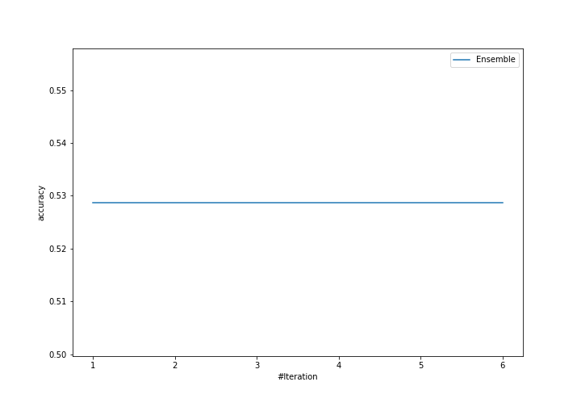
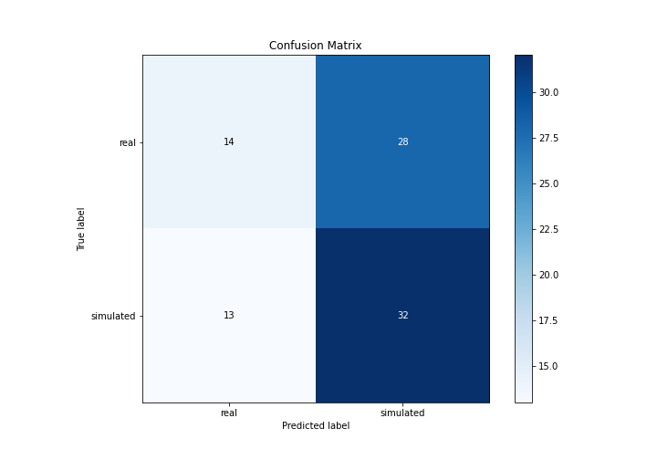
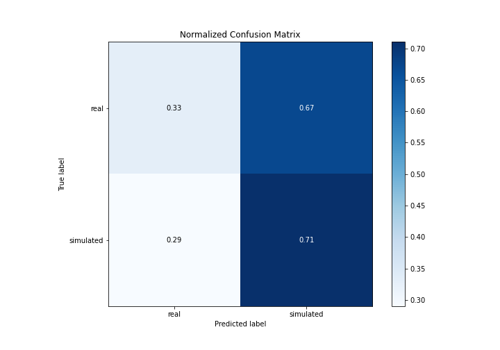
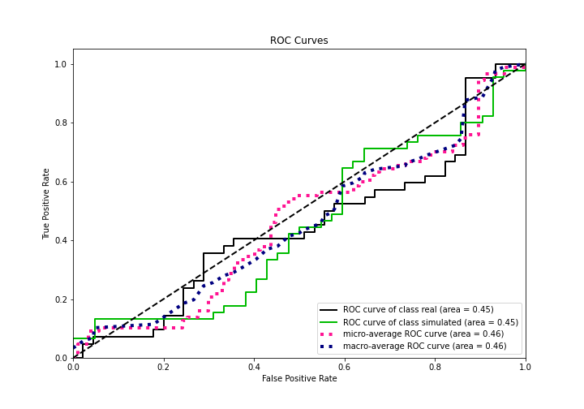
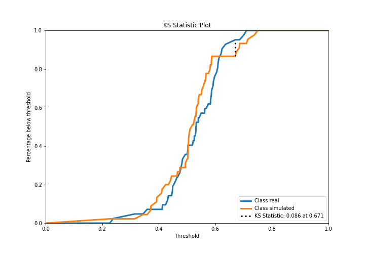
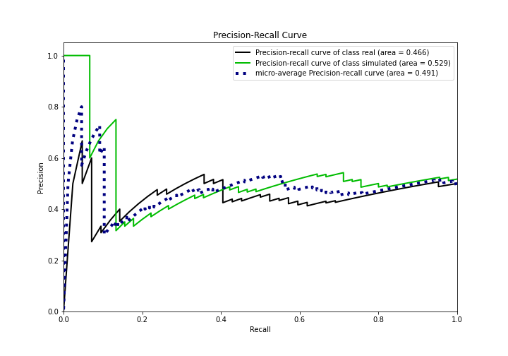
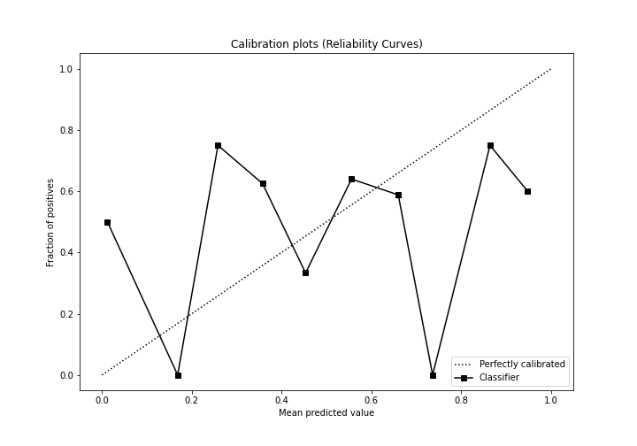
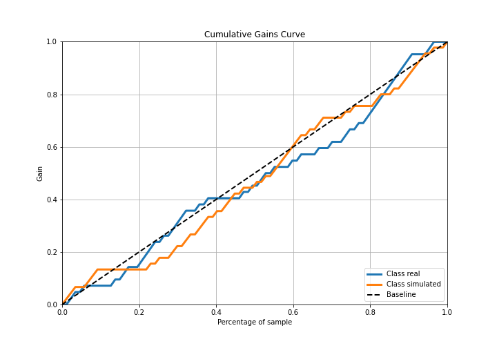
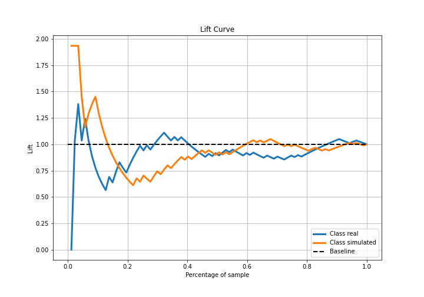

# Summary of Ensemble

[<< Go back](../README.md)

## Ensemble structure
| Model                  |   Weight |
|:-----------------------|---------:|
| 6_Default_RandomForest |        1 |

## Metric details
|           |    score |   threshold |
|:----------|---------:|------------:|
| logloss   | 0.724256 |  nan        |
| auc       | 0.447619 |  nan        |
| f1        | 0.681818 |    0.204042 |
| accuracy  | 0.528736 |    0.49017  |
| precision | 1        |    0.726684 |
| recall    | 1        |    0.204042 |
| mcc       | 0.148192 |    0.726684 |

## Confusion matrix (at threshold=0.49017)
|                      |   Predicted as real |   Predicted as simulated |
|:---------------------|--------------------:|-------------------------:|
| Labeled as real      |                  14 |                       28 |
| Labeled as simulated |                  13 |                       32 |

## Learning curves

## Confusion Matrix

## Normalized Confusion Matrix

## ROC Curve

## Kolmogorov-Smirnov Statistic

## Precision-Recall Curve

## Calibration Curve

## Cumulative Gains Curve

## Lift Curve

[<< Go back](../README.md)
