# Summary of 2_DecisionTree

[<< Go back](../README.md)

## Decision Tree
- **n_jobs**: -1
- **criterion**: gini
- **max_depth**: 3
- **explain_level**: 2

## Validation
 - **validation_type**: split
 - **train_ratio**: 0.75
 - **shuffle**: True
 - **stratify**: True

## Optimized metric
accuracy

## Training time

9.5 seconds

## Metric details
|           |    score |   threshold |
|:----------|---------:|------------:|
| logloss   | 0.72553  |  nan        |
| auc       | 0.57381  |  nan        |
| f1        | 0.651163 |    0.084375 |
| accuracy  | 0.482759 |    0.084375 |
| precision | 0.482759 |    0.084375 |
| recall    | 1        |    0.084375 |
| mcc       | 0        |    0.084375 |

## Confusion matrix (at threshold=0.084375)
|                      |   Predicted as real |   Predicted as simulated |
|:---------------------|--------------------:|-------------------------:|
| Labeled as real      |                   0 |                       45 |
| Labeled as simulated |                   0 |                       42 |

## Learning curves
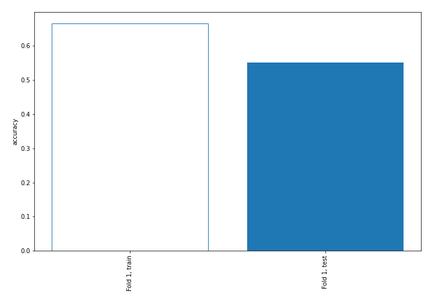

## Decision Tree 

### Tree #1
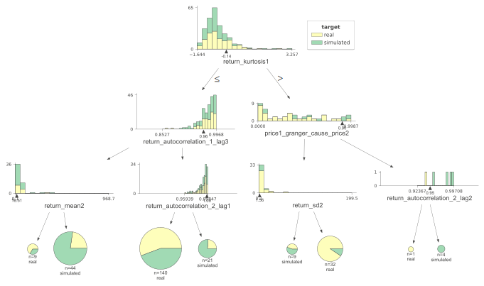

### Rules

if (return_kurtosis1 <= -0.135) and (return_autocorrelation_1_lag3 > 0.963) and (return_autocorrelation_2_lag1 <= 0.997) then class: real (proba: 55.71%) | based on 140 samples

if (return_kurtosis1 <= -0.135) and (return_autocorrelation_1_lag3 <= 0.963) and (return_mean2 > 16.515) then class: simulated (proba: 77.27%) | based on 44 samples

if (return_kurtosis1 > -0.135) and (price1_granger_cause_price2 <= 0.905) and (return_sd2 > 1.56) then class: real (proba: 90.62%) | based on 32 samples

if (return_kurtosis1 <= -0.135) and (return_autocorrelation_1_lag3 > 0.963) and (return_autocorrelation_2_lag1 > 0.997) then class: simulated (proba: 76.19%) | based on 21 samples

if (return_kurtosis1 > -0.135) and (price1_granger_cause_price2 <= 0.905) and (return_sd2 <= 1.56) then class: simulated (proba: 55.56%) | based on 9 samples

if (return_kurtosis1 <= -0.135) and (return_autocorrelation_1_lag3 <= 0.963) and (return_mean2 <= 16.515) then class: real (proba: 66.67%) | based on 9 samples

if (return_kurtosis1 > -0.135) and (price1_granger_cause_price2 > 0.905) and (return_autocorrelation_2_lag2 > 0.95) then class: simulated (proba: 100.0%) | based on 4 samples

if (return_kurtosis1 > -0.135) and (price1_granger_cause_price2 > 0.905) and (return_autocorrelation_2_lag2 <= 0.95) then class: real (proba: 100.0%) | based on 1 samples

## Permutation-based Importance
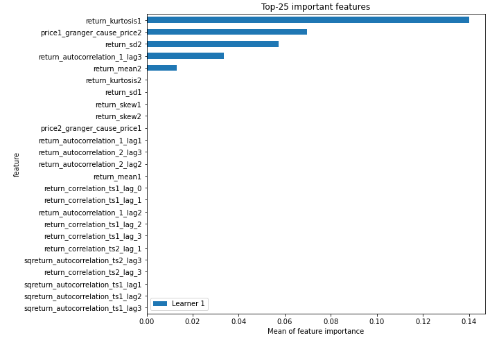
## Confusion Matrix

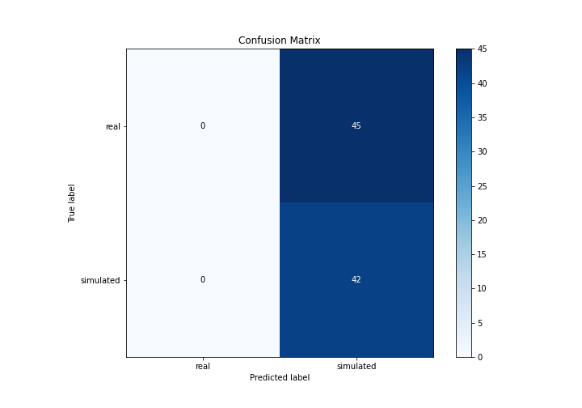

## Normalized Confusion Matrix

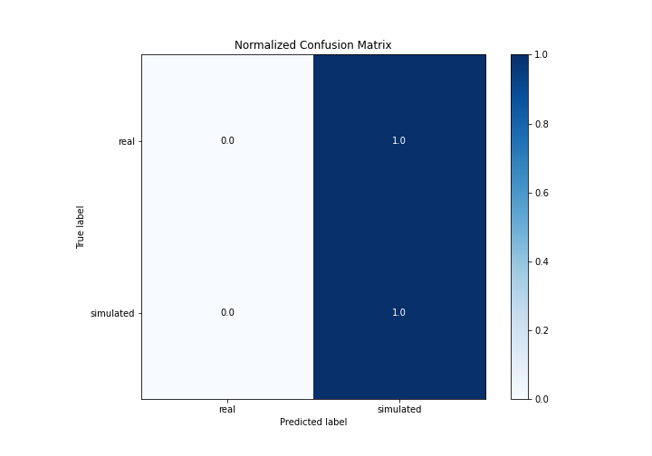

## ROC Curve

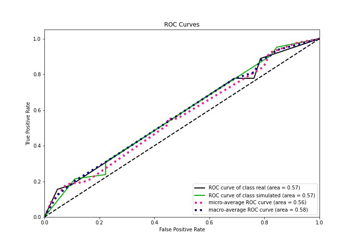

## Kolmogorov-Smirnov Statistic

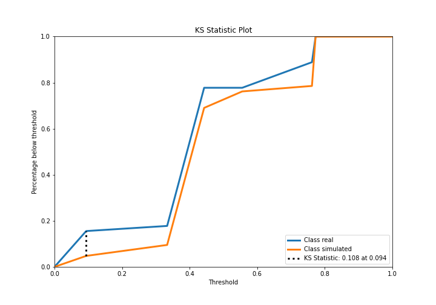

## Precision-Recall Curve

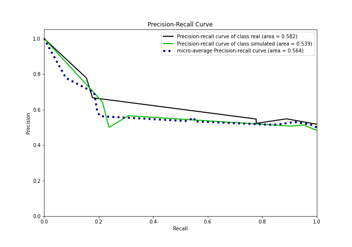

## Calibration Curve

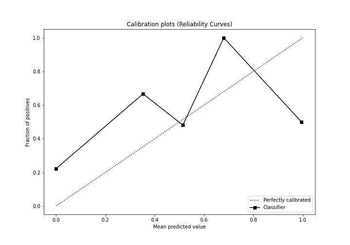

## Cumulative Gains Curve

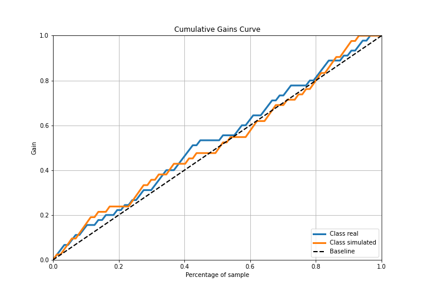

## Lift Curve

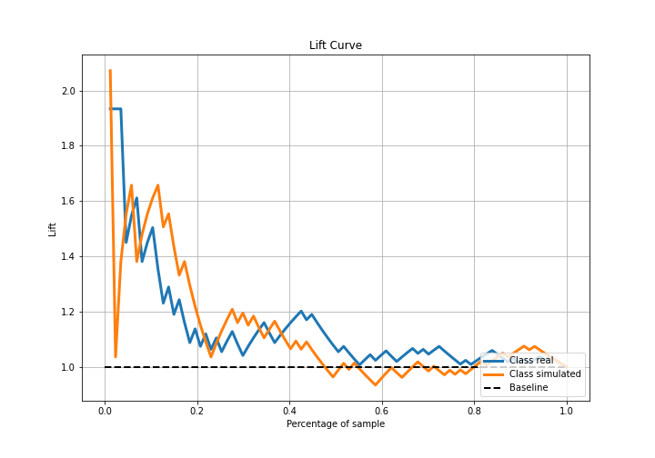

## SHAP Importance
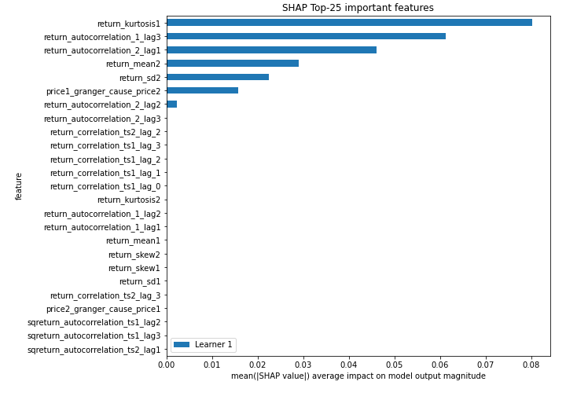

## SHAP Dependence plots

### Dependence (Fold 1)
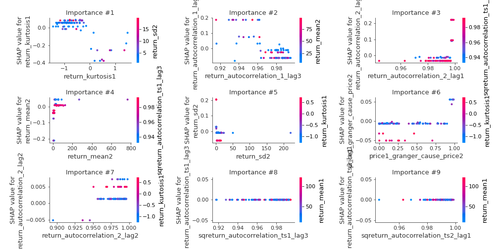

## SHAP Decision plots

### Top-10 Worst decisions for class 0 (Fold 1)
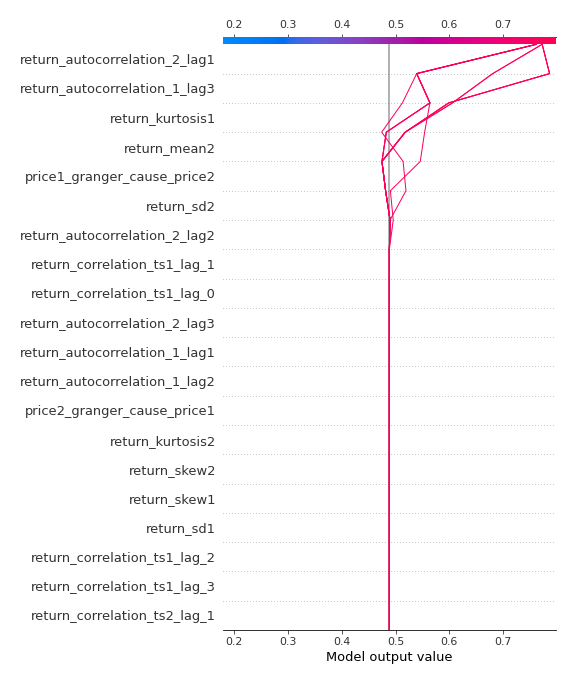
### Top-10 Best decisions for class 0 (Fold 1)
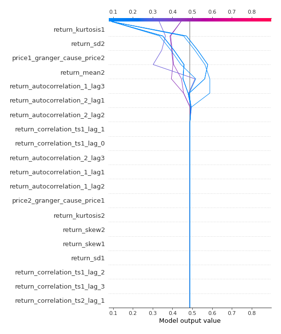
### Top-10 Worst decisions for class 1 (Fold 1)
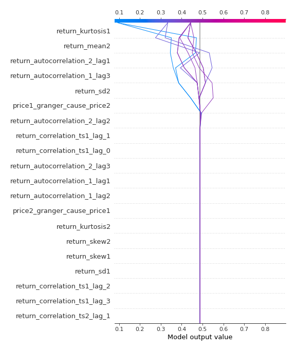
### Top-10 Best decisions for class 1 (Fold 1)
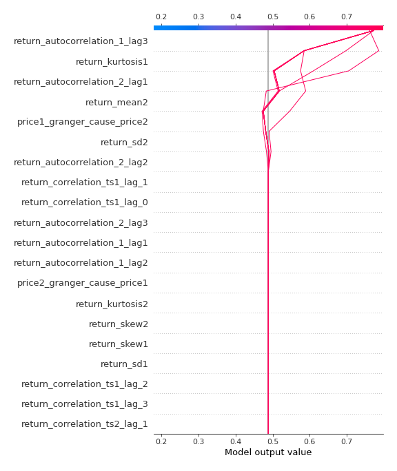

[<< Go back](../README.md)
