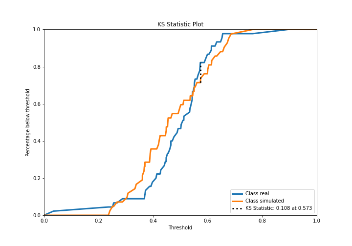
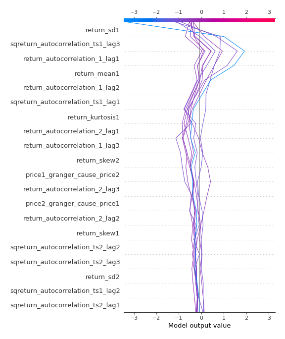

# Summary of 3_Linear

[<< Go back](../README.md)

## Logistic Regression (Linear)
- **n_jobs**: -1
- **explain_level**: 2

## Validation
 - **validation_type**: split
 - **train_ratio**: 0.75
 - **shuffle**: True
 - **stratify**: True

## Optimized metric
accuracy

## Training time

8.8 seconds

## Metric details
|           |    score |   threshold |
|:----------|---------:|------------:|
| logloss   | 0.749782 | nan         |
| auc       | 0.450265 | nan         |
| f1        | 0.651163 |   0.0311691 |
| accuracy  | 0.563218 |   0.573434  |
| precision | 0.8      |   0.669687  |
| recall    | 1        |   0.0311691 |
| mcc       | 0.156768 |   0.669687  |

## Confusion matrix (at threshold=0.573434)
|                      |   Predicted as real |   Predicted as simulated |
|:---------------------|--------------------:|-------------------------:|
| Labeled as real      |                  37 |                        8 |
| Labeled as simulated |                  30 |                       12 |

## Learning curves

## Coefficients
| feature                           |   Learner_1 |
|:----------------------------------|------------:|
| price1_granger_cause_price2       |   0.44426   |
| price2_granger_cause_price1       |   0.390324  |
| return_autocorrelation_1_lag1     |   0.385479  |
| sqreturn_autocorrelation_ts1_lag1 |   0.327215  |
| return_autocorrelation_1_lag2     |   0.304847  |
| return_mean1                      |   0.234252  |
| return_sd2                        |   0.196837  |
| return_skew1                      |   0.165526  |
| return_autocorrelation_2_lag3     |   0.125713  |
| return_autocorrelation_2_lag2     |   0.113626  |
| sqreturn_autocorrelation_ts2_lag2 |   0.0973775 |
| sqreturn_correlation_ts1_lag_3    |   0.080901  |
| return_correlation_ts1_lag_3      |   0.080901  |
| sqreturn_autocorrelation_ts2_lag1 |   0.0643105 |
| return_kurtosis2                  |   0.042617  |
| return_correlation_ts1_lag_2      |   0.0396932 |
| sqreturn_correlation_ts1_lag_2    |   0.0396932 |
| return_correlation_ts1_lag_1      |  -0.0178391 |
| sqreturn_correlation_ts1_lag_1    |  -0.0178391 |
| return_correlation_ts2_lag_3      |  -0.0629868 |
| sqreturn_correlation_ts2_lag_3    |  -0.0629868 |
| return_correlation_ts2_lag_1      |  -0.0652494 |
| sqreturn_correlation_ts2_lag_1    |  -0.0652494 |
| sqreturn_autocorrelation_ts1_lag2 |  -0.0654635 |
| return_correlation_ts2_lag_2      |  -0.0656896 |
| sqreturn_correlation_ts2_lag_2    |  -0.0656896 |
| return_correlation_ts1_lag_0      |  -0.0752664 |
| sqreturn_correlation_ts1_lag_0    |  -0.0752664 |
| sqreturn_autocorrelation_ts2_lag3 |  -0.0786029 |
| return_mean2                      |  -0.140953  |
| return_autocorrelation_1_lag3     |  -0.166842  |
| return_autocorrelation_2_lag1     |  -0.220388  |
| intercept                         |  -0.235556  |
| return_kurtosis1                  |  -0.254651  |
| return_skew2                      |  -0.377233  |
| return_sd1                        |  -0.465799  |
| sqreturn_autocorrelation_ts1_lag3 |  -0.739879  |

## Permutation-based Importance

## Confusion Matrix

## Normalized Confusion Matrix

## ROC Curve

## Kolmogorov-Smirnov Statistic

## Precision-Recall Curve

## Calibration Curve

## Cumulative Gains Curve

## Lift Curve

## SHAP Importance

## SHAP Dependence plots

### Dependence (Fold 1)

## SHAP Decision plots

### Top-10 Worst decisions for class 0 (Fold 1)

### Top-10 Best decisions for class 0 (Fold 1)

### Top-10 Worst decisions for class 1 (Fold 1)

### Top-10 Best decisions for class 1 (Fold 1)

[<< Go back](../README.md)
