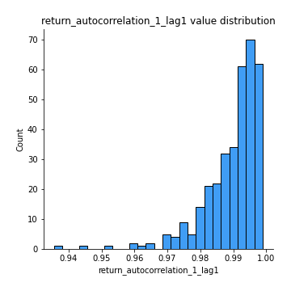
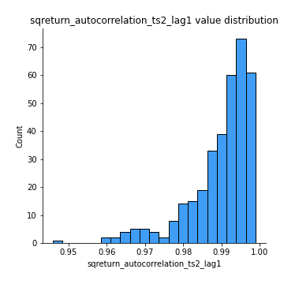

# Exploratory Data Analysis

[<< Go back](../README.md)
## Feature : target
- **Feature type** : categorical
- **Missing** : 0.0%
- **Unique** : 2
- **Count** :347
- **Unique** :2
- **Top** :real
- **Freq** :178

## Feature : return_mean1
- **Feature type** : continous
- **Missing** : 0.0%
- **Unique** : 347
- **Count** :347.0
- **Mean** :50.05495419826513
- **Std** :44.928461862204955
- **Min** :2.041832174
- **25%th Percentile** : 20.494964179
- **50%th Percentile** : 37.706493738000006
- **75%th Percentile** : 63.477552047
- **Max** :368.637599734

## Feature : return_mean2
- **Feature type** : continous
- **Missing** : 0.0%
- **Unique** : 347
- **Count** :347.0
- **Mean** :53.42164756591354
- **Std** :98.7777228721817
- **Min** :0.122436238
- **25%th Percentile** : 17.427599988
- **50%th Percentile** : 30.001943848
- **75%th Percentile** : 54.779804152
- **Max** :968.654841336

## Feature : return_sd1
- **Feature type** : continous
- **Missing** : 0.0%
- **Unique** : 347
- **Count** :347.0
- **Mean** :8.19879824574004
- **Std** :11.94302563468746
- **Min** :0.17075448275615598
- **25%th Percentile** : 2.624407653493239
- **50%th Percentile** : 4.8740627254083755
- **75%th Percentile** : 8.980262825397112
- **Max** :113.75913244339056

## Feature : return_sd2
- **Feature type** : continous
- **Missing** : 0.0%
- **Unique** : 347
- **Count** :347.0
- **Mean** :8.460518214049822
- **Std** :19.45543266904121
- **Min** :0.06022746901081144
- **25%th Percentile** : 2.2680992433769727
- **50%th Percentile** : 4.386768162358565
- **75%th Percentile** : 7.745925811138173
- **Max** :221.10527467938883

## Feature : return_skew1
- **Feature type** : continous
- **Missing** : 0.0%
- **Unique** : 347
- **Count** :347.0
- **Mean** :0.10907256995967364
- **Std** :0.49924135994203417
- **Min** :-1.2969383077901073
- **25%th Percentile** : -0.2253580489224732
- **50%th Percentile** : 0.08673731232345905
- **75%th Percentile** : 0.4893967763272462
- **Max** :1.5535808520192136

## Feature : return_skew2
- **Feature type** : continous
- **Missing** : 0.0%
- **Unique** : 347
- **Count** :347.0
- **Mean** :0.10014093482591185
- **Std** :0.504594210391441
- **Min** :-1.5143013373937064
- **25%th Percentile** : -0.21607552118437573
- **50%th Percentile** : 0.05519964903754846
- **75%th Percentile** : 0.404050660835458
- **Max** :1.723087490745204

## Feature : return_kurtosis1
- **Feature type** : continous
- **Missing** : 0.0%
- **Unique** : 347
- **Count** :347.0
- **Mean** :-0.5905652797234424
- **Std** :0.6484555603916654
- **Min** :-1.6435775800393035
- **25%th Percentile** : -0.9724716388758434
- **50%th Percentile** : -0.7467560651198211
- **75%th Percentile** : -0.35391551537517607
- **Max** :3.256924497920797

## Feature : return_kurtosis2
- **Feature type** : continous
- **Missing** : 0.0%
- **Unique** : 347
- **Count** :347.0
- **Mean** :-0.5798079079160238
- **Std** :0.6746377961897713
- **Min** :-1.5537576053359181
- **25%th Percentile** : -1.029636799474716
- **50%th Percentile** : -0.7527406470423594
- **75%th Percentile** : -0.301555775857687
- **Max** :3.67606360130176

## Feature : return_autocorrelation_1_lag1
- **Feature type** : continous
- **Missing** : 0.0%
- **Unique** : 347
- **Count** :347.0
- **Mean** :0.9895302182330791
- **Std** :0.008631433102648222
- **Min** :0.9355613544071343
- **25%th Percentile** : 0.9861891774848397
- **50%th Percentile** : 0.9921357389956752
- **75%th Percentile** : 0.9953883090036382
- **Max** :0.998907093145209

## Feature : return_autocorrelation_1_lag2
- **Feature type** : continous
- **Missing** : 0.0%
- **Unique** : 347
- **Count** :347.0
- **Mean** :0.9797270401403918
- **Std** :0.016146781222512212
- **Min** :0.8975005092899148
- **25%th Percentile** : 0.9727909591510965
- **50%th Percentile** : 0.9849056509540868
- **75%th Percentile** : 0.9908860562861826
- **Max** :0.9978622646293857

## Feature : return_autocorrelation_1_lag3
- **Feature type** : continous
- **Missing** : 0.0%
- **Unique** : 347
- **Count** :347.0
- **Mean** :0.9702307226767616
- **Std** :0.023537471953532736
- **Min** :0.8527377034295596
- **25%th Percentile** : 0.9606073497766627
- **50%th Percentile** : 0.9779814966559487
- **75%th Percentile** : 0.986808488795984
- **Max** :0.9968227021901522

## Feature : return_autocorrelation_2_lag1
- **Feature type** : continous
- **Missing** : 0.0%
- **Unique** : 347
- **Count** :347.0
- **Mean** :0.9899746384988369
- **Std** :0.008307499589627758
- **Min** :0.9442109633563541
- **25%th Percentile** : 0.9867667682367773
- **50%th Percentile** : 0.9923596588981412
- **75%th Percentile** : 0.9959724774108274
- **Max** :0.9990075551978286

## Feature : return_autocorrelation_2_lag2
- **Feature type** : continous
- **Missing** : 0.0%
- **Unique** : 347
- **Count** :347.0
- **Mean** :0.9805072235907376
- **Std** :0.015734320575555894
- **Min** :0.8945372386327647
- **25%th Percentile** : 0.974078219819899
- **50%th Percentile** : 0.9851753918207162
- **75%th Percentile** : 0.9919410317808278
- **Max** :0.9980152731102225

## Feature : return_autocorrelation_2_lag3
- **Feature type** : continous
- **Missing** : 0.0%
- **Unique** : 347
- **Count** :347.0
- **Mean** :0.9714219306955021
- **Std** :0.022740193069380202
- **Min** :0.8556938656298004
- **25%th Percentile** : 0.9614164704381183
- **50%th Percentile** : 0.9784145780983755
- **75%th Percentile** : 0.9882508828566869
- **Max** :0.9970922117201266

## Feature : return_correlation_ts1_lag_0
- **Feature type** : continous
- **Missing** : 0.0%
- **Unique** : 347
- **Count** :347.0
- **Mean** :0.37924982062848644
- **Std** :0.4696868057265436
- **Min** :-0.9454212056869181
- **25%th Percentile** : 0.0392641327190546
- **50%th Percentile** : 0.5311688232938929
- **75%th Percentile** : 0.7609819474147822
- **Max** :0.9610218489847147

## Feature : return_correlation_ts1_lag_1
- **Feature type** : continous
- **Missing** : 0.0%
- **Unique** : 347
- **Count** :347.0
- **Mean** :0.3760327475598572
- **Std** :0.4702056125062589
- **Min** :-0.9452305740471955
- **25%th Percentile** : 0.030307566375868164
- **50%th Percentile** : 0.5268620990488588
- **75%th Percentile** : 0.7567789899676862
- **Max** :0.9606848527473938

## Feature : return_correlation_ts1_lag_2
- **Feature type** : continous
- **Missing** : 0.0%
- **Unique** : 347
- **Count** :347.0
- **Mean** :0.37318154342282056
- **Std** :0.47061089513619064
- **Min** :-0.9451440682595582
- **25%th Percentile** : 0.029451200855735677
- **50%th Percentile** : 0.5121438649141771
- **75%th Percentile** : 0.7533900316328643
- **Max** :0.9603481768895162

## Feature : return_correlation_ts1_lag_3
- **Feature type** : continous
- **Missing** : 0.0%
- **Unique** : 347
- **Count** :347.0
- **Mean** :0.37053352132904815
- **Std** :0.4709443187926062
- **Min** :-0.9448708035067677
- **25%th Percentile** : 0.0332712650122126
- **50%th Percentile** : 0.5173640931076856
- **75%th Percentile** : 0.7497631033606226
- **Max** :0.9601228296203328

## Feature : return_correlation_ts2_lag_1
- **Feature type** : continous
- **Missing** : 0.0%
- **Unique** : 347
- **Count** :347.0
- **Mean** :0.37604054800029696
- **Std** :0.4702683106818704
- **Min** :-0.9457910375143614
- **25%th Percentile** : 0.03710037604696809
- **50%th Percentile** : 0.5311272776468768
- **75%th Percentile** : 0.759835179426322
- **Max** :0.9582931185741356

## Feature : return_correlation_ts2_lag_2
- **Feature type** : continous
- **Missing** : 0.0%
- **Unique** : 347
- **Count** :347.0
- **Mean** :0.373056330325618
- **Std** :0.47083087071460855
- **Min** :-0.9463260196248172
- **25%th Percentile** : 0.031881432464512256
- **50%th Percentile** : 0.5253964947475122
- **75%th Percentile** : 0.7599350678618871
- **Max** :0.9573084646636364

## Feature : return_correlation_ts2_lag_3
- **Feature type** : continous
- **Missing** : 0.0%
- **Unique** : 347
- **Count** :347.0
- **Mean** :0.3702872999469014
- **Std** :0.4712261726064325
- **Min** :-0.9467149428568907
- **25%th Percentile** : 0.0319080056614331
- **50%th Percentile** : 0.5110291280641047
- **75%th Percentile** : 0.7592177680197401
- **Max** :0.9570016616355986

## Feature : sqreturn_autocorrelation_ts1_lag1
- **Feature type** : continous
- **Missing** : 0.0%
- **Unique** : 347
- **Count** :347.0
- **Mean** :0.9892180808339239
- **Std** :0.008861520968013318
- **Min** :0.9332773406178796
- **25%th Percentile** : 0.98570339084707
- **50%th Percentile** : 0.9917593745445706
- **75%th Percentile** : 0.9953511211966359
- **Max** :0.9986169228928321

## Feature : sqreturn_autocorrelation_ts1_lag2
- **Feature type** : continous
- **Missing** : 0.0%
- **Unique** : 347
- **Count** :347.0
- **Mean** :0.9791571009222765
- **Std** :0.016433981688728172
- **Min** :0.8823581818725827
- **25%th Percentile** : 0.9719019207786199
- **50%th Percentile** : 0.9834257513039114
- **75%th Percentile** : 0.99080989825765
- **Max** :0.9972727873616056

## Feature : sqreturn_autocorrelation_ts1_lag3
- **Feature type** : continous
- **Missing** : 0.0%
- **Unique** : 347
- **Count** :347.0
- **Mean** :0.9694615055068387
- **Std** :0.023709142542139253
- **Min** :0.8522889535016422
- **25%th Percentile** : 0.959411070191935
- **50%th Percentile** : 0.9759323439296367
- **75%th Percentile** : 0.9865237889031546
- **Max** :0.9959512789640361

## Feature : sqreturn_autocorrelation_ts2_lag1
- **Feature type** : continous
- **Missing** : 0.0%
- **Unique** : 347
- **Count** :347.0
- **Mean** :0.9896305158263368
- **Std** :0.008295854621102305
- **Min** :0.9458029581929804
- **25%th Percentile** : 0.9865659686381607
- **50%th Percentile** : 0.9923944712606271
- **75%th Percentile** : 0.9957297580982206
- **Max** :0.9988745118390566

## Feature : sqreturn_autocorrelation_ts2_lag2
- **Feature type** : continous
- **Missing** : 0.0%
- **Unique** : 347
- **Count** :347.0
- **Mean** :0.9798323311045882
- **Std** :0.01577193613083242
- **Min** :0.8967532017908393
- **25%th Percentile** : 0.9730444765589232
- **50%th Percentile** : 0.9850521940031274
- **75%th Percentile** : 0.9911934620818115
- **Max** :0.9976921088288594

## Feature : sqreturn_autocorrelation_ts2_lag3
- **Feature type** : continous
- **Missing** : 0.0%
- **Unique** : 347
- **Count** :347.0
- **Mean** :0.9704288440872954
- **Std** :0.02284114666168014
- **Min** :0.8580676146054256
- **25%th Percentile** : 0.9601068864085448
- **50%th Percentile** : 0.978075075131631
- **75%th Percentile** : 0.9870519788167851
- **Max** :0.9965698341282454

## Feature : sqreturn_correlation_ts1_lag_0
- **Feature type** : continous
- **Missing** : 0.0%
- **Unique** : 347
- **Count** :347.0
- **Mean** :0.37924982062848644
- **Std** :0.4696868057265436
- **Min** :-0.9454212056869181
- **25%th Percentile** : 0.0392641327190546
- **50%th Percentile** : 0.5311688232938929
- **75%th Percentile** : 0.7609819474147822
- **Max** :0.9610218489847147

## Feature : sqreturn_correlation_ts1_lag_1
- **Feature type** : continous
- **Missing** : 0.0%
- **Unique** : 347
- **Count** :347.0
- **Mean** :0.3760327475598572
- **Std** :0.4702056125062589
- **Min** :-0.9452305740471955
- **25%th Percentile** : 0.030307566375868164
- **50%th Percentile** : 0.5268620990488588
- **75%th Percentile** : 0.7567789899676862
- **Max** :0.9606848527473938

## Feature : sqreturn_correlation_ts1_lag_2
- **Feature type** : continous
- **Missing** : 0.0%
- **Unique** : 347
- **Count** :347.0
- **Mean** :0.37318154342282056
- **Std** :0.47061089513619064
- **Min** :-0.9451440682595582
- **25%th Percentile** : 0.029451200855735677
- **50%th Percentile** : 0.5121438649141771
- **75%th Percentile** : 0.7533900316328643
- **Max** :0.9603481768895162

## Feature : sqreturn_correlation_ts1_lag_3
- **Feature type** : continous
- **Missing** : 0.0%
- **Unique** : 347
- **Count** :347.0
- **Mean** :0.37053352132904815
- **Std** :0.4709443187926062
- **Min** :-0.9448708035067677
- **25%th Percentile** : 0.0332712650122126
- **50%th Percentile** : 0.5173640931076856
- **75%th Percentile** : 0.7497631033606226
- **Max** :0.9601228296203328

## Feature : sqreturn_correlation_ts2_lag_1
- **Feature type** : continous
- **Missing** : 0.0%
- **Unique** : 347
- **Count** :347.0
- **Mean** :0.37604054800029696
- **Std** :0.4702683106818704
- **Min** :-0.9457910375143614
- **25%th Percentile** : 0.03710037604696809
- **50%th Percentile** : 0.5311272776468768
- **75%th Percentile** : 0.759835179426322
- **Max** :0.9582931185741356

## Feature : sqreturn_correlation_ts2_lag_2
- **Feature type** : continous
- **Missing** : 0.0%
- **Unique** : 347
- **Count** :347.0
- **Mean** :0.373056330325618
- **Std** :0.47083087071460855
- **Min** :-0.9463260196248172
- **25%th Percentile** : 0.031881432464512256
- **50%th Percentile** : 0.5253964947475122
- **75%th Percentile** : 0.7599350678618871
- **Max** :0.9573084646636364

## Feature : sqreturn_correlation_ts2_lag_3
- **Feature type** : continous
- **Missing** : 0.0%
- **Unique** : 347
- **Count** :347.0
- **Mean** :0.3702872999469014
- **Std** :0.4712261726064325
- **Min** :-0.9467149428568907
- **25%th Percentile** : 0.0319080056614331
- **50%th Percentile** : 0.5110291280641047
- **75%th Percentile** : 0.7592177680197401
- **Max** :0.9570016616355986

## Feature : price2_granger_cause_price1
- **Feature type** : continous
- **Missing** : 0.0%
- **Unique** : 347
- **Count** :347.0
- **Mean** :0.38886740722083396
- **Std** :0.30990091826620964
- **Min** :7.442002876220672e-07
- **25%th Percentile** : 0.08193375873925919
- **50%th Percentile** : 0.3372359424650788
- **75%th Percentile** : 0.6715108687709259
- **Max** :0.9991604192257109

## Feature : price1_granger_cause_price2
- **Feature type** : continous
- **Missing** : 0.0%
- **Unique** : 347
- **Count** :347.0
- **Mean** :0.38423958266451635
- **Std** :0.315782884217125
- **Min** :8.101068402988115e-10
- **25%th Percentile** : 0.09403567456358891
- **50%th Percentile** : 0.31738874623891766
- **75%th Percentile** : 0.6458615777559591
- **Max** :0.9987360641740829

[<< Go back](../README.md)
