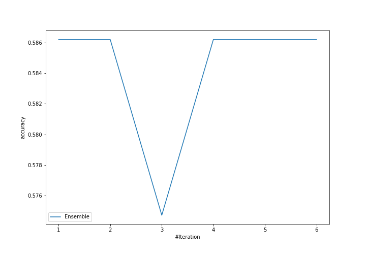
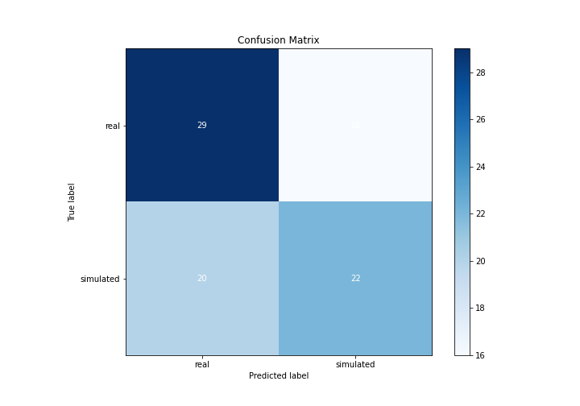
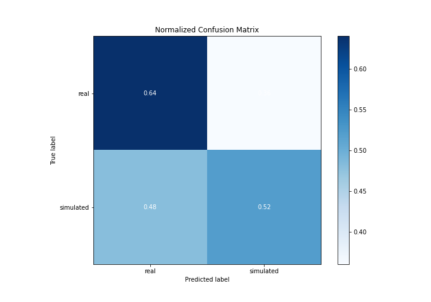
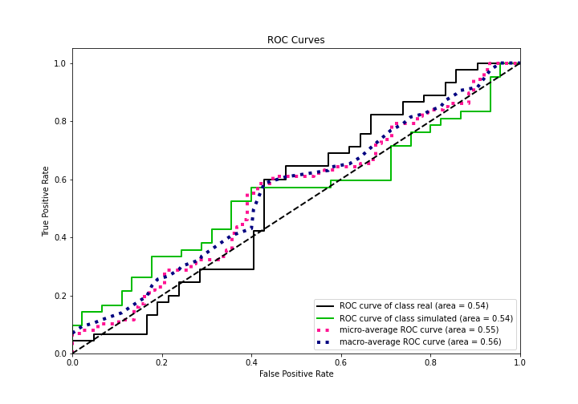
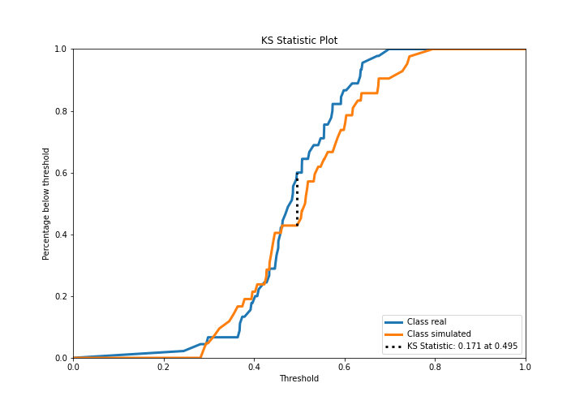
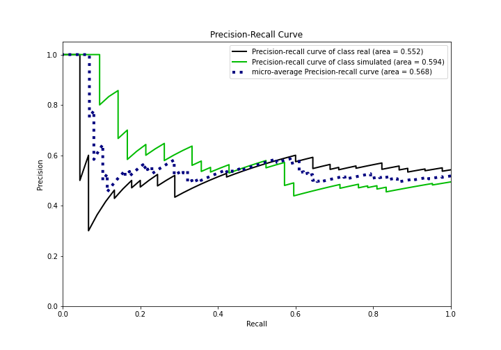
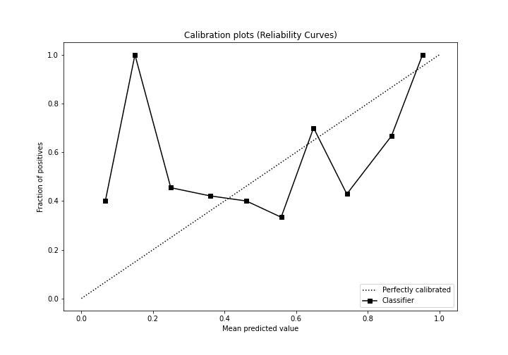
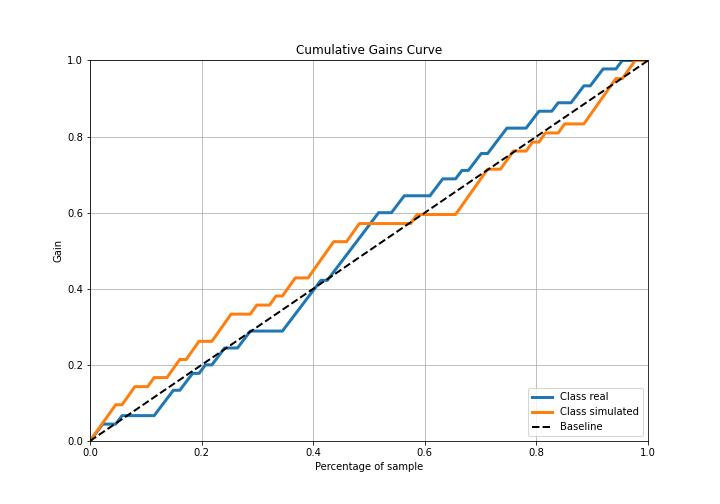
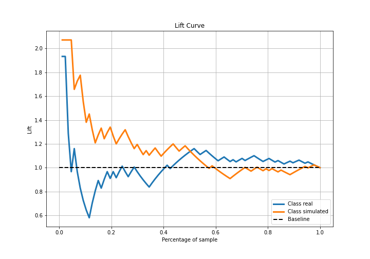

# Summary of Ensemble

[<< Go back](../README.md)

## Ensemble structure
| Model                  |   Weight |
|:-----------------------|---------:|
| 6_Default_RandomForest |        1 |

## Metric details
|           |    score |   threshold |
|:----------|---------:|------------:|
| logloss   | 0.696042 |  nan        |
| auc       | 0.542328 |  nan        |
| f1        | 0.651163 |    0.220066 |
| accuracy  | 0.586207 |    0.511486 |
| precision | 0.833333 |    0.675053 |
| recall    | 1        |    0.220066 |
| mcc       | 0.190942 |    0.675053 |

## Confusion matrix (at threshold=0.511486)
|                      |   Predicted as real |   Predicted as simulated |
|:---------------------|--------------------:|-------------------------:|
| Labeled as real      |                  29 |                       16 |
| Labeled as simulated |                  20 |                       22 |

## Learning curves

## Confusion Matrix

## Normalized Confusion Matrix

## ROC Curve

## Kolmogorov-Smirnov Statistic

## Precision-Recall Curve

## Calibration Curve

## Cumulative Gains Curve

## Lift Curve

[<< Go back](../README.md)
