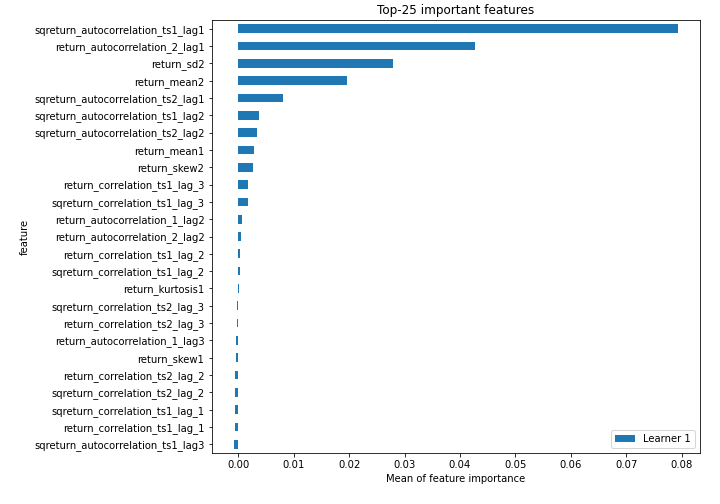
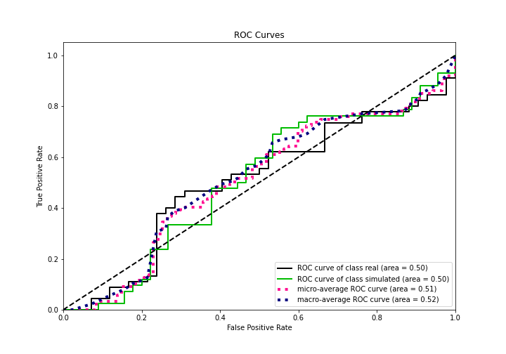

# Summary of 3_Linear

[<< Go back](../README.md)

## Logistic Regression (Linear)
- **n_jobs**: -1
- **explain_level**: 2

## Validation
 - **validation_type**: split
 - **train_ratio**: 0.75
 - **shuffle**: True
 - **stratify**: True

## Optimized metric
accuracy

## Training time

9.1 seconds

## Metric details
|           |    score |   threshold |
|:----------|---------:|------------:|
| logloss   | 0.753006 |  nan        |
| auc       | 0.503704 |  nan        |
| f1        | 0.651163 |    0.137142 |
| accuracy  | 0.574713 |    0.473012 |
| precision | 0.54717  |    0.473012 |
| recall    | 1        |    0.137142 |
| mcc       | 0.160934 |    0.473012 |

## Confusion matrix (at threshold=0.473012)
|                      |   Predicted as real |   Predicted as simulated |
|:---------------------|--------------------:|-------------------------:|
| Labeled as real      |                  21 |                       24 |
| Labeled as simulated |                  13 |                       29 |

## Learning curves

## Coefficients
| feature                           |   Learner_1 |
|:----------------------------------|------------:|
| return_mean2                      |   0.686734  |
| sqreturn_autocorrelation_ts1_lag1 |   0.528356  |
| price2_granger_cause_price1       |   0.451614  |
| sqreturn_autocorrelation_ts2_lag2 |   0.329811  |
| return_autocorrelation_2_lag2     |   0.321202  |
| return_autocorrelation_2_lag3     |   0.25006   |
| price1_granger_cause_price2       |   0.210606  |
| return_kurtosis2                  |   0.195298  |
| return_sd1                        |   0.185961  |
| sqreturn_correlation_ts1_lag_3    |   0.0732077 |
| return_correlation_ts1_lag_3      |   0.0732077 |
| sqreturn_autocorrelation_ts2_lag3 |   0.0731902 |
| sqreturn_autocorrelation_ts1_lag2 |   0.059877  |
| return_skew1                      |   0.0556756 |
| sqreturn_correlation_ts1_lag_2    |   0.0185322 |
| return_correlation_ts1_lag_2      |   0.0185322 |
| return_correlation_ts2_lag_3      |  -0.0149961 |
| sqreturn_correlation_ts2_lag_3    |  -0.0149961 |
| return_kurtosis1                  |  -0.0203169 |
| return_correlation_ts2_lag_2      |  -0.0359776 |
| sqreturn_correlation_ts2_lag_2    |  -0.0359776 |
| return_correlation_ts1_lag_1      |  -0.0373963 |
| sqreturn_correlation_ts1_lag_1    |  -0.0373963 |
| return_autocorrelation_1_lag1     |  -0.0472295 |
| return_mean1                      |  -0.057009  |
| return_correlation_ts2_lag_1      |  -0.0590443 |
| sqreturn_correlation_ts2_lag_1    |  -0.0590443 |
| return_correlation_ts1_lag_0      |  -0.0780341 |
| sqreturn_correlation_ts1_lag_0    |  -0.0780341 |
| sqreturn_autocorrelation_ts2_lag1 |  -0.139151  |
| intercept                         |  -0.170163  |
| sqreturn_autocorrelation_ts1_lag3 |  -0.226458  |
| return_skew2                      |  -0.247355  |
| return_autocorrelation_1_lag2     |  -0.28234   |
| return_autocorrelation_1_lag3     |  -0.28292   |
| return_autocorrelation_2_lag1     |  -0.390991  |
| return_sd2                        |  -0.970087  |

## Permutation-based Importance

## Confusion Matrix

## Normalized Confusion Matrix

## ROC Curve

## Kolmogorov-Smirnov Statistic

## Precision-Recall Curve

## Calibration Curve

## Cumulative Gains Curve

## Lift Curve

## SHAP Importance

## SHAP Dependence plots

### Dependence (Fold 1)

## SHAP Decision plots

### Top-10 Worst decisions for class 0 (Fold 1)

### Top-10 Best decisions for class 0 (Fold 1)

### Top-10 Worst decisions for class 1 (Fold 1)

### Top-10 Best decisions for class 1 (Fold 1)

[<< Go back](../README.md)
