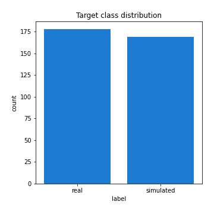
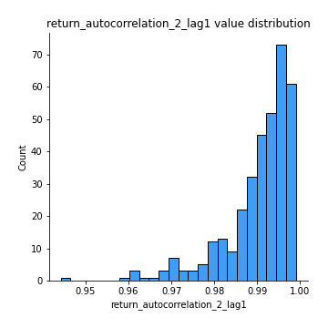

# Exploratory Data Analysis

[<< Go back](../README.md)
## Feature : target
- **Feature type** : categorical
- **Missing** : 0.0%
- **Unique** : 2
- **Count** :347
- **Unique** :2
- **Top** :real
- **Freq** :178

## Feature : return_mean1
- **Feature type** : continous
- **Missing** : 0.0%
- **Unique** : 347
- **Count** :347.0
- **Mean** :46.4751446369683
- **Std** :44.25219221427725
- **Min** :1.885538416
- **25%th Percentile** : 18.626662245999995
- **50%th Percentile** : 33.727051624
- **75%th Percentile** : 61.347831966
- **Max** :368.637599734

## Feature : return_mean2
- **Feature type** : continous
- **Missing** : 0.0%
- **Unique** : 347
- **Count** :347.0
- **Mean** :50.32431711208646
- **Std** :88.25353310497555
- **Min** :0.122436238
- **25%th Percentile** : 19.130680135
- **50%th Percentile** : 31.269702763999998
- **75%th Percentile** : 53.825285279
- **Max** :968.654841336

## Feature : return_sd1
- **Feature type** : continous
- **Missing** : 0.0%
- **Unique** : 347
- **Count** :347.0
- **Mean** :7.304554028724771
- **Std** :10.709109800011314
- **Min** :0.17075448275615598
- **25%th Percentile** : 2.4461604097917555
- **50%th Percentile** : 4.483646390077538
- **75%th Percentile** : 8.576790449979423
- **Max** :113.75913244339056

## Feature : return_sd2
- **Feature type** : continous
- **Missing** : 0.0%
- **Unique** : 347
- **Count** :347.0
- **Mean** :7.7921381177385385
- **Std** :15.987741691896382
- **Min** :0.06022746901081144
- **25%th Percentile** : 2.646110641949601
- **50%th Percentile** : 4.696545249757071
- **75%th Percentile** : 7.745925811138173
- **Max** :221.10527467938883

## Feature : return_skew1
- **Feature type** : continous
- **Missing** : 0.0%
- **Unique** : 347
- **Count** :347.0
- **Mean** :0.06691066101110066
- **Std** :0.4835813294187608
- **Min** :-1.2969383077901073
- **25%th Percentile** : -0.24502155082841928
- **50%th Percentile** : 0.05790257061011905
- **75%th Percentile** : 0.4040832303923575
- **Max** :1.5010388367538123

## Feature : return_skew2
- **Feature type** : continous
- **Missing** : 0.0%
- **Unique** : 347
- **Count** :347.0
- **Mean** :0.09154647110538872
- **Std** :0.5103713862248357
- **Min** :-1.6146280688819945
- **25%th Percentile** : -0.2691263552040101
- **50%th Percentile** : 0.06370302339470368
- **75%th Percentile** : 0.40640824149127686
- **Max** :1.8950824286933763

## Feature : return_kurtosis1
- **Feature type** : continous
- **Missing** : 0.0%
- **Unique** : 347
- **Count** :347.0
- **Mean** :-0.5973087228485019
- **Std** :0.6265503437801617
- **Min** :-1.5625912834372917
- **25%th Percentile** : -0.9947037606156133
- **50%th Percentile** : -0.7338819704363879
- **75%th Percentile** : -0.37713531749589424
- **Max** :2.7204133903766734

## Feature : return_kurtosis2
- **Feature type** : continous
- **Missing** : 0.0%
- **Unique** : 347
- **Count** :347.0
- **Mean** :-0.5894124239800287
- **Std** :0.6998099145340491
- **Min** :-1.5537576053359181
- **25%th Percentile** : -1.0563442547841262
- **50%th Percentile** : -0.7419368647794231
- **75%th Percentile** : -0.36114007816078675
- **Max** :3.67606360130176

## Feature : return_autocorrelation_1_lag1
- **Feature type** : continous
- **Missing** : 0.0%
- **Unique** : 347
- **Count** :347.0
- **Mean** :0.9893782954846654
- **Std** :0.00859585839387572
- **Min** :0.9413419342077411
- **25%th Percentile** : 0.9858095436594468
- **50%th Percentile** : 0.9921315103304474
- **75%th Percentile** : 0.9953883090036382
- **Max** :0.998907093145209

## Feature : return_autocorrelation_1_lag2
- **Feature type** : continous
- **Missing** : 0.0%
- **Unique** : 347
- **Count** :347.0
- **Mean** :0.9794612948711451
- **Std** :0.016156693403858235
- **Min** :0.8983702502230806
- **25%th Percentile** : 0.9722710438681592
- **50%th Percentile** : 0.9848970011044781
- **75%th Percentile** : 0.9907930741087807
- **Max** :0.9978622646293857

## Feature : return_autocorrelation_1_lag3
- **Feature type** : continous
- **Missing** : 0.0%
- **Unique** : 347
- **Count** :347.0
- **Mean** :0.9698615988007074
- **Std** :0.0235218982176581
- **Min** :0.8527377034295596
- **25%th Percentile** : 0.9601336163777014
- **50%th Percentile** : 0.9777793766211351
- **75%th Percentile** : 0.9866840568558883
- **Max** :0.9968227021901522

## Feature : return_autocorrelation_2_lag1
- **Feature type** : continous
- **Missing** : 0.0%
- **Unique** : 347
- **Count** :347.0
- **Mean** :0.9903693807372906
- **Std** :0.008092182007596227
- **Min** :0.9442109633563541
- **25%th Percentile** : 0.9879846183058836
- **50%th Percentile** : 0.9927406810366409
- **75%th Percentile** : 0.9960114078003579
- **Max** :0.9990075551978286

## Feature : return_autocorrelation_2_lag2
- **Feature type** : continous
- **Missing** : 0.0%
- **Unique** : 347
- **Count** :347.0
- **Mean** :0.9812525582780193
- **Std** :0.015493748721137025
- **Min** :0.8945372386327647
- **25%th Percentile** : 0.9764961819858864
- **50%th Percentile** : 0.9858150095573895
- **75%th Percentile** : 0.9920869661784215
- **Max** :0.9980152731102225

## Feature : return_autocorrelation_2_lag3
- **Feature type** : continous
- **Missing** : 0.0%
- **Unique** : 347
- **Count** :347.0
- **Mean** :0.9724988846712239
- **Std** :0.02240981662371344
- **Min** :0.8556938656298004
- **25%th Percentile** : 0.9650645053423084
- **50%th Percentile** : 0.9791908278365871
- **75%th Percentile** : 0.9884501829382855
- **Max** :0.9970922117201266

## Feature : return_correlation_ts1_lag_0
- **Feature type** : continous
- **Missing** : 0.0%
- **Unique** : 347
- **Count** :347.0
- **Mean** :0.4440193447298289
- **Std** :0.4595826571653805
- **Min** :-0.9454212056869181
- **25%th Percentile** : 0.15734735902127592
- **50%th Percentile** : 0.6214552656255101
- **75%th Percentile** : 0.8108955672109706
- **Max** :0.9737538981965371

## Feature : return_correlation_ts1_lag_1
- **Feature type** : continous
- **Missing** : 0.0%
- **Unique** : 347
- **Count** :347.0
- **Mean** :0.44088476586362635
- **Std** :0.4600679056719085
- **Min** :-0.9452305740471955
- **25%th Percentile** : 0.15052129520305424
- **50%th Percentile** : 0.6174353808261379
- **75%th Percentile** : 0.8100778481822586
- **Max** :0.9711085570505825

## Feature : return_correlation_ts1_lag_2
- **Feature type** : continous
- **Missing** : 0.0%
- **Unique** : 347
- **Count** :347.0
- **Mean** :0.43806169552317303
- **Std** :0.46045286349027004
- **Min** :-0.9451440682595582
- **25%th Percentile** : 0.15083627472747718
- **50%th Percentile** : 0.6121763899393636
- **75%th Percentile** : 0.8077225690741274
- **Max** :0.9689525049465741

## Feature : return_correlation_ts1_lag_3
- **Feature type** : continous
- **Missing** : 0.0%
- **Unique** : 347
- **Count** :347.0
- **Mean** :0.4353943389714899
- **Std** :0.46086699232713796
- **Min** :-0.9448708035067677
- **25%th Percentile** : 0.15432318989098465
- **50%th Percentile** : 0.6073467751106789
- **75%th Percentile** : 0.8060740013491701
- **Max** :0.9661881898387052

## Feature : return_correlation_ts2_lag_1
- **Feature type** : continous
- **Missing** : 0.0%
- **Unique** : 347
- **Count** :347.0
- **Mean** :0.44074819317879943
- **Std** :0.460168349986239
- **Min** :-0.9457910375143614
- **25%th Percentile** : 0.15694794007002316
- **50%th Percentile** : 0.6134143185720462
- **75%th Percentile** : 0.8080806216022356
- **Max** :0.9724436077344459

## Feature : return_correlation_ts2_lag_2
- **Feature type** : continous
- **Missing** : 0.0%
- **Unique** : 347
- **Count** :347.0
- **Mean** :0.4377786001771393
- **Std** :0.4607380545896698
- **Min** :-0.9463260196248172
- **25%th Percentile** : 0.16175803304893216
- **50%th Percentile** : 0.6043799882542106
- **75%th Percentile** : 0.8056887468088514
- **Max** :0.9717047956671369

## Feature : return_correlation_ts2_lag_3
- **Feature type** : continous
- **Missing** : 0.0%
- **Unique** : 347
- **Count** :347.0
- **Mean** :0.4349616229874011
- **Std** :0.4612455766095857
- **Min** :-0.9467149428568907
- **25%th Percentile** : 0.16530125861056527
- **50%th Percentile** : 0.5999096276225491
- **75%th Percentile** : 0.804375639295773
- **Max** :0.970545073163944

## Feature : sqreturn_autocorrelation_ts1_lag1
- **Feature type** : continous
- **Missing** : 0.0%
- **Unique** : 347
- **Count** :347.0
- **Mean** :0.9890386220468403
- **Std** :0.008960136255321114
- **Min** :0.9332773406178796
- **25%th Percentile** : 0.9855989715021118
- **50%th Percentile** : 0.991699423773002
- **75%th Percentile** : 0.995141195032672
- **Max** :0.9986169228928321

## Feature : sqreturn_autocorrelation_ts1_lag2
- **Feature type** : continous
- **Missing** : 0.0%
- **Unique** : 347
- **Count** :347.0
- **Mean** :0.9788613247924605
- **Std** :0.016545645703387693
- **Min** :0.8823581818725827
- **25%th Percentile** : 0.9719117522838316
- **50%th Percentile** : 0.9836137550708303
- **75%th Percentile** : 0.9904867688741938
- **Max** :0.9972727873616056

## Feature : sqreturn_autocorrelation_ts1_lag3
- **Feature type** : continous
- **Missing** : 0.0%
- **Unique** : 347
- **Count** :347.0
- **Mean** :0.9690683140969336
- **Std** :0.023756941649228275
- **Min** :0.8522889535016422
- **25%th Percentile** : 0.9592790990340023
- **50%th Percentile** : 0.9761914050132106
- **75%th Percentile** : 0.9861364786712028
- **Max** :0.9959512789640361

## Feature : sqreturn_autocorrelation_ts2_lag1
- **Feature type** : continous
- **Missing** : 0.0%
- **Unique** : 347
- **Count** :347.0
- **Mean** :0.9899791018327022
- **Std** :0.008175012674489729
- **Min** :0.9458029581929804
- **25%th Percentile** : 0.9875643359295562
- **50%th Percentile** : 0.9923944712606271
- **75%th Percentile** : 0.9958468239671743
- **Max** :0.9988745118390566

## Feature : sqreturn_autocorrelation_ts2_lag2
- **Feature type** : continous
- **Missing** : 0.0%
- **Unique** : 347
- **Count** :347.0
- **Mean** :0.9805231600108387
- **Std** :0.01568478959202525
- **Min** :0.8967532017908393
- **25%th Percentile** : 0.9755938579606622
- **50%th Percentile** : 0.9854332010086267
- **75%th Percentile** : 0.9918589939904439
- **Max** :0.9976921088288594

## Feature : sqreturn_autocorrelation_ts2_lag3
- **Feature type** : continous
- **Missing** : 0.0%
- **Unique** : 347
- **Count** :347.0
- **Mean** :0.971449475448796
- **Std** :0.022672394809046124
- **Min** :0.8580676146054256
- **25%th Percentile** : 0.9635801236555431
- **50%th Percentile** : 0.9785190186473356
- **75%th Percentile** : 0.987701102006589
- **Max** :0.9965698341282454

## Feature : sqreturn_correlation_ts1_lag_0
- **Feature type** : continous
- **Missing** : 0.0%
- **Unique** : 347
- **Count** :347.0
- **Mean** :0.4440193447298289
- **Std** :0.4595826571653805
- **Min** :-0.9454212056869181
- **25%th Percentile** : 0.15734735902127592
- **50%th Percentile** : 0.6214552656255101
- **75%th Percentile** : 0.8108955672109706
- **Max** :0.9737538981965371

## Feature : sqreturn_correlation_ts1_lag_1
- **Feature type** : continous
- **Missing** : 0.0%
- **Unique** : 347
- **Count** :347.0
- **Mean** :0.44088476586362635
- **Std** :0.4600679056719085
- **Min** :-0.9452305740471955
- **25%th Percentile** : 0.15052129520305424
- **50%th Percentile** : 0.6174353808261379
- **75%th Percentile** : 0.8100778481822586
- **Max** :0.9711085570505825

## Feature : sqreturn_correlation_ts1_lag_2
- **Feature type** : continous
- **Missing** : 0.0%
- **Unique** : 347
- **Count** :347.0
- **Mean** :0.43806169552317303
- **Std** :0.46045286349027004
- **Min** :-0.9451440682595582
- **25%th Percentile** : 0.15083627472747718
- **50%th Percentile** : 0.6121763899393636
- **75%th Percentile** : 0.8077225690741274
- **Max** :0.9689525049465741

## Feature : sqreturn_correlation_ts1_lag_3
- **Feature type** : continous
- **Missing** : 0.0%
- **Unique** : 347
- **Count** :347.0
- **Mean** :0.4353943389714899
- **Std** :0.46086699232713796
- **Min** :-0.9448708035067677
- **25%th Percentile** : 0.15432318989098465
- **50%th Percentile** : 0.6073467751106789
- **75%th Percentile** : 0.8060740013491701
- **Max** :0.9661881898387052

## Feature : sqreturn_correlation_ts2_lag_1
- **Feature type** : continous
- **Missing** : 0.0%
- **Unique** : 347
- **Count** :347.0
- **Mean** :0.44074819317879943
- **Std** :0.460168349986239
- **Min** :-0.9457910375143614
- **25%th Percentile** : 0.15694794007002316
- **50%th Percentile** : 0.6134143185720462
- **75%th Percentile** : 0.8080806216022356
- **Max** :0.9724436077344459

## Feature : sqreturn_correlation_ts2_lag_2
- **Feature type** : continous
- **Missing** : 0.0%
- **Unique** : 347
- **Count** :347.0
- **Mean** :0.4377786001771393
- **Std** :0.4607380545896698
- **Min** :-0.9463260196248172
- **25%th Percentile** : 0.16175803304893216
- **50%th Percentile** : 0.6043799882542106
- **75%th Percentile** : 0.8056887468088514
- **Max** :0.9717047956671369

## Feature : sqreturn_correlation_ts2_lag_3
- **Feature type** : continous
- **Missing** : 0.0%
- **Unique** : 347
- **Count** :347.0
- **Mean** :0.4349616229874011
- **Std** :0.4612455766095857
- **Min** :-0.9467149428568907
- **25%th Percentile** : 0.16530125861056527
- **50%th Percentile** : 0.5999096276225491
- **75%th Percentile** : 0.804375639295773
- **Max** :0.970545073163944

## Feature : price2_granger_cause_price1
- **Feature type** : continous
- **Missing** : 0.0%
- **Unique** : 347
- **Count** :347.0
- **Mean** :0.378827409202324
- **Std** :0.3008423940520502
- **Min** :7.442002876220672e-07
- **25%th Percentile** : 0.08595187963839743
- **50%th Percentile** : 0.3231554446399989
- **75%th Percentile** : 0.6414746546869938
- **Max** :0.9991604192257109

## Feature : price1_granger_cause_price2
- **Feature type** : continous
- **Missing** : 0.0%
- **Unique** : 347
- **Count** :347.0
- **Mean** :0.37619802462040275
- **Std** :0.30492911960311603
- **Min** :1.6674455312589196e-07
- **25%th Percentile** : 0.09817963670205213
- **50%th Percentile** : 0.30808368407556624
- **75%th Percentile** : 0.6236632266229911
- **Max** :0.9969138565505037

[<< Go back](../README.md)
