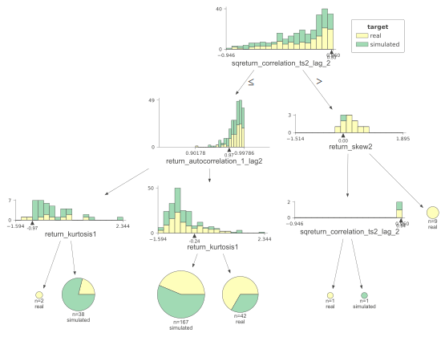

# Summary of 2_DecisionTree

[<< Go back](../README.md)

## Decision Tree
- **n_jobs**: -1
- **criterion**: gini
- **max_depth**: 3
- **explain_level**: 2

## Validation
 - **validation_type**: split
 - **train_ratio**: 0.75
 - **shuffle**: True
 - **stratify**: True

## Optimized metric
accuracy

## Training time

11.2 seconds

## Metric details
|           |    score |   threshold |
|:----------|---------:|------------:|
| logloss   | 0.669303 |  nan        |
| auc       | 0.59016  |  nan        |
| f1        | 0.717557 |    0        |
| accuracy  | 0.574713 |    0        |
| precision | 0.65     |    0.676174 |
| recall    | 1        |    0        |
| mcc       | 0.120338 |    0.676174 |

## Confusion matrix (at threshold=0.0)
|                      |   Predicted as real |   Predicted as simulated |
|:---------------------|--------------------:|-------------------------:|
| Labeled as real      |                   3 |                       37 |
| Labeled as simulated |                   0 |                       47 |

## Learning curves

## Decision Tree 

### Tree #1

### Rules

if (sqreturn_correlation_ts2_lag_2 <= 0.93) and (return_autocorrelation_1_lag2 > 0.968) and (return_kurtosis1 <= -0.245) then class: simulated (proba: 56.29%) | based on 167 samples

if (sqreturn_correlation_ts2_lag_2 <= 0.93) and (return_autocorrelation_1_lag2 > 0.968) and (return_kurtosis1 > -0.245) then class: real (proba: 66.67%) | based on 42 samples

if (sqreturn_correlation_ts2_lag_2 <= 0.93) and (return_autocorrelation_1_lag2 <= 0.968) and (return_kurtosis1 > -0.975) then class: simulated (proba: 78.95%) | based on 38 samples

if (sqreturn_correlation_ts2_lag_2 > 0.93) and (return_skew2 > 0.001) then class: real (proba: 100.0%) | based on 9 samples

if (sqreturn_correlation_ts2_lag_2 <= 0.93) and (return_autocorrelation_1_lag2 <= 0.968) and (return_kurtosis1 <= -0.975) then class: real (proba: 100.0%) | based on 2 samples

if (sqreturn_correlation_ts2_lag_2 > 0.93) and (return_skew2 <= 0.001) and (sqreturn_correlation_ts2_lag_2 > 0.938) then class: simulated (proba: 100.0%) | based on 1 samples

if (sqreturn_correlation_ts2_lag_2 > 0.93) and (return_skew2 <= 0.001) and (sqreturn_correlation_ts2_lag_2 <= 0.938) then class: real (proba: 100.0%) | based on 1 samples

## Permutation-based Importance

## Confusion Matrix

## Normalized Confusion Matrix

## ROC Curve

## Kolmogorov-Smirnov Statistic

## Precision-Recall Curve

## Calibration Curve

## Cumulative Gains Curve

## Lift Curve

## SHAP Importance

## SHAP Dependence plots

### Dependence (Fold 1)

## SHAP Decision plots

### Top-10 Worst decisions for class 0 (Fold 1)

### Top-10 Best decisions for class 0 (Fold 1)

### Top-10 Worst decisions for class 1 (Fold 1)

### Top-10 Best decisions for class 1 (Fold 1)

[<< Go back](../README.md)
