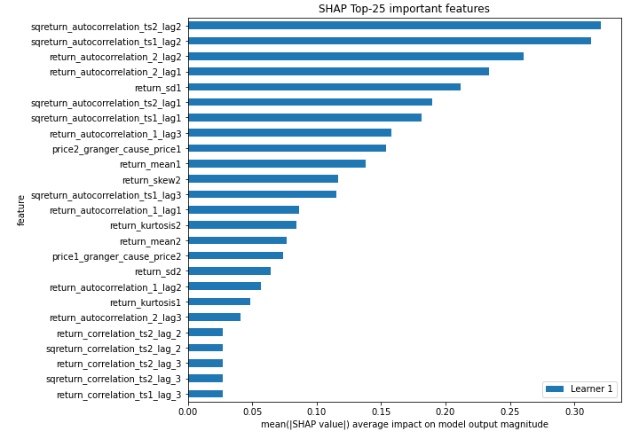

# Summary of 3_Linear

[<< Go back](../README.md)

## Logistic Regression (Linear)
- **n_jobs**: -1
- **explain_level**: 2

## Validation
 - **validation_type**: split
 - **train_ratio**: 0.75
 - **shuffle**: True
 - **stratify**: True

## Optimized metric
accuracy

## Training time

10.4 seconds

## Metric details
|           |    score |   threshold |
|:----------|---------:|------------:|
| logloss   | 0.72688  | nan         |
| auc       | 0.496809 | nan         |
| f1        | 0.701493 |   0.0357621 |
| accuracy  | 0.563218 |   0.555666  |
| precision | 0.619048 |   0.636443  |
| recall    | 1        |   0.0357621 |
| mcc       | 0.135928 |   0.555666  |

## Confusion matrix (at threshold=0.555666)
|                      |   Predicted as real |   Predicted as simulated |
|:---------------------|--------------------:|-------------------------:|
| Labeled as real      |                  25 |                       15 |
| Labeled as simulated |                  23 |                       24 |

## Learning curves

## Coefficients
| feature                           |   Learner_1 |
|:----------------------------------|------------:|
| price2_granger_cause_price1       |  0.591917   |
| sqreturn_autocorrelation_ts2_lag2 |  0.481708   |
| return_autocorrelation_2_lag2     |  0.404076   |
| price1_granger_cause_price2       |  0.296747   |
| return_autocorrelation_1_lag3     |  0.192409   |
| return_mean1                      |  0.185023   |
| return_mean2                      |  0.17544    |
| sqreturn_autocorrelation_ts1_lag3 |  0.140071   |
| return_autocorrelation_1_lag1     |  0.108136   |
| return_kurtosis2                  |  0.102283   |
| sqreturn_correlation_ts1_lag_3    |  0.0693007  |
| return_correlation_ts1_lag_3      |  0.0693007  |
| return_autocorrelation_2_lag3     |  0.0625354  |
| sqreturn_correlation_ts1_lag_2    |  0.0360174  |
| return_correlation_ts1_lag_2      |  0.0360174  |
| sqreturn_autocorrelation_ts2_lag3 |  0.00257627 |
| sqreturn_correlation_ts1_lag_1    | -0.00937035 |
| return_correlation_ts1_lag_1      | -0.00937035 |
| intercept                         | -0.0365224  |
| return_skew1                      | -0.0511949  |
| return_correlation_ts1_lag_0      | -0.0600294  |
| sqreturn_correlation_ts1_lag_0    | -0.0600294  |
| return_correlation_ts2_lag_1      | -0.060333   |
| sqreturn_correlation_ts2_lag_1    | -0.060333   |
| return_autocorrelation_1_lag2     | -0.070442   |
| sqreturn_correlation_ts2_lag_3    | -0.0704793  |
| return_correlation_ts2_lag_3      | -0.0704793  |
| return_correlation_ts2_lag_2      | -0.070603   |
| sqreturn_correlation_ts2_lag_2    | -0.070603   |
| return_kurtosis1                  | -0.0788977  |
| return_sd2                        | -0.217849   |
| sqreturn_autocorrelation_ts1_lag1 | -0.227373   |
| return_skew2                      | -0.269688   |
| return_sd1                        | -0.285707   |
| sqreturn_autocorrelation_ts2_lag1 | -0.288139   |
| return_autocorrelation_2_lag1     | -0.364677   |
| sqreturn_autocorrelation_ts1_lag2 | -0.386341   |

## Permutation-based Importance

## Confusion Matrix

## Normalized Confusion Matrix

## ROC Curve

## Kolmogorov-Smirnov Statistic

## Precision-Recall Curve

## Calibration Curve

## Cumulative Gains Curve

## Lift Curve

## SHAP Importance

## SHAP Dependence plots

### Dependence (Fold 1)

## SHAP Decision plots

### Top-10 Worst decisions for class 0 (Fold 1)

### Top-10 Best decisions for class 0 (Fold 1)

### Top-10 Worst decisions for class 1 (Fold 1)

### Top-10 Best decisions for class 1 (Fold 1)

[<< Go back](../README.md)
