# Exploratory Data Analysis

[<< Go back](../README.md)
## Feature : target
- **Feature type** : categorical
- **Missing** : 0.0%
- **Unique** : 2
- **Count** :347
- **Unique** :2
- **Top** :simulated
- **Freq** :186

## Feature : return_mean1
- **Feature type** : continous
- **Missing** : 0.0%
- **Unique** : 347
- **Count** :347.0
- **Mean** :49.0581395768242
- **Std** :45.07842939236274
- **Min** :1.885538416
- **25%th Percentile** : 19.555044248
- **50%th Percentile** : 37.891407848
- **75%th Percentile** : 63.873939007000004
- **Max** :368.637599734

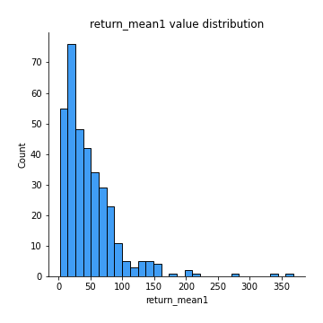
## Feature : return_mean2
- **Feature type** : continous
- **Missing** : 0.0%
- **Unique** : 347
- **Count** :347.0
- **Mean** :52.60254911682421
- **Std** :95.60802064368737
- **Min** :0.122436238
- **25%th Percentile** : 19.096126557
- **50%th Percentile** : 32.428582244
- **75%th Percentile** : 54.862314818
- **Max** :968.654841336

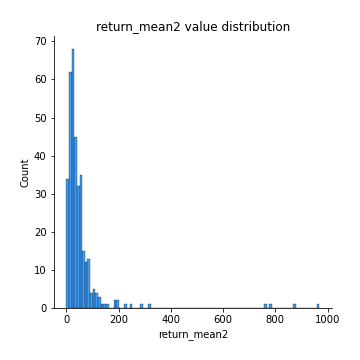
## Feature : return_sd1
- **Feature type** : continous
- **Missing** : 0.0%
- **Unique** : 347
- **Count** :347.0
- **Mean** :7.755191350293738
- **Std** :11.032901299167664
- **Min** :0.20926397957890733
- **25%th Percentile** : 2.5910791870247056
- **50%th Percentile** : 4.805882501306376
- **75%th Percentile** : 8.987564597946218
- **Max** :113.75913244339056

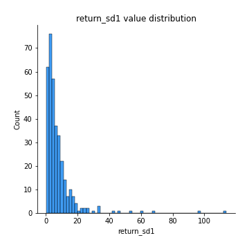
## Feature : return_sd2
- **Feature type** : continous
- **Missing** : 0.0%
- **Unique** : 347
- **Count** :347.0
- **Mean** :8.379418494745728
- **Std** :19.113658700117764
- **Min** :0.06022746901081144
- **25%th Percentile** : 2.497330597166126
- **50%th Percentile** : 4.523056897981553
- **75%th Percentile** : 7.6885774366272805
- **Max** :221.10527467938883

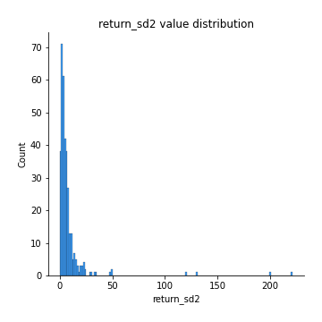
## Feature : return_skew1
- **Feature type** : continous
- **Missing** : 0.0%
- **Unique** : 347
- **Count** :347.0
- **Mean** :0.08753181468293686
- **Std** :0.5034991715527554
- **Min** :-1.2969383077901073
- **25%th Percentile** : -0.238448674795858
- **50%th Percentile** : 0.050384366003558854
- **75%th Percentile** : 0.4436347872823695
- **Max** :1.517442952270221

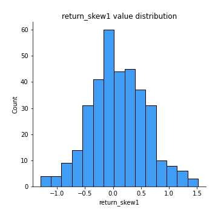
## Feature : return_skew2
- **Feature type** : continous
- **Missing** : 0.0%
- **Unique** : 347
- **Count** :347.0
- **Mean** :0.12118117484635285
- **Std** :0.505768742609179
- **Min** :-1.6146280688819945
- **25%th Percentile** : -0.1985203972583342
- **50%th Percentile** : 0.10464636017753738
- **75%th Percentile** : 0.4169822644756879
- **Max** :1.8950824286933763

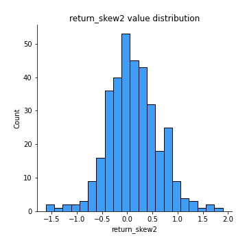
## Feature : return_kurtosis1
- **Feature type** : continous
- **Missing** : 0.0%
- **Unique** : 347
- **Count** :347.0
- **Mean** :-0.5896688313838259
- **Std** :0.6283525506091818
- **Min** :-1.6435775800393035
- **25%th Percentile** : -0.9848782418601858
- **50%th Percentile** : -0.75375359308345
- **75%th Percentile** : -0.36318203892981615
- **Max** :2.3439791044866163

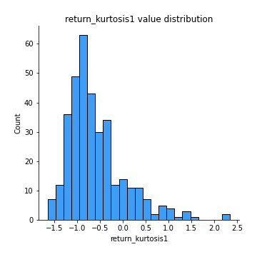
## Feature : return_kurtosis2
- **Feature type** : continous
- **Missing** : 0.0%
- **Unique** : 347
- **Count** :347.0
- **Mean** :-0.5776152490264226
- **Std** :0.7014877101561006
- **Min** :-1.5537576053359181
- **25%th Percentile** : -1.0564693439170152
- **50%th Percentile** : -0.7164407469619576
- **75%th Percentile** : -0.29378324925023613
- **Max** :3.67606360130176

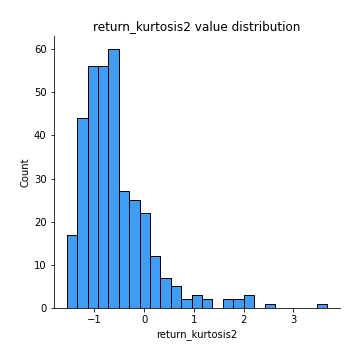
## Feature : return_autocorrelation_1_lag1
- **Feature type** : continous
- **Missing** : 0.0%
- **Unique** : 347
- **Count** :347.0
- **Mean** :0.9899134248144797
- **Std** :0.007362494418930992
- **Min** :0.9527857808185859
- **25%th Percentile** : 0.9864263433399572
- **50%th Percentile** : 0.9919644670052201
- **75%th Percentile** : 0.9954574088096227
- **Max** :0.998907093145209

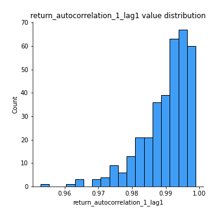
## Feature : return_autocorrelation_1_lag2
- **Feature type** : continous
- **Missing** : 0.0%
- **Unique** : 347
- **Count** :347.0
- **Mean** :0.9803318461777794
- **Std** :0.014290364847647436
- **Min** :0.9017820920753983
- **25%th Percentile** : 0.9731646127589282
- **50%th Percentile** : 0.9842742566573484
- **75%th Percentile** : 0.9910266733869681
- **Max** :0.9978622646293857

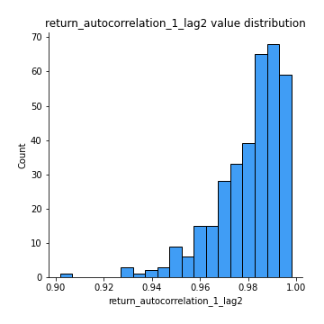
## Feature : return_autocorrelation_1_lag3
- **Feature type** : continous
- **Missing** : 0.0%
- **Unique** : 347
- **Count** :347.0
- **Mean** :0.9710745840629684
- **Std** :0.021011196240917757
- **Min** :0.8527377034295596
- **25%th Percentile** : 0.9612128550068129
- **50%th Percentile** : 0.9776864197679511
- **75%th Percentile** : 0.986914160990761
- **Max** :0.9968227021901522

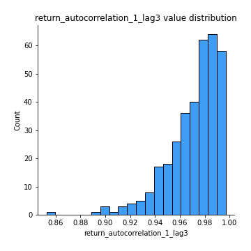
## Feature : return_autocorrelation_2_lag1
- **Feature type** : continous
- **Missing** : 0.0%
- **Unique** : 347
- **Count** :347.0
- **Mean** :0.9901207045456434
- **Std** :0.008390315037233155
- **Min** :0.9442109633563541
- **25%th Percentile** : 0.9877293480069753
- **50%th Percentile** : 0.9923505111615091
- **75%th Percentile** : 0.9960467387367375
- **Max** :0.9990075551978286

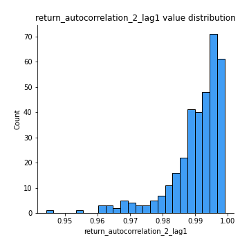
## Feature : return_autocorrelation_2_lag2
- **Feature type** : continous
- **Missing** : 0.0%
- **Unique** : 347
- **Count** :347.0
- **Mean** :0.9808050255554248
- **Std** :0.015865552505501663
- **Min** :0.8945372386327647
- **25%th Percentile** : 0.9755108415721175
- **50%th Percentile** : 0.9851982395639332
- **75%th Percentile** : 0.9921322958508527
- **Max** :0.9980152731102225

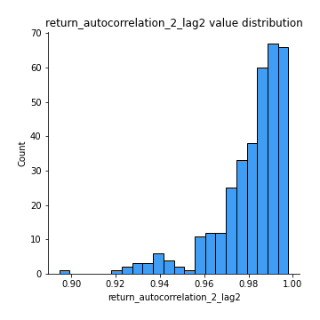
## Feature : return_autocorrelation_2_lag3
- **Feature type** : continous
- **Missing** : 0.0%
- **Unique** : 347
- **Count** :347.0
- **Mean** :0.9718041652262746
- **Std** :0.022909901007217834
- **Min** :0.8556938656298004
- **25%th Percentile** : 0.9635529012387873
- **50%th Percentile** : 0.9780826973621549
- **75%th Percentile** : 0.9884501829382855
- **Max** :0.9970922117201266

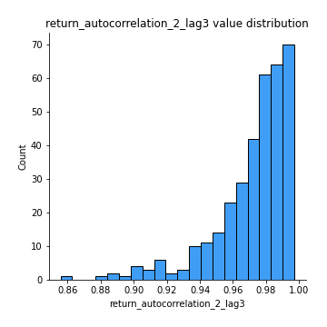
## Feature : return_correlation_ts1_lag_0
- **Feature type** : continous
- **Missing** : 0.0%
- **Unique** : 347
- **Count** :347.0
- **Mean** :0.40842046029698
- **Std** :0.4599953629403996
- **Min** :-0.9454212056869181
- **25%th Percentile** : 0.1241356512287324
- **50%th Percentile** : 0.5446767382658027
- **75%th Percentile** : 0.7793359680274294
- **Max** :0.9629314841496843

## Feature : return_correlation_ts1_lag_1
- **Feature type** : continous
- **Missing** : 0.0%
- **Unique** : 347
- **Count** :347.0
- **Mean** :0.4052521378064371
- **Std** :0.46022839436523083
- **Min** :-0.9452305740471955
- **25%th Percentile** : 0.11935405756281872
- **50%th Percentile** : 0.5399991407862761
- **75%th Percentile** : 0.7792460855566421
- **Max** :0.9622575959379156

## Feature : return_correlation_ts1_lag_2
- **Feature type** : continous
- **Missing** : 0.0%
- **Unique** : 347
- **Count** :347.0
- **Mean** :0.4023984822326325
- **Std** :0.4603612538348195
- **Min** :-0.9451440682595582
- **25%th Percentile** : 0.11748434830991887
- **50%th Percentile** : 0.5407360795256124
- **75%th Percentile** : 0.7778861227175096
- **Max** :0.961475687521161

## Feature : return_correlation_ts1_lag_3
- **Feature type** : continous
- **Missing** : 0.0%
- **Unique** : 347
- **Count** :347.0
- **Mean** :0.3996393318971069
- **Std** :0.460478307218082
- **Min** :-0.9448708035067677
- **25%th Percentile** : 0.11628162906560238
- **50%th Percentile** : 0.529241409387446
- **75%th Percentile** : 0.7748530399560818
- **Max** :0.9609166269912282

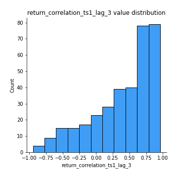
## Feature : return_correlation_ts2_lag_1
- **Feature type** : continous
- **Missing** : 0.0%
- **Unique** : 347
- **Count** :347.0
- **Mean** :0.4054722139836707
- **Std** :0.4604944075917344
- **Min** :-0.9457910375143614
- **25%th Percentile** : 0.12332859338204133
- **50%th Percentile** : 0.545702624204277
- **75%th Percentile** : 0.7744292182357055
- **Max** :0.9618819791386621

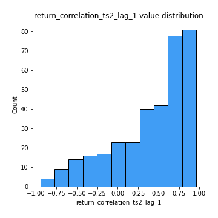
## Feature : return_correlation_ts2_lag_2
- **Feature type** : continous
- **Missing** : 0.0%
- **Unique** : 347
- **Count** :347.0
- **Mean** :0.40276106917263227
- **Std** :0.46100062994598906
- **Min** :-0.9463260196248172
- **25%th Percentile** : 0.1226471588169332
- **50%th Percentile** : 0.5471369683823232
- **75%th Percentile** : 0.7702263530842189
- **Max** :0.9612484058484547

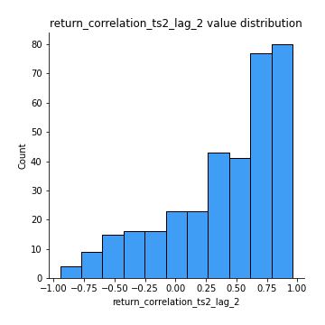
## Feature : return_correlation_ts2_lag_3
- **Feature type** : continous
- **Missing** : 0.0%
- **Unique** : 347
- **Count** :347.0
- **Mean** :0.40018454756277405
- **Std** :0.4613654562655875
- **Min** :-0.9467149428568907
- **25%th Percentile** : 0.11984046596232623
- **50%th Percentile** : 0.5434317277227839
- **75%th Percentile** : 0.7676339897803659
- **Max** :0.9606559891023181

## Feature : sqreturn_autocorrelation_ts1_lag1
- **Feature type** : continous
- **Missing** : 0.0%
- **Unique** : 347
- **Count** :347.0
- **Mean** :0.9896114249234184
- **Std** :0.007406939531148894
- **Min** :0.9522834284655625
- **25%th Percentile** : 0.9861965895656877
- **50%th Percentile** : 0.9915987825533852
- **75%th Percentile** : 0.9951919348364711
- **Max** :0.9986169228928321

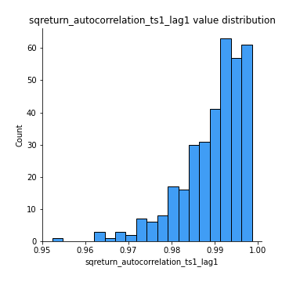
## Feature : sqreturn_autocorrelation_ts1_lag2
- **Feature type** : continous
- **Missing** : 0.0%
- **Unique** : 347
- **Count** :347.0
- **Mean** :0.9797578410276941
- **Std** :0.014334979189685473
- **Min** :0.9011539463042845
- **25%th Percentile** : 0.9721620350335376
- **50%th Percentile** : 0.98335796967847
- **75%th Percentile** : 0.9907073133060524
- **Max** :0.9972727873616056

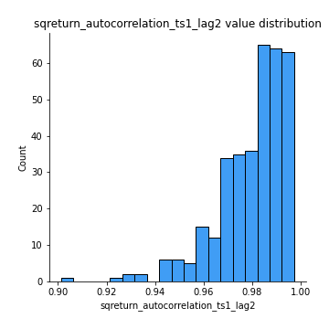
## Feature : sqreturn_autocorrelation_ts1_lag3
- **Feature type** : continous
- **Missing** : 0.0%
- **Unique** : 347
- **Count** :347.0
- **Mean** :0.9702629955416165
- **Std** :0.02105775054672904
- **Min** :0.8522889535016422
- **25%th Percentile** : 0.9602025032832453
- **50%th Percentile** : 0.9751623775833843
- **75%th Percentile** : 0.9862199710017965
- **Max** :0.9959512789640361

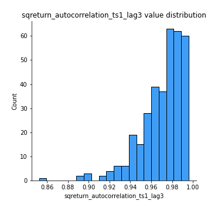
## Feature : sqreturn_autocorrelation_ts2_lag1
- **Feature type** : continous
- **Missing** : 0.0%
- **Unique** : 347
- **Count** :347.0
- **Mean** :0.9898146567142269
- **Std** :0.008373349335796323
- **Min** :0.9458029581929804
- **25%th Percentile** : 0.9872967579029804
- **50%th Percentile** : 0.9922906449385014
- **75%th Percentile** : 0.9958609453135712
- **Max** :0.9988745118390566

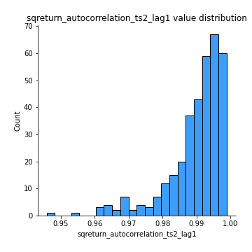
## Feature : sqreturn_autocorrelation_ts2_lag2
- **Feature type** : continous
- **Missing** : 0.0%
- **Unique** : 347
- **Count** :347.0
- **Mean** :0.9802149270159692
- **Std** :0.01587311000317409
- **Min** :0.8967532017908393
- **25%th Percentile** : 0.9748767497711954
- **50%th Percentile** : 0.9853199781437383
- **75%th Percentile** : 0.9917818846981415
- **Max** :0.9976921088288594

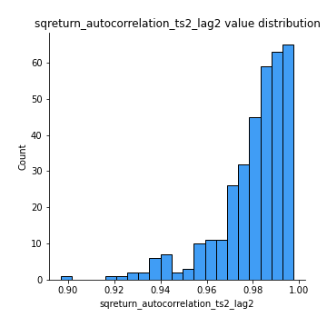
## Feature : sqreturn_autocorrelation_ts2_lag3
- **Feature type** : continous
- **Missing** : 0.0%
- **Unique** : 347
- **Count** :347.0
- **Mean** :0.9709357320112438
- **Std** :0.022965404589338576
- **Min** :0.8580676146054256
- **25%th Percentile** : 0.9626258236287647
- **50%th Percentile** : 0.9779907817523512
- **75%th Percentile** : 0.9876844062959274
- **Max** :0.9965698341282454

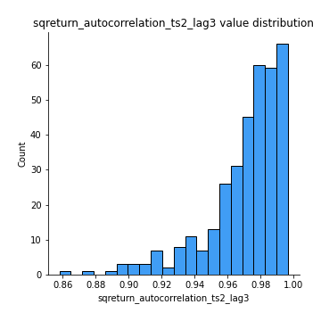
## Feature : sqreturn_correlation_ts1_lag_0
- **Feature type** : continous
- **Missing** : 0.0%
- **Unique** : 347
- **Count** :347.0
- **Mean** :0.40842046029698
- **Std** :0.4599953629403996
- **Min** :-0.9454212056869181
- **25%th Percentile** : 0.1241356512287324
- **50%th Percentile** : 0.5446767382658027
- **75%th Percentile** : 0.7793359680274294
- **Max** :0.9629314841496843

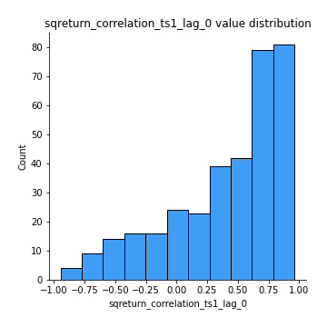
## Feature : sqreturn_correlation_ts1_lag_1
- **Feature type** : continous
- **Missing** : 0.0%
- **Unique** : 347
- **Count** :347.0
- **Mean** :0.4052521378064371
- **Std** :0.46022839436523083
- **Min** :-0.9452305740471955
- **25%th Percentile** : 0.11935405756281872
- **50%th Percentile** : 0.5399991407862761
- **75%th Percentile** : 0.7792460855566421
- **Max** :0.9622575959379156

## Feature : sqreturn_correlation_ts1_lag_2
- **Feature type** : continous
- **Missing** : 0.0%
- **Unique** : 347
- **Count** :347.0
- **Mean** :0.4023984822326325
- **Std** :0.4603612538348195
- **Min** :-0.9451440682595582
- **25%th Percentile** : 0.11748434830991887
- **50%th Percentile** : 0.5407360795256124
- **75%th Percentile** : 0.7778861227175096
- **Max** :0.961475687521161

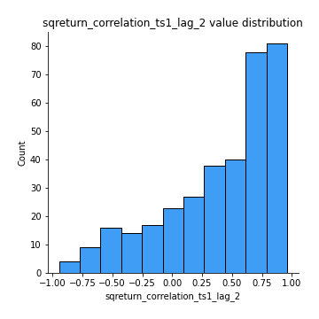
## Feature : sqreturn_correlation_ts1_lag_3
- **Feature type** : continous
- **Missing** : 0.0%
- **Unique** : 347
- **Count** :347.0
- **Mean** :0.3996393318971069
- **Std** :0.460478307218082
- **Min** :-0.9448708035067677
- **25%th Percentile** : 0.11628162906560238
- **50%th Percentile** : 0.529241409387446
- **75%th Percentile** : 0.7748530399560818
- **Max** :0.9609166269912282

## Feature : sqreturn_correlation_ts2_lag_1
- **Feature type** : continous
- **Missing** : 0.0%
- **Unique** : 347
- **Count** :347.0
- **Mean** :0.4054722139836707
- **Std** :0.4604944075917344
- **Min** :-0.9457910375143614
- **25%th Percentile** : 0.12332859338204133
- **50%th Percentile** : 0.545702624204277
- **75%th Percentile** : 0.7744292182357055
- **Max** :0.9618819791386621

## Feature : sqreturn_correlation_ts2_lag_2
- **Feature type** : continous
- **Missing** : 0.0%
- **Unique** : 347
- **Count** :347.0
- **Mean** :0.40276106917263227
- **Std** :0.46100062994598906
- **Min** :-0.9463260196248172
- **25%th Percentile** : 0.1226471588169332
- **50%th Percentile** : 0.5471369683823232
- **75%th Percentile** : 0.7702263530842189
- **Max** :0.9612484058484547

## Feature : sqreturn_correlation_ts2_lag_3
- **Feature type** : continous
- **Missing** : 0.0%
- **Unique** : 347
- **Count** :347.0
- **Mean** :0.40018454756277405
- **Std** :0.4613654562655875
- **Min** :-0.9467149428568907
- **25%th Percentile** : 0.11984046596232623
- **50%th Percentile** : 0.5434317277227839
- **75%th Percentile** : 0.7676339897803659
- **Max** :0.9606559891023181

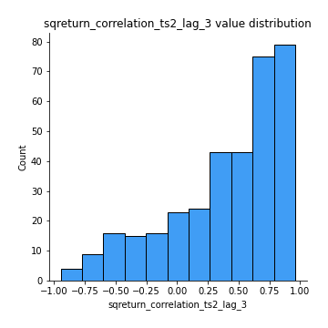
## Feature : price2_granger_cause_price1
- **Feature type** : continous
- **Missing** : 0.0%
- **Unique** : 347
- **Count** :347.0
- **Mean** :0.39103832206029626
- **Std** :0.3110238065281306
- **Min** :5.063123743918868e-06
- **25%th Percentile** : 0.0899836330280875
- **50%th Percentile** : 0.3231554446399989
- **75%th Percentile** : 0.6737053558983059
- **Max** :0.9923417706683243

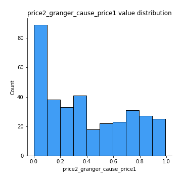
## Feature : price1_granger_cause_price2
- **Feature type** : continous
- **Missing** : 0.0%
- **Unique** : 347
- **Count** :347.0
- **Mean** :0.40580479346161275
- **Std** :0.311603332934329
- **Min** :8.101068402988115e-10
- **25%th Percentile** : 0.12063160520340789
- **50%th Percentile** : 0.35863886078568785
- **75%th Percentile** : 0.6513040457473736
- **Max** :0.9987360641740829

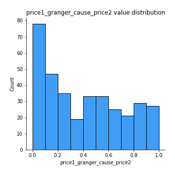

[<< Go back](../README.md)
