## Bivariate analysis of standardised_price_mean1 feature with target

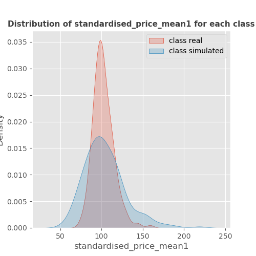

------------------------------------------------------
## Bivariate analysis of standardised_price_mean2 feature with target

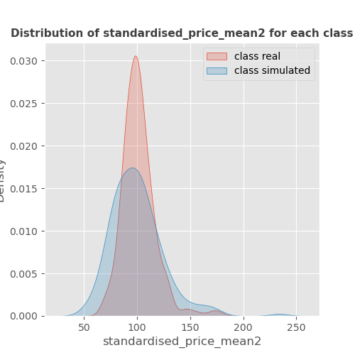

------------------------------------------------------
## Bivariate analysis of return_mean1 feature with target

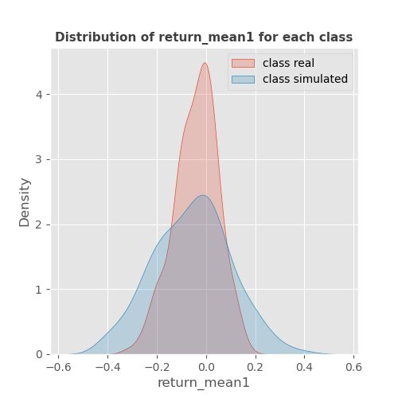

------------------------------------------------------
## Bivariate analysis of return_mean2 feature with target

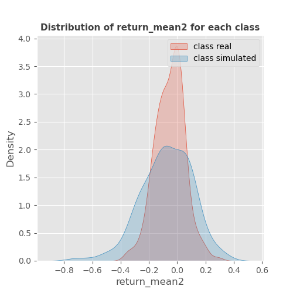

------------------------------------------------------
## Bivariate analysis of return_sd1 feature with target

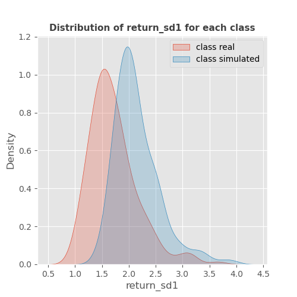

------------------------------------------------------
## Bivariate analysis of return_sd2 feature with target

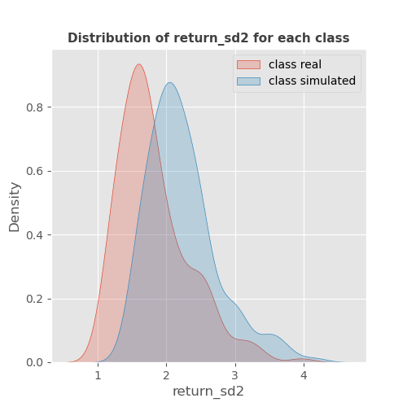

------------------------------------------------------
## Bivariate analysis of return_skew1 feature with target

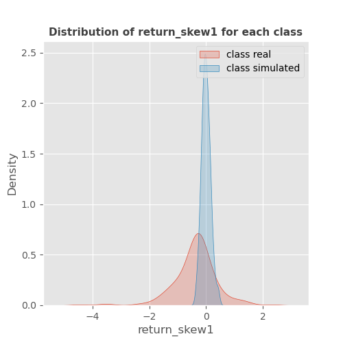

------------------------------------------------------
## Bivariate analysis of return_skew2 feature with target

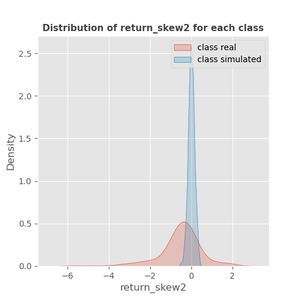

------------------------------------------------------
## Bivariate analysis of return_kurtosis1 feature with target

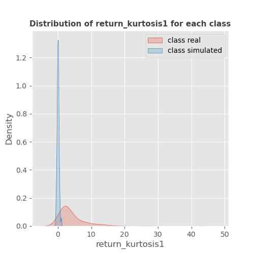

------------------------------------------------------
## Bivariate analysis of return_kurtosis2 feature with target

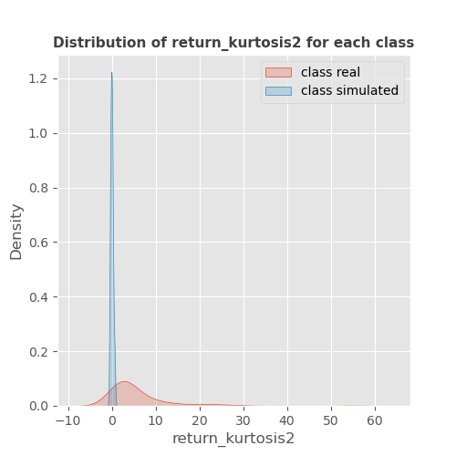

------------------------------------------------------
## Bivariate analysis of return_autocorrelation_lag1_1 feature with target

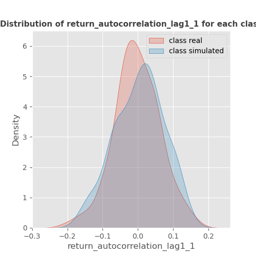

------------------------------------------------------
## Bivariate analysis of return_autocorrelation_lag1_2 feature with target

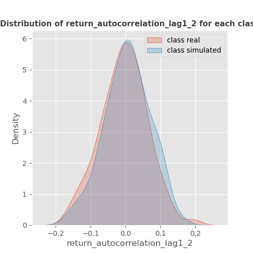

------------------------------------------------------
## Bivariate analysis of return_autocorrelation_lag1_rolling_sd1 feature with target

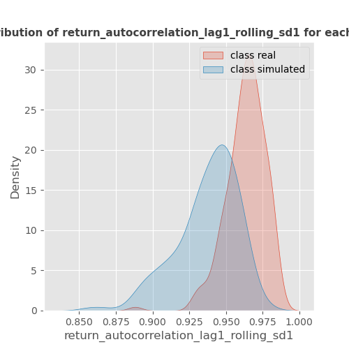

------------------------------------------------------
## Bivariate analysis of return_autocorrelation_lag1_rolling_sd2 feature with target

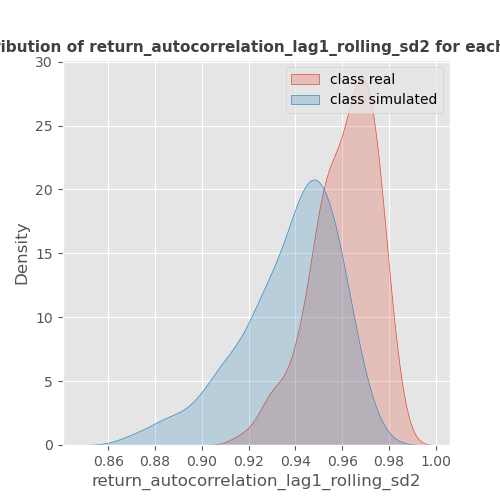

------------------------------------------------------
## Bivariate analysis of price_adf_p_values feature with target

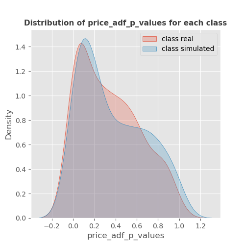

------------------------------------------------------
## Bivariate analysis of return_correlation_ts1_lag_0 feature with target

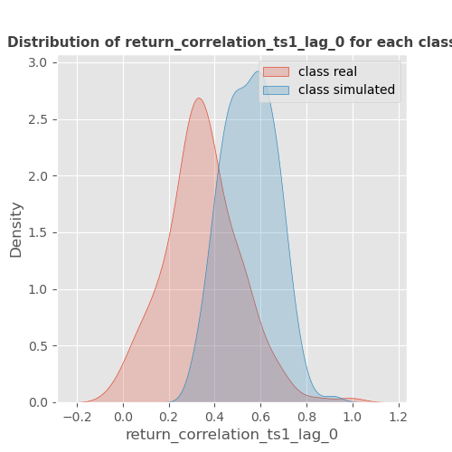

------------------------------------------------------
## Bivariate analysis of return_correlation_ts1_lag_1 feature with target

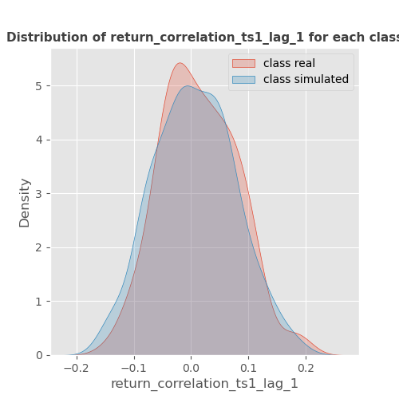

------------------------------------------------------
## Bivariate analysis of return_correlation_ts1_lag_2 feature with target

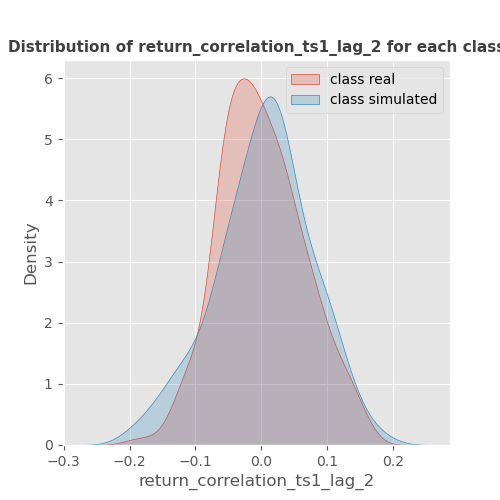

------------------------------------------------------
## Bivariate analysis of return_correlation_ts1_lag_3 feature with target

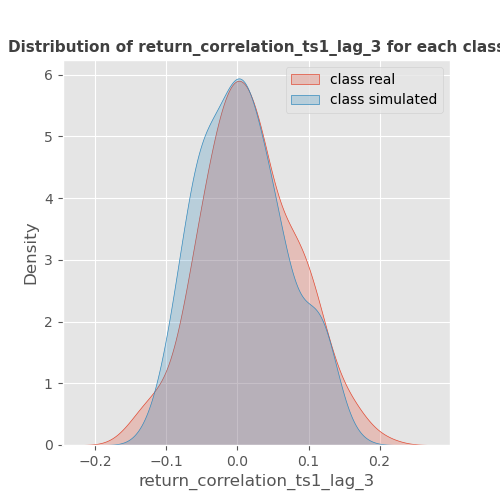

------------------------------------------------------
## Bivariate analysis of return_correlation_ts2_lag_1 feature with target

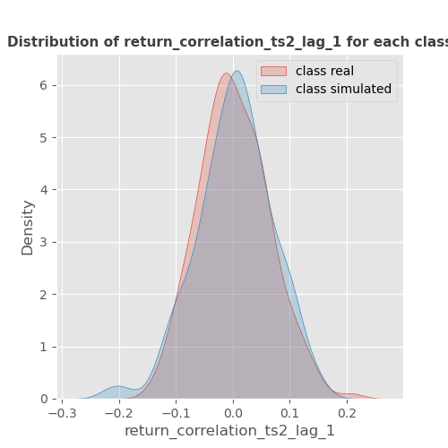

------------------------------------------------------
## Bivariate analysis of return_correlation_ts2_lag_2 feature with target

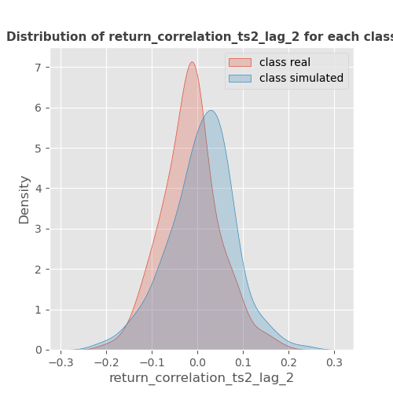

------------------------------------------------------
## Bivariate analysis of return_correlation_ts2_lag_3 feature with target

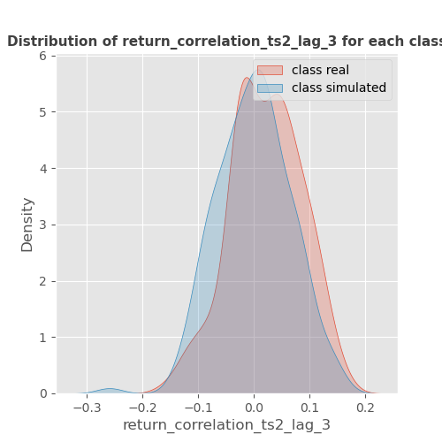

------------------------------------------------------
## Bivariate analysis of durbin_watson_statistic1 feature with target

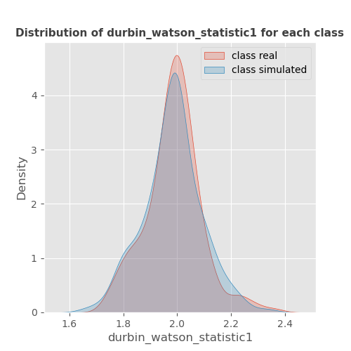

------------------------------------------------------
## Bivariate analysis of durbin_watson_statistic2 feature with target

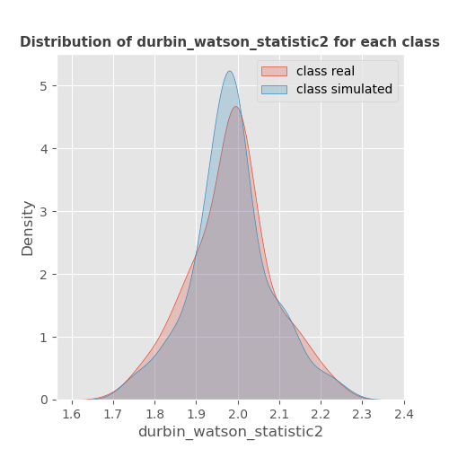

------------------------------------------------------
## Bivariate analysis of co_integration_statistic feature with target

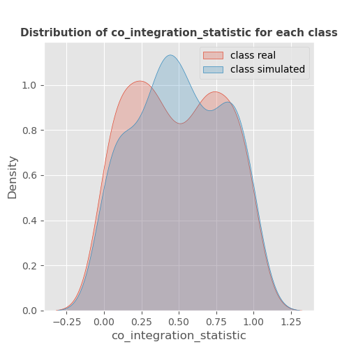

------------------------------------------------------
## Heatmap
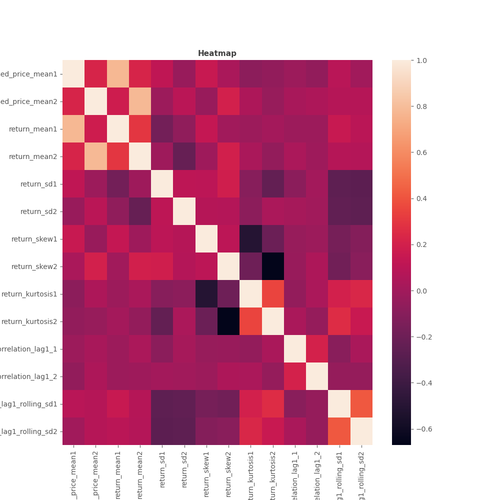

------------------------------------------------------
